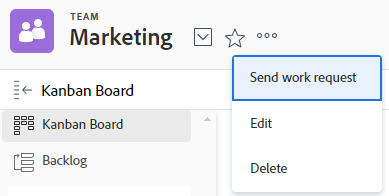

# チームのディアクティベートまたは削除

関連する履歴データを保持したまま、使用しなくなったチームを非アクティブ化できます。[!DNL Adobe Workfront] 管理者は、設定のチームエリアからいつでもチームを再アクティブ化できます。チームを非アクティブ化すると、チームは以下のエリアに表示されなくなります。

<table style="table-layout:auto"> 
 <col> 
 <col> 
 <tbody> 
  <tr> 
   <td> 
    <ul> 
     <li> 
カスタムフォームの先行入力フィールド
 </li> 
    </ul> 
    <ul> 
     <li> 
オブジェクトの共有ダイアログ
 </li> 
     <li> 
[!UICONTROL User Profile]*
 </li> 
    </ul> </td> 
   <td> 
    <ul> 
     <li> 
[!UICONTROL Teams] エリアのメイン選択ドロップダウンメニュー
 </li> 
     <li> 
[!UICONTROL Assignments] 先行入力
 </li> 
     <li> 
プロジェクトの [!UICONTROL Add to Kanban] ボードダイアログ
 </li> 
    </ul> </td> 
  </tr> 
 </tbody> 
</table>

非アクティブ化されたチームはチームを検索しても表示されませんが、非アクティブ化前にユーザーがチームに割り当てられていた場合は、引き続き [!UICONTROL &#x200B; ホームチーム &#x200B;] およびその他のチームに表示されます。

## アクセス要件

+++ 展開すると、この記事の機能のアクセス要件が表示されます。

<table style="table-layout:auto"> 
 <col> 
 <col> 
 <tbody> 
  <tr data-mc-conditions=""> 
   <td role="rowheader"> 
Adobe Workfront パッケージ
 </td> 
   <td>任意</td> 
  </tr> 
  <tr> 
   <td role="rowheader">Adobe Workfront プラン</td> 
   <td>
   
標準

   
プラン
</td>
  </tr> 
  <tr>
   <td>アクセスレベル設定</td>
   <td>
チームをディアクティベートするには、設定は不要です。

   
チームを削除するには、システム管理者である必要があります。
</td>
  </tr>
 </tbody> 
</table>

この表の情報について詳しくは、[Workfront ドキュメントのアクセス要件](/help/quicksilver/administration-and-setup/add-users/access-levels-and-object-permissions/access-level-requirements-in-documentation.md)を参照してください。

+++

## チームの非アクティブ化

非アクティブ化する前にチームに割り当てられた作業は、すべて割り当てられたままです。チームを非アクティブ化する前に、作業を再割り当てすることをお勧めします。

>[!TIP]
>
>非アクティブ化されたチームがまだ割り当てられているタスクやイシューをフィルタリングして特定するレポートを作成できます。

リクエストキューを使用する場合、ルーティングルールでデフォルトチームとして割り当てられたチームを非アクティブ化しても、そのチームはそのまま残り、リクエストは非アクティブ化されたチームに引き続きルーティングされます。チームを非アクティブ化する前に、アクティブなチームでルーティングルールをアップデートすることをお勧めします。

{{step1-to-team}}

1. **[!DNL Switch team]** アイコンをクリックし、ドロップダウンメニューから新しいチームを選択するか、検索バーでチームを検索します。
1. **[!UICONTROL その他]**&#x200B;メニューをクリックして、「**[!UICONTROL 編集]**」を選択します。

   

1. チーム設定の「**[!UICONTROL アクティブ]**」チェックボックスをオフにします。
1. 「**[!UICONTROL 変更を保存]**」をクリックします。

## チームを非アクティブ化するための既知の制限

非アクティブ化されたチームは、以下のエリアに表示されます。

* [!DNL Workfront Goals] の所有者フィールドこれには、追加の [!DNL Adobe Workfront Goals] ライセンスが必要です。詳しくは、[概要 [!DNL Adobe Workfront Goals]](../../workfront-goals/goal-management/getting-started-with-wf-goals.md)を参照してください。

## チームの削除

システム管理者のみがチームを削除できます。 チームの所有者（管理者ではない）がチームを削除しようとすると、エラーメッセージが表示されます。

チームを削除するには：

{{step1-to-team}}

1. **[!DNL Switch team]** アイコンをクリックし、ドロップダウンメニューから新しいチームを選択するか、検索バーでチームを検索します。
1. **[!UICONTROL その他]** メニューをクリックし、「**[!UICONTROL 削除]**」を選択します。

   

1. チームを完全に削除するには、確認メッセージで「[!UICONTROL **確認**]」をクリックします。 削除したチームは復元できません。
