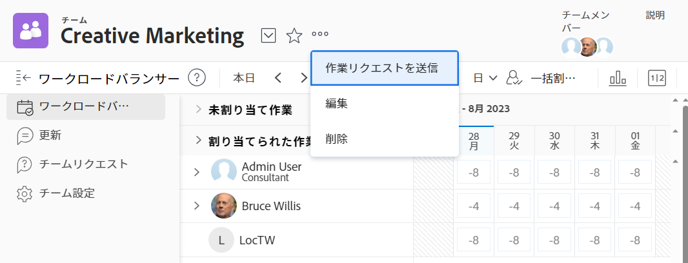

# チーム設定を編集

As a [!DNL Adobe Workfront] 管理者または [!UICONTROL プラン] または [!UICONTROL 作業] ライセンス、編集可能 [!UICONTROL チーム設定].

チームにユーザーを追加し、チームレイアウトテンプレートを設定し、チームが作業項目を完了したときのステータスの記録方法を設定できます。

## アクセス要件

この記事の手順を実行するには、次のアクセス権が必要です。

<table style="table-layout:auto"> 
 <col> 
 </col> 
 <col> 
 </col> 
 <tbody> 
  <tr> 
   <td role="rowheader"><strong>[!DNL Adobe Workfront] 計画*</strong></td> 
   <td> 
任意
 </td> 
  </tr> 
  <tr> 
   <td role="rowheader"><strong>[!DNL Adobe Workfront] ライセンス*</strong></td> 
   <td> 
仕事以上
 </td> 
  </tr> 
 </tbody> 
</table>

&#42;保有するプランやライセンスの種類を確認するには、 [!DNL Workfront] 管理者。

## チーム設定を編集

1. 次をクリック： **[!UICONTROL メインメニュー]** アイコン  Adobe Workfrontの右上隅で、 **[!UICONTROL チーム]**.

1. 次をクリック： **[!UICONTROL チームの切り替え]** アイコン をクリックし、ドロップダウンメニューから新しいチームを選択するか、検索バーでチームを検索します。

1. 次をクリック： **[!UICONTROL 詳細]** メニュー を選択し、「 **[!UICONTROL 編集]**.

   次のいずれかを持つチームメンバーのみ [!UICONTROL プラン] または [!UICONTROL 作業] ライセンスこのオプションを参照してください。

   次の場合、 [!UICONTROL 編集] 」オプションが表示されない場合は、Workfront管理者に確認し、 [!UICONTROL チーム設定] は、 [!UICONTROL スクラムチーム], [!UICONTROL かんばんチーム]または [!UICONTROL ウォーターフォールチーム].

   

1. チーム設定では、次のような変更を行うことができます。

   * チーム名の変更
   * チームを非アクティブ化
   * チームをグループに関連付ける

      >[!NOTE]
      >
      >チームがグループまたはサブグループに割り当てられると、そのグループまたはサブグループのグループ管理者は、チームのメンバーにならずにチームを管理できます。 グループ管理者は、メインメニューから「チーム」領域に移動し、 [!UICONTROL チームの切り替え] 矢印  ：管理するグループに割り当てられているすべてのチームをリストします。

      適切なグループにカーソルを合わせ、情報アイコンをクリックすると、適切なグループがチームに関連付けられていることを確認できます  その横に表示されます。 グループの上位のグループの階層や管理者など、グループに関する情報が一覧表示されるツールチップが表示されます。

   * チーム所有者を指定
   * チームメンバーの追加と削除
   * チームの説明を追加
   * レイアウトテンプレートをチームに適用する

      カスタムレイアウトテンプレートをチームに適用する方法の詳細については、 [!UICONTROL マイワーク] および [!UICONTROL 作業要求] 領域にレイアウトテンプレートが含まれます。

   * このチームがアジャイルチームかどうかを判断するには、 **[!UICONTROL アジャイルチームです]** オプション。

      アジャイルチームとアジャイルチーム内での作業の管理方法について詳しくは、 [アジャイルチームの作成](../../agile/get-started-with-agile-in-workfront/create-an-agile-team.md).

   * を [!UICONTROL 作業] ボタンを [!UICONTROL 開始] 」ボタンをクリックします。 の設定方法の詳細については、 [!UICONTROL 開始] ボタン、「 [「作業範囲」ボタンを [!UICONTROL 開始] ボタン](../../people-teams-and-groups/create-and-manage-teams/work-on-it-button-to-start-button.md).
   * のカスタマイズ **[!UICONTROL 完了]** 」ボタンをクリックします。 をカスタマイズする方法の詳細については、 [!UICONTROL 完了] ボタンをクリックします。

      * [の設定 [!UICONTROL 完了] タスクのボタン](../../people-teams-and-groups/create-and-manage-teams/configure-the-done-button-for-tasks.md)
      * [の設定 [!UICONTROL 完了] ボタン](../../people-teams-and-groups/create-and-manage-teams/configure-the-done-button-for-issues.md)

1. クリック **[!UICONTROL 変更を保存]**.
