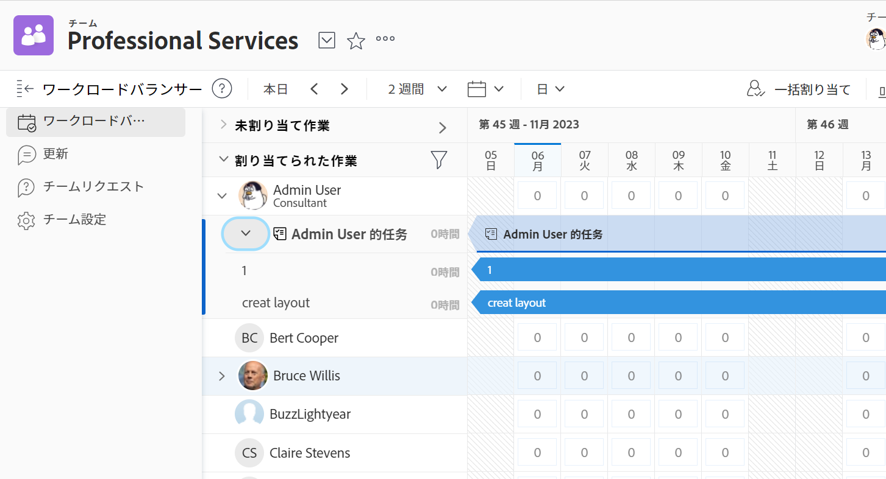

# チームが作業している作業を管理する

チームが作業している項目のリストを [!UICONTROL チームリクエスト] セクションに含める必要があります。

未割り当て項目の割り当て、現在の割り当ての調整、現在の割り当ての調整などを [!UICONTROL ワークロードバランサー] セクションに含める必要があります。

チームに割り当てられた作業を管理する方法について詳しくは、 [[!UICONTROL ワークロードバランサー]](../../resource-mgmt/workload-balancer/assign-work-in-workload-balancer.md).

