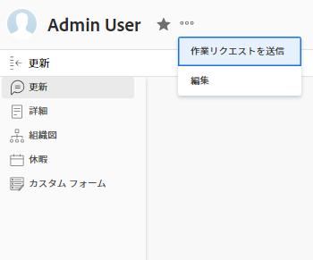

# を [!UICONTROL 作業] ボタン [!UICONTROL 開始] ボタン

[!DNL Adobe Workfront]のデフォルト設定には、 [!UICONTROL 作業] 割り当てられた項目に対して表示されるタスクとタスクのボタン。 クリック時 [!UICONTROL 作業] 自分に割り当てられた項目に対して、自分が作業を受け取ったことを他のユーザーに通知し、作業を行うことを承認します。 ただし、 [!DNL Work On It] ボタンを押しても、タスクや問題のステータスは、実際に作業が開始されたことを示すように更新されません。

次を [!DNL Work On It] ボタン [!UICONTROL 開始] ボタンをクリックします。 この場合、 [!UICONTROL 開始] ボタン [!UICONTROL 作業]：ステータスと [!UICONTROL 実際の開始日] 作業項目の情報を入力し、作業を開始したことを示します。 変更に影響を与える可能性のあるチームの設定に関する情報は、 [!UICONTROL 作業] ボタン（「 」セクションを参照） [の設定 [!UICONTROL 開始] ボタン](#configure-the-uicontrol-start-button) 」を参照してください。

>[!IMPORTANT]
>
>クリック [!UICONTROL 開始] ボタンをクリックすると、項目のステータスが変更され、 [!UICONTROL 実際の開始日]. 他のユーザーがタスクまたは問題の作業を開始した場合 ( ステータスが「 [!UICONTROL 処理中] そして、 [!UICONTROL 実際の開始日]) の場合、項目のボタンが [!UICONTROL 作業] 所属するチームがボタンを [!UICONTROL 開始] 」ボタンをクリックします。

## アクセス要件

この記事の手順を実行するには、次のアクセス権が必要です。

<table style="table-layout:auto"> 
 <col> 
 </col> 
 <col> 
 </col> 
 <tbody> 
  <tr> 
   <td role="rowheader"><strong>[!DNL Adobe Workfront] 計画*</strong></td> 
   <td> 
任意
 </td> 
  </tr> 
  <tr> 
   <td role="rowheader"><strong>[!DNL Adobe Workfront] ライセンス*</strong></td> 
   <td> 
計画
 </td> 
  </tr> 
 </tbody> 
</table>

&#42;保有するプランやライセンスの種類を確認するには、 [!DNL Workfront] 管理者。

## の設定 [!UICONTROL 開始] ボタン

次の場合、 [!UICONTROL プラン] ライセンスを取得する場合、 [!UICONTROL 開始] のチームのボタン [!UICONTROL 編集] チームウィンドウ チームで有効にした後のボタンの動作は次のとおりです。

* **チームは作業項目に割り当てられています**:チームが作業項目に割り当てられている場合、そのチームのメンバーには [!UICONTROL 開始] 」ボタンと、そのチーム用に設定されたステータス。
* **ユーザーがホームチームに属している**:作業項目にチームが割り当てられていないが、ユーザーがプロファイル内のホームチームに割り当てられている場合、ユーザーには [!UICONTROL 開始] 」ボタンと、そのチーム用に設定されたステータス。 このシナリオは、ユーザーが [!UICONTROL 開始] ボタンを頻繁に使用します。
* **ユーザーは作業項目に割り当てられています**:作業項目に割り当てられたチームがなく、ユーザに割り当てられたホームチームがない場合、ユーザは作業項目に割り当てられたユーザーに対して、 [!UICONTROL 開始] ボタンおよび設定済みの組み合わせステータスが表示されます。
* **ユーザーはどのチームにも割り当てられていません。** 作業項目に割り当てられたチームがなく、ホームチームを含むユーザーのチームがなく、項目がユーザーに割り当てられた場合、ユーザーは [!UICONTROL 作業] 」ボタンをクリックします。

>[!NOTE]
>
>この機能は、現在、
>
>* この [!DNL Workfront] モバイルアプリ
>* [!DNL Workfront for Office 365]
>* [!DNL Workfront] 電子メール通知
>

「開始」ボタンを設定するには：

1. 次をクリック： **[!UICONTROL メインメニュー]** アイコン  Adobe Workfrontの右上隅で、 **[!UICONTROL チーム]**.

1. 内 **[!UICONTROL チーム]** ドロップダウンメニューから、チームを選択します。\
   または\
   クリック **[!UICONTROL チームを作成]**.

1. 次をクリック： **[!UICONTROL 詳細]** アイコン を選択し、「 **[!UICONTROL 編集]**.

1. 次を検索： **[!UICONTROL 作業]** ボタンセクション [!UICONTROL チームの編集] ページ。
1. を選択します。 **[!UICONTROL [ 作業部分 ] ボタンを [ 開始 ] ボタンに変更して、項目のステータスを自動的に更新します]** チェックボックスをオンにします。
1. 作業項目のタイプごとに 1 つ以上のステータスを選択します。 複数のステータスを選択した場合、 [!UICONTROL 開始] ここで、目的のステータスを選択できます。
1. クリック **[!UICONTROL 変更を保存]**. ユーザーに [!UICONTROL タスクを開始] または [!UICONTROL 問題の開始] ボタン [!UICONTROL 作業] ボタンをクリックします。

   >[!NOTE]
   >
   >チームをユーザーのホームチームとして設定し、割り当てられたすべての作業項目に開始ボタンが表示されるようにすることをお勧めします。 詳しくは、 [ユーザをホームチームに関連付ける](#associate-users-with-a-home-team) 下

## ユーザをホームチームに関連付ける

ユーザーをホームチームに関連付けるには：

1. 次をクリック： **[!UICONTROL メインメニュー]** アイコン  右上隅に [!DNL Adobe Workfront].

1. クリック **[!UICONTROL ユーザー]**&#x200B;をクリックし、ホームチームに関連付ける 1 人または複数のユーザを選択します。
1. 次をクリック： **[!UICONTROL 詳細]** メニューから、 **[!UICONTROL 編集]**.\
   

1. 内 **[!UICONTROL 組織]** セクションで、 **[!UICONTROL ホームチーム]** フィールドに入力します。 設定をユーザーに関連付けるチームの名前を入力します。 リストにチームの名前が表示されたら、そのチームの名前をクリックします。

1. クリック **[!UICONTROL 変更を保存]**.\
   選択したユーザがホームチームに関連付けられます。

   チーム設定 ( [!UICONTROL 完了] ボタンが表示されるようになりました。

