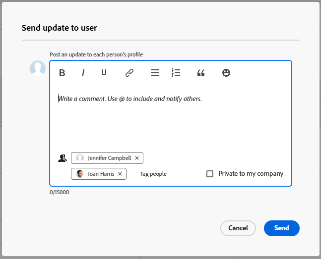

# 他のユーザーにダイレクトメッセージを送信

[!DNL Adobe Workfront] を使用すると、作業アイテムに関係のないメッセージを他の [!DNL Workfront] ユーザーに直接、迅速かつ簡単に送信できます。 この節の説明に従って送信されたメッセージは、ユーザーのプロファイルページの「[!UICONTROL 更新]」タブに表示され、すべてのユーザーに表示されます。 更新について詳しくは、[作業アイテムの更新および更新の表示：記事インデックス](../../workfront-basics/updating-work-items-and-viewing-updates/update-work-items-and-view-updates.md)を参照してください。

この説の説明に従ってメッセージを送信すると、メッセージの送信先のユーザーは、以下のタイプの通知を受け取ります。

* アプリ内通知（[アプリ内通知を表示および管理](../../workfront-basics/using-notifications/view-and-manage-in-app-notifications.md)で説明）
* メール通知

  これは、ユーザーが受信するように設定されているメール通知のタイプによって異なります。 詳しくは、[システムの全ユーザーに対するイベント通知の設定](../../administration-and-setup/manage-workfront/emails/configure-event-notifications-for-everyone-in-the-system.md)、[グループのイベント通知の表示および設定](../../administration-and-setup/manage-groups/create-and-manage-groups/view-and-configure-event-notifications-group.md)、[自身のメール通知の変更](../../workfront-basics/using-notifications/activate-or-deactivate-your-own-event-notifications.md)を参照してください。

## アクセス要件

+++ 展開すると、この記事の機能のアクセス要件が表示されます。

<table style="table-layout:auto"> 
 <col> 
 <col> 
 <tbody> 
  <tr> 
   <td>Adobe Workfront パッケージ</td> 
   <td>
任意
</td> 
  </tr> 
  <tr> 
   <td>Adobe Workfront プラン</td> 
   <td>
   
ユーザーのプロファイルページからメッセージを送信するには、次の条件を満たす必要があります。

   
明るいまたはそれ以上

   
レビュー以上

   
ユーザーリストからメッセージを送信するには、次のものが必要です。

   
標準

   
Work またはそれ以上
</td>
  </tr> 
 </tbody> 
</table>

詳しくは、[Workfront ドキュメントのアクセス要件](/help/quicksilver/administration-and-setup/add-users/access-levels-and-object-permissions/access-level-requirements-in-documentation.md)を参照してください。

+++

## プロファイルページから別のユーザーに作業項目に関連しないメッセージを送信する

1. メッセージを送信するユーザーのプロファイルページに移動します。

   ユーザーのプロファイルページに移動するには、[!DNL Workfront] インターフェイスの任意の場所に表示されているユーザーのリンクされた名前をクリックします。 ユーザー名は、ユーザーが行ったコメントなど、多くの領域に表示されます。

1. 「**[!UICONTROL アップデート]**」タブをクリックし、テキストボックスフィールドをクリックします。

   ![「[!UICONTROL アップデート]」タブ](assets/send-message-to-user-on-updates-tab.png)でユーザーにメッセージを送信

1. メッセージを入力します。
1. （オプション）「**[!UICONTROL 通知]**」フィールドをクリックし、このメッセージに含める別のユーザーの名前を入力します。

1. （オプション）「**[!UICONTROL 社外秘]**」を選択して、このメッセージを社内の他のユーザーにのみ表示します。

   >[!TIP]
   >
   >会社に対する&#x200B;[!UICONTROL **非公開**]&#x200B;設定は、Workfront プロファイルが会社に関連付けられている場合にのみ使用できます。

1. 「**[!UICONTROL 更新]」をクリックします。**
メッセージは、ユーザーのプロファイルページの「**[!UICONTROL 更新]**」タブのメッセージのリストの上部に投稿されます。

## ユーザーリストから1人以上のユーザーにメッセージを送信する

このオプションは、Standard、Plan、またはWork ライセンスをお持ちの場合にのみ使用できます。

{{step-1-to-users}}

1. メッセージを送信するユーザーを選択し、[!UICONTROL **更新をユーザーに送信**]&#x200B;をクリックします。
1. 「[!UICONTROL 更新をユーザー]に送信」ウィンドウにメッセージを入力します。 必要に応じて、テキストの書式設定オプションを使用します。 詳しくは、[作業の更新](/help/quicksilver/workfront-basics/updating-work-items-and-viewing-updates/update-work.md)の「[Workfront コメントでリッチテキストを使用](/help/quicksilver/workfront-basics/updating-work-items-and-viewing-updates/update-work.md#use-rich-text-in-a-workfront-comment)」を参照してください。

   

1. （オプション）「**ユーザーをタグ付け**」をクリックして、メッセージに追加のユーザーをタグ付けします。 詳しくは、[更新時の他のユーザーへのタグ付け](/help/quicksilver/workfront-basics/updating-work-items-and-viewing-updates/tag-others-on-updates.md)を参照してください。
1. （オプション）「**[!UICONTROL 社外秘]**」を選択して、このメッセージを社内の他のユーザーにのみ表示します。

   >[!TIP]
   >
   >会社に対する&#x200B;[!UICONTROL **非公開**]&#x200B;設定は、Workfront プロファイルが会社に関連付けられている場合にのみ使用できます。
1. 「[!UICONTROL **送信**]」をクリックします。
メッセージは、タグ付けされた各ユーザーのプロファイルページの「**[!UICONTROL 更新]**」タブのメッセージのリストの上部に投稿されます。
