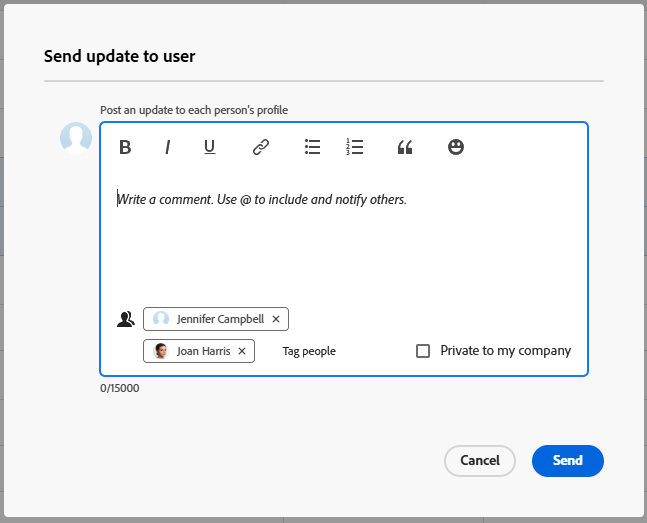

# 他のユーザーにダイレクトメッセージを送信

{{highlighted-preview}}

[!DNL Adobe Workfront] を使用すると、作業アイテムに関係のないメッセージを他の [!DNL Workfront] ユーザーに直接、迅速かつ簡単に送信できます。この節で説明するように送信されたメッセージは、ユーザーのプロファイルページの「[!UICONTROL &#x200B; 更新 &#x200B;]」タブに表示され、すべてのユーザーに表示されます。 更新について詳しくは、[作業アイテムの更新および更新の表示：記事インデックス](../../workfront-basics/updating-work-items-and-viewing-updates/update-work-items-and-view-updates.md)を参照してください。

この説の説明に従ってメッセージを送信すると、メッセージの送信先のユーザーは、以下のタイプの通知を受け取ります。

* アプリ内通知（[アプリ内通知を表示および管理](../../workfront-basics/using-notifications/view-and-manage-in-app-notifications.md)で説明）
* メール通知

  これは、ユーザーが受信するように設定されているメール通知のタイプによって異なります。詳しくは、[システムの全ユーザーに対するイベント通知の設定](../../administration-and-setup/manage-workfront/emails/configure-event-notifications-for-everyone-in-the-system.md)、[グループのイベント通知の表示および設定](../../administration-and-setup/manage-groups/create-and-manage-groups/view-and-configure-event-notifications-group.md)、[自身のメール通知の変更](../../workfront-basics/using-notifications/activate-or-deactivate-your-own-event-notifications.md)を参照してください。

## アクセス要件

+++ 展開すると、この記事の機能のアクセス要件が表示されます。

この記事の手順を実行するには、次のアクセス権が必要です。

<table style="table-layout:auto"> 
 <col> 
 <col> 
 <tbody> 
  <tr data-mc-conditions=""> 
   <td role="rowheader">Adobe Workfront プラン</td> 
   <td>任意</td> 
  </tr> 
  <tr> 
   <td role="rowheader">Adobe Workfront プラン</td> 
   <td>
   
ユーザーのプロファイルページからメッセージを送信するには、  が必要です。
   新規：Light 以上  
   または  
   現在：レビューまたはそれ以上

   
ユーザーリストからメッセージを送信するには、次が必要です。 
   新規：標準  
   または  
   現在：仕事以上
</td>
  </tr> 
 </tbody> 
</table>

この表の情報について詳しくは、[Workfront ドキュメントのアクセス要件](/help/quicksilver/administration-and-setup/add-users/access-levels-and-object-permissions/access-level-requirements-in-documentation.md)を参照してください。

+++

## 作業項目に関連しないメッセージをプロファイルページから別のユーザーに送信する

1. メッセージの送信先のユーザーのプロファイルページに移動します。

   ユーザーのプロファイルページに移動するには、[!DNL Workfront] インターフェイスの任意の場所に表示されるユーザーのリンク名をクリックします。 ユーザー名は、ユーザーが作成したコメントなど、多くの領域に表示されます。

1. 「**[!UICONTROL アップデート]**」タブをクリックし、テキストボックスフィールドをクリックします。

   ![「[!UICONTROL アップデート]」タブ](assets/send-message-to-user-on-updates-tab.png)でユーザーにメッセージを送信

1. メッセージを入力します。
1. （オプション）「**[!UICONTROL 通知]**」フィールドをクリックし、このメッセージに含める別のユーザーの名前を入力します。

1. （オプション）「**[!UICONTROL 社外秘]**」を選択して、このメッセージを社内の他のユーザーにのみ表示します。

1. 「**[!UICONTROL アップデート]」をクリックします。**
メッセージは、ユーザーのプロファイルページの「**[!UICONTROL 更新]**」タブのメッセージリストの上部に投稿されます。

## ユーザーリストから 1 人以上のユーザーにメッセージを送信

このオプションは、標準、プラン、またはワーク ライセンスがある場合にのみ使用できます。

{{step-1-to-users}}

1. メッセージを送信する 1 人または複数のユーザーを選択し、「[!UICONTROL **ユーザーに更新を送信**]」をクリックします。
1. [!UICONTROL &#x200B; ユーザーに更新を送信 &#x200B;] ウィンドウにメッセージを入力します。 必要に応じて、テキスト書式設定オプションを使用します。 詳しくは、「作業の更新 [ の ](/help/quicksilver/workfront-basics/updating-work-items-and-viewing-updates/update-work.md#use-rich-text-in-a-workfront-comment)Workfront コメントでのリッチテキストの使用 [ を参照してくだ ](/help/quicksilver/workfront-basics/updating-work-items-and-viewing-updates/update-work.md) い。

    プレビュー環境のサンプル画像：
   

   実稼動環境のサンプル画像：
   

1.  （任意）「**ユーザーをタグ付け**」をクリックして、メッセージに関する追加のユーザーにタグ付けします。 詳しくは、「[ 更新で他のユーザーにタグ付け ](/help/quicksilver/workfront-basics/updating-work-items-and-viewing-updates/tag-others-on-updates.md) を参照してください 。
1. （オプション）実稼動環境では、メッセージにタグ付けしたい追加のユーザーを検索します。 ユーザーリストで既に選択しているユーザーにタグを付ける必要はありません。
1. （オプション）「**[!UICONTROL 社外秘]**」を選択して、このメッセージを社内の他のユーザーにのみ表示します。
1. [!UICONTROL **送信**] をクリックします。
メッセージは、タグ付けされた各ユーザーのプロファイルページの「**[!UICONTROL 更新]**」タブのメッセージリストの上部に投稿されます。
