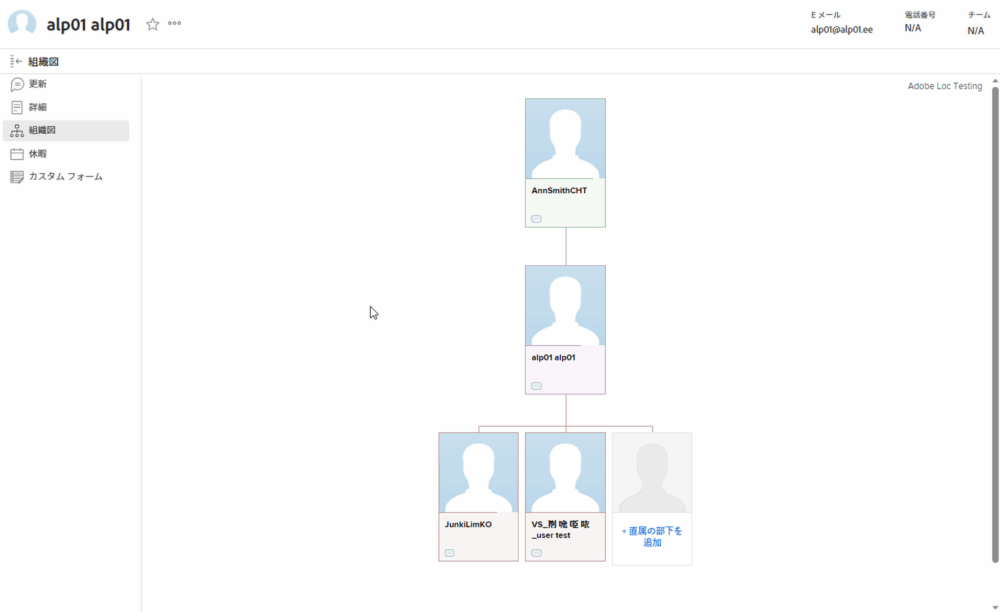

# 組織図の表示

組織図機能を使用すると、特定の [!DNL Adobe Workfront] ユーザーに関連する組織図を表示できます。組織図は、特定の部門の構造を視覚化する優れた方法です。

## アクセス要件

この記事の手順を実行するには、次のアクセス権が必要です。

<table style="table-layout:auto"> 
 <col> 
 </col> 
 <col> 
 </col> 
 <tbody> 
  <tr> 
   <td role="rowheader"><strong>[!DNL Adobe Workfront] プラン*</strong></td> 
   <td> 
任意
 </td> 
  </tr> 
  <tr> 
   <td role="rowheader"><strong>[!DNL Adobe Workfront] ライセンス*</strong></td> 
   <td> 
レビュー以上
 </td> 
  </tr> 
 </tbody> 
</table>

&#42;保有するプランやライセンスタイプを確認するには、[!DNL Workfront] 管理者にお問い合わせください。

## ユーザーの組織図の検索

1. [!DNL Adobe Workfront] の右上隅の&#x200B;**[!UICONTROL メインメニュー]**&#x200B;アイコン 、プロファイル画像の横にあるユーザー名の順にクリックします。

1. 左側のパネルで、「**[!UICONTROL 組織図]**」をクリックします。\
   
