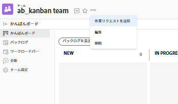

# 作業とチームのリクエストを管理

リクエストは、保留中のタスクまたはイシューの割り当てを表します。 作業リクエストは個人に対して行われ、チームのリクエストはチームに対して行われます。

>[!NOTE]
>
>アジャイルチームにはチームリクエストはありません。

## アクセス要件

この記事の手順を実行するには、次のアクセス権が必要です。

<table style="table-layout:auto"> 
 <col> 
 </col> 
 <col> 
 </col> 
 <tbody> 
  <tr> 
   <td role="rowheader"><strong>[!DNL Adobe Workfront] 計画*</strong></td> 
   <td> 
任意
 </td> 
  </tr> 
  <tr> 
   <td role="rowheader"><strong>[!DNL Adobe Workfront] ライセンス*</strong></td> 
   <td> 
リクエストを割り当てたり、リクエストに対して作業を行う場合は、リクエストを再割り当てする作業
 </td> 
  </tr> 
 </tbody> 
</table>

&#42;保有するプランやライセンスの種類を確認するには、 [!DNL Workfront] 管理者。

## チームにリクエストを割り当てる {#assign-a-request-to-a-team}

プロジェクトマネージャと問題依頼者は、作業を行うリソースが不明な場合や、誰が作業を完了したかを問わない場合に、作業をチームに割り当てることができます。

チームに割り当てられたタスクは、 [!UICONTROL チームリクエスト] 「 」タブをクリックして、チームのボランティアのユーザーがリクエストに取り組むまで待ちます。

チームのメンバーでないユーザーとチームの両方にリクエストが割り当てられると、そのリクエストは [!UICONTROL チームリクエスト] 」タブと「 」タブが表示されます。 チームのボランティア以外のユーザーがタスクに取り組んでいる場合、タスクは [!UICONTROL チームリクエスト] タブをクリックして、チームのボランティアのユーザーが作業するまで待ちます。

チームは、次のいずれかの方法でタスクおよびタスクに割り当てることができます。

* を通じて [!UICONTROL ガントチャート]
* タスクまたはイシューリスト（個別または一括）から
* タスクまたはイシューが作成または変更されたとき
* リクエストに対するルーティングルールを使用（問題のみ）

この節で説明するように、チームページからチームにリクエストを手動で割り当てることができます。

チームページからチームにリクエストを手動で割り当てるには、次の手順に従います。

1. 次をクリック： **[!UICONTROL メインメニュー]** アイコン  右上隅に [!DNL Adobe Workfront]を選択し、「 **[!UICONTROL チーム]**.

1. 次をクリック： **[!UICONTROL チームの切り替え]** アイコン をクリックし、ドロップダウンメニューから新しいチームを選択するか、検索バーでチームを検索します。

1. 次をクリック： **[!UICONTROL 詳細]** アイコン を選択し、「 **[!UICONTROL 作業リクエストを送信]**.

   

1. 開いたボックスに情報を入力します。
1. クリック **[!UICONTROL リクエストを送信]**.\
   チームに新しいタスクが割り当てられ、「チームリクエスト」タブに表示されます。 このタスクは、現在プロジェクトに関連付けられていませんが、 [タスクを移動](../../manage-work/tasks/manage-tasks/move-tasks.md).

## リクエストの再割り当て {#reassign-requests}

チームに割り当てられたリクエストを再割り当てすることができます。

1. 次をクリック： **[!UICONTROL メインメニュー]** アイコン  右上隅に [!DNL Adobe Workfront]を選択し、「 **[!UICONTROL チーム]**.
1. 次をクリック： **[!UICONTROL チームの切り替え]** アイコン をクリックし、ドロップダウンメニューから新しいチームを選択するか、検索バーでチームを検索します。
1. 左側のナビゲーションパネルで、 **[!UICONTROL チームリクエスト]**.
1. 次をクリック： **[!UICONTROL 再割り当て]** アイコン

1. リクエストの再割り当て先となるユーザー、グループまたはチームの名前を入力し、「 **[!UICONTROL 割り当て]**.\
   リクエストが再割り当てされます。
