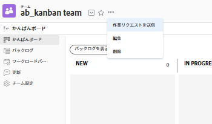

# 作業とチームのリクエストの管理

リクエストは、保留中のタスクまたはイシューの割り当てを表します。 ワークリクエストは個人に対して行われ、チームリクエストはチームに対して行われます。

>[!NOTE]
>
>アジャイルチームにはチームリクエストはありません。

## アクセス要件

+++ 展開すると、この記事の機能のアクセス要件が表示されます。

<table style="table-layout:auto"> 
 <col> 
 <col> 
 <tbody> 
  <tr data-mc-conditions=""> 
   <td role="rowheader">Adobe Workfront パッケージ</td> 
   <td>任意</td> 
  </tr> 
  <tr> 
   <td role="rowheader">Adobe Workfront プラン</td> 
   <td>
   
リクエストを割り当てたり作業したりするには：
   
明るいまたはそれ以上

  
レビュー以上

   
リクエストを再割り当てするには：
   
標準

   
Work またはそれ以上
</td>
  </tr> 
 </tbody> 
</table>

この表の情報について詳しくは、[Workfront ドキュメントのアクセス要件](/help/quicksilver/administration-and-setup/add-users/access-levels-and-object-permissions/access-level-requirements-in-documentation.md)を参照してください。

+++

## チームにリクエストを割り当てる {#assign-a-request-to-a-team}

プロジェクトマネージャとイシュー依頼者は、作業を行うリソースが不明な場合や、誰が作業を完了したかを問わない場合に、作業をチームに割り当てることができます。

チームのユーザーが自発的にリクエストに取り組むまで、チームに割り当てられたタスクは、「[!UICONTROL チームリクエスト]」タブに残ります。

チームのメンバーでないユーザーとチームの両方にリクエストが割り当てられると、そのリクエストは「[!UICONTROL チームリクエスト]」タブとユーザーのワークリクエストエリアの両方に表示されます。 チームのメンバーではないユーザーが自発的にタスクに取り組んでいる場合、チームのメンバーが自発的に取り組むまで、そのタスクは「[!UICONTROL チームリクエスト]」に残ります。

チームは、次のいずれかの方法でタスクおよびイシューに割り当てることができます。

* [!UICONTROL ガントチャート]を通じて
* タスクまたはイシューのリスト（個別または一括）から
* タスクまたはイシューが作成または変更されたとき
* リクエストに対するルーティングルール（問題のみ）を通じて

この節で説明するように、チームページからチームにリクエストを手動で割り当てることができます。

チームページからチームにリクエストを手動で割り当てるには、次の手順に従います。

{{step1-to-team}}

1. **[!UICONTROL チームの切り替え]**&#x200B;アイコン  をクリックし、ドロップダウンメニューから新しいチームを選択するか、検索バーでチームを検索します。

1. **[!UICONTROL その他]**&#x200B;アイコンをクリックし、「**[!UICONTROL 作業リクエストを送信]**」を選択します。

   

1. 開いたボックスに情報を入力します。
1. 「**[!UICONTROL リクエストを送信]**」をクリックします。\
   チームに新しいタスクが割り当てられ、「チームリクエスト」タブに表示されます。 このタスクは、現在プロジェクトに関連付けられていませんが、移動できます。詳しくは、[タスクを移動](../../manage-work/tasks/manage-tasks/move-tasks.md)を参照してください。

## リクエストを再割り当てする {#reassign-requests}

チームに割り当てられたリクエストを再割り当てすることができます。

{{step1-to-team}}

1. **[!UICONTROL チームの切り替え]**&#x200B;アイコンをクリックして、次にドロップダウンメニューから新しいチームを選択するか、検索バーでチームを検索します。
1. 左側のナビゲーションパネルで、「**[!UICONTROL チームリクエスト]**」を選択します。
1. **[!UICONTROL 再割り当て]**&#x200B;アイコンをクリックします。

1. リクエストの再割り当て先となるユーザー、グループまたはチームの名前を入力しはじめてから、「**[!UICONTROL 割り当てる]**」をクリックします。\
   リクエストが再割り当てされます。
