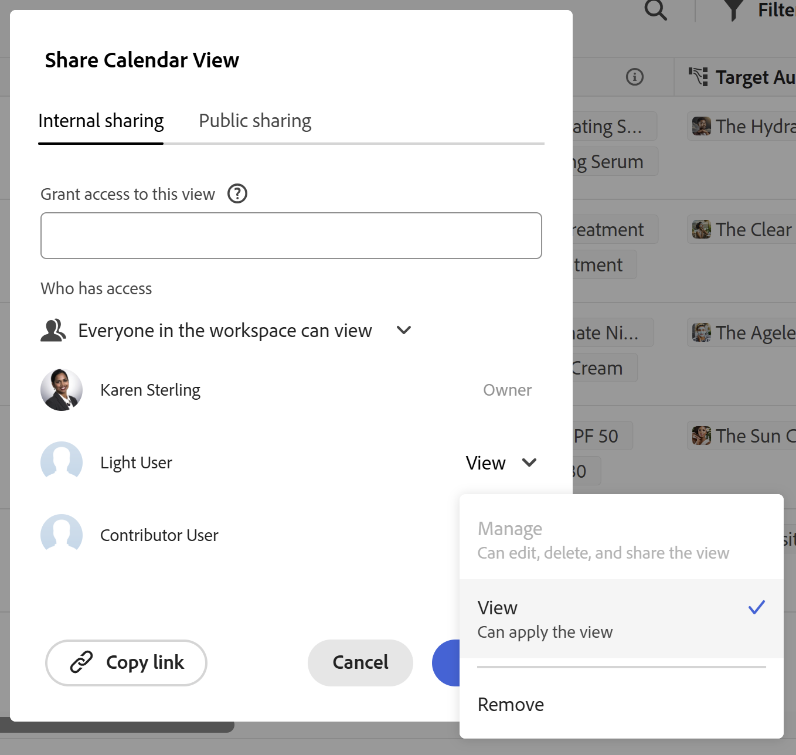

# Adobe Workfront Planning 使用時のライセンスタイプの概要

<!--The highlighted information on this page refers to functionality not yet generally available. It is available only in the Preview environment for all customers. After the monthly releases to Production, the same features are also available in the Production environment for customers who enabled fast releases.    

For information about fast releases, see [Enable or disable fast releases for your organization](/help/quicksilver/administration-and-setup/set-up-workfront/configure-system-defaults/enable-fast-release-process.md). -->

{{planning-important-intro}}

お使いのAdobe Workfrontのライセンスタイプは、Adobe Workfront Planning の権限と組み合わせて、次のアクセス権を付与します。

* ワークスペースまたはレコードの種類を表示、投稿、または管理します
* ビューの表示または管理<!--and records-->

Workfront Planning のオブジェクトに対する権限について詳しくは、[Adobe Workfront Planning での共有権限の概要](/help/quicksilver/planning/access/sharing-permissions-overview.md)を参照してください。

Adobe Planning へのアクセスについて詳しくは、[Workfront Planning へのアクセスの概要 ](/help/quicksilver/planning/access/access-overview.md) を参照してください。

## Workfront のライセンスタイプと Workfront Planning の権限の関係

次の表に、Adobe Workfrontのユーザーのライセンスタイプと、ユーザーに付与できる、そのライセンスに基づくAdobe Workfront Planning オブジェクトへの権限レベルとの関係を示します。

ワークスペースにユーザー権限を付与すると、レコードタイプ、レコード、フィールドへの権限も付与されます。

ビューにアクセスして管理できるようにするには、ワークスペースに対する権限に加えて、ユーザーにビューへの個別の権限を付与する必要があります。

レコードタイプの権限を使用する場合は、次の点を考慮してください。

* ユーザーは、ワークスペースからレコードタイプ権限を自動的に継承します。
* ユーザーがワークスペースに対する管理権限を持っている場合、レコードタイプに対するアクセス権を減らすことはできません。
* ユーザーは、レコードタイプが属するワークスペースに対して持っている権限よりも、レコードタイプに対して大きな権限を持つことはできません。
* ユーザーのレコードタイプへの権限を削除しても、ワークスペースへの権限が削除されないので、ワークスペース内のすべてのレコードタイプに対する表示アクセス権は削除されません。

| Adobe Workfront ライセンスタイプ | Adobe Workfront Planning で許可されている最上位の権限 |
|------------------------------------------------|-------------------------------------------------------------------------------------------------------------------------------------------------------------------------------|
| 標準 | 
ユーザーは、ワークスペース、レコードの種類、<!--records--> およびビューを管理できます。 ワークスペース、レコードタイプ、レコード、フィールドおよびビューを作成、編集または削除できます。
 
システム管理者には、未作成のワークスペースを含むすべてのワークスペースに対する管理権限があります。
 |
| ライトまたはコントリビューター | 
ユーザーは、共有されているワークスペースに加え、それらのワークスペースのレコードタイプ、レコード、フィールドを表示できます。
   
ユーザーは、共有されたビューを表示できますが、独自のビューを作成することはできません。 
  
ユーザーは、ワークスペース、レコードタイプ、レコード、フィールドを作成、編集、削除できません。
 |

<!--Old: 
*Workfront Planning is not available for legacy Workfront licenses. 
For more information, see [Access requirements in Workfront documentation](/help/quicksilver/administration-and-setup/add-users/access-levels-and-object-permissions/access-level-requirements-in-documentation.md).-->

### ワークスペースとレコードタイプに対するライセンスタイプと権限

ワークスペースおよびレコードタイプに対する投稿権限または管理権限を持つことができるのは、標準ライセンスを持つユーザーのみです。 ワークスペースおよびレコードタイプに対する投稿権限と管理権限も、レコードとフィールドに転送されます。

システム管理者は、自分が作成していないものを含め、システム内のすべてのワークスペースを表示できます。

他のすべてのライセンスタイプを持つユーザーは、共有されているワークスペースとレコードタイプ、およびレコードとフィールドに対する表示権限を持つことができます。

>[!INFO]
>
>**例：**
>
>コントリビューターまたはライトライセンスのユーザーは、ワークスペースとそのオブジェクトに投稿または管理することはできません。
>
>共有ボックスには、下位レベルのライセンスを保持しているユーザーに対して、ワークスペースへの投稿またはワークスペースの管理を行う権限を付与できないことが示されます。これは、これらの権限レベルがグレー表示されているためです。
>
>

### ライセンスの種類とビューへの権限

標準ライセンスを持つユーザーのみが、ビューに対する管理権限を持つことができます。

システム管理者は、自分が作成していないビューにアクセスすることはできません。 これらは共有する必要があります。

他のすべてのライセンスタイプを持つユーザーは、自分と共有されたビューに対する表示権限を持つことができます。

>[!INFO]
>
>**例：**
>
>コントリビューターまたはライトライセンスのユーザーは、ビューを管理できません。 アクセス可能なビューに一時的なフィルター、並べ替え、グループ化を適用できます。
>
>共有ボックスには、下位レベルのライセンスを持つユーザーにビューを管理する権限を付与できないことが示されます。これは、これらの権限レベルがグレー表示されているためです。
>
>
