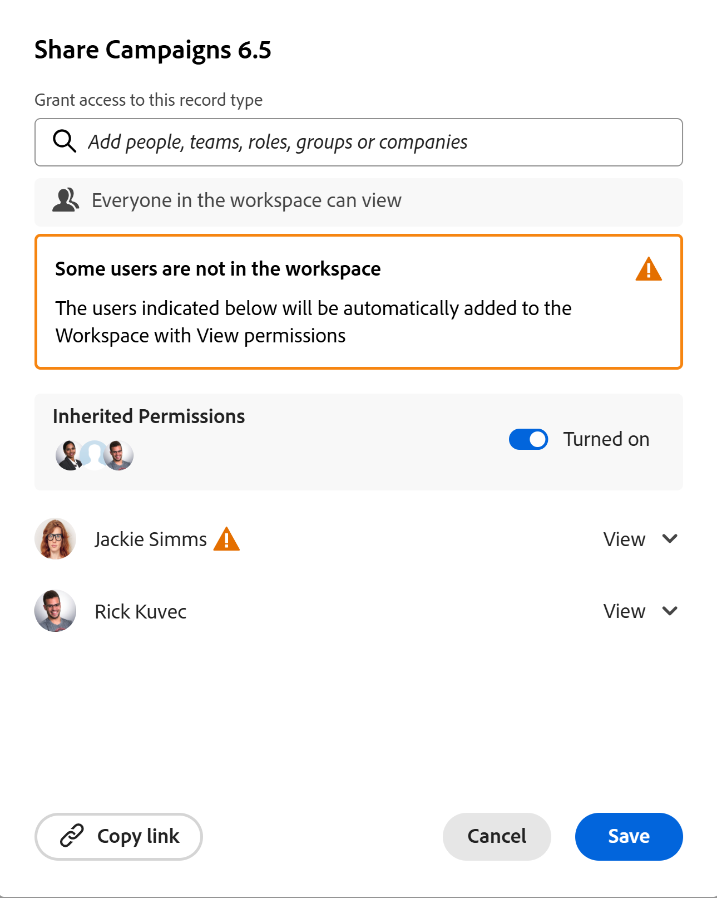
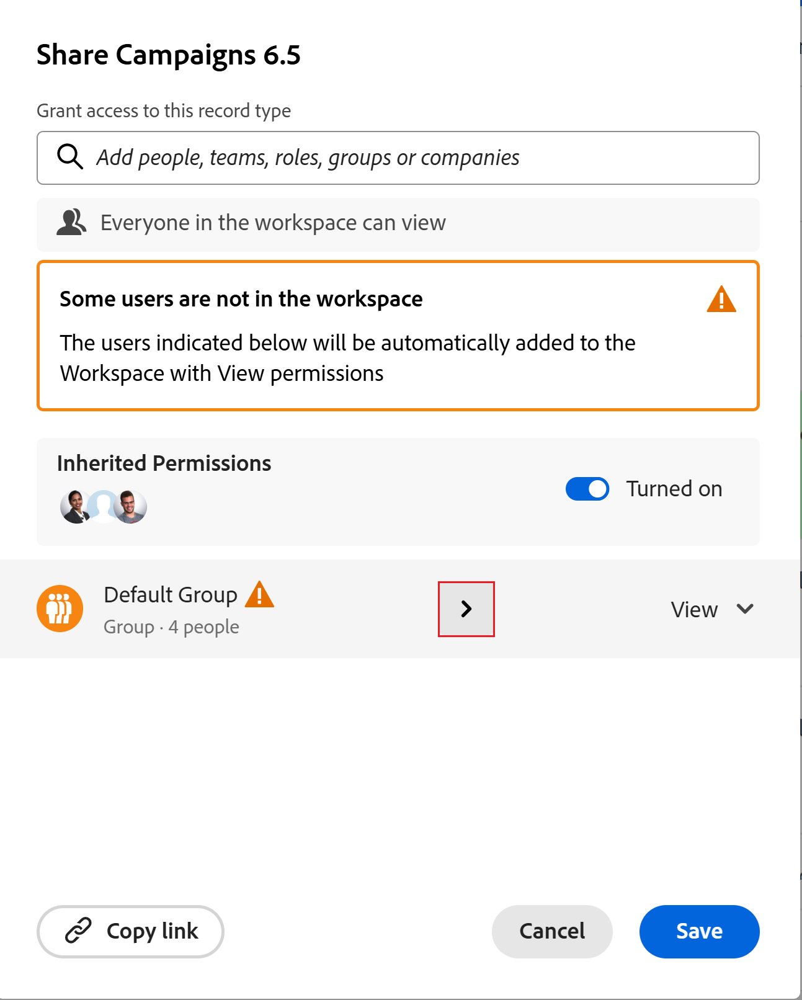
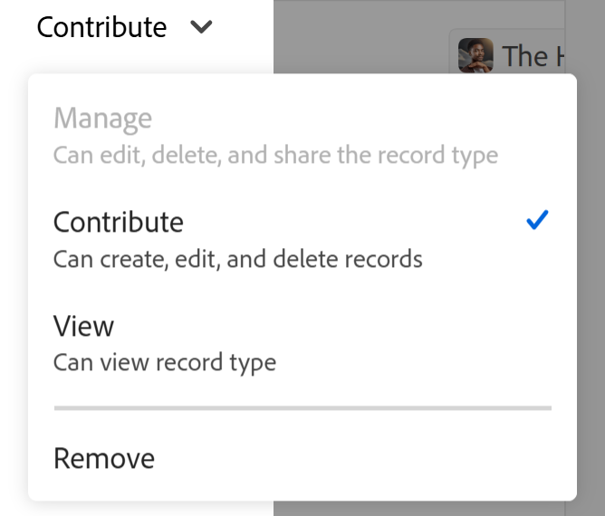

<!-- take the Remove permissions section out, at the end - this is what Lilit said: Because of "Everyone in the workspace can view" wildcard, currently it's not possible to entirely remove access to a record type. Let's take out this section. -->

# レコードタイプの共有

<!--
The highlighted information on this page refers to functionality not yet generally available. It is available only in the Preview environment for all customers. After the monthly releases to Production, the same features are also available in the Production environment for customers who enabled fast releases.    

For information about fast releases, see [Enable or disable fast releases for your organization](/help/quicksilver/administration-and-setup/set-up-workfront/configure-system-defaults/enable-fast-release-process.md). 
-->

{{planning-important-intro}}

Adobe Workfront Planningでレコードを操作する際に、レコードタイプを他のユーザーと共有してコラボレーションを確保できます。

>[!IMPORTANT]
>
>ワークスペースへのアクセス権を持つユーザーは、ワークスペース内のすべてのレコードタイプに対する少なくとも表示権限を自動的に取得します。
>ビューを共有しても、レコードタイプに対するユーザー権限は付与されません。 レコードタイプに対するユーザー権限を付与できるのは、共有ワークスペースのみです。
>
>* Workfront Planningでのオブジェクトの共有に関する一般的な情報については、[Adobe Workfront Planningでの共有権限の概要](/help/quicksilver/planning/access/sharing-permissions-overview.md)も参照してください。
>* 詳しくは、この記事の「[&#x200B; レコードタイプを共有する際の考慮事項](#considerations-when-sharing-record-types)」の節を参照してください。

## アクセス要件

+++ 展開すると、この記事の機能のアクセス要件が表示されます。 

<!--at GA, check that the Workfront plans article linked below has Planning info-->

<table style="table-layout:auto"> 
<col> 
</col> 
<col> 
</col> 
<tbody> 
    <tr> 
<tr> 
   <td role="rowheader">
Adobe Workfront パッケージ
</td> 
   <td> 

任意のWorkfrontおよびプランニングパッケージ
 
または

任意のワークフローとプランニングパッケージ
 
 </tr>

<tr> 
   <td role="rowheader">
Adobe Workfront プラン
</td> 
   <td>
任意
 
  </td> 
  </tr> 
  <tr> 
   <td role="rowheader">
アクセスレベル設定
</td> 
   <td> 
Adobe Workfront Planning に対するアクセスレベルのコントロールはありません。
   
</td> 
  </tr> 
<tr> 
   <td role="rowheader">
オブジェクト権限
</td> 
   <td>  
ワークスペースとレコードタイプに対する権限の管理
  
   
<b>重要</b>

   
ワークスペースへの管理権限を持つユーザーのみが、レコードタイプに管理権限を共有できます
</td> 
  </tr>
<tr>
   <td role="rowheader">
レイアウトテンプレート
</td>
   <td> LightまたはContributor ライセンスを持つユーザーには、Planningを含むレイアウトテンプレートを割り当てる必要があります。
   
標準ユーザーとシステム管理者は、デフォルトでプランニング領域を有効にできます。

</li></ul>

</td>
  </tr>

</tbody> 
</table>

Workfrontのアクセス要件について詳しくは、[Workfront ドキュメント &#x200B;](/help/quicksilver/administration-and-setup/add-users/access-levels-and-object-permissions/access-level-requirements-in-documentation.md)のアクセス要件を参照してください。

+++

<!--
Old:

<table style="table-layout:auto"> 
<col> 
</col> 
<col> 
</col> 
<tbody> 
    <tr> 
<tr> 
<td> 
   
 Products
 </td> 
   <td> 
   <ul><li>
 Adobe Workfront
</li> 
   <li>
 Adobe Workfront Planning
</li></ul></td> 
  </tr>   
<tr> 
   <td role="rowheader">
Adobe Workfront plan*
</td> 
   <td> 

Any of the following Workfront plans:
 
<ul><li>Select</li> 
<li>Prime</li> 
<li>Ultimate</li></ul> 

Workfront Planning is not available for legacy Workfront plans
 
   </td> 
<tr> 
   <td role="rowheader">
Adobe Workfront Planning package*
</td> 
   <td> 

Any 
 

For more information about what is included in each Workfront Planning plan, contact your Workfront account manager. 
 
   </td> 
 <tr> 
   <td role="rowheader">
Adobe Workfront platform
</td> 
   <td> 

Your organization's instance of Workfront must be onboarded to the Adobe Unified Experience to be able to access Workfront Planning.
 

Users must be added to the Adobe Admin Console in order to gain permissions to Workfront Planning views.

For more information, see <a href="/help/quicksilver/workfront-basics/navigate-workfront/workfront-navigation/adobe-unified-experience.md">Adobe Unified Experience for Workfront</a>. 
 
   </td> 
   </tr> 
  </tr> 
  <tr> 
   <td role="rowheader">
Adobe Workfront license*
</td> 
   <td>
 Standard

   
Workfront Planning is not available for legacy Workfront licenses
 
  </td> 
  </tr> 
  <tr> 
   <td role="rowheader">
Access level configuration
</td> 
   <td> 
There are no access level controls for Adobe Workfront Planning
   
</td> 
  </tr> 
<tr> 
   <td role="rowheader">
Object permissions
</td> 
   <td>  
Manage permissions to a record type
  
   
Only users with Manage permissions to a workspace can share Manage permissions to a record type
</td> 
  </tr> 
 
</tbody> 
</table>
-->

## レコードタイプを共有する際の考慮事項

* ワークスペースに権限を付与すると、デフォルトでワークスペース内のレコードタイプに同じ権限がユーザーに付与されます。

  さらに、個々のレコードタイプに対する権限を調整することもできます。

  ただし、レコードタイプに対して、ワークスペースに対する権限よりも高い権限を付与することはできません。
* ユーザーに対して、ワークスペースよりも低い権限を付与できます。 例えば、ワークスペースに対するContribute権限と、レコードタイプに対するView権限を持つことができます。
* ワークスペースに対する管理権限を持つユーザーは、ワークスペース内のすべてのレコードタイプに対する管理アクセス権を常に保持します。 継承された権限がオフになっている場合でも、レコードタイプで権限を下げることはできません。

* 現在、レコードタイプを共有すると、次のことが可能です。

   * レコードタイプを初めて共有し、ワークスペースに対する権限を持っていないユーザーに、ワークスペースに対する表示権限を付与します。

     これにより、ワークスペース内のすべてのレコードタイプに対する表示権限も付与されます。

     レコードタイプに権限を付与すると、共有ボックスに、ワークスペースにも追加されていることを示す表示が表示されます。
   * 継承された権限を無効にする場合は、ワークスペース内のすべてのユーザー（ワークスペースマネージャーを除く）に対してレコードタイプの表示専用にします。

     ワークスペースに対する管理権限を持つユーザーは、レコードタイプで継承された権限をオフにした場合でも、常にレコードタイプに対する管理権限を持っています。
   * レコードタイプに対するユーザーの権限を下げます。 ユーザーの権限をワークスペース上のレコードタイプから増やすことはできません。

     例えば、誰かがワークスペースに対してContribute権限を持っている場合、その権限を特定のレコードタイプに変更して「表示」することができます。 ただし、ワークスペースに対する表示権限を持っているユーザーには、任意のレコードタイプに対してContribute権限を付与することはできません。

* ワークスペース内のユーザーのレコードタイプへのアクセスを削除することはできません。 誰もが、少なくともワークスペースに対する表示権限を持っている場合、すべてのレコードタイプに対する少なくとも表示権限を常に持っています。

* レコードタイプは、次のエンティティと社内で共有できます。

  Workfrontのユーザー、グループ、チーム、企業、担当業務
* レコードタイプをWorkfront以外のユーザーと外部で共有することはできません。
* レコードタイプに対する表示権限よりも高いワークスペース権限を持たないユーザーに付与するには、最初に表示よりも高い権限を持つユーザーとワークスペースを共有する必要があります。 ワークスペースのより高い権限は、レコードタイプに適用されます。

* グローバルなレコードタイプは、元のワークスペースと追加された他のセカンダリワークスペースの両方から共有できます。

  詳しくは、[&#x200B; クロスワークスペースレコードタイプの概要](/help/quicksilver/planning/architecture/cross-workspace-record-types-overview.md)を参照してください。

## レコードタイプへの権限の共有

ワークスペースに対する管理権限がある場合は、ワークスペースの個々のレコードタイプに対する権限を調整できます。

{{step1-to-planning}}

1. 共有するレコードタイプを持つワークスペースを開きます。

1. 次のいずれかの操作を行います。

   * レコードタイプカードから、**詳細** メニュー/**共有**&#x200B;をクリックします。
   * レコードタイプカードをクリックしてレコードタイプのページを開き、**Share** > **任意のレコードタイプビューからレコードタイプ**&#x200B;を共有をクリックします。

   **共有** ボックスが開きます。

   

1. （オプション） **アクセス権を持つユーザー**&#x200B;領域で、**ワークスペース内のすべてのユーザーが** オプションをデフォルトで表示できます。  ワークスペースに対する表示権限またはそれ以上の権限を持つすべてのユーザーは、レコードタイプを表示できます。

1. （オプション）「**継承された権限**」オプションの下にあるユーザー数をクリックして、ワークスペースから権限を継承するユーザー、チーム、グループ、企業、またはジョブロールを表示します。

   >[!TIP]
   >
   >継承された権限リストから個々のエンティティを削除することはできません。

1. （オプションおよび条件付き）レコードタイプを特定のエンティティと共有し、ワークスペースに対して既に持っているとは異なるレコードタイプへのアクセス権を与える場合は、次の操作を行います。

   1. 「**継承された権限**」ドロップダウンメニューから「**無効化**」を選択します。

      >[!TIP]
      >
      >Workspace マネージャーには、レコードタイプに対する管理権限が引き続き付与されます。

   1. **このレコードタイプ**&#x200B;へのアクセス権を付与フィールドで、ワークスペースに対して付与する権限レベルとは異なる権限レベルを付与するユーザー、チーム、グループ、会社、または担当業務を追加します。
   1. （オプション）グループ、チーム、役割、または会社と共有する場合は、エンティティの名前にカーソルを合わせ、右向きの矢印をクリックして、権限を受け取っているユーザーのリストを展開します。

      と共有

   1. 権限レベルの選択：

   >[!IMPORTANT]
   >
   >* グループ、グループ、企業、担当業務に加えて、Adobe Admin Consoleに追加されたユーザーとのみ共有できます。 Workfrontのみのユーザーを追加することはできません。 詳しくは、[Adobe Admin Consoleでのユーザーの管理](/help/quicksilver/administration-and-setup/add-users/create-and-manage-users/admin-console.md)を参照してください。
   >* ユーザーに、ワークスペースに対する権限よりもレコードタイプに対する権限を付与することはできません。
   >* ユーザーがワークスペースに対する管理権限を持っている場合、レコードタイプに対する管理よりも少ない権限をユーザーに付与することはできません。
   >* ユーザーがワークスペースに対するContribute権限を持っている場合は、レコードタイプに対する権限を減らすことができます。
   > 詳しくは、[Adobe Workfront Planning での共有権限の概要](/help/quicksilver/planning/access/sharing-permissions-overview.md)を参照してください。
   >* レコードタイプをユーザーと共有すると、そのユーザーの主な担当業務とその電子メールもフィールドに表示されます。 ユーザーの電子メールを表示するには、アクセスレベルのUsers オブジェクトで「連絡先情報を表示」設定を有効にする必要があります。

1. ワークスペースへのアクセス権を持たないユーザーにレコードタイプを表示するアクセス権を付与するには、「**このビューへのアクセス権を付与**」フィールドで、ユーザー、グループ、チーム、会社、またはジョブロールの名前を入力し始め、リストに表示されたらクリックします。

   選択したエンティティは、**表示**&#x200B;権限を持つレコードタイプおよびワークスペースに追加されます。

   システム管理者は常に、共有タイプを記録するための管理権限を受け取り、ユーザーがシステム管理者であることを示します。

1. （オプション）「**リンクをコピー**」をクリックして、レコードタイプへのリンクをクリップボードにコピーし、他のユーザーと共有します。
1. 「**保存**」をクリックします。

   レコードタイプは他のユーザーと共有されるようになりました。
レコードタイプを共有したユーザーは、次のエンティティに対して与えられた権限に関するアプリ内通知とメール通知の両方を受け取ります。

   * レコードタイプ
   * レコードタイプを共有する前にワークスペースに対する権限を持っていない場合、ワークスペース。

1. コピーしたリンクを他のユーザーと共有します。リンクを受け取るユーザーは、レコードタイプページにアクセスして選択したビューに表示するには、アクティブなユーザーでWorkfrontにログインする必要があります。 レコードタイプを表示するには、レコードタイプに対する権限が必要です。

## レコードタイプへの権限の削除

レコードタイプからユーザーの権限を削除できます。 ただし、少なくともワークスペースの表示権限を保持し、少なくともレコードタイプの表示権限も付与します。 ワークスペース内のレコードタイプに対する権限を付与しない場合は、ワークスペースからアクセス権を削除する必要があります。

{{step1-to-planning}}

1. 共有を停止するレコードタイプのワークスペースを開き、レコードタイプカードをクリックします。 レコードタイプページが開きます。

1. 任意のビューのタブで、レコードタイプの右上隅にある「**共有**」をクリックします。
1. 「**レコードタイプを共有**」をクリックします。

   **共有** ボックスが開きます。
1. 権限を削除するユーザー、グループ、チーム、会社、または担当業務を見つけ、権限ドロップダウンメニューを名前右側に展開し、**削除**&#x200B;をクリックします。<!--check the screen shot below - the UI text for View might not be accurate-->

   

1. 「**保存**」をクリックします。

   ユーザーには、レコードタイプに対する指定された権限がなくなりました。 ただし、ワークスペースの権限から削除しない限り、ワークスペースに対する権限は引き続き保持されます。

   レコードタイプへのアクセスから削除されたユーザーに対して、これらの権限を持たなくなった旨の通知はありません。

<!--
 This is not working yet: *************************** edit this before publishing, because this was not tested with record types - this section came from sharing views *******************: 

## Grant permissions to a record type from a permission request

Users who access a link to a record type to which they do not have permissions can request permissions to the record type. All users with Manage permissions to the view receive the permission request and can grant or deny the permissions. 

1. (Conditional) If you are are the manager of a view, you might receive a request from another user to access the view in the following areas:
   
   * An in-app notification
      
   * An email notification
      
1. (Conditional) From the notification area in Workfront, click the in-app notification
   Or
   From the email notification, click **View all notifications**, then click the notification in the list.

   The **Pending access requests** box displays. 

      
1. (Optional) For the user whose permissions you want to approve, select one of the following options from the drop-down menu to the right of the user's name: 
   * **View**
   * **Manage**
1. Select the user for whom you want to approve or deny the permission, then click **Approve all** or **Deny all**. 
1. Click the left-pointing arrow to the left of **Pending access requests**, then click **Save**.

   If you approved the request, the users are added to the sharing box of the view. The user requesting the permission receives an email confirmation that their request was approved. 
   
   will they also get an in-app notification??
-->

