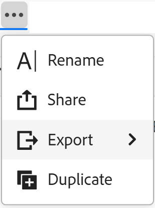
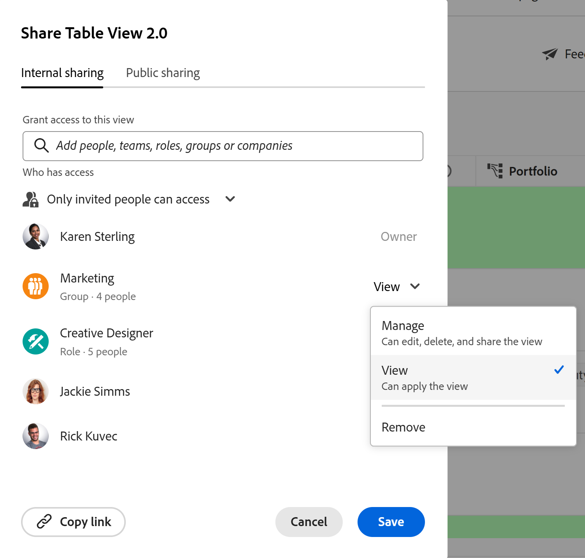
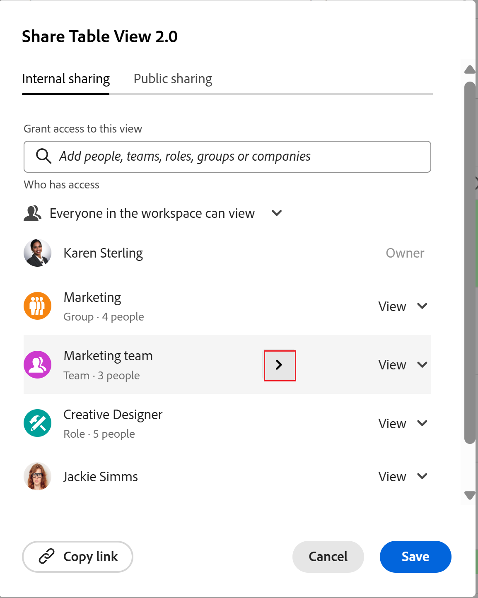
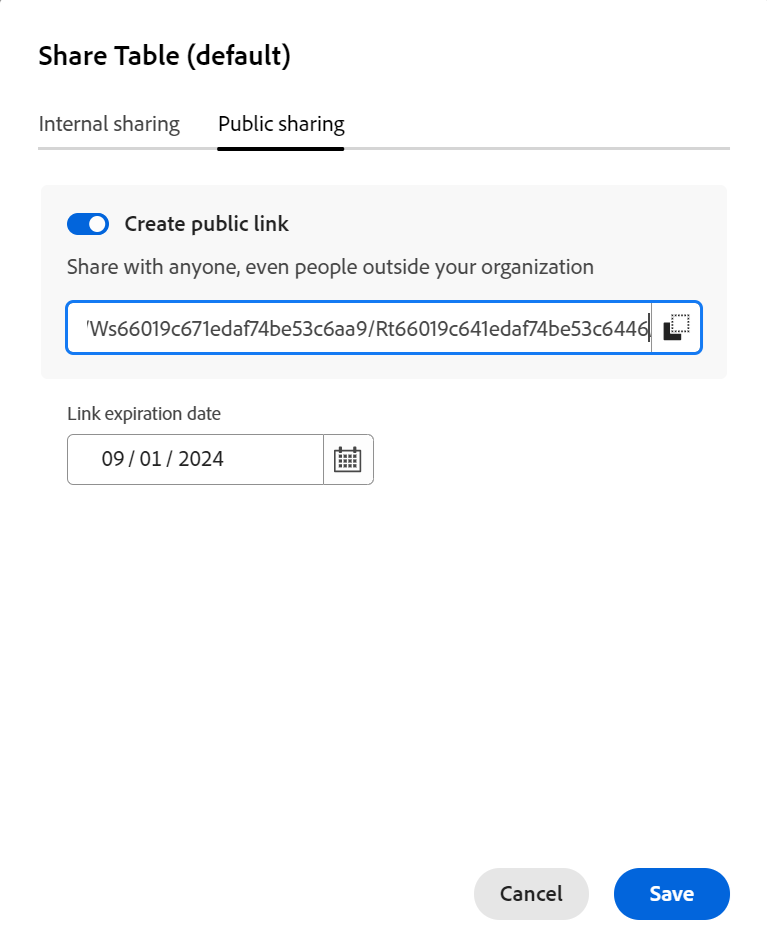
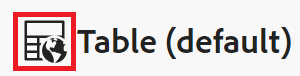
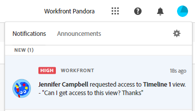

# ビューを共有

<!--there are several mentions on how to share public links for global record types in secondary workspaces in this articel; you have to update all of these mentions when something changes-->

このページでハイライト表示されている情報は、まだ一般に利用できない機能を示します。すべてのユーザーのプレビュー環境でのみ使用できます。 実稼動環境への毎月のリリース後、高速リリースを有効にしたお客様は、実稼動環境でも同じ機能を利用できます。

迅速リリースについて詳しくは、[組織での迅速リリースを有効または無効にする](/help/quicksilver/administration-and-setup/set-up-workfront/configure-system-defaults/enable-fast-release-process.md)を参照してください。

{{planning-important-intro}}

Adobe Workfront Planning でレコードを操作する際に、他のユーザーとビューを共有して、共同作業を確実に行えます。

>[!IMPORTANT]
>
>* 他のユーザーにワークスペースの権限を付与しても、レコードタイプページのビューに対する権限は付与されません。他のユーザーと共有するには、レコードタイプのページ内の個々のビューに権限を付与する必要があります。
>
>* ビューに権限を付与しても、レコードを表示する権限は変更されません。 レコードの権限は、ワークスペースの共有によって付与されます。
>
>* ビューを共有する場合、ビューのすべての要素にアクセスするための権限を他のユーザーに付与します。 例えば、ビューに管理権限を付与すると、グループ化、フィルター、並べ替え、バーの外観を変更できます。

<!--
This article describes how you can share a view with others. For information about requesting, granting, or denying permissions to a view, see [Request permissions to a view or a workspace](/help/quicksilver/planning/access/request-permissions.md).
-->

## アクセス要件

+++ 展開すると、この記事の機能のアクセス要件が表示されます。 

<!--at GA, check that the Workfront plans article linked below has Planning info-->

<table style="table-layout:auto"> 
<col> 
</col> 
<col> 
</col> 
<tbody> 
    <tr> 
<tr> 
   <td role="rowheader">
Adobe Workfront パッケージ
</td> 
   <td> 

任意のWorkfrontおよびプランニングパッケージ
 
または

任意のワークフローとプランニングパッケージ
 
 </tr>

<tr> 
   <td role="rowheader">
Adobe Workfront プラン
</td> 
   <td>
任意
 
  </td> 
  </tr> 
  <tr> 
   <td role="rowheader">
アクセスレベル設定
</td> 
   <td> 
Adobe Workfront Planning に対するアクセスレベルのコントロールはありません。
   
</td> 
  </tr> 
<tr> 
   <td role="rowheader">
オブジェクト権限
</td> 
   <td>  
ビューに対する権限を管理
 
   
<b>重要</b>
 
   
ワークスペースに対する管理権限を持つユーザーのみがビューを公開できます。
</td> 
  </tr> 
<tr>
   <td role="rowheader">
レイアウトテンプレート
</td>
   <td> LightまたはContributor ライセンスを持つユーザーには、Planningを含むレイアウトテンプレートを割り当てる必要があります。
   
標準ユーザーとシステム管理者は、デフォルトでプランニング領域を有効にできます。

</li></ul>

</td>
  </tr>

</tbody> 
</table>

Workfrontのアクセス要件について詳しくは、[Workfront ドキュメント &#x200B;](/help/quicksilver/administration-and-setup/add-users/access-levels-and-object-permissions/access-level-requirements-in-documentation.md)のアクセス要件を参照してください。

+++

<!--
Old:
<table style="table-layout:auto"> 
<col> 
</col> 
<col> 
</col> 
<tbody> 
    <tr> 
<tr> 
<td> 
   
 Products
 </td> 
   <td> 
   <ul><li>
 Adobe Workfront
</li> 
   <li>
 Adobe Workfront Planning
</li></ul></td> 
  </tr>   
<tr> 
   <td role="rowheader">
Adobe Workfront plan*
</td> 
   <td> 

Any of the following Workfront plans:
 
<ul><li>Select</li> 
<li>Prime</li> 
<li>Ultimate</li></ul> 

Workfront Planning is not available for legacy Workfront plans
 
   </td> 
<tr> 
   <td role="rowheader">
Adobe Workfront Planning package*
</td> 
   <td> 

Any 
 

For more information about what is included in each Workfront Planning plan, contact your Workfront account manager. 
 
   </td> 
 <tr> 
   <td role="rowheader">
Adobe Workfront platform
</td> 
   <td> 

Your organization's instance of Workfront must be onboarded to the Adobe Unified Experience to be able to access Workfront Planning.
 

Your organization must be onboarded to the Adobe Unified Experience for users to be able to request and grant permissions to a view from a permission request. 

Users must be added to the Adobe Admin Console in order to gain permissions to Workfront Planning views.

For more information, see <a href="/help/quicksilver/workfront-basics/navigate-workfront/workfront-navigation/adobe-unified-experience.md">Adobe Unified Experience for Workfront</a>. 
 
   </td> 
   </tr> 
  </tr> 
  <tr> 
   <td role="rowheader">
Adobe Workfront license*
</td> 
   <td>
 Standard

   
Workfront Planning is not available for legacy Workfront licenses
 
  </td> 
  </tr> 
  <tr> 
   <td role="rowheader">
Access level configuration
</td> 
   <td> 
There are no access level controls for Adobe Workfront Planning
   
</td> 
  </tr> 
<tr> 
   <td role="rowheader">
Object permissions
</td> 
   <td>  
Manage permissions to a view
  
   
Only users with Manage permissions to a workspace can share a view publicly.
</td> 
  </tr> 

</tbody> 
</table>
-->

## ビューを共有する際の考慮事項

* ビューは、次の方法で共有できます。

   * Workfrontのユーザー、グループ、チーム、企業、担当業務と連携し
   * Workfront以外のユーザーとの公開
   * ビューへのリンクをコピーして共有することで
   * ExcelやCSV ファイルにエクスポートすることで。 ファイルに書き出すことができるのは、テーブルビューのみです。 詳しくは、[テーブルビューの管理](/help/quicksilver/planning/views/manage-the-table-view.md)を参照してください。

* Workfront Planningでのオブジェクトの共有に関する一般的な情報については、[Adobe Workfront Planningでの共有権限の概要](/help/quicksilver/planning/access/sharing-permissions-overview.md)も参照してください。
* ビューに対してビュー権限または管理権限を付与するには、Workfrontの内部ユーザーに付与します。

* 管理権限を持つユーザーは、ビュー設定を変更、共有、複製、または削除できます。

* 公開リンクを使用して、組織外のユーザーとビューを共有できます。

* ビューを公開で共有すると、有効期限が示すように、会社外の誰もが期間限定でリンクにアクセスできます。 共有ビューを表示するためにログインは必要ありません。

  >[!NOTE]
  >
  >セカンダリワークスペースのグローバルレコードタイプからビューを公開することはできません。 詳しくは、[別のワークスペースから既存のレコードタイプを追加](/help/quicksilver/planning/architecture/add-existing-record-types-from-another-workspace.md)を参照してください。

* ビューにアクセスできる組織外のユーザーは、他のビューを作成したり、共有ビューを編集したり、ビュー内のレコード情報を追加、削除、編集したりすることはできません。

## ビューに対する権限を内部的に共有する

作成したビューまたは管理権限を持つビューを、Workfront Planningのユーザー、グループ、チーム、企業、担当業務と共有できます。

>[!NOTE]
>
>システム管理者は、自分で作成しなかったビューは表示または共有できません。自分と共有されたビューのみにアクセスしたり、ビューのみを共有したりできます。
>
>システム管理者は、ビューに対する管理権限のみを持つことができます。

{{step1-to-planning}}

1. 共有するビューのワークスペースを開き、レコードタイプカードをクリックします。

   レコードタイプページが開きます。

1. ビューのタブで、次のいずれかの操作を行います。

   * ビューのタブをクリックし、ドロップダウンメニューのビューにカーソルを合わせ、**詳細** メニューをクリックしてから、**共有**&#x200B;をクリックします。

     

   * 画面の右上隅にある「**共有**」をクリックしてから、**現在のビューを共有**&#x200B;します。

     

   **共有ビュー** ボックスが開き、**内部共有** タブがデフォルトで選択されている必要があります。

1. （オプション） **アクセス権を持つユーザー**&#x200B;領域で、次のオプションから選択します。

   * **招待されたユーザーのみが**&#x200B;にアクセスできます：ビューを共有するユーザー、グループ、チーム、会社、または担当業務を指定する必要があります。 これはデフォルトのオプションです。

   >[!NOTE]
   >
   >* グループ、グループ、企業、担当業務に加えて、Adobe Admin Consoleに追加されたユーザーとのみ共有できます。 Workfrontのみのユーザーを追加することはできません。 詳しくは、[Adobe Admin Consoleでのユーザーの管理](/help/quicksilver/administration-and-setup/add-users/create-and-manage-users/admin-console.md)を参照してください。
   >
   >* ユーザーとビューを共有すると、そのユーザーの主要な担当業務とその電子メール もフィールドに表示されます。 ユーザーの電子メールを表示するには、アクセスレベルのUsers オブジェクトで「連絡先情報を表示」設定を有効にする必要があります。

   * **ワークスペース内のすべてのユーザーが表示できます**: ワークスペースに対する表示権限またはそれ以上の権限を持つすべてのユーザーがビューにアクセスできます。

1. **このビューへのアクセス権を付与** フィールドで、ユーザー、グループ、チーム、会社、または担当業務の名前を入力し始め、リストに表示されたらクリックします。

   

1.  （オプション）グループ、チーム、役割、または会社と共有する場合は、エンティティの名前にカーソルを合わせ、右向きの矢印をクリックして、権限を受け取っているユーザーのリストを展開します。

   

1. ドロップダウンメニューから次の権限レベルの 1 つを選択します。
   * 表示
   * 管理

     権限レベルと各レベルでユーザーが実行できるアクションについて詳しくは、[Adobe Workfront Planning での共有権限の概要](/help/quicksilver/planning/access/sharing-permissions-overview.md)を参照してください。

     システム管理者は常に、共有されたビューに対する管理権限を受け取ります。

1. 「**保存**」をクリックします。

   ビューは、人物アイコン で更新され、ビューが他のユーザーと共有されたことを示します。

   ビューを共有したユーザーは、そのビューに対する権限を持つことに関するアプリ内およびメール通知を受け取ります。

   >[!TIP]
   >
   >人物やグローバルアイコンのないビューは、作成したビューであり、他のユーザーと共有されません。 共有されていないビューは、自分のみが表示できます。

1. コピーしたリンクを他のユーザーと共有します。リンクを受け取ったユーザーが、レコードタイプのページにアクセスして、選択したビューで表示するには、ユーザーがアクティブユーザーであり、Workfront にログインしている必要があります。

## ビューへの権限を公開で共有する

作成したビューまたは管理権限を持つビューは、Workfront ライセンスを持たず、組織の外部に所属している可能性のあるユーザーと共有できます。

セカンダリワークスペースのグローバルレコードタイプからビューを公開することはできません。

>[!IMPORTANT]
>
>ワークスペースに対する管理権限を持つユーザーのみが、ワークスペースのビューを公開で共有できます。

Workfront Planningでビューを公開するには：

{{step1-to-planning}}

1. 共有するビューのワークスペースを開き、レコードタイプカードをクリックします。

   レコードタイプページが開きます。

1. 「表示」タブで、次のいずれかの操作を行います。

   * 共有するビューのタブ名にカーソルを合わせ、ビュー名の右側にある&#x200B;**More** メニューをクリックし、**Share**&#x200B;をクリックします。

   
   * 「**共有** > **現在のビューを共有**」をクリックします

   **共有ビュー** ボックスが開きます。

1. **公開共有**&#x200B;をクリックします。

   

1. **公開リンクの作成**&#x200B;設定を有効にします。

   リンクが使用可能になります。 これは公開リンクです。 共有すると、組織外のユーザーを含め、リンクを持つすべてのユーザーがレコードタイプページにアクセスし、ページ上のレコードとフィールドを表示できます。

   >[!TIP]
   >
   >セカンダリワークスペースのグローバルレコードタイプの「**公開共有**」タブが削除されます。

1. **リンクをコピー** アイコン をクリックして、リンクをクリップボードにコピーします。

1. 手動で日付を入力するか、**リンク有効期限** フィールドのカレンダーを使用して、公開リンクの有効期限を選択します。 レコードページビューには、選択した日付より後はアクセスできません。

1. 「**保存**」をクリックします。

   ビューが更新され、グローバルアイコン 。これは、ビューが公開されていることを示します。

   >[!TIP]
   >
   >人物やグローバルアイコンのないビューは、作成したビューであり、他のユーザーと共有されません。 共有されていないビューは、自分のみが表示できます。

1. （オプション）コピーしたリンクを電子メール、チャットメッセージ、ドキュメント、またはWorkfront コメントに貼り付けて、他のユーザーと共有します。

   

   他のユーザーが公開ビューを開くと、ヘッダーにビューに関する次の情報が表示されます。

   * ビュー名とアイコン
   * 表示されるレコードタイプの名前

   

## ビューへのリンクのコピー

ビューへのリンクをクリップボードにコピーして、他のアプリケーションに含めたり、他のユーザーと共有したりできます。

公開共有ビューへのリンクをコピーするには、この記事の「[公開ビューへの権限の共有](#share-permissions-to-a-view-publicly)」の節を参照してください。

この節では、ビューを社内で共有する方法について説明します。

>[!IMPORTANT]
>
>最初に、ビューを表示するには、ビューへのリンクを共有する前に、ユーザーとビューを共有する必要があります。

{{step1-to-planning}}

1. ビューをコピーしてリンクを共有するワークスペースを開き、レコードタイプカードをクリックします。

   レコードタイプページが開きます。

1. ビューのタブから、次のいずれかの操作を行います。

   * 共有するビューのタブにマウスポインターを置き、ビュー名の右側にある&#x200B;**More** メニューをクリックし、**Share view** ボックスの&#x200B;**Share** > **Copy link**&#x200B;をクリックします。
   * **共有** > **レコードタイプページからビューリンク**&#x200B;をコピーをクリックします。

   ビューへのリンクがクリップボードにコピーされ、画面の下部に確認が表示されます。

   リンクを別のアプリケーションに貼り付けたり、他のアプリケーションに送信したりできるようになりました。

## 権限リクエストからビューに権限を付与する

権限を持たないビューへのリンクにアクセスするユーザーは、ビューに対する権限をリクエストできます。 ビューに対する管理権限を持つすべてのユーザーが権限リクエストを受け取り、権限を付与または拒否できます。

1. （条件付き）あなたがビューのマネージャーである場合、次の領域でビューにアクセスするためのリクエストを別のユーザーから受け取る可能性があります。

   * アプリ内通知
     
   * メール通知
     
1. （条件付き）Workfrontの通知領域で、アプリ内通知をクリックします
または
メール通知から、**すべての通知を表示**&#x200B;をクリックし、リスト内の通知をクリックします。

   「**保留中のアクセス要求**」ボックスが表示されます。

   
1. （オプション）権限を承認するユーザーの場合、ユーザー名の右側にあるドロップダウンメニューから次のいずれかのオプションを選択します。
   * **表示**
   * **管理**
1. 権限を承認または拒否するユーザーを選択し、**すべてを承認**&#x200B;または&#x200B;**すべてを拒否**&#x200B;をクリックします。
1. **保留中のアクセス要求**&#x200B;の左側にある左向き矢印をクリックし、**保存**&#x200B;をクリックします。

   リクエストを承認すると、ユーザーはビューの共有ボックスに追加されます。 権限を要求するユーザーは、要求が承認されたことを確認する電子メールを受信します。<!--will they also get an in-app notification??-->

## ビューに対する権限を削除

{{step1-to-planning}}

1. ビューの共有を停止するワークスペースを開き、レコードタイプカードをクリックします。 レコードタイプページが開きます。
1. 「表示」タブで、次のいずれかの操作を行います。

   * 共有するビューのタブ名にカーソルを合わせ、ビュー名の右側にある&#x200B;**More** メニューをクリックし、**Share**&#x200B;をクリックします。

   * 「**共有** > **現在のビューを共有**」をクリックします

   **共有ビュー** ボックスが開きます。
1. ビューの内部共有を削除するには、次の操作を行います。

   1. **内部共有** タブが選択されていることを確認します。
   1. 削除するユーザー、グループ、チーム、会社、または担当業務を見つけ、ビューを共有するエンティティの名前の右側にある権限ドロップダウンメニューを展開し、**削除**&#x200B;をクリックします。

1. ビューのパブリック共有を削除するには、次の操作を行います。

   1. 「**公開共有**」タブをクリックします。
   1. 「**公開リンクを作成**」オプションの選択を解除します。

1. 「**保存**」をクリックします。

   ユーザーはビューにアクセスできなくなります。 ビューへのアクセスから削除されたユーザーに対して、このアクセス権が失われたという通知はありません。
