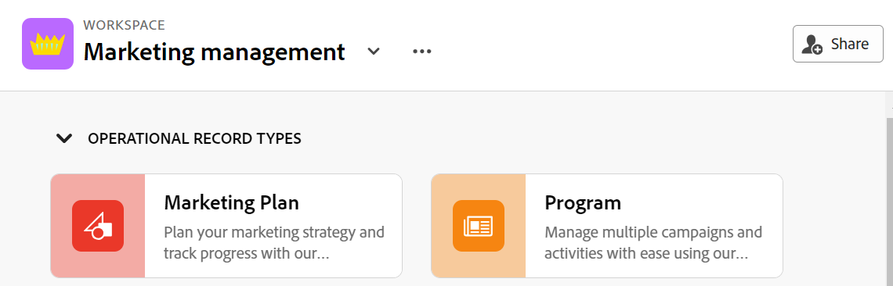
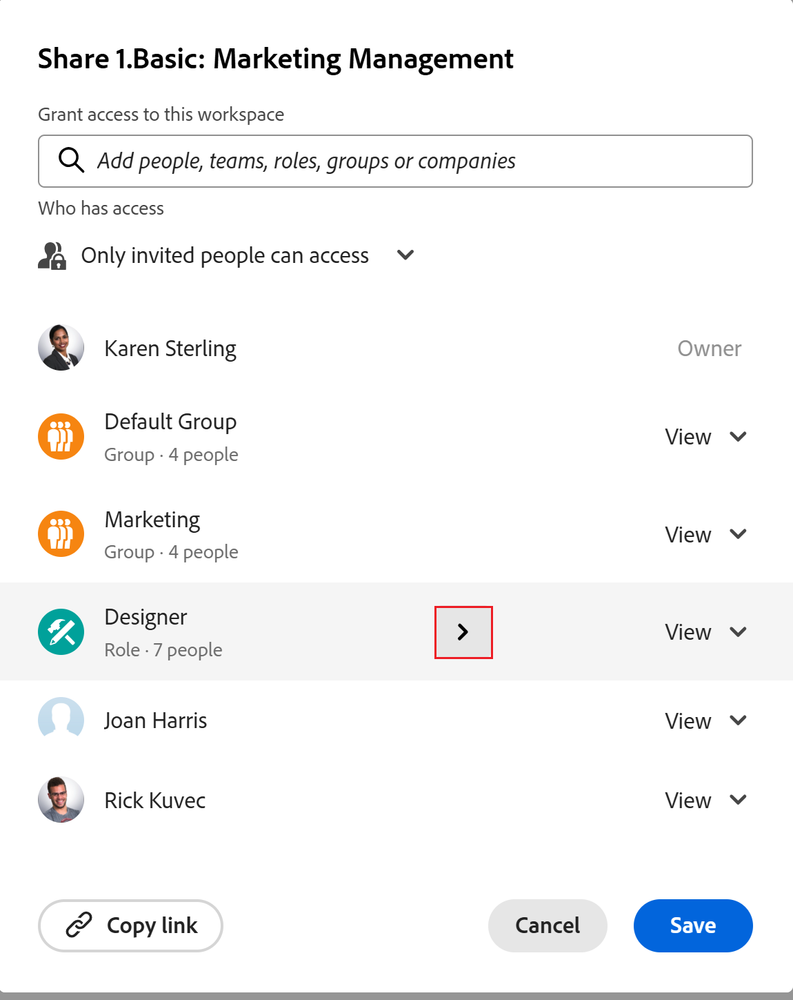
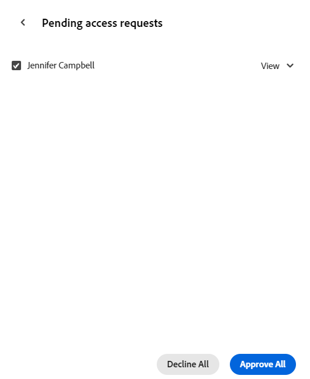

# ワークスペースを共有

このページでハイライト表示されている情報は、まだ一般に利用できない機能を示します。すべてのユーザーのプレビュー環境でのみ使用できます。 実稼動環境への毎月のリリース後、高速リリースを有効にしたお客様は、実稼動環境でも同じ機能を利用できます。

迅速リリースについて詳しくは、[組織での迅速リリースを有効または無効にする](/help/quicksilver/administration-and-setup/set-up-workfront/configure-system-defaults/enable-fast-release-process.md)を参照してください。

{{planning-important-intro}}

Adobe Workfront Planning で作業する際、ワークスペースを他のユーザーと共有して共同作業を確実に行うことができます。

<!--
This article describes how you can share a view with others. For information about requesting, granting, or denying permissions to a view, see [Request permissions to a view or a workspace](/help/quicksilver/planning/access/request-permissions.md).
-->

>[!NOTE]
>
>他のユーザーにワークスペースの権限を付与しても、レコードタイプページのビューに対する権限は付与されません。他のユーザーと共有するには、レコードタイプのページ内の個々のビューに権限を付与する必要があります。詳しくは、[ビューの共有](/help/quicksilver/planning/access/share-views.md)を参照してください。

## アクセス要件

+++ 展開すると、この記事の機能のアクセス要件が表示されます。 

<!--at GA, check that the Workfront plans article linked below has Planning info-->

<table style="table-layout:auto"> 
<col> 
</col> 
<col> 
</col> 
<tbody> 
<tr> 
   <td role="rowheader">
Adobe Workfront パッケージ
</td> 
   <td> 

任意のWorkfrontおよびプランニングパッケージ
 
または

任意のワークフローとプランニングパッケージ
 
 </tr>
<tr> 
   <td role="rowheader">
Adobe Workfront プラン
</td> 
   <td>
標準
 
  </td> 
  </tr>

<td role="rowheader">
オブジェクト権限
</td> 
   <td>  
ワークスペースに対する権限の管理
  </td> 
  </tr>

</tbody> 
</table>

Workfrontのアクセス要件について詳しくは、[Workfront ドキュメント &#x200B;](/help/quicksilver/administration-and-setup/add-users/access-levels-and-object-permissions/access-level-requirements-in-documentation.md)のアクセス要件を参照してください。

+++

<!--
Old:
<table style="table-layout:auto"> 
<col> 
</col> 
<col> 
</col> 
<tbody> 
    <tr> 
<tr> 
<td> 
   
 Products
 </td> 
   <td> 
   <ul><li>
 Adobe Workfront
</li> 
   <li>
 Adobe Workfront Planning
</li></ul></td> 
  </tr>   
<tr> 
   <td role="rowheader">
Adobe Workfront plan*
</td> 
   <td> 

Any of the following Workfront plans:
 
<ul><li>Select</li> 
<li>Prime</li> 
<li>Ultimate</li></ul> 

Workfront Planning is not available for legacy Workfront plans
 
   </td> 
<tr> 
   <td role="rowheader">
Adobe Workfront Planning package*
</td> 
   <td> 

Any 
 

For more information about what is included in each Workfront Planning plan, contact your Workfront account manager. 
 
   </td> 
 <tr> 
   <td role="rowheader">
Adobe Workfront platform
</td> 
   <td> 

Your organization's instance of Workfront must be onboarded to the Adobe Unified Experience to be able to access Workfront Planning.

Your organization must be onboarded to the Adobe Unified Experience for users to be able to request and grant permissions to a workspace from a permission request. 
 

Users must be added to the Adobe Admin Console in order to gain permissions to Workfront Planning workspaces.

For more information, see <a href="/help/quicksilver/workfront-basics/navigate-workfront/workfront-navigation/adobe-unified-experience.md">Adobe Unified Experience for Workfront</a>. 
 
   </td> 
   </tr> 
  </tr> 
  <tr> 
   <td role="rowheader">
Adobe Workfront license*
</td> 
   <td>
 Standard 

   
Workfront Planning is not available for legacy Workfront licenses
 
  </td> 
  </tr> 
  <tr> 
   <td role="rowheader">
Access level configuration
</td> 
   <td> 
There are no access level controls for Adobe Workfront Planning
   
</td> 
  </tr> 
<tr> 
   <td role="rowheader">
Object permissions
</td> 
   <td>  
Manage permissions to a workspace
  </td> 
  </tr> 

</tbody> 
</table>
-->

## ワークスペースの共有に関する考慮事項

* Workfront Planningでのオブジェクトの共有に関する一般的な情報については、[Adobe Workfront Planningでの共有権限の概要](/help/quicksilver/planning/access/sharing-permissions-overview.md)も参照してください。
* ワークスペースは、組織内のユーザー、チーム、役割、グループ、または会社と共有できます。
* グループ、グループ、企業、担当業務に加えて、Adobe Admin Consoleに追加されたユーザーとのみ共有できます。
* 組織外のユーザーとワークスペースを共有することはできません。
* ワークスペースを共有すると、ワークスペースに関連付けられたすべてのレコードタイプ、レコード、フィールドも共有されます。
* ワークスペースを共有する場合、ビューは共有されません。 ビューを個別に共有する必要があります。
* Workspace権限は、レコードタイプに対して継承された権限として表示されます。

## ワークスペースに対する権限の共有

以下のユーザーは、ワークスペースを他のユーザーと共有できます。

* システム管理者は、自分が作成していないワークスペースを含め、すべてのワークスペースを共有できます。
* 他のすべてのユーザーは、管理権限を持つワークスペースのみを共有できます。

ワークスペースを他のユーザーと共有するには：

{{step1-to-planning}}

1. 共有するワークスペースを開き、画面の右上隅にある「**共有**」をクリックします。 共有ボックスが開きます。

   ワークスペースの右上の

1.  （条件付き）アクセス レベルに応じて、次のいずれかの操作を行います。

   * システム管理者の場合は、次のオプションから選択します。

      * **招待されたユーザーのみが**&#x200B;にアクセスできます。共有ボックスでエンティティを選択し、ワークスペースへのアクセス権を選択する必要があります。 これがデフォルトの選択範囲です。
      * **システム内のすべてのユーザーが表示できます**:Planningにアクセスできるシステム内の全員が、Planningの&#x200B;**ワークスペース**&#x200B;領域のワークスペースを表示できます。

   *  （条件付き）標準ライセンスを持つワークスペース マネージャーの場合、次のいずれかの選択項目が表示されますが、変更することはできません。

      * **招待されたユーザーのみが**&#x200B;にアクセスできます。 これは既定の設定です。
      * **システム内のすべてのユーザーが**&#x200B;を表示できます

      ワークスペースのグローバル権限を変更するには、システム管理者に依頼する必要があります。

1. **このワークスペースへのアクセス権を付与** フィールドで、ユーザー、グループ、チーム、会社、または担当業務の名前を入力し始め、リストに表示されたらクリックします。

   

   >[!NOTE]
   >
   >* グループ、グループ、企業、担当業務に加えて、Adobe Admin Consoleに追加されたユーザーとのみ共有できます。 Workfrontのみのユーザーを追加することはできません。 詳しくは、[Adobe Admin Consoleでのユーザーの管理](/help/quicksilver/administration-and-setup/add-users/create-and-manage-users/admin-console.md)を参照してください。
   >
   >* ユーザーとワークスペースを共有すると、そのユーザーの主要な担当業務とその電子メール もフィールドに表示されます。 ユーザーの電子メールを表示するには、アクセスレベルのUsers オブジェクトで「連絡先情報を表示」設定を有効にする必要があります。

1.  （オプション）グループ、チーム、役割、または会社と共有する場合は、エンティティの名前にカーソルを合わせ、右向きの矢印をクリックして、権限を受け取っているユーザーのリストを展開します。

   

1. ドロップダウンメニューから次の権限レベルの 1 つを選択します。
   * 表示
   * 参加
   * 管理

     権限レベルと各レベルでユーザーが実行できるアクションについて詳しくは、[Adobe Workfront Planning での共有権限の概要](/help/quicksilver/planning/access/sharing-permissions-overview.md)を参照してください。
1. 「**リンクをコピー**」をクリックして、ワークスペースへのリンクをクリップボードにコピーします。
1. コピーしたリンクを他のユーザーと共有します。リンクを受け取ったユーザーがそのワークスペースにアクセスするには、アクティブユーザーであり、かつ Workfront にログインする必要があります。
1. 「**保存**」をクリックします。

   ワークスペースを共有したユーザーは、ワークスペースに対する権限を持つことに関するアプリ内通知とメール通知の両方を受け取ります。

## 権限リクエストからワークスペースに権限を付与する

権限を持たないワークスペースへのリンクにアクセスするユーザーは、ワークスペースに対する権限をリクエストできます。 ワークスペースに対する管理権限を持つすべてのユーザーは、権限リクエストを受け取り、権限を付与または拒否できます。

1. （条件付き）ワークスペースのマネージャーである場合、次の領域でビューにアクセスするためのリクエストを他のユーザーから受け取る可能性があります。

   * アプリ内通知
     のアプリ内通知
   * メール通知
     
1. （条件付き）Workfrontの通知領域で、アプリ内通知をクリックします
または
メール通知から、**すべての通知を表示**&#x200B;をクリックし、リスト内の通知をクリックします。

   「**保留中のアクセス要求**」ボックスが表示されます。

   

1. （オプション）権限を承認するユーザーの場合、ユーザー名の右側にあるドロップダウンメニューから次のいずれかのオプションを選択します。
   * **表示**
   * **参加**
   * **管理**
1. 権限を承認または拒否するユーザーを選択し、**すべてを承認**&#x200B;または&#x200B;**すべてを拒否**&#x200B;をクリックします。
1. **保留中のアクセス要求**&#x200B;の左側にある左向き矢印をクリックし、**保存**&#x200B;をクリックします。

   リクエストを承認すると、ユーザーはワークスペースの共有ボックスに追加されます。 権限を要求するユーザーは、要求が承認されたことを確認する電子メールを受信します。<!--will they also get an in-app notification??-->

## ワークスペースに対する権限の削除

{{step1-to-planning}}

1. 権限を削除するワークスペースを開き、画面の右上隅の「**共有**」をクリックします。
1. ワークスペースを共有しているエンティティの名前の右側にあるドロップダウンメニューをクリックし、**削除**&#x200B;をクリックします。
1. 「**保存**」をクリックします。

   削除されたユーザーは、ワークスペースまたはそのオブジェクトにアクセスできなくなります。

   ワークスペースへのアクセスから削除されたユーザーに対して、これらの権限を持たなくなった旨の通知はありません。
