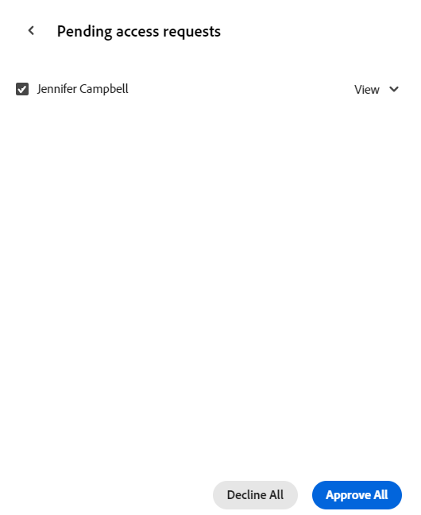

# ワークスペースを共有

このページでハイライト表示されている情報は、まだ一般に利用できない機能を示します。すべてのお客様が、プレビュー環境でのみ使用できます。 実稼動環境への毎月のリリースの後、迅速なリリースを有効にしたお客様には、実稼動環境でも同じ機能を利用できます。

迅速リリースについて詳しくは、[組織での迅速リリースを有効または無効にする](/help/quicksilver/administration-and-setup/set-up-workfront/configure-system-defaults/enable-fast-release-process.md)を参照してください。

{{planning-important-intro}}

Adobe Workfront Planning で作業する際、ワークスペースを他のユーザーと共有して共同作業を確実に行うことができます。

<!--
This article describes how you can share a view with others. For information about requesting, granting, or denying permissions to a view, see [Request permissions to a view or a workspace](/help/quicksilver/planning/access/request-permissions.md). -->

>[!NOTE]
>
>他のユーザーにワークスペースの権限を付与しても、レコードタイプページのビューに対する権限は付与されません。他のユーザーと共有するには、レコードタイプのページ内の個々のビューに権限を付与する必要があります。詳しくは、[ビューの共有](/help/quicksilver/planning/access/share-views.md)を参照してください。

## アクセス要件

+++ 展開すると、Workfront Planning のアクセス要件が表示されます。

この記事の手順を実行するには、次のアクセス権が必要です。

<table style="table-layout:auto"> 
<col> 
</col> 
<col> 
</col> 
<tbody> 
    <tr> 
<tr> 
<td> 
   
 製品
 </td> 
   <td> 
   <ul><li>
 Adobe Workfront
</li> 
   <li>
 Adobe Workfrontの計画
</li></ul></td> 
  </tr>   
<tr> 
   <td role="rowheader">
Adobe Workfront プラン*
</td> 
   <td> 

次のいずれかのWorkfront プラン：
 
<ul><li>選択</li> 
<li>Prime</li> 
<li>Ultimate</li></ul> 

Workfront Planning は、従来のWorkfront プランでは使用できません
 
   </td> 
<tr> 
   <td role="rowheader">
Adobe Workfront Planning パッケージ*
</td> 
   <td> 

任意 
 

各Workfront Planning プランに含まれる内容について詳しくは、Workfront担当営業または販売店にお問い合わせください。 
 
   </td> 
 <tr> 
   <td role="rowheader">
Adobe Workfront platform
</td> 
   <td> 

組織のWorkfront インスタンスは、Workfront Planning のすべての機能にアクセスできるように、Adobe Unified Experience にオンボーディングされる必要があります。

ユーザーが権限リクエストからワークスペースに権限をリクエストおよび付与できるようにするには、組織がAdobeの Unified Experience にオンボーディングされている必要があります。 
 

詳しくは、<a href="/help/quicksilver/workfront-basics/navigate-workfront/workfront-navigation/adobe-unified-experience.md">Workfront の Adobe Unified Experience</a> を参照してください。 
 
   </td> 
   </tr> 
  </tr> 
  <tr> 
   <td role="rowheader">
Adobe Workfront プラン*
</td> 
   <td>
 標準 

   
Workfront Planning は、従来のWorkfront ライセンスでは使用できません
 
  </td> 
  </tr> 
  <tr> 
   <td role="rowheader">
アクセスレベルの設定
</td> 
   <td> 
Adobe Workfront Planning に対するアクセスレベルのコントロールはありません。
   
</td> 
  </tr> 
<tr> 
   <td role="rowheader">
オブジェクト権限
</td> 
   <td>  
ワークスペースに対する権限の管理
  </td> 
  </tr> 
<tr> 
   <td role="rowheader">
レイアウトテンプレート
</td> 
   <td> 
Workfront の管理者を含むすべてのユーザーには、メインメニューの Planning エリアを含むレイアウトテンプレートを割り当てる必要があります。 
 </td> 
  </tr> 
</tbody> 
</table>

*Workfront のアクセス要件について詳しくは、[Workfront ドキュメントのアクセス要件](/help/quicksilver/administration-and-setup/add-users/access-levels-and-object-permissions/access-level-requirements-in-documentation.md)を参照してください。

+++

<!--

OLD: 
 
<table style="table-layout:auto">
 <col>
 </col>
 <col>
 </col>
 <tbody>
    <tr>
<tr>
<td>
   
 Product
 </td>
   <td>
   
 Adobe Workfront
 </td>
  </tr>  
 <td role="rowheader">
Adobe Workfront agreement
</td>
   <td>

Your organization must be enrolled in the early access stage for Workfront Planning 

   </td>
  </tr>
  <tr>
   <td role="rowheader">
Adobe Workfront plan
</td>
   <td>

Any

   </td>
  </tr>
  <tr>
   <td role="rowheader">
Adobe Workfront license*
</td>
   <td>
   
New: Standard

   Or
   
Current: Plan 
 
  </td>
  </tr>
  
  <tr>
   <td role="rowheader">
Access level configurations
</td>
   <td> There are no access controls for Adobe Workfront Planning
  
</td>
  </tr>

  <tr>
   <td role="rowheader">
Permissions
</td>
   <td> 
Manage permissions to a workspace
  
</td>
  </tr>

<tr>
   <td role="rowheader">
Layout template
</td>
   <td> 
All users, including Workfront administrators,  must be assigned a layout template that includes the Planning area in the Main Menu. 
 
For information, see <a href="/help/quicksilver/planning/access/access-overview.md">Access overview</a>. 
 
</td>
  </tr>
 </tbody>
</table>

*For information, see [Access requirements in Workfront documentation](/help/quicksilver/administration-and-setup/add-users/access-levels-and-object-permissions/access-level-requirements-in-documentation.md).-->

## ワークスペースに対する権限の共有

以下のユーザーは、ワークスペースを他のユーザーと共有できます。

* システム管理者は、自分が作成していないワークスペースを含め、すべてのワークスペースを共有できます。
* 他のすべてのユーザーは、管理権限を持つワークスペースのみを共有できます。

ワークスペースを他のユーザーと共有するには：

{{step1-to-planning}}

1. 共有するワークスペースを開き、画面の右上隅の「**共有**」をクリックします。

   

1. 「**ワークスペースへのアクセス権の付与先**」フィールドに、ユーザー、グループ、 チーム、会社または担当業務の名前の入力を開始し  リストに表示されたらクリックします。

   

   

   

1. ドロップダウンメニューから次の権限レベルの 1 つを選択します。
   * 表示
   * 参加
   * 管理

     権限レベルと各レベルでユーザーが実行できるアクションについて詳しくは、[Adobe Workfront Planning での共有権限の概要](/help/quicksilver/planning/access/sharing-permissions-overview.md)を参照してください。
1. 「**リンクをコピー**」をクリックして、ワークスペースへのリンクをクリップボードにコピーします。
1. コピーしたリンクを他のユーザーと共有します。リンクを受け取ったユーザーがそのワークスペースにアクセスするには、アクティブユーザーであり、かつ Workfront にログインする必要があります。
1. 「**保存**」をクリックします。

## 権限リクエストからのワークスペースに対する権限の付与

権限のないワークスペースへのリンクにアクセスするユーザーは、ワークスペースに対する権限をリクエストできます。 ワークスペースに対する管理権限を持つすべてのユーザーは、権限リクエストを受け取り、権限を付与または拒否できます。

1. （条件付き）ワークスペースの管理者は、次の領域で別のユーザーからビューにアクセスするリクエストを受け取る場合があります。

   * アプリ内通知
     
   * メール通知
     
1. （条件付き）Workfrontの通知領域で、アプリ内通知をクリックします
または
メール通知で「**すべての通知を表示**」をクリックし、リスト内の通知をクリックします。

   **保留中のアクセスリクエスト** ボックスが表示されます。

   

1. （オプション）権限を承認するユーザーについて、ユーザー名の右側にあるドロップダウンメニューから次のいずれかのオプションを選択します。
   * **表示**
   * **参加**
   * **管理**
1. 権限を承認または拒否するユーザーを選択し、「**すべて承認**」または「**すべて拒否** をクリックします。
1. **保留中のアクセスリクエスト** の左側にある左向き矢印をクリックし、「**保存**」をクリックします。

   リクエストを承認すると、ユーザーはワークスペースの共有ボックスに追加されます。 権限をリクエストするユーザーに、リクエストが承認されたことを示すメールが届きます。<!--will they also get an in-app notification??-->

## ワークスペースに対する権限の削除

{{step1-to-planning}}

1. 権限を削除するワークスペースを開き、画面の右上隅の「**共有**」をクリックします。
1. ワークスペースを共有するエンティティ名の右側にあるドロップダウンメニューをクリックし、「**削除**」をクリックします。
1. **保存**&#x200B;をクリックします。

   削除されたユーザーは、ワークスペースまたはそのオブジェクトにアクセスできなくなります。
