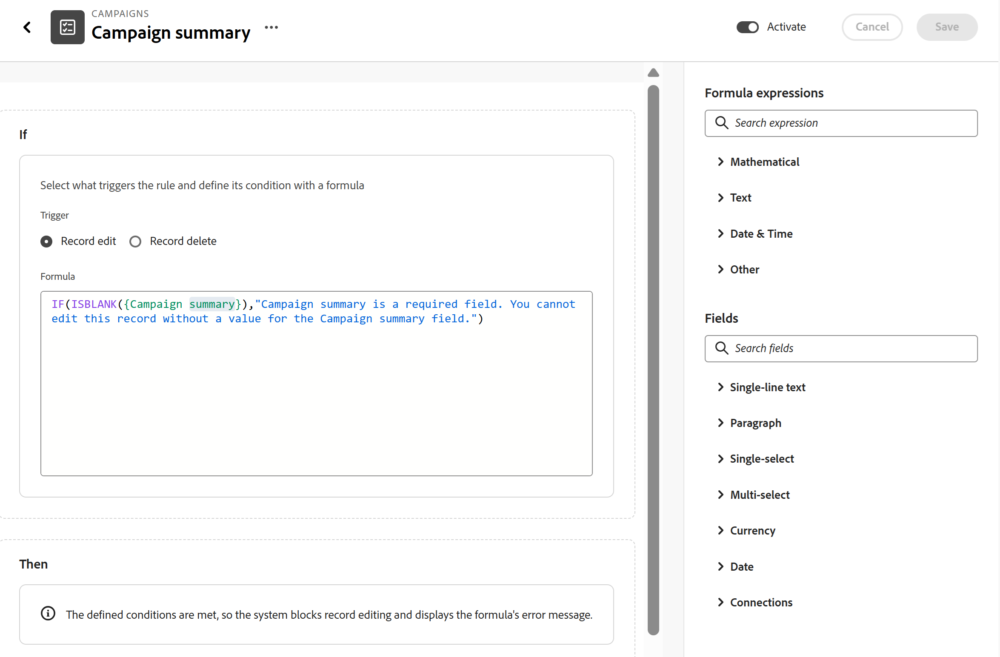

# レコードタイプのビジネスルールの設定

{{planning-important-intro}}

<span class="preview">このページの情報は、まだ一般に提供されていない機能を指します。 すべてのユーザーのプレビュー環境でのみ使用できます。 リリースからプレビューの後、高速リリースを有効にしたお客様は、同じ機能を毎月実稼動環境でも使用できます。</span>

<span class="preview">迅速リリースについて詳しくは、[組織での迅速リリースを有効または無効にする](/help/quicksilver/administration-and-setup/set-up-workfront/configure-system-defaults/enable-fast-release-process.md)を参照してください。</span>

Adobe Workfront Planningのレコードタイプのビジネスルールを設定して、そのタイプのレコードに対するアクションが許可または禁止される前に、特定のフィールドが必要であることを示すことができます。

ルールの作成方法に応じて、定義されたビジネスルールが満たされている場合は、レコードに対して次のアクションを許可できます。

* レコードを編集する/編集しない
* レコードを削除するか、削除しない

## アクセス要件

+++ 展開してアクセス要件を表示し、この記事の手順を実行します。  

<table style="table-layout:auto"> 
<col> 
</col> 
<col> 
</col> 
<tbody> 
    <tr> 
<tr> 
</tr>   
<tr> 
   <td role="rowheader"><p>Adobe Workfront パッケージ</p></td> 
   <td> 
<ul> 
<li><p>プランニングパッケージを含む任意のWorkfrontまたはワークフロー</p></li>
または
<li><p>スタンドアロン製品として購入された場合の任意のプランニング・パッケージ</p></li></ul>
   </td> </tr>
  <tr> 
   <td role="rowheader"><p>Adobe Workfront プラン</p></td> 
   <td><p>Workflow Standard</p>
   </td> 
  </tr> 
<tr> 
   <td role="rowheader"><p>Adobe計画ライセンス</p></td> 
   <td><p>計画標準</p>
   </td> 
  </tr> 
<tr> 
   <td role="rowheader"><p>アクセスレベル設定</p></td> 
   <td> <p>ワークフローとPlanning パッケージの両方を持っている場合は、ワークフローとPlanning ライセンスタイプの両方をアクセスレベルに追加する必要があります</p>   
</td> 
  </tr> 
  <tr> 
   <td role="rowheader"><p>オブジェクト権限</p></td> 
   <td>   <p>ワークスペースおよびレコードタイプに対する権限の管理</p>  
   <p>システム管理者は、作成しなかったワークスペースも含め、すべてのワークスペースに対する権限を持っています。</p>  </td> 
  </tr>  
</tbody> 
</table>

Workfrontのアクセス要件について詳しくは、[Workfront ドキュメント &#x200B;](/help/quicksilver/administration-and-setup/add-users/access-levels-and-object-permissions/access-level-requirements-in-documentation.md)のアクセス要件を参照してください。

+++

## ビジネスルールを設定する際の考慮事項

* ビジネスルールは、フィールドの変更またはレコードの削除に条件を添付します。 ルールは、フィールドがルールで設定したフィールド値に変更されようとしている特定の意図的な瞬間にのみ適用されます。

* ルールは平易な言語では次のようになります。「このレコードを編集する前に、Campaignの概要フィールドに値が必要です。」

  フィールドが空の場合、レコードの編集はブロックされ、ユーザーは先に進む前に対処する必要があることを説明する明確なメッセージを受け取ります。 必須フィールドを更新して再試行すると、変更は許可されます。

* ルールはレコードの作成をブロックしません。 ユーザーは引き続きレコードを作成できますが、必須フィールドが空でないか、指定された値が含まれていることを確認する必要があります。
* ルールは、レコードを自動的に編集または削除しません。 変更は、ユーザーが故意にトリガーする必要があります。
* ルールは過去にさかのぼって適用されません。古いレコードは影響を受けません。 ルールチェックは、ユーザーがレコードを次に編集または削除しようとしたときにのみ実行されます。
* プライマリワークスペースまたはセカンダリワークスペースのグローバルレコードタイプにビジネスルールを追加することはできません。
* 次の以外のすべてのフィールドタイプを参照するビジネスルールの条件を作成できます。
  * 数式フィールド
  * ルックアップフィールド
  * 参照フィールド
* レコードを編集または削除できるすべてのユーザーにルールが適用されます。
* レコードタイプには、複数のビジネスルールを設定できます。 <!--Syuzanna is checking this because it should be just ONE rule per action: one per edit and one per delete - see this: https://workfront.slack.com/archives/C0BHWEUSJCU/p1788281638322049?thread_ts=1787924876.280359&cid=C0BHWEUSJCU; I also logged a bug for this because it released with more than one per action - https://experience.adobe.com/#/@adobeinternalworkfront/so:hub-Hub/workfront/issue/6a99add600001e9aa90435ec181dec3e/overview-->

  すべてのルールを同時にチェックします。<!-- I have asked Syuzanna and Norayr multiple times HOW are the rules run/ prioritized and I got no answers; when I know, I will update here-->

## ビジネスルールの設定

1. レコードタイプ ページに移動します。
1. 任意のビューから、レコードタイプ名の右側にある&#x200B;**詳細** メニューをクリックし、**ビジネスルール**&#x200B;をクリックします。

   ビジネスルールのテーブルページが開きます。
1. 「**新しいビジネスルール**」をクリックします。
1. **新しいビジネス** ルールボックスで、最初に使用可能なフィールドにビジネスルールの名前を追加します。 これは必須フィールドです
1. （オプション）ビジネスルールを定義する説明を追加し、**保存**&#x200B;をクリックします。

   ビジネスルール設定フォームが開きます。

   

1. ビジネスルール設定フォームの&#x200B;**If** セクションで、特定のルールに基づいて制限または許可するアクションを選択します。 次から選択してください：<!--check UI text-->
   * **レコード編集**：このルールで定義された条件が満たされた場合、ユーザーはレコードを編集または編集できません。
   * **レコード削除**：このルールで定義された条件が満たされた場合、ユーザーはレコードを削除または削除できません。
     <!--add screen shot when UI text is final-->
1. **数式フィールド**&#x200B;に、ビジネスルールを追加します。 右側のパネルの「**数式**」セクションから、ルールの演算子を選択します。

   例えば、**その他** フィールドセクションから&#x200B;**IF**&#x200B;を選択するか、「IF」と入力し、候補リストに表示されたらクリックします。

   >[!TIP]
   >
   >ルールの構文を正しく保つために、候補リストからフィールドと演算子を選択することをお勧めします。
1. このレコードタイプのレコードを編集または削除できるように、必須にするフィールドを選択します。

   例えば、次のステートメントを入力して、**キャンペーンの概要** フィールドを必須にすることができます。

   ```
      IF(ISBLANK({Campaign summary}),"Campaign summary is a required field. You cannot edit this record without a value for the Campaign summary field.")
   ```

   >[!IMPORTANT]
   >
   >ユーザーがレコードで実行しようとしているアクションが許可されていない場合を簡単に理解できるように、ルール式に次の情報を含めることを強くお勧めします。
   >
   >* ルールが設定されている正確なフィールド。
   >* ルールが満たされない場合の正確な結果。

   フィールドまたは式が正しくない場合は、**式** フィールドにインジケーターがあります。 <!--add screen shot?-->

   ビジネス ルールの&#x200B;**Then** セクションでは、ルールの機能の説明を表示できます。

1. 「**アクティブ化**」をクリックして、このレコードタイプのルールをアクティブにし、「**保存**」をクリックします。

   ルールは、アクティベートした直後に適用されます。選択したレコードタイプのレコードを編集または削除する権限を持つすべてのユーザーは、ルールに従う必要があります。
1. （オプションおよび推奨）ページヘッダーの&#x200B;**ビジネスルール**&#x200B;の左側にある後方矢印をクリックして、レコードタイプページを表示し、テーブルビューに移動するか、レコードのページを開いて、レコードの編集または削除を試して、作成したルールをテストします。

## ビジネスルールの管理

既存のビジネスルールを編集、削除または非アクティブ化できます。

既存のルールを編集しても、既存のレコードは変更されません。 編集されたルールは、誰かがレコードを編集または削除しようとしたときに、既存のレコードにのみ適用されます。

1. レコードタイプの&#x200B;**ビジネスルール** テーブルページに戻ります。
1. 変更したいルールを見つけます。
1. ルール名にカーソルを合わせ、**詳細** メニューをクリックしてから、次のいずれかのオプションをクリックします。

   * **編集**：これにより、ビジネスルールの設定ページが開き、ビジネスルールに関する情報を編集できます。
   * **非アクティブ化**: <!--check this in the UI: right now, it says Disable-->これにより、ルールがトリガーされなくなりますが、将来にわたって保持されます。必要です。
   * **削除**: ルールに関するすべての情報が削除されます。 削除されたルールは復元できません。

   編集されたルールまたはルールの非アクティブ化は、今後のレコードにのみ適用され、過去にさかのぼって適用されません。

   <!--add NEW screen shot below if UI is fixed with Deactivate at release; it was fixed in devTest-->

   <!---->

<!--

***********FROM CLAUDE - BELOW - MUST EDIT*******************


### What business rules actually do

Business rules attach a condition to a **status change**. Instead of enforcing complete data the moment someone creates a record (which would slow everyone down), the rule only kicks in at one specific, deliberate moment: when a status is about to change to a status you've configured.

A rule looks like this in plain language:

> "Before a record can move to **Ready for Execution**, the field **Brand** must have a value."

If the field is empty, the status change is blocked and the person gets a clear message telling them what to fix. Once they fill it in and try again, the change goes through.

A few important things this is *not*:

* **It doesn't block record creation.** People can still create a new record instantly and fill it in over time, exactly like today. 
* **It doesn't auto-fill anything or auto-change statuses.** A person always has to make the status change themselves.
* **It doesn't retroactively flag old records.** Records that are already sitting in the target status aren't affected — the check only runs the next time someone tries to move a record *into* that status.

### Step 1: Open the business rules configuration area

Business rules live alongside your other admin setup — you won't need to hunt for a separate "Planning" panel. From your workflow setup area:

1. Go to the main **workflow setup / admin configuration** area for your workspace.
2. Look for the **business rules** section for the record type you want to configure (for example, "Materials" or "Campaigns").


### Step 2: Choose the record type

Rules are configured per record type, so pick the one you want to add a rule to. For example, if you want to make sure every Materials record has key fields filled in before execution, select **Materials**.

### Step 3: Create a new rule

For each rule, you'll specify three things:

| What you set | Example |
|---|---|
| **Record type** | Materials |
| **Target status** | Ready for Execution |
| **Required field** | Brand |

In other words: "When a Materials record's status is changed to **Ready for Execution**, the field **Brand** must have a value."

You can add more than one rule for the same status. For example, you might require Brand, Therapeutic Area, Indication, and Estimated Launch Date all to be filled in before a record can move to "Ready for Execution" — each is its own rule, and all of them are checked together.

**What fields can you require?**

* Connected record fields (e.g., a linked Brand or Indication record) — the rule passes as soon as at least one record is linked.
* Standard text fields (single-line or paragraph) — the rule passes once there's any value.
* Date fields — the rule passes once a date is set.

**What you can't use yet:** formula fields and lookup fields aren't supported as rule targets in this release, since they're calculated in the background rather than filled in directly by a person.

### Step 4: Write the message people will see

When you create a rule, you'll also provide the message that shows up if someone tries to make the change without the field filled in. Keep it specific and actionable — something like:

> "Brand is required."

You don't need to worry about formatting a whole error banner — the system handles combining messages if multiple rules are violated at once (see below).

### Step 5: Save the rule

Once saved, the rule takes effect **immediately** for everyone in the workspace — no need to log out, refresh, or wait for a deployment. The very next time anyone tries to move a record into that status, the rule is checked.

### What your team will actually experience

Here's what changes for the people using Planning day to day, once a rule is live.

#### If a required field is empty

1. A planner opens a record and changes the status to the gated status (say, "Ready for Execution").
2. The system checks all rules tied to that status.
3. If a required field is empty, the change is **rejected** — the status reverts back to what it was.
4. A toast message appears, naming exactly which field(s) are missing:
   > *"Status change blocked: 'Brand' and 'Estimated Launch Date' must be populated before moving to 'Ready for Execution.'"*
5. The planner fills in the missing field(s) and tries the status change again.
6. This time, the rule passes, and the status updates normally.

#### If everything is already filled in

Nothing changes. The status updates instantly, with no extra steps or popups. Business rules are invisible until they're actually needed.

#### If several fields are missing at once

All the violated rules are checked together, and the message lists every missing field in one go — planners don't have to fix one field, try again, get told about the next one, and repeat.

### Step 6: Edit or remove a rule later

Rules aren't set in stone. To make changes:

1. Go back to the business rules configuration area for the record type.
2. Find the rule you want to change.
3. Edit the required field, target status, or message — or delete the rule entirely.
4. Save. The change applies immediately to future status changes.

Keep in mind: editing or deleting a rule **only affects transitions going forward.** Records that already made it into the target status before the change aren't reevaluated.
3## A few things worth knowing

* **This is separate from locking records after a status change.** Business rules (as described here) only check field completeness *before* a status change goes through. A different, related feature governs whether a record becomes fully locked from edits/deletion once it reaches a certain status — that's not what's covered here.
* **Bulk status changes** (changing status on many records at once) aren't fully defined yet for how they interact with business rules — if your team relies heavily on bulk actions, check with your Adobe contact on current behavior.
* **If a rule can't be evaluated** due to a system error, the transition is blocked rather than silently allowed through — you'll never end up with an incomplete record slipping past a rule because of a backend hiccup.
* **Turning the feature off** doesn't delete your configured rules — they're just paused. Turning it back on restores them exactly as they were, no reconfiguration needed.

### Quick reference: setting up your first rule

1. Confirm the feature is enabled for your tenant.
2. Go to workflow setup → business rules for your record type.
3. Choose the record type (e.g., Materials).
4. Create a rule: target status + required field.
5. Write a clear, specific error message.
6. Save — it's live immediately.
7. Repeat for each field you want to require.
8. Test it yourself: try changing a record's status with the field empty, confirm you see the expected message, fill in the field, and confirm the status change now goes through.

That's it — from here on, anyone converting a record forward will get a clear nudge if something's missing, instead of a downstream project quietly showing up incomplete.

-->