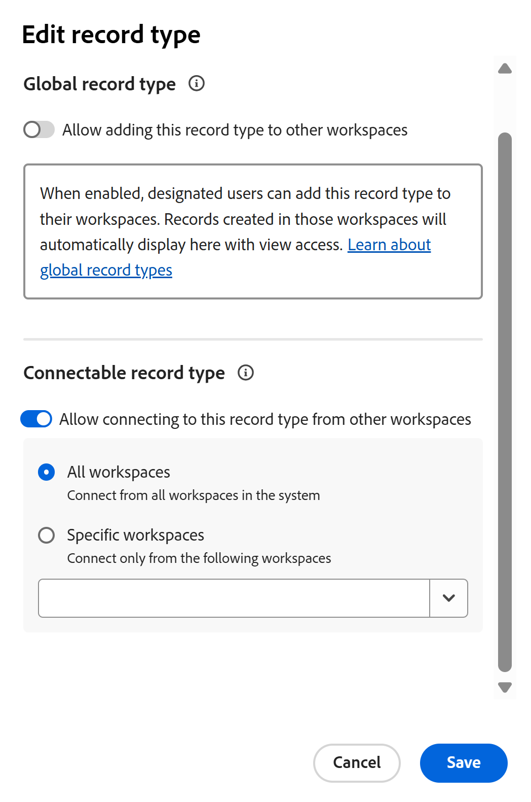

<!--
*******************REPLACE THE "ADVANCED SETTINGS" SECTION IN THE "EDIT RECORD TYPES" ARTICLE WITH A LINK TO THIS ARTICLE INSTEAD AND REMOVE THE STEPS FROM THE "EDIT RECORD TYPES" ARTICLE ON HOW TO ALLOW CROSS-WORKSPACE SETTINGS FOR RECORD TYPES*************
-->

# レコードタイプのクロスワークスペース機能の設定

<!--
this article is linked to the UI in the Advanced settings/ Cross-workspace settings tab - do not delete or change the URL
-->

{{planning-important-intro}}

<!--
The information highlighted on this page refers to functionality not yet generally available. It is available only in the Preview environment for all customers. After the monthly releases to Production, the same features are also available in the Production environment for customers who enabled fast releases.    

For information about fast releases, see [Enable or disable fast releases for your organization](/help/quicksilver/administration-and-setup/set-up-workfront/configure-system-defaults/enable-fast-release-process.md). 
-->

Adobe Workfront Planningでは、複数のワークスペースをまたいで作業するようにレコードタイプを設定できます。

レコードタイプは、次のいずれかに指定できます。

* **グローバルレコードタイプ**：ユーザーは、管理できる他のワークスペースにグローバルレコードタイプを追加できます。
* **接続可能なレコードタイプ**：ユーザーは他のワークスペースからこのレコードタイプに接続できます。

ワークスペースマネージャーがレコードタイプを追加したり、他のワークスペースから接続したりするには、まずレコードタイプのクロスワークスペース機能を定義する必要があります。

レコードタイプを作成または編集する際に、レコードタイプのクロスワークスペース機能を定義します。

詳しくは、次のいずれかの記事を参照してください。

* [レコードタイプの作成](/help/quicksilver/planning/architecture/create-record-types.md)
* [レコードタイプの編集](/help/quicksilver/planning/architecture/edit-record-types.md)

## アクセス要件

+++ 展開して、この記事の機能のアクセス要件を表示します。

<table style="table-layout:auto"> 
<col> 
</col> 
<col> 
</col> 
<tbody> 
    <tr> 
<tr> 
</tr>   
<tr> 
   <td role="rowheader">
Adobe Workfront パッケージ
</td> 
   <td> 

接続可能なレコードタイプを設定するには： 

<ul> 
<li>
任意のWorkfront パッケージと任意のPlanning パッケージ
</li>
または
<li>任意のワークフローとプランニング PrimeまたはUltimate パッケージ
</li></ul>

グローバルレコードタイプを設定するには：

<ul> 
<li>
任意のWorkfront パッケージとPlanning Plus パッケージ
</li>
または
<li>
任意のワークフローとプランニング PrimeまたはUltimate パッケージ
</li></ul>

各Workfront計画パッケージに含まれる内容について詳しくは、Workfrontの担当者にお問い合わせください。 

</td> 
  <tr> 
   <td role="rowheader">
Adobe Workfront プラン
</td> 
   <td>
   <!--
   
In the Production environment: 

   
To make a record global:

   <ul><li>Standard or higher</li></ul>
   
To make a record connectable:

   <ul><li>System Administrator</li></ul>
   -->

レコードをグローバル化するには：

   <ul><li>Standard以上</li></ul>
   
レコードを接続可能にするには：

<ul><li>特定のワークスペースからレコードを接続可能にする標準</li>
   <li>すべてのワークスペースからレコードを接続可能にするシステム管理者</li></ul>

</td> 
  </tr> 
  <tr> 
   <td role="rowheader">
オブジェクト権限
</td> 
   <td>   
ワークスペースに対する権限の管理
  
   
システム管理者は、作成しなかったワークスペースも含め、すべてのワークスペースに対する権限を持っています。
  </td> 
  </tr>  
</tbody> 
</table>

Workfrontのアクセス要件について詳しくは、[Workfront ドキュメント &#x200B;](/help/quicksilver/administration-and-setup/add-users/access-levels-and-object-permissions/access-level-requirements-in-documentation.md)のアクセス要件を参照してください。

+++   

<!--
Old:
<table style="table-layout:auto"> 
<col> 
</col> 
<col> 
</col> 
<tbody> 
    <tr> 
<tr> 
  </tr>   
<tr> 
   <td role="rowheader">
Adobe Workfront package
</td> 
   <td> 
<ul><li>
Any Workfront package
</li>

And

<li>
Any Planning package to create connectable record types
</li>
<li>
A Planning Plus package to create global record types
</li>
</ul>
Or:
<ul><li>
A Workflow Prime or Ultimate package
 </li>
And
<li>
A Planning Prime or Ultimate package
</li></ul>

For more information about what is included in each Workfront Planning package, contact your Workfront account manager. 
 
   </td> 
  <tr> 
   <td role="rowheader">
Adobe Workfront license
</td> 
   <td>
Standard

   </td> 
  </tr> 
  <tr> 
   <td role="rowheader">
Object permissions
</td> 
   <td>   
Manage permissions to a workspace and to the record type</a> 
  
   
System Administrators have permissions to all workspaces, including the ones they did not create
  </td> 
  </tr>  
</tbody> 
</table>
-->

## グローバルレコードタイプの設定

<!--
this is a UI term; don't change the title of this section
-->

ワークスペースマネージャーは、レコードタイプをグローバルレコードタイプに設定できます。 グローバルレコードタイプは、他のワークスペースに追加できます。

ワークスペースマネージャーは、管理するワークスペースにグローバルレコードタイプを追加できます。 レコードタイプの元のフィールドもセカンダリワークスペースに追加されます。

ユーザーは、Contribute権限を持ち、元のワークスペースを含むグローバルレコードタイプが追加されている任意のワークスペースから、グローバルレコードタイプにレコードを追加できます。 グローバルレコードタイプのプライマリワークスペースからへの表示権限のみを持つワークスペースからレコードを表示できます。

詳しくは、[&#x200B; クロスワークスペースのレコードタイプの概要](/help/quicksilver/planning/architecture/cross-workspace-record-types-overview.md)を参照してください。

レコードタイプをグローバルに設定するには：

{{step1-to-planning}}

1. グローバルとして設定するレコードタイプを持つワークスペースをクリックします。

   ワークスペースページが開き、レコードタイプが表示されます。
1. 次のいずれかの操作を行います。

   * レコードタイプのカードにカーソルを合わせ、レコードタイプカードの右上隅にある&#x200B;**詳細** メニューをクリックします。

     

   * レコードタイプカードをクリックしてレコードタイプページを開き、レコードタイプ名の右側にある&#x200B;**詳細** メニューをクリックします。
1. **編集**&#x200B;または&#x200B;**設定**&#x200B;をクリックします。

   >[!TIP]
   >
   >レコードタイプが別のワークスペースに追加されると、そのワークスペースにグローバルレコードタイプとして表示されます。 この場合、「編集」および「設定」オプションは削除されます。

1. （条件付き）「**編集**」をクリックした場合、「**レコードタイプを編集**」ボックスで、「**クロスワークスペース設定**」タブをクリックします

   または、**設定**&#x200B;をクリックした場合は、左側のパネルの&#x200B;**クロスワークスペース設定** セクションをクリックします。
1. このレコードタイプを他のワークスペース **設定に追加することを許可する**&#x200B;設定を有効にします。

   

   >[!TIP]
   >
   >グローバルレコードタイプを別のワークスペースに追加した後、この設定を無効にすることはできません。

1. **このレコードタイプを管理するワークスペースに追加できるユーザーを選択** フィールドで、このレコードタイプを管理するワークスペースに追加できるエンティティを追加します。

   あなたの名前が自動的にフィールドに追加されます。

   このレコードタイプを管理するワークスペースに追加することを許可するユーザーの個々のユーザー、グループ、チーム、担当業務、または会社を追加できます。

   このフィールドは、レコードタイプを保存した後で編集できます。

1. （オプション）「**このレコードタイプを管理するワークスペースに追加できるユーザーを選択**」フィールドから名前を削除します。

   >[!TIP]
   >
   >この設定を有効にするには、少なくとも1つのエンティティ（ユーザー、チーム、グループ、役割、または会社）を指定する必要があります。

1. （条件付き）「**レコードタイプを編集**」ボックスの「**保存**」をクリックするか、ページヘッダーの「**設定**」セクションの左側にある後方矢印をクリックして変更を保存します。

   次のことが発生します。

   * レコードタイプとそのフィールドは、指定したユーザーが別のワークスペースに追加できるようになりました。

   >[!NOTE]
   >
   >レコードタイプの外観と設定、および元のフィールドは、元のワークスペースからのみ編集できます。

   * レコードタイプカードには、**グローバルレコードタイプ** アイコン が表示され、レコードタイプが他のワークスペースに追加できることを示します。
   * システム生成の&#x200B;**Workspace** フィールドが、レコードタイプとそのレコードの詳細のテーブルビューに追加されます。

     Workspace フィールドには、各レコードの作成元となるワークスペースが表示されます。

     このフィールドは読み取り専用で、削除できません。

     >[!TIP]
     >
     >**Workspace** フィールドのフィールド値が空の場合、レコードは、レコードの作成後にグローバル レコード タイプが削除されたセカンダリ ワークスペースから作成されました。

1. （オプション）別のワークスペースに移動し、既存のレコードタイプを使用してレコードタイプを作成します。 上記の手順で有効にしたレコードタイプを選択します。

   詳しくは、[別のワークスペースから既存のレコードタイプを追加](/help/quicksilver/planning/architecture/add-existing-record-types-from-another-workspace.md)を参照してください。

   セカンダリワークスペースのグローバルレコードタイプから追加されたレコードタイプは、セカンダリワークスペース **に類似した** グローバルレコードタイプ  グローバルレコードタイプアイコンを表示します。これは、レコードタイプが別のワークスペースからインポートされたことを示します。 セカンダリワークスペースのグローバルアイコンにカーソルを合わせると、元のワークスペースの名前を確認できます。
1. （オプション）グローバルレコードタイプを作成した元のワークスペースに戻り、<!--ensure this stays accurate-->の手順1 ～ 4に従ってレコードタイプを編集します
1. （オプション）このレコードタイプが使用されている&#x200B;**ワークスペース** セクションで、グローバルレコードが追加されたワークスペースのリストを確認します。 ワークスペースの所有者は、ワークスペース名の横にも表示されます。

   
1. （オプション）このレコードタイプが使用されている&#x200B;**ワークスペースにリストされているワークスペースの1つの名前をクリックして** セクションを開きます。

## 接続可能なレコードタイプの設定

<!--this is a UI term; don't change the title of this section-->

{{step1-to-planning}}

1. 接続可能として設定するレコードタイプを持つワークスペースをクリックします。

   ワークスペースページが開き、レコードタイプが表示されます。
1. 次のいずれかの操作を行います。

   * レコードタイプのカードにカーソルを合わせ、レコードタイプカードの右上隅にある&#x200B;**詳細** メニューをクリックします

     

   * レコードタイプカードをクリックしてレコードタイプページを開き、レコードタイプ名の右側にある&#x200B;**詳細** メニューをクリックします。
1. **編集**&#x200B;または&#x200B;**設定**&#x200B;をクリックします。

1. （条件付き）「**編集**」をクリックした場合、「**レコードタイプを編集**」ボックスで、「**クロスワークスペース設定**」タブをクリックします

   または、**設定**&#x200B;をクリックした場合は、左側のパネルの&#x200B;**クロスワークスペース設定** セクションをクリックします。

1. 他のワークスペース **設定でこのレコードタイプへの接続を許可する**&#x200B;を有効にします。

   

   有効にすると、レコードタイプにアクセスでき、他のワークスペースからに接続できます。

1. （条件付き）所有しているライセンスに応じて、レコードタイプにアクセスできるワークスペースを選択します。 次のオプションから選択します。

   * **すべてのワークスペース**: ユーザーは、管理権限を持つすべてのワークスペースからこのレコードタイプに接続できます。 このオプションは、標準ライセンスを持つワークスペースマネージャーの場合はグレー表示になります。 すべてのワークスペースからのレコードタイプの接続を有効にできるのは、システム管理者のみです。
   * **特定のワークスペース**: ドロップダウンメニューから、ワークスペースマネージャーがこのレコードタイプに接続できるワークスペースの名前を追加します。

1. （条件付き）「**レコードタイプを編集**」ボックスの「**保存**」をクリックするか、ページヘッダーの&#x200B;**設定**」の左側にある後方矢印をクリックして変更を保存します。

   次のことが発生します。

   * レコードタイプとそのフィールドは、指定したワークスペースから接続できるようになりました。
   * レコードタイプカードには、接続可能なレコードタイプアイコン が表示され、設定で指定したワークスペースからレコードタイプを接続できることを示します。

1. （オプション）別のワークスペースに移動し、上記の手順でワークスペース間の接続性を有効にしたレコードタイプに接続を追加します。

   詳しくは、[レコードタイプの接続](/help/quicksilver/planning/architecture/connect-record-types.md)を参照してください。

