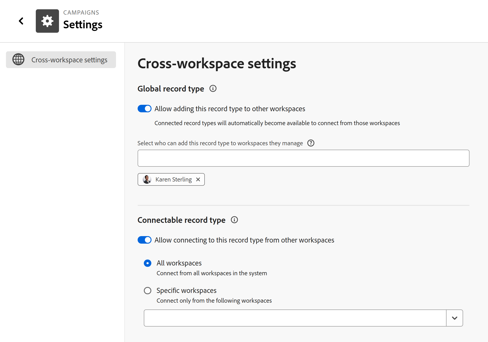

# レコードタイプの設定エリアの設定

このページの情報は、まだ一般に提供されていない機能を指します。すべてのお客様が、プレビュー環境でのみ使用できます。 実稼動環境への毎月のリリースの後、迅速なリリースを有効にしたお客様には、実稼動環境でも同じ機能を利用できます。

迅速リリースについて詳しくは、[組織での迅速リリースを有効または無効にする](/help/quicksilver/administration-and-setup/set-up-workfront/configure-system-defaults/enable-fast-release-process.md)を参照してください。

{{planning-important-intro}}

レコードタイプの追加設定は、Adobe Workfront Planning に保存された後で指定できます。

レコードタイプに対して定義する機能に応じて、次のいずれかの操作を実行して追加の設定を指定できます。

<!--the above will need to be reworded when we add automations and manage request forms to this area-->

* 編集

  詳しくは、[ レコードタイプの編集 ](/help/quicksilver/planning/architecture/edit-record-types.md) を参照してください。

* レコードタイプの設定ページの設定。

  この記事では、設定ページを設定してレコードタイプを編集する方法を説明します。

## アクセス要件

+++ 展開して、この記事の機能のアクセス要件を表示します。 

<table style="table-layout:auto"> 
<col> 
</col> 
<col> 
</col> 
<tbody> 
    <tr> 
<tr> 
</tr>   
<tr> 
   <td role="rowheader">
Adobe Workfront パッケージ
</td> 
   <td> 

任意のWorkfrontおよび Planning パッケージ

任意のワークフローおよび計画パッケージ

<b>メモ</b>

接続可能なレコード・タイプを構成する手順は、次のとおりです。

<ul> 
<li>
任意のWorkfrontおよび Planning パッケージ
</li>
または
<li>
任意のワークフローパッケージと Planning PrimeまたはUltimate パッケージ
</li></ul>

グローバルレコードタイプを設定するには：

<ul> 
<li>
任意のWorkfront パッケージと Planning Plus パッケージ
</li>
または
<li>
任意のワークフローパッケージと Planning PrimeまたはUltimate パッケージ
</li></ul>

各Workfront Planning パッケージに含まれる内容について詳しくは、Workfront アカウント担当者にお問い合わせください。 
 

   </td> </tr>
  <tr> 
   <td role="rowheader">
Adobe Workfront プラン
</td> 
   <td>
標準

   </td> 
  </tr> 
  <tr> 
   <td role="rowheader">
オブジェクト権限
</td> 
   <td>   
ワークスペースに対する権限の管理
  
   
システム管理者は、作成しなかったワークスペースも含め、すべてのワークスペースに対する権限を持っています。
  </td> 
  </tr>  
</tbody> 
</table>

Workfrontのアクセス要件について詳しくは、[Workfront ドキュメントのアクセス要件 ](/help/quicksilver/administration-and-setup/add-users/access-levels-and-object-permissions/access-level-requirements-in-documentation.md) を参照してください。

+++    

<!--Old:

<table style="table-layout:auto"> 
<col> 
</col> 
<col> 
</col> 
<tbody> 
    <tr> 
<tr> 
<td> 
   
 Products
 </td> 
   <td> 
   <ul><li>
 Adobe Workfront
</li> 
   <li>
 Adobe Workfront Planning
</li></ul></td> 
  </tr>   
<tr> 
   <td role="rowheader">
Adobe Workfront plan*
</td> 
   <td> 

Any of the following Workfront plans:
 
<ul><li>Select</li> 
<li>Prime</li> 
<li>Ultimate</li></ul> 

Workfront Planning is not available for legacy Workfront plans
 
   </td> 
<tr> 
   <td role="rowheader">
Adobe Workfront Planning package*
</td> 
   <td> 

Any 
 

For more information about what is included in each Workfront Planning plan, contact your Workfront account manager. 
 
   </td> 
 <tr> 
   <td role="rowheader">
Adobe Workfront platform
</td> 
   <td> 

Your organization's instance of Workfront must be onboarded to the Adobe Unified Experience to be able to access Workfront Planning.
 

For more information, see <a href="/help/quicksilver/workfront-basics/navigate-workfront/workfront-navigation/adobe-unified-experience.md">Adobe Unified Experience for Workfront</a>. 
 
   </td> 
   </tr> 
  </tr> 
  <tr> 
   <td role="rowheader">
Adobe Workfront license*
</td> 
   <td>
 Standard 

   
Workfront Planning is not available for legacy Workfront licenses
 
  </td> 
  </tr> 
  <tr> 
   <td role="rowheader">
Access level configuration
</td> 
   <td> 
There are no access level controls for Adobe Workfront Planning
   
</td> 
  </tr> 
<tr> 
   <td role="rowheader">
Object permissions
</td> 
   <td>   
Manage permissions to a workspace and record type 
  
   
System Administrators have permissions to all workspaces, including the ones they did not create

   
Only system administrators can enable record types to connect from other workspaces
 </td> 
  </tr> 

</tbody> 
</table> 

-->

## 設定ページでのレコードタイプ情報の設定

レコードタイプに対してクロスワークスペース機能を定義するには、設定ページで情報を設定します。

<!--the intro above will change when we can configure more in this area -->

{{step1-to-planning}}

1. レコードタイプを編集するワークスペースをクリックします。

   ワークスペースページが開き、レコードタイプが表示されます。
1. 次のいずれかの操作を行います。

   * レコードタイプのカードにポインタを合わせ、レコードタイプのカードの右上隅にある **その他** メニュー  をクリックしてから、**設定** をクリックします。

     

     または

   * レコードタイプカードをクリックしてレコードタイプページを開き、レコードタイプ名の右側にある **詳細** メニュー  をクリックしてから、**設定** をクリックします。

   <!--update screen shot at prod??-->

   

1. 「**クロスワークスペース設定**」セクションは、デフォルトで選択されています。
1. 次のいずれかの設定をオンまたはオフにします。

   * **このレコードタイプを他のワークスペースに追加することを許可** して、これがグローバルレコードタイプであることを示します
   * **他のワークスペースでこのレコードタイプへの接続を許可** して、接続可能なレコードタイプであることを示します。

   この設定は、デフォルトではオフになっています。

   詳しくは、[ レコードタイプのクロスワークスペース機能の設定 ](/help/quicksilver/planning/architecture/configure-record-type-cross-workspace-capabilities.md) を参照してください。