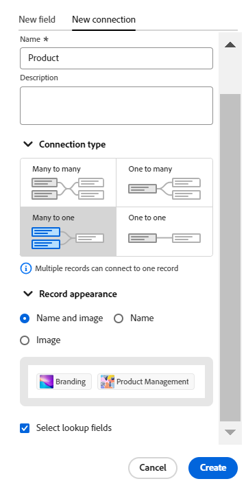

# 接続されたレコードタイプの概要

このページでハイライト表示されている情報は、まだ一般に利用できない機能を示します。すべてのお客様が、プレビュー環境でのみ使用できます。 実稼動環境への毎月のリリースの後、迅速なリリースを有効にしたお客様には、実稼動環境でも同じ機能を利用できます。

迅速リリースについて詳しくは、[組織での迅速リリースを有効または無効にする](/help/quicksilver/administration-and-setup/set-up-workfront/configure-system-defaults/enable-fast-release-process.md)を参照してください。

個々のレコードタイプを相互に関連付けたり、他のアプリケーションのオブジェクトに接続して関連付けることができます。

この記事では、レコードタイプ接続の概要を説明し、レコードタイプとオブジェクトタイプの間で確立できる接続のタイプについて説明します。

レコードタイプの接続について詳しくは、[ レコードタイプの接続 ](/help/quicksilver/planning/architecture/connect-record-types.md) を参照してください。

## レコードタイプの連結に関する考慮事項

Workfront Planning で接続するには、次の 2 つの手順があります。

1. まず、2 つのレコードタイプまたはレコードタイプとオブジェクトタイプ間の接続を別のアプリケーションから確立する必要があります。 レコードタイプの接続方法について詳しくは、[ レコードタイプの接続 ](/help/quicksilver/planning/architecture/connect-record-types.md) を参照してください。
1. 次に、2 つのレコードタイプが接続された後で、1 つのタイプの個々のレコードを別のタイプのレコードに接続できます。 レコードの接続について詳しくは、「[ レコードの接続 ](/help/quicksilver/planning/records/connect-records.md)」を参照してください。

レコードタイプの接続については、次の点に注意してください。

* Workfront Planning では、次のエンティティを接続できます。

   * 2 つのレコードタイプ

     デフォルトでは、同じワークスペースから 2 つのレコードタイプを接続できます。 また、レコードタイプを設定して、他のワークスペースのレコードタイプに接続することもできます。 詳しくは、[ レコードタイプの編集 ](/help/quicksilver/planning/architecture/edit-record-types.md) を参照してください。
   * 1 つのレコードタイプと、別のアプリケーションの 1 つのオブジェクトタイプ

* Workfrontの計画レコードタイプを次のアプリケーションの次のオブジェクトタイプと結び付けることができます。

   * Adobe Workfront:

      * プロジェクト
      * ポートフォリオ
      * プログラム
      * 会社
      * グループ

   * Adobe Experience Manager Assets：

      * 画像
      * フォルダー

     >[!IMPORTANT]
     >
     >Adobe Experience Manager Assets ライセンスが必要です。Workfront Planning レコードを Adobe Experience Manager Assets に接続するには、組織の Workfront インスタンスを Adobe Business Platform または Adobe Admin Console にオンボーディングする必要があります。
     >
     >Adobe Admin Console へのオンボーディングに関する質問については、[Adobe Unified Experience の FAQ](/help/quicksilver/workfront-basics/navigate-workfront/workfront-navigation/unified-experience-faq.md) を参照してください。

* 接続済みレコードタイプのレコードを作成したら、「接続済みレコード」フィールドを使用してそれらのレコードを相互にリンクできます。  詳しくは、[レコードの接続](/help/quicksilver/planning/records/connect-records.md)を参照してください。

* レコードタイプを別のレコードタイプに接続するか、別のアプリケーションのオブジェクトタイプに接続すると、次のシナリオが存在します。

   * **2 つの Planning レコードタイプを接続する場合**：リンクされたレコードフィールドは、接続元のレコードタイプで作成されます。 接続先のレコードタイプに、同様のリンクされたレコードフィールドが作成されます。

     例えば、「キャンペーン」レコードタイプを「製品」レコードタイプに接続すると、「リンクされた製品」という名前のリンクされたレコードフィールド（接続フィールド）がキャンペーンレコードタイプに作成されます。 製品レコードタイプに、「キャンペーン」という名前のリンクされたレコードタイプが自動的に作成されます。

   * **レコードタイプを別のアプリケーションのオブジェクトタイプに接続する場合**

      * リンクされたレコードフィールドは、接続元のレコードタイプで作成されます。 他のアプリケーションのオブジェクトタイプには、リンクされたレコードフィールドが自動的に作成されません。
      * 計画レコードフィールドには、Workfront オブジェクトからアクセスできません。
      * 計画レコードは、Workfront オブジェクトの「計画」タブに表示されます。 詳しくは、[Adobe Workfront オブジェクトの計画セクションでのレコードの管理 ](/help/quicksilver/planning/records/manage-records-in-planning-section.md) を参照してください。
      * Planning 接続のカスタムフィールドを作成して、Workfront オブジェクトのカスタムフォームに添付できます。 詳しくは、[ カスタムフォームの作成 ](/help/quicksilver/administration-and-setup/customize-workfront/create-manage-custom-forms/form-designer/design-a-form/design-a-form.md) を参照してください。
      * Workfront管理者がWorkfrontとAdobe Experience Manager Assetsの統合を通じてメタデータマッピングを設定すると、Experience Managerのアセットから計画レコードフィールドにアクセスできます。 詳しくは、[Adobe WorkfrontとExperience Manager Assets間のアセットメタデータのマッピングの設定 ](https://experienceleague.adobe.com/docs/experience-manager-cloud-service/content/assets/integrations/configure-asset-metadata-mapping.html?lang=ja) を参照してください。

   * **接続先のレコードまたはオブジェクトからルックアップ フィールドを追加する場合**: リンクされたレコード フィールドを作成する以外に、ルックアップ フィールドと呼ばれる接続されたレコードまたはオブジェクト タイプのフィールドにも接続できます。 接続先のレコードの情報とリンクされた（またはルックアップ フィールド）が、接続先のレコードに表示されます。

     他のレコードタイプまたは別のアプリケーションのオブジェクトのフィールドを、Workfront Planning レコードタイプに関連付けることができます。

     リンクされたフィールドは読み取り専用で、接続されたレコードの情報が自動的に表示されます。

     式、フィルター、またはグループ化で、他のレコードまたはオブジェクト タイプのルックアップ フィールドを参照できます。

     例えば、「キャンペーン」レコードタイプを Workfront プロジェクトに接続し、プロジェクトの「予定完了日」フィールドを Workfront Planning レコードに取り込むと、キャンペーンに対して（プロジェクトからの）「予定完了日」という名前のリンクされたフィールドが自動的に作成されます。このリンクされたフィールドを手動で編集することはできません。（プロジェクトからの）「予定完了日」フィールドには、リンクされたプロジェクトの予定完了日が表示されます。

     >[!IMPORTANT]
     >
     >ワークスペースに対する表示以上のアクセス権を持つすべてのユーザーは、リンク オブジェクトの種類のアプリケーションでのアクセス権またはアクセス レベル、または他のワークスペースでのアクセス権に関係なく、ルックアップ フィールドの情報を表示することができます。

     リンクされたレコードフィールドの前には関係アイコン  が付きます。

     リンクされたフィールドの前には、フィールドタイプを識別するアイコンが付きます。例えば、リンクされた（または参照）フィールドの前には、フィールドが数値、段落、または日付であることを示すアイコンが付きます。

## 接続タイプ

2 つのレコードタイプ間、または別のアプリケーションのレコードとオブジェクトタイプ間の接続を確立した後、接続されたレコードフィールドにレコードを追加できます。

接続レコード フィールドに追加できるレコード数に応じて、レコードの種類を接続するときに選択できる接続の種類は次のとおりです。

* [多対多](#many-to-many-connection-type)
* [一対多](#one-to-many-connection-type)
* [多対 1](#many-to-one-connection-type)
* [一対一](#many-to-one-connection-type)

>[!WARNING]
>
>以下を接続する場合、これらのオプションは使用できません。
>
>* 異なるワークスペースの 2 つのレコード
>
>* レコードタイプとExperience Managerアセット

### 多対多接続タイプ

レコードタイプ間に多対多の接続を作成すると、両方のレコードタイプの接続フィールドで複数のレコードを選択できます。

例えば、キャンペーンとプロジェクトの間に多対多の接続を作成する場合、キャンペーンごとに複数のプロジェクトを選択し、プロジェクトごとに複数のキャンペーンを選択できます。

多対多の関係タイプの実際の例は、映画と俳優の関係です。 各映画は複数の俳優を持つことができ、各俳優は複数の映画で再生できます。

この接続の種類を選択すると、保存した後で接続の種類を変更することはできません。

### 1 対多接続タイプ

レコードタイプ間に 1 対多の接続を作成すると、現在のレコードタイプの「接続」フィールドで複数のレコードを選択できますが、接続先のレコードタイプの対応する「接続」フィールドでは、1 つのレコードしか選択できません。 2 番目のレコードタイプで自動的に作成される接続済みレコードフィールドは、自動的に多対 1 の関係タイプに設定されます。

例えば、キャンペーンとプロジェクトの間に 1 対多の接続を作成した場合、キャンペーンごとに複数のプロジェクトを選択できますが、各プロジェクトを接続できるキャンペーンは 1 つだけです。

一対多の関係タイプの実際の例は、ライブラリとブックの関係です。ライブラリにはインベントリ内に多数のブックがありますが、特定のブックは特定の時点で 1 つのライブラリにのみ存在できます。

この接続タイプを選択した場合は、後で多対多の接続タイプにのみ変更できます。

### 多対 1 接続タイプ

レコードタイプ間に多対 1 の接続を作成すると、現在のレコードタイプの各レコードを、接続されたレコードタイプの 1 つのレコードのみで接続できます。 2 番目のレコードタイプで自動的に作成される接続済みレコードフィールドは、1 対多の関係タイプに自動的に設定されます。

例えば、キャンペーンをプロジェクトと結び付け、このタイプの接続を選択した場合、キャンペーンに追加できるプロジェクトは 1 つだけです。 ただし、複数のキャンペーンを 1 つのプロジェクトに追加できます。

多対一の関係タイプの実際の例は、多数の映画と 1 人の俳優の関係です。1 人の俳優は多数の映画に出演できますが、各映画はキャストに特定の俳優を出演させるのは 1 回だけです。

この接続タイプを選択した場合は、後で多対多の接続タイプにのみ変更できます。

### 1 対 1 の接続タイプ

レコードタイプ間で 1 対 1 の接続を作成する場合、両方のレコードタイプで、各レコードを他のレコードタイプの 1 つのレコードにのみ接続できます。

例えば、キャンペーンとプロジェクトを接続してこのタイプの接続を選択した場合、1 つのキャンペーンを 1 つのプロジェクトに接続できます。 1 つのプロジェクトを 1 つのキャンペーンにのみ接続できます。

1 対 1 の関係の実際の例としては、ある人物とその国の一意の ID （社会保障番号、パスポート ID、地域の ID ID など）の間に存在する関係が挙げられます。各人物は 1 つの国に 1 つの一意の ID しか持たず、各一意の ID は 1 人の人物にのみリンクできます。

この接続の種類を選択すると、後で他の接続の種類に変更できます。
