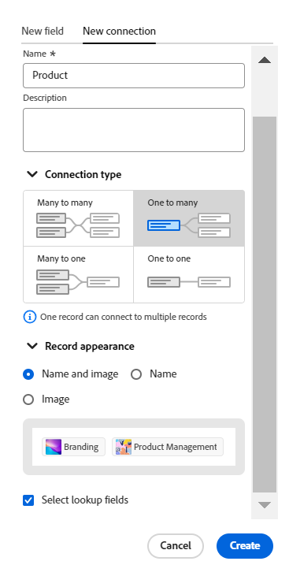
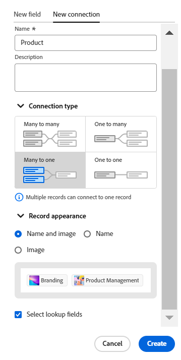

<!--keep the 30 limit verbiage in yellow til Jan 2026-->

# 接続されたレコードタイプの概要

<!--
The highlighted information on this page refers to functionality not yet generally available. It is available only in the Preview environment for all customers. After the monthly releases to Production, the same features are also available in the Production environment for customers who enabled fast releases.    

For information about fast releases, see [Enable or disable fast releases for your organization](/help/quicksilver/administration-and-setup/set-up-workfront/configure-system-defaults/enable-fast-release-process.md).
-->

個々のレコードタイプを接続することで、互いに関連付けたり、他のアプリケーションのオブジェクトに関連付けたりできます。

この記事では、レコードタイプの接続の概要を説明し、レコードタイプとオブジェクトタイプの間で確立できる接続のタイプについて説明します。

レコードタイプの接続について詳しくは、[&#x200B; レコードタイプの接続](/help/quicksilver/planning/architecture/connect-record-types.md)を参照してください。

## レコードタイプの連結に関する考慮事項

* 個々のレコードまたはオブジェクトを相互に接続するには、まずレコードタイプをオブジェクトタイプに接続する必要があります。

  次の方法で、レコードタイプとオブジェクトタイプを相互に接続できます。

   * 手動
   * 自動

  >[!NOTE]
  >
  >Workfront Planningでは、1つのレコードタイプに対して最大30個の接続されたフィールドを設定できます。

* レコードとオブジェクトタイプの接続については、次の点を考慮してください。

   * Workfront Planningで次のエンティティを接続するには、レコードタイプから「新規接続」フィールドを手動で追加できます。

      * 2 つのレコードタイプ

        デフォルトでは、同じワークスペースから2つのレコードタイプを接続できます。 また、より高いWorkfrontまたはプランニングパッケージを購入した場合は、他のワークスペースのレコードタイプと接続するようにレコードタイプを設定することもできます。 詳しくは、[&#x200B; レコードタイプの編集](/help/quicksilver/planning/architecture/edit-record-types.md)を参照してください。
      * 1 つのレコードタイプと、別のアプリケーションの 1 つのオブジェクトタイプ

     レコードとオブジェクトタイプの接続方法について詳しくは、[&#x200B; レコードタイプの接続](/help/quicksilver/planning/architecture/connect-record-types.md)を参照してください。

     レコードタイプを他のレコードタイプまたはオブジェクトタイプと手動で接続すると、個々のレコードとオブジェクトを接続できます。

     詳しくは、[レコードの接続](/help/quicksilver/planning/records/connect-records.md)を参照してください。

   * エンティティ間の接続は、次のシナリオで自動的に確立されます。

      * 自動化機能を使用して、レコードタイプのページからレコードを作成する場合。

        レコードタイプまたはレコードタイプと別のアプリケーションのオブジェクトタイプとの間の接続は、オートメーションが接続されたレコードまたはオブジェクトを作成するときに自動的に作成されます。

        詳しくは、[Adobe Workfront Planningの自動処理の設定](/help/quicksilver/planning/records/configure-automations-to-create-records.md)を参照してください。

      * レコードタイプのリクエストフォームを設定して、レコードまたはオブジェクトを作成する場合。

        レコードを作成するPlanning リクエストを送信して承認すると、レコードタイプとリクエストオブジェクトタイプの間の接続が自動的に作成されます。

        詳しくは、[&#x200B; レコードを作成するためのAdobe Workfront計画リクエストの送信](/help/quicksilver/planning/requests/submit-requests.md)を参照してください。

        元のリクエストは、Workfrontのリクエスト領域の&#x200B;**件名** フィールドまたはWorkfront Planningの元のリクエスト接続フィールドで表示できます。

   * Workfront Planningのレコードタイプは、次のアプリケーションから次のオブジェクトタイプに接続できます。

      * Adobe Workfront:

         * プロジェクト
         * ポートフォリオ
         * プログラム
         * 会社
         * グループ
         * 元のリクエスト

           「元のリクエスト接続」フィールドには、リクエストフォームがWorkfront Planningに送信された後にレコードを作成する元のリクエストの名前が表示されます。 リクエストの名前は、Workfrontのリクエストの「件名」フィールドに表示されます。

      * Adobe Experience Manager:

         * アセット

           Adobe Experience Manager Assetsから次のオブジェクトを接続できます。

            * 画像
            * フォルダー

         * コンテンツフラグメント

      * Adobe GenStudio for Performance Marketing

         * ブランド

        >[!IMPORTANT]
        >
        >Adobe Experience Manager オブジェクトとGenStudio Brandsを接続するには、次の操作が必要です。
        >* Adobe Experience Manager ライセンス
        >* Adobe GenStudio for Performance Marketing ライセンス
        >* 組織のWorkfront インスタンスは、Adobe Business PlatformまたはAdobe Admin Consoleにオンボーディングする必要があります。
        >Adobe Admin Consoleについて詳しくは、[Adobe Unified Experience FAQ](/help/quicksilver/workfront-basics/navigate-workfront/workfront-navigation/unified-experience-faq.md)を参照してください。

* 2つのレコードタイプまたはレコードタイプと別のアプリケーションのオブジェクトタイプが接続されている場合、次のシナリオが存在します。

   * **2つのプランニング レコード タイプを接続する場合**：リンクされたレコード フィールドは、接続元のレコード タイプに作成されます。 「新規接続」タブの「リンクされたレコードタイプに対応するフィールドを作成」設定を有効にした場合にのみ、接続先のレコードタイプに同様のリンクされたレコードフィールドが作成されます。

     例えば、「Campaign」レコードタイプを「Product」レコードタイプに接続すると、Campaign レコードタイプに「Linked Product」という名前のリンクされたレコードフィールド（接続フィールド）が作成されます。 自動的に「Campaign」という名前のリンクされたレコードタイプが、製品レコードタイプに作成されます。

     例えば、次のシナリオが存在します。

      * 「リンクされたレコードタイプに対応するフィールドを作成」設定を有効にし、「Campaign」レコードタイプを「製品」レコードタイプに接続すると、Campaign レコードタイプに「リンクされた製品」という名前のリンクされたレコードフィールド（接続フィールド）が作成されます。 自動的に「Campaign」という名前のリンクされたレコードタイプが、製品レコードタイプに作成されます。
      * 「リンクされたレコードタイプに対応するフィールドを作成」設定を無効にし、「Campaign」レコードタイプを「製品」レコードタイプに接続すると、Campaign レコードタイプに「リンクされた製品」という名前のリンクされたレコードフィールド（接続フィールド）が作成されます。 自動的に「Campaign」という名前のリンクされたレコードタイプは、製品レコードタイプには作成されません。

     詳しくは、[レコードタイプの接続](/help/quicksilver/planning/architecture/connect-record-types.md)を参照してください。

   * **別のアプリケーションのオブジェクト タイプでレコード タイプを接続すると**:

      * リンクされたレコードフィールドは、接続元のレコードタイプに作成されます。 他のアプリケーションのオブジェクトタイプには、リンクされたレコードフィールドが自動的に作成されません。
      * プランニングレコードフィールドには、Workfront オブジェクトからアクセスできません。
      * プランニングレコードは、Workfront オブジェクトの「プランニング」セクションから表示されます。 詳しくは、[Workfront オブジェクトからのレコード接続の管理](/help/quicksilver/planning/records/manage-records-in-planning-section.md)を参照してください。
      * Planning Connection カスタムフィールドを作成し、それをWorkfront オブジェクトのカスタムフォームに添付できます。 詳しくは、[&#x200B; カスタムフォームの作成](/help/quicksilver/administration-and-setup/customize-workfront/create-manage-custom-forms/form-designer/design-a-form/design-a-form.md)を参照してください。
      * Experience Manager管理者がWorkfrontとAdobe Experience Manager Assetsの統合を通じてメタデータマッピングを設定すると、Workfront assetsからプランニングレコードフィールドにアクセスできます。 詳しくは、[Adobe WorkfrontとExperience Manager Assets間のアセットメタデータマッピングの設定](https://experienceleague.adobe.com/ja/docs/experience-manager-cloud-service/content/assets/integrations/configure-asset-metadata-mapping)を参照してください。<!--not sure if this is also possible for content fragments-->
      * プランニングレコードフィールドには、GenStudio for Performance MarketingのBrandsからアクセスできません。

   * **接続先のレコードまたはオブジェクトからルックアップフィールドを追加する場合**：リンクされたレコードフィールドを作成するだけでなく、接続されたレコードまたはオブジェクトタイプからルックアップフィールドと呼ばれるフィールドに接続することもできます。 接続しているレコードの情報を含むリンク（またはルックアップフィールド）が、接続元のレコードに表示されます。<!--not sure if this is also possible for content fragments-->

     他のレコードタイプまたは別のアプリケーションのオブジェクトのフィールドをWorkfront Planning レコードタイプに接続できます。

     リンクされたフィールドは読み取り専用で、接続されたレコードの情報が自動的に表示されます。

     他のレコードタイプやオブジェクトタイプのルックアップフィールドは、式、フィルター、またはグループ化で参照できます。

     例えば、「キャンペーン」レコードタイプを Workfront プロジェクトに接続し、プロジェクトの「予定完了日」フィールドを Workfront Planning レコードに取り込むと、キャンペーンに対して（プロジェクトからの）「予定完了日」という名前のリンクされたフィールドが自動的に作成されます。このリンクされたフィールドを手動で編集することはできません。（プロジェクトからの）「予定完了日」フィールドには、リンクされたプロジェクトの予定完了日が表示されます。

     >[!IMPORTANT]
     >
     >ワークスペースに対する表示権限またはそれ以上の権限を持つユーザーは、リンクされたオブジェクトタイプのアプリケーションの権限や他のワークスペースの権限に関係なく、ルックアップフィールドの情報を表示できます。

     リンクされたレコードフィールドの前には、関係アイコン が表示されます。

     リンクされたフィールドの前には、フィールドタイプを識別するアイコンが付きます。例えば、リンクされた（またはルックアップ）フィールドの前には、フィールドが数値、段落、または日付であることを示すアイコンが表示されます。

     >[!TIP]
     >
     >Workfront オブジェクトの日付フィールド情報は、Workfrontでの表示方法に関係なく、Workfront Planningでは24時間形式で表示されます。
     >
     >例えば、プロジェクトの予定開始日がWorkfrontで午後3:00と表示される場合、読み込まれたルックアップフィールドにWorkfront Planningで15:00と表示されます。

   * Workfront Planningで階層を作成するには、レコードタイプを接続する必要があります。 レコードタイプの接続が存在しない場合は、階層を作成するときに自動的に作成されます。 詳しくは、[&#x200B; ワークスペース階層の作成](/help/quicksilver/planning/architecture/create-workspace-hierarchies.md)を参照してください。

## 接続タイプ

2つのレコードタイプ間、または別のアプリケーションのレコードとオブジェクトタイプ間の接続を確立した後、接続されたレコードフィールドにレコードを追加できます。

>[!WARNING]
>
>この節で説明するオプションは、次の接続時には使用できません。
>
>* 異なるワークスペースからの2つのレコード
>
>* レコードタイプとExperience Manager オブジェクト
>
>* レコードタイプとAdobe GenStudioブランド

一度に1つのレコードを複数のレコードに接続するか、一度に1つのレコードを相互に接続するかを選択できます。

レコードタイプを接続する際に選択できる接続タイプは次のとおりです。

* リンクされたレコードタイプ **の設定で「**&#x200B;対応するフィールドを作成」が無効になっている場合、次のいずれかを選択できます。

   * [複数選択](#multi-select-connection-type)
   * [単一選択](#single-select-connection-type)

* リンクされたレコードタイプ **の設定で「**&#x200B;対応するフィールドを作成」が有効になっている場合、次のいずれかを選択できます。

   * [多対多](#many-to-many-connection-type)
   * [1 対多](#one-to-many-connection-type)
   * [多対 1](#many-to-one-connection-type)
   * [1対1](#many-to-one-connection-type)

### 複数選択の接続タイプ

レコードタイプ間に複数選択接続を作成する場合、接続フィールドで元のレコードタイプから複数の接続されたレコードを選択できます。

例えば、キャンペーンとプロジェクトの間に複数選択接続を作成する場合、1つのキャンペーンに複数のプロジェクトを選択できます。 Campaign接続レコードタイプは、プロジェクトオブジェクトタイプ用に作成されません。

この接続タイプを選択した後、接続タイプを次のいずれかのタイプに保存すると、接続タイプを変更できません。

* 単一選択
* 1 対多
* 多対 1
* 1 対 1

### シングルセレクト接続タイプ

レコードタイプ間にシングルセレクト接続を作成する場合は、接続フィールドで元のレコードタイプから1つのレコードを選択できます。

例えば、キャンペーンと会社間で単一選択接続を作成する場合、1つのキャンペーンに1つの会社を選択できます。 Campaign接続レコードタイプは、会社オブジェクトタイプ用に作成されません。

この接続タイプを選択した後、接続タイプを次のいずれかに保存すると、変更できません。

* 1 対多
* 1 対 1

<!--
* [Many to many](#many-to-many-connection-type)
* [One to many](#one-to-many-connection-type)
* [Many to one](#many-to-one-connection-type)
* [One to one](#many-to-one-connection-type)
-->

### 多対多の接続タイプ

レコードタイプ間に多対多の接続を作成する場合、両方のレコードタイプから接続フィールドで複数のレコードを選択できます。

例えば、キャンペーンとプロジェクトの間に多対多の接続を作成する場合、キャンペーンごとに複数のプロジェクトを選択し、各プロジェクトに複数のキャンペーンを選択できます。

多対多の関係型の実例としては、映画と俳優の関係があります。 各映画は複数の俳優を持つことができ、各俳優は複数の映画で再生できます。

この接続タイプを選択した場合、保存した後に接続タイプを変更することはできません。

### 1対多の接続タイプ

レコードタイプ間に1対多の接続を作成する場合、現在のレコードタイプの接続フィールドで複数のレコードを選択できますが、接続するレコードタイプの対応する接続フィールドでは、1つのレコードのみを選択できます。 2番目のレコードタイプで自動的に作成される接続レコードフィールドは、自動的に多対一の関係タイプに設定されます。

例えば、キャンペーンとプロジェクトの間に1対多の接続を作成する場合、キャンペーンごとに複数のプロジェクトを選択できますが、各プロジェクトは1つのキャンペーンにのみ接続できます。

一対多の関係タイプの実際の例は、ライブラリとブックの関係です。ライブラリには多数のブックが含まれていますが、特定のブックは特定の時点で1つのライブラリにしか含まれていません。

この接続タイプを選択すると、後で多対多の接続タイプにのみ変更できます。

### 多対一の接続タイプ

レコードタイプ間に多対一の接続を作成すると、現在のレコードタイプの各レコードを、接続されたレコードタイプの1つのレコードにのみ接続できます。 2番目のレコードタイプで自動的に作成される接続レコードフィールドは、自動的に1対多の関係タイプに設定されます。

例えば、キャンペーンをプロジェクトに接続し、このタイプの接続を選択した場合、キャンペーンに追加できるプロジェクトは1つだけです。 ただし、1つのプロジェクトに複数のキャンペーンを追加することができます。

多対一の関係タイプの実例は、多くの映画と1人の俳優との関係です。1人の俳優は多くの映画に出演できますが、各映画の出演者は特定の俳優を1回しか出演できません。

この接続タイプを選択すると、後で多対多の接続タイプにのみ変更できます。

### 1対1の接続タイプ

レコードタイプ間で1対1の接続を作成する場合、両方のレコードタイプで、各レコードを他のレコードタイプの1つのレコードにのみ接続できます。

例えば、キャンペーンをプロジェクトに接続し、このタイプの接続を選択した場合、1つのキャンペーンを1つのプロジェクトに接続できます。 1つのプロジェクトは、1つのキャンペーンにのみ接続できます。

一対一の関係の実例は、個人とその国の一意の識別子（社会保障番号、パスポート ID、ローカル IDなど）との間に存在する関係です。各個人は国に対して一意の識別子を1つだけ持ち、各一意の識別子は1人にのみリンクできます。

この接続タイプを選択すると、後で他の接続タイプに変更できます。
