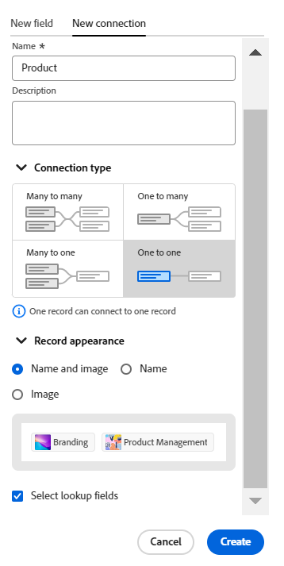

<!--update metadata at GA-->
<!--add mini TOC when live, already added to big TOC to get the link-->

# 接続されたレコードタイプの概要

<!--REMOVE THE CONTENT BELOW FROM THE "CONNECT RECORD TYPES" ARTICLE WHEN YOU TURN THIS ARTICLE LIVE- THIS IS THE SAME CONTENT AS THERE, DUPLICATED-->

個々のレコードタイプを相互に関連付けたり、他のアプリケーションのオブジェクトに接続して関連付けることができます。

この記事では、レコードタイプ接続の概要を説明し、レコードタイプとオブジェクトタイプの間で確立できる接続のタイプについて説明します。

レコードタイプの接続について詳しくは、[ レコードタイプの接続 ](/help/quicksilver/planning/architecture/connect-record-types.md) を参照してください。

## レコードタイプの連結に関する考慮事項

Workfront Planning で接続するには、次の 2 つの手順があります。

1. まず、2 つのレコードタイプまたはレコードタイプとオブジェクトタイプ間の接続を別のアプリケーションから確立する必要があります。 レコードタイプの接続方法について詳しくは、[ レコードタイプの接続 ](/help/quicksilver/planning/architecture/connect-record-types.md) を参照してください。
1. 次に、2 つのレコードタイプが接続された後で、1 つのタイプの個々のレコードを別のタイプのレコードに接続できます。 レコードの接続について詳しくは、「[ レコードの接続 ](/help/quicksilver/planning/records/connect-records.md)」を参照してください。

レコードタイプの接続については、次の点に注意してください。

* Workfront Planning では、次のエンティティを接続できます。

   * 2 つのレコードタイプ

     デフォルトでは、同じワークスペースから 2 つのレコードタイプを接続できます。 また、レコードタイプを設定して、他のワークスペースのレコードタイプに接続することもできます。 詳しくは、[ レコードタイプの編集 ](/help/quicksilver/planning/architecture/edit-record-types.md) を参照してください。
   * 1 つのレコードタイプと、別のアプリケーションの 1 つのオブジェクトタイプ

* Workfrontの計画レコードタイプを次のアプリケーションの次のオブジェクトタイプと結び付けることができます。

   * Adobe Workfront:

      * プロジェクト
      * ポートフォリオ
      * プログラム
      * 会社
      * グループ

   * Adobe Experience Manager Assets：

      * 画像
      * フォルダー

     >[!IMPORTANT]
     >
     >Adobe Experience Manager Assets ライセンスが必要です。Workfront Planning レコードを Adobe Experience Manager Assets に接続するには、組織の Workfront インスタンスを Adobe Business Platform または Adobe Admin Console にオンボーディングする必要があります。
     >
     >Adobe Admin Console へのオンボーディングに関する質問については、[Adobe Unified Experience の FAQ](/help/quicksilver/workfront-basics/navigate-workfront/workfront-navigation/unified-experience-faq.md) を参照してください。

* 接続済みレコードタイプのレコードを作成したら、「接続済みレコード」フィールドを使用してそれらのレコードを相互にリンクできます。  詳しくは、[レコードの接続](/help/quicksilver/planning/records/connect-records.md)を参照してください。

* レコードタイプを別のレコードタイプに接続するか、別のアプリケーションのオブジェクトタイプに接続すると、次のシナリオが存在します。

   * **2 つの Planning レコードタイプを接続する場合**：リンクされたレコードフィールドは、接続元のレコードタイプで作成されます。 接続先のレコードタイプに、同様のリンクされたレコードフィールドが作成されます。

     例えば、「キャンペーン」レコードタイプを「製品」レコードタイプに接続すると、「リンクされた製品」という名前のリンクされたレコードフィールド（接続フィールド）がキャンペーンレコードタイプに作成されます。 製品レコードタイプに、「キャンペーン」という名前のリンクされたレコードタイプが自動的に作成されます。

   * **レコードタイプを別のアプリケーションのオブジェクトタイプに接続する場合**

      * リンクされたレコードフィールドは、接続元のレコードタイプで作成されます。 他のアプリケーションのオブジェクトタイプには、リンクされたレコードフィールドが自動的に作成されません。
      * 計画レコードフィールドには、Workfront オブジェクトからアクセスできません。
      * Workfront管理者がWorkfrontとAdobe Experience Manager Assetsの統合を通じてメタデータマッピングを設定すると、Experience Managerのアセットから計画レコードフィールドにアクセスできます。 詳しくは、[Adobe WorkfrontとExperience Manager Assets間のアセットメタデータのマッピングの設定 ](https://experienceleague.adobe.com/docs/experience-manager-cloud-service/content/assets/integrations/configure-asset-metadata-mapping.html?lang=ja) を参照してください。
      * 計画レコードは、Workfront オブジェクトの「計画」タブに表示されます。 詳しくは、[Adobe Workfront オブジェクトの計画セクションでのレコードの管理 ](/help/quicksilver/planning/records/manage-records-in-planning-section.md) を参照してください。

   * **接続先のレコードまたはオブジェクトからルックアップ フィールドを追加する場合**: リンクされたレコード フィールドを作成する以外に、ルックアップ フィールドと呼ばれる接続されたレコードまたはオブジェクト タイプのフィールドにも接続できます。 接続先のレコードの情報とリンクされた（またはルックアップ フィールド）が、接続先のレコードに表示されます。

     他のレコードタイプまたは別のアプリケーションのオブジェクトのフィールドを、Workfront Planning レコードタイプに関連付けることができます。

     リンクされたフィールドは読み取り専用で、接続されたレコードの情報が自動的に表示されます。

     式、フィルター、またはグループ化で、他のレコードまたはオブジェクト タイプのルックアップ フィールドを参照できます。

     例えば、「キャンペーン」レコードタイプを Workfront プロジェクトに接続し、プロジェクトの「予定完了日」フィールドを Workfront Planning レコードに取り込むと、キャンペーンに対して（プロジェクトからの）「予定完了日」という名前のリンクされたフィールドが自動的に作成されます。このリンクされたフィールドを手動で編集することはできません。（プロジェクトからの）「予定完了日」フィールドには、リンクされたプロジェクトの予定完了日が表示されます。

     >[!IMPORTANT]
     >
     >ワークスペースに対する表示以上のアクセス権を持つすべてのユーザーは、リンク オブジェクトの種類のアプリケーションでのアクセス権またはアクセス レベル、または他のワークスペースでのアクセス権に関係なく、ルックアップ フィールドの情報を表示することができます。

     リンクされたレコードフィールドの前には関係アイコン  が付きます。

     リンクされたフィールドの前には、フィールドタイプを識別するアイコンが付きます。例えば、リンクされた（または参照）フィールドの前には、フィールドが数値、段落、または日付であることを示すアイコンが付きます。

<!--## Connection types

After you establish a connection between two record types or between a record and an object type from another application, you can add records in the connected record fields. 

Depending on how many records you can add to a connected record field, the following are the connection types you can choose from when connecting record types: 

* [Many to many](#many-to-many-connection-type)
* [One to many](#one-to-many-connection-type)
* [Many to one](#many-to-one-connection-type)
* [One to one](#many-to-one-connection-type)

>[!WARNING]
>
>These options are not available when connecting the following: 
>* Two records from different workspaces
>
>* A record type and Experience Manager assets

### Many-to-many connection type

When you create a many-to-many connection between record types, you can then select multiple records in the connection field from both record types. 

For example, if you create a many-to-many connection between campaigns and projects, you can select multiple projects for each campaign, and multiple campaigns for each project. 

A real-life example of a many-to-many relationship type is the relationship between movies and actors. Each movie can have multiple actors, and each actor can play in multiple movies. 

When you select this connection type, you cannot change the connection type after you save it. 

### One-to-many connection type

When you create a one-to-many connection between record types, you can then select multiple records in the connection field in the current record type, but the corresponding connection field in the record type you connect to will allow selecting only one record. The connected record field that is automatically created on the second record type is automatically set to a many-to-one relationship type. 

For example, if you create a one-to-many connection between campaigns and projects, you can select multiple projects for each campaign, but each project can be connected to only one campaign.

A real-life example of a one-to-many relationship type is the relationship between libraries and books: a library has many books in its inventory; but one particular book can only be in one library at a given point in time. 

When you select this connection type, you can later change it only to a many-to-many connection type. 

### Many-to-one connection type

When you create a many-to-one connection between record types, you can then connect each record in the current record type with only one record from the connected record type. The connected record field that is automatically created on the second record type is automatically set to a one-to-many relationship type. 

For example, if you connect campaigns with projects and you choose this type of connection, you can add only one project to a campaign. But you can add multiple campaigns to one project. 

A real-life example of a many-to-one relationship type is the relationship between many movies and one actor: one actor can be in many movies, but each movie can only have a specific actor once in its cast. 

When you select this connection type, you can later change it only to a many-to-many connection type.

### One-to-one connection type

When you create a one-to-one connection between record types, in both record types you can connect each record only with one record from the other record type.

For example, if you connect campaigns with projects and you choose this type of connection, you can connect one campaign with one project. One project can be connected only to one campaign. 

A real-life example of a one-to-one relationship is the one existing between a person and their country's unique identifier (like a Social Security Number, Passport ID, local identification ID): each person has only one unique identifier for a country and each unique identifier can be linked to only one person. 

When you select this connection type, you can later change it to any other connection type. 

-->

