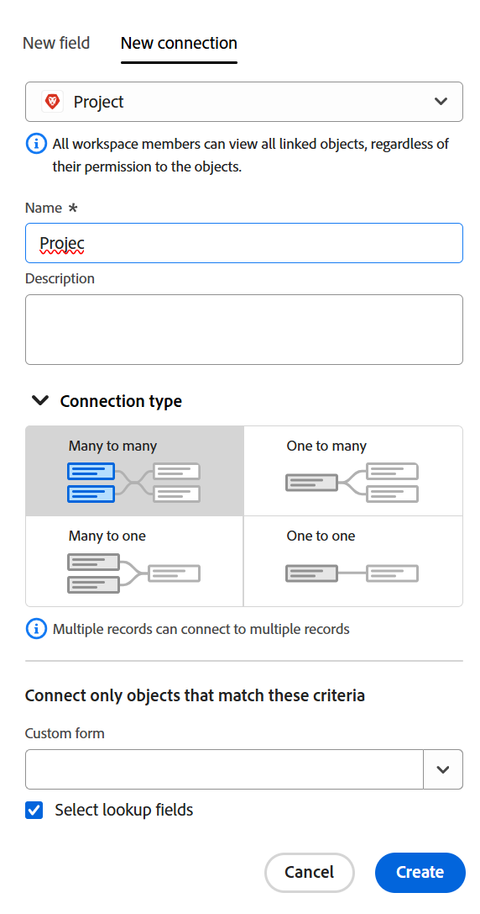

<!-----
title: Connect record types
description: A way to indicate how individual record types relate to one another is to connect them. Also, you can connect Adobe Workfront Planning record types with object types from other applications to enhance your users' experience and keep their focus in one application.
hidefromtoc: yes
hide: yes
feature: Work management
role: User
author: Alina
--->

<!--update the metadata with real information when making this avilable in TOC and in the left nav-->
<!--************ THIS MIGHT NO LONGER BE A 'RELATIONSHIP' TYPE FIELD, BECAUSE THEY WILL SHOW IT IN THE CONNECTION TAB*****************************-->

# レコードタイプを接続

{{planning-important-intro}}

Adobe Workfront Planning を使用すると、組織で必要なレコードタイプを含んだ完全にカスタマイズ可能なワークスペースをデザインできます。個々のレコードタイプが互いにどのように関連しているかは、レコードタイプを接続するとよくわかります。また、Workfront Planning のレコードタイプを他のアプリケーションのオブジェクトタイプに接続して、ユーザーのエクスペリエンスを向上させ、ユーザーが 1 つのアプリケーションに集中できるようにすることもできます。

レコードタイプは、別のレコードタイプや、他のアプリケーションのオブジェクトタイプを持つレコードタイプに接続できます。

これにより、リンクされたレコードまたはオブジェクトタイプのフィールドを別の Workfront Planning レコードに表示できます。

この記事では、Workfront Planningの 2 つのレコードタイプを接続する方法と、レコードタイプを別のアプリケーションのオブジェクトに接続する方法について説明します。

レコードまたはオブジェクトタイプ間の接続を確立した後で、個々のレコードを相互に接続できます。

Workfront Planning レコードを別のアプリケーションのオブジェクトに接続する方法については、[レコードの接続](/help/quicksilver/planning/records/connect-records.md)を参照してください。

レコードタイプを連結する例については、[レコードタイプとレコードの連結例](/help/quicksilver/planning/architecture/example-connect-record-types-and-records.md)を参照してください。

<!--ensure this last linked article is right; the title and the link should have changed-->

## アクセス要件

この記事の手順を実行するには、次のアクセス権が必要です。

<table style="table-layout:auto">
 <col>
 </col>
 <col>
 </col>
 <tbody>
    <tr>
<tr>
<td>
   
 製品
 </td>
   <td>
   
 Adobe Workfront
 
Adobe Workfront Planning レコードタイプをExperience Manager Assetsに接続するには、Adobe Experience Manager Assets ライセンスが必要で、組織のWorkfront インスタンスがAdobeの Unified Experience にオンボーディングされている必要があります。 詳しくは、を参照してください <a href="/help/quicksilver/workfront-basics/navigate-workfront/workfront-navigation/adobe-unified-experience.md">WorkfrontのAdobe統合エクスペリエンス</a>.
 </td>
  </tr>  
 <td role="rowheader">
Adobe Workfront 契約
</td>
   <td>

Workfront Planning の早期アクセス段階に登録されている必要があります 

   </td>
  </tr>
  <tr>
   <td role="rowheader">
Adobe Workfront プラン
</td>
   <td>

任意

   </td>
  </tr>
  <tr>
   <td role="rowheader">
Adobe Workfront プラン
</td>
   <td>
   
任意
 
  </td>
  </tr>

<tr>
   <td role="rowheader">
アクセスレベル設定
</td>
   <td> 
Adobe Workfront Planning に対するアクセスレベルのコントロールはありません。
  
</td>
  </tr>
<tr>
   <td role="rowheader">
レイアウトテンプレート
</td>
   <td> 
Workfront 管理者やグループ管理者は、レイアウトテンプレートに Planning エリアを追加する必要があります。詳しくは、<a href="/help/quicksilver/planning/access/access-overview.md">アクセス権の概要</a>を参照してください。 
  
</td>
  </tr>
<tr>
   <td role="rowheader">
権限
</td>
   <td> 
ワークスペースに対する管理権限</a> 
  
   
システム管理者は、自分が作成したものでないものも含めて、すべてのワークスペースに対する権限を持っています。
</td>
  </tr>
 </tbody>
</table>

<!--Maybe enable this at GA - but planing is not supposed to have Access controls in the Workfront Access Level: 
>[!NOTE]
>
>If you don't have access, ask your Workfront administrator if they set additional restrictions in your access level. For information on how a Workfront administrator can change your access level, see [Create or modify custom access levels](/help/quicksilver/administration-and-setup/add-users/configure-and-grant-access/create-modify-access-levels.md). -->

<!-- Notes to add for the table: for the "Workfront plans" row: the above is only for closed beta; when going to GA - activate the following plans:    

Current plan: Prime and Ultimate

Legacy plan: Enterprise
-->

<!-- Notes for the table: for the "Workfront access" row: 
For more information, see <a href="../../administration-and-setup/add-users/access-levels-and-object-permissions/wf-licenses.md" class="MCXref xref">Adobe Workfront licenses overview</a>.
-->

## レコードタイプの接続に関する考慮事項

* Workfront Planning では、次のエンティティを接続できます。

   * 2 つのレコードタイプ

     レコードタイプは、同じワークスペースに属している必要があります。
   * 1 つのレコードタイプと、別のアプリケーションの 1 つのオブジェクトタイプ

* 以下のアプリケーションの下記オブジェクトタイプを Workfront Planning レコードタイプに接続できます。

   * Adobe Workfront:

      * プロジェクト
      * ポートフォリオ
      * プログラム
      * 会社
      * グループ

   * Adobe Experience Manager Assets：

      * 画像
      * フォルダー

     >[!IMPORTANT]
     >
     >Adobe Experience Manager Assets ライセンスが必要です。Workfront Planning レコードを Adobe Experience Manager Assets に接続するには、組織の Workfront インスタンスを Adobe Business Platform または Adobe Admin Console にオンボーディングする必要があります。
     >
     >Adobe Admin Console のオンボーディングについて質問がある場合は、[Adobe Unified Experience の FAQ](/help/quicksilver/workfront-basics/navigate-workfront/workfront-navigation/unified-experience-faq.md) を参照してください。

* レコードタイプの個々のレコードを作成した後、リンクされたレコードタイプのフィールドから接続先のレコードを選択できます。詳しくは、[レコードの接続](/help/quicksilver/planning/records/connect-records.md)を参照してください。

* レコードタイプを別のレコードタイプに接続するか、別のアプリケーションのオブジェクトタイプに接続すると、次のシナリオが存在します。

   * **2 つのレコードタイプを接続する場合**：接続元のレコードタイプに、リンクされたレコードフィールドが作成されます。接続先のレコードタイプに、同様のリンクされたレコードフィールドが作成されます。

     例えば、「キャンペーン」レコードタイプを「製品」レコードタイプに接続すると、「リンクされた製品」という名前のリンクされたレコードフィールドがキャンペーンレコードタイプに作成され、「キャンペーン」という名前のリンクされたレコードタイプが製品レコードタイプに自動的に作成されます。

   * **別のアプリケーションからレコード型をオブジェクト型に接続した場合**:

      * リンクされたレコードフィールドは、接続元のレコードタイプで作成されます。 他のアプリケーションのオブジェクトタイプには、リンクされたレコードフィールドが自動的に作成されません。

      * 他のアプリケーションのオブジェクトに対して新しい Workfront Planning 読み取り専用レコードタイプが作成されるのは、実際のオブジェクトが Workfront Planning レコードに接続されている場合のみです。

        詳しくは、[レコードの接続](/help/quicksilver/planning/records/connect-records.md)を参照してください。

      * 計画レコードまたはそのフィールドには、Workfrontからアクセスできません。
      * Planning レコードとそのフィールドには、Experience Manager AssetsとAdobe Experience Manager Assets間の統合を通じてWorkfront管理者がメタデータ・マッピングを構成する際に、Workfrontからアクセスできます。 詳しくは、を参照してください [Adobe WorkfrontとExperience Manager Assets間のアセットメタデータのマッピング設定](https://experienceleague.adobe.com/docs/experience-manager-cloud-service/content/assets/integrations/configure-asset-metadata-mapping.html?lang=ja).

   * **接続先のレコードまたはオブジェクトのルックアップフィールドを追加する場合**：他のアプリケーションのオブジェクトのフィールドを Workfront Planning レコードタイプに接続できます。これらは、リンクされたフィールドまたはルックアップフィールドです。レコードまたはオブジェクトを接続すると、リンクされたフィールドに、接続されたレコードまたはオブジェクトの情報が自動的に表示されます。リンクされたルックアップフィールドは常に読み取り専用で、接続されたレコードまたはオブジェクトの値が自動的に設定されます。

     例えば、「キャンペーン」レコードタイプを Workfront プロジェクトに接続し、プロジェクトの「予定完了日」フィールドを Workfront Planning レコードに取り込むと、キャンペーンに対して（プロジェクトからの）「予定完了日」という名前のリンクされたフィールドが自動的に作成されます。このリンクされたフィールドを手動で編集することはできません。（プロジェクトからの）「予定完了日」フィールドには、リンクされたプロジェクトの予定完了日が表示されます。

     >[!IMPORTANT]
     >
     >    ワークスペースに対する表示権限以上の権限を持つユーザーは、リンクされたオブジェクトタイプのアプリケーションでの権限やアクセスレベルに関係なく、リンクされたフィールドの情報を表示できます。

* リンクされたレコードフィールドの前には関係アイコン  が付きます。

  リンクされたフィールドの前には、フィールドタイプを識別するアイコンが付きます。例えば、リンクされた（または参照）フィールドの前には、フィールドが数値、段落、または日付であることを示すアイコンが付きます。

## レコードタイプの接続

<!--when changes here, also update the article for "Connect records"-->

{{step1-to-planning}}

1. レコードタイプを接続するワークスペースをクリックします。

   または

   ワークスペースから、既存のワークスペース名の右側にある下向き矢印を展開し、レコードの種類を接続するワークスペースを選択します。
1. レコードタイプのカードをクリックして、レコードタイプのページを開きます。
1. テーブルビューの右上隅にある **+** アイコンをクリックし、「**新しい接続**」タブを選択します。

   

1. 「**レコードタイプ**」フィールドでレコードタイプを検索するか、次のいずれかを選択します。

   * 選択したワークスペースのセクションにある別のレコードタイプ

     >[!TIP]
     >
     >選択したワークスペースのレコードタイプのみに接続できます。
     > 
     >選択したワークスペースに他のレコードタイプがない場合、ワークスペースセクションは表示されません。

   * 「**Workfront オブジェクトタイプ**」セクションの&#x200B;**プロジェクト、ポートフォリオ、プログラム、会社**&#x200B;または&#x200B;**グループ**。
   * 「**Adobe アプリケーション**」セクションからの **Experience Manager Assets**。

   

1. 次の情報を更新します。

   * **名前**：テーブルビューまたは元のレコードタイプのレコードページに表示される、接続されたフィールドの名前。これにより、元のレコードタイプのテーブルビューまたは元のレコードのリンクされたレコードフィールドに、リンクされたレコード列が作成されます。

   >[!TIP]
   >
   >新しいフィールドがどのレコードタイプから取得されているかを把握するために、接続されたレコードフィールドの名前にリンク先のレコードの名前を含めることをお勧めします。リンクされたレコード名は、新しくリンクされたレコードフィールドまたはリンクされたフィールドには表示されません。

   * **説明**：接続されたレコードのフィールドに関する追加情報。フィールドの説明は、テーブル内でフィールドの列にポインタを合わせると表示されます。
   * **複数のレコードを許可**：リンクされたレコードタイプのフィールドが元のレコードに表示される場合に、ユーザーが複数のレコードを追加できるようにするには、このオプションを選択します。これはデフォルトで選択されています。
   * **ルックアップフィールドを選択**：選択したレコードタイプからフィールドを追加するには、このオプションを選択します。ルックアップフィールドは、リンク先のレコードタイプまたはオブジェクトタイプに関連付けられたフィールドです。このフィールドをリンクすると、リンク先のレコードまたはオブジェクトの情報がリンク元のレコードに表示されます。これはデフォルトで選択されています。

     >[!TIP]
     >
     > 次のフィールドタイプを参照フィールドとして追加することはできません。
     >
     >    * ユーザー
     >    * 作成者
     >    * 最終変更者
     >    * Workfrontの先行入力フィールド（「プロジェクト所有者」や「プロジェクトスポンサー」などのフィールドを含む）

1. （条件付きおよびオプション）Workfront オブジェクトの接続を選択した場合、「**これらの条件に一致するオブジェクトのみをリンク**」セクションから「**カスタムフォーム**」を選択します。選択したカスタムフォームがアタッチされているオブジェクトのみを、選択したレコードタイプにリンクできます。複数のフォームを選択できます。

   

   >[!NOTE]
   >
   > このリストに表示される前に、選択したオブジェクトのカスタムフォームを Workfront で作成する必要があります。

1. （条件付き）Experience Manager Assets への接続を選択した場合、「**次のリポジトリからアセットをリンク**」セクションの **Experience Manager リポジトリ**&#x200B;ドロップダウンメニューからリポジトリを選択します。必須フィールドです。このフィールドには、Experience Manager Assets でアクセス権のあるリポジトリのみが表示されます。

   <!--replace the screen shot below when they fix the permissions info icon bug-->

   

   >[!NOTE]
   >
   >Workfront管理者は、Workfrontのメタデータマッピングを使用して、Workfront Planning フィールドをExperience Manager Assets フィールドにマッピングできます。 詳しくは、を参照してください [Adobe WorkfrontとExperience Manager Assets間のアセットメタデータのマッピング設定](https://experienceleague.adobe.com/docs/experience-manager-cloud-service/content/assets/integrations/configure-asset-metadata-mapping.html?lang=ja).

<!-- for when Title is released - ensure that this is valid for linking Planning records and not just AEM assets: 

1. (Conditional) If you selected to connect to Experience Manager Assets or to a Workfront Planning record type, disable the **Title** toggle, if you don't want the title of connected records or assets to display in the linked field. When disabled, only records' thumbnail displays in  the linked fields. The toggle is enabled by default. 

    >[!TIP]
    >
    >    When you allow multiple records to be linked, displaying only the thumbnail might save space in smaller areas, like the record views.
    >
    >The Title of a record is the primary field of the record. For more information, see [Manage the table view](/help/quicksilver/planning/views/manage-the-table-view.md). 
-->

1. 「**作成**」をクリックします。

1. （条件付き）**ルックアップフィールドを選択**&#x200B;設定を選択した場合、「**ルックアップフィールドを追加**」ボックスが開きます。

   **+** アイコンをクリックして、**選択されていないフィールド**&#x200B;エリアからフィールドを追加します。

   または

   **-** アイコンをクリックして、**選択されたフィールド**&#x200B;エリアからフィールドを削除します。

   

   レコードやオブジェクトをリンクした後、接続されたフィールドの値が自動的に入力されます。

   >[!IMPORTANT]
   >
   >    ワークスペースに対する表示権限以上の権限を持つユーザーは、リンクされたオブジェクトタイプのアプリケーションでの権限やアクセスレベルに関係なく、リンクされたフィールドの情報を表示できます。

1. （オプション）「**スキップ**」をクリックして、リンクされたレコードやオブジェクトからフィールドを追加しないようにします。リンクされたレコードの&#x200B;**名前**&#x200B;は、元のレコードのテーブルビューに唯一表示されるフィールドです。

1. （オプションおよび条件付き）数値、通貨、パーセンテージまたは日付タイプのフィールドをリンクすることを選択する場合は、アグリゲータ値も選択します。ユーザーがリンクされたレコードフィールドで複数のリンクされたレコードを選択した場合、リンクされたフィールドの値は、コンマで区切られるか、選択したアグリゲータに従って集計された値として表示されます。

   >[!IMPORTANT]
   >
   >    日付フィールドをタイムライン表示とカレンダー表示の開始日および終了日として追加できるようにする場合、日付フィールドを追加する際にアグリゲータ値を選択する必要があります。

   

   >[!NOTE]
   >
   > レコードタイプを Experience Manager Assets に接続した場合、アグリゲータは使用できません。

   次の中から選択します。

   * **なし**：複数のレコードから取得された値をコンマで区切って表示します。これはデフォルトの選択です。
   * **最大**：リンクされたレコードフィールドで選択された複数のレコードから取得されたすべての値の最大値を表示します。
   * **最小**：リンクされたレコードフィールドで選択された複数のレコードから取得されたすべての値の最小値を表示します。
   * **合計**：リンクされたレコードフィールドで選択された複数のレコードから取得されたすべての値の合計を表示します。
   * **平均**：リンクされたレコードフィールドで選択された複数のレコードから取得されたすべての値の平均を表示します。
   * **一意**：ルックアップフィールドの値から重複を削除し、一意の値のみを表示します。 これは、次のフィールドタイプでは使用できません。
      * 段落
      * チェックボックス
      * ユーザー

   >[!NOTE]
   >
   >例えば、キャンペーンのレコード（元のレコード）から製品レコード（リンクされたレコード）をリンクし、「製品フィールド」という名前を付けることができます。また、キャンペーンのレコードから製品レコードの「予算」フィールドをリンクし、「製品の予算」という名前を付けることもできます。「製品フィールド」で複数のレコードを選択できる場合は、予算が$100,000 の製品 1 と予算が$110,000 の製品 2 および予算が$100,000 の製品 3 を選択できます。 選択したアグリゲータに応じて、元のレコードから、リンクされたフィールドに次の予算情報を表示できます。
   >
   >* **なし**: $100,000、110,000、100,000
   >* **MAX**: 110,000 ドル
   >* **最小**：100,000 ドル
   >* **SUM**: 310,000 ドル
   >* **AVG**: 103,000.33 ドル
   >* **一意**: 100,000 ドル
   >

1. （オプション）**検索**&#x200B;アイコン  を使用してフィールドを検索します。

1. 「**フィールドを追加**」をクリックして変更を保存します。

   次のアイテムが追加されます。

   * リンク元のレコードタイプ上のリンクされたレコードフィールド。リンクされたレコードタイプの個別のレコードが手動で追加された後、リンクされたレコードフィールドに表示されます。レコードの追加について詳しくは、[レコードを接続](/help/quicksilver/planning/records/connect-records.md)を参照してください。リンクされたレコードフィールドの名前は、手順 6 で選択した名前です。<!--accurate-->

   * リンクされたレコードフィールドに手動でレコードまたはオブジェクトを追加した後に、リンクされたレコードまたはオブジェクトタイプのフィールドの情報を表示する、リンクされたフィールド（複数可）。リンクされたフィールドは、接続の作成時に&#x200B;**ルックアップフィールドを選択**&#x200B;設定が選択されている場合にのみ作成されます。リンクされたフィールドは、次のパターンに従って自動的に名前が付けられます。

     `<Name of the original field on the linked record> (from <Name of your linked field>)`

     例えば、キャンペーンレコードタイプをプログラムレコードタイプにリンクし、プログラムにリンクされたレコードフィールドに「プログラム情報」という名前を付け、キャンペーンのテーブルビューにプログラムの予算フィールドも表示するように選択した場合、リンクされたフィールドにはキャンペーンのテーブルビュー内で、自動的に `Budget (from Program information)` という名前が付けられます。

   * レコードタイプを相互にリンクすると、リンク先のレコードタイプにも、リンクされたレコードフィールドが追加されます。リンクされたレコードタイプでのリンクされたレコードフィールドの名前は、リンク元のレコードタイプの名前です。

     例えば、「キャンペーン」のレコードタイプから「製品」のレコードタイプをリンクし、キャンペーンの接続されたフィールドに「リンクされた製品」という名前を付けた場合、「キャンペーン」のリンクされたレコードフィールドが「製品」レコードタイプに対して作成されます。

     >[!TIP]
     >
     > 別のアプリケーションから Workfront Planning でのリンク元のレコードタイプへのオブジェクトには、リンクされたレコードフィールドは作成されません。

1. （オプションおよび条件付き）元のレコードタイプまたはリンクされたレコードタイプのテーブルビューで、リンクされたレコードフィールドのヘッダーにある下向き矢印をクリックし、次のいずれかをクリックします。

   * **フィールドを編集**：更新できるのは、フィールドの&#x200B;**名前**&#x200B;と&#x200B;**説明**&#x200B;情報のみです。
   * **ルックアップフィールドを編集**：任意のリンクされたレコードのフィールドを追加または削除します。

   

   ルックアップフィールドを追加または削除するには、上記の手順 10～14 の指示に従います。<!--ensure these step numbers stay accurate-->

   >[!NOTE]
   >
   > リンク元のレコードタイプに属するルックアップフィールドを、別のアプリケーションのオブジェクトタイプに追加することはできません。
   >
   > 例えば、キャンペーンからリンク先の Workfront プロジェクトに「キャンペーンステータス」のルックアップフィールドを追加することはできません。

1. （オプション）リンクされたレコード フィールドのヘッダー、またはリンク元のレコード タイプのルックアップ フィールドのヘッダーにある下向き矢印をクリックし、「**削除**」をクリックします。

   レコードフィールドまたはルックアップフィールドが削除されます。レコードフィールドを削除すると、リンクされたレコードに関連付けられているルックアップフィールドも削除されます。
