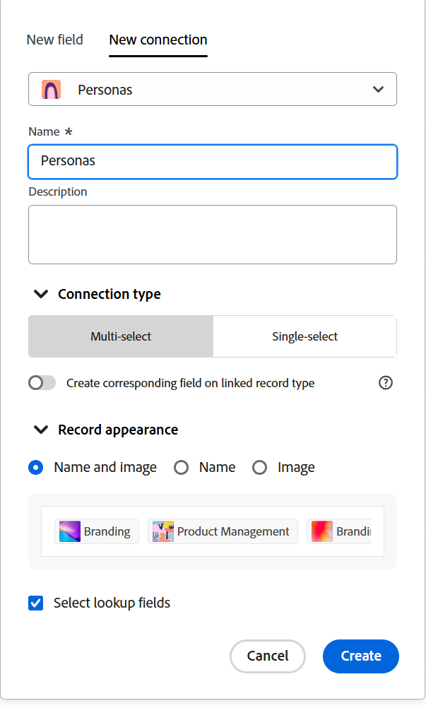
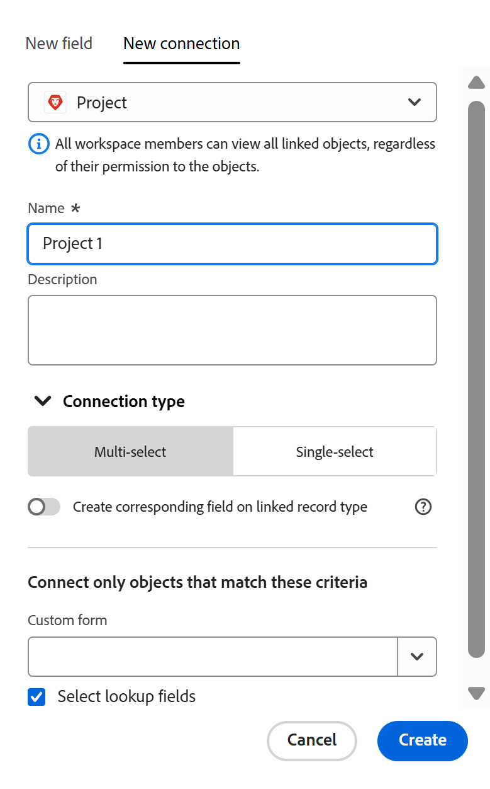
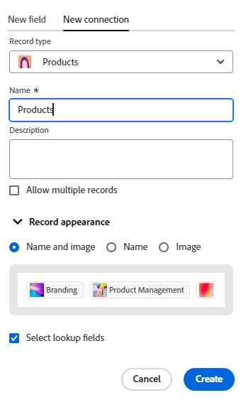

<!--keep the 30 fields limit in yellow till Jan 2026; also the global record type cross-workspace capability information-->

<!--take production and preview references out at prod-->

# レコードタイプを接続

<!--
The highlighted information on this page refers to functionality not yet generally available. It is available only in the Preview environment for all customers. After the monthly releases to Production, the same features are also available in the Production environment for customers who enabled fast releases.    

For information about fast releases, see [Enable or disable fast releases for your organization](/help/quicksilver/administration-and-setup/set-up-workfront/configure-system-defaults/enable-fast-release-process.md). 
-->

{{planning-important-intro}}

<!--
You can use Adobe Workfront Planning to design fully-customizable workspaces that contain record types needed in your organization. A way to indicate how individual record types relate to one another is to connect them. Also, you can connect Workfront Planning record types with object types from other applications to enhance your users' experience and keep their focus in one application.
-->

レコードタイプを相互に接続したり、レコードタイプを他のアプリケーションのオブジェクトタイプと接続したりできます。

相互に影響を与える複数のタイプの作業オブジェクトがある場合、レコードタイプを接続すると便利です。例えば、キャンペーンの作業をする際に、各キャンペーンが複数のブランドを対象としている場合があります。この関係を示すために、ブランドにキャンペーンを接続できます。これにより、キャンペーンレコードのブランドの接続フィールドが作成されます。

また、Workfront の複数のプロジェクトで各キャンペーンの作業が計画されることもあります。これを示すには、関連するプロジェクトにキャンペーンを接続します。これにより、Campaign レコードのプロジェクトの接続フィールドが作成されます。

接続フィールドを作成したら、2つのレコードタイプまたはオブジェクトタイプ間で個々のレコードを接続できます。

>[!NOTE]
>
>1つのレコードタイプには、最大30個の接続フィールドを設定できます。

ここでは、2つのWorkfront計画レコードタイプ、またはWorkfront計画レコードタイプを別のアプリケーションのオブジェクトに接続する方法について説明します。

レコードまたはオブジェクトタイプ間の接続を確立すると、接続フィールドがPlanning レコードタイプに追加されます。 「接続」フィールドでは、個々のレコードを相互に接続し、リンクされたレコードまたはオブジェクトタイプのフィールドをWorkfront Planning レコードに表示できます。

接続タイプの一般的な情報については、[接続されたレコードタイプの概要](/help/quicksilver/planning/architecture/connect-record-types-overview.md)を参照してください。

レコードまたはレコードを他のアプリケーションのオブジェクトと接続する方法については、[&#x200B; レコードの接続](/help/quicksilver/planning/records/connect-records.md)を参照してください。

レコードタイプとレコードの接続例については、[&#x200B; レコードタイプとレコードの接続例](/help/quicksilver/planning/architecture/example-connect-record-types-and-records.md)を参照してください。

<!--ensure this last linked article is right; the title and the link should have changed-->

## アクセス要件

+++ 展開して、この記事の機能のアクセス要件を表示します。

<table style="table-layout:auto"> 
<col> 
</col> 
<col> 
</col> 
<tbody> 
    <tr> 
<tr> 
</tr> 
<tr> 
   <td role="rowheader">
Adobe Workfront パッケージ
</td> 
   <td> 

同じワークスペースからレコードタイプを接続するには： 

<ul> 
<li>
任意のWorkfrontおよびプランニングパッケージ
</li>
<li>
任意のワークフローとプランニングパッケージ</li></ul>

異なるワークスペースからレコードタイプを接続するには：

<ul> 
<li>
任意のWorkfrontおよびプランニングパッケージ
</li>
<li>
任意のワークフローとプランニング PrimeまたはUltimate パッケージ
</li></ul>

各Workfront計画パッケージに含まれる内容について詳しくは、Workfrontの担当者にお問い合わせください。 
 
   </td> 
<tr> 
<td> 
   
 その他の製品
 </td> 
   <td> 
   
 Adobe Workfrontに加えて、次のアプリケーションのオブジェクトにレコードタイプを接続する場合は、次の機能が必要です。

   <ul><li>
Adobe Experience Manager Assetsライセンスと、AEM Assetsとプランニングレコードタイプを連携させるAEM AssetsとWorkfrontの統合。

   
詳しくは、<a href="/help/quicksilver/documents/adobe-workfront-for-experience-manager-assets-essentials/workfront-for-aem-asset-essentials.md">Experience Manager AssetsおよびAssets Essentials向けAdobe Workfront：記事インデックス </a>を参照してください。 
</li>
   <li>
 レコードタイプとGenStudio Brandsを連携させるAdobe GenStudio for Performance Marketingライセンス

   
詳しくは、<a href="https://experienceleague.adobe.com/ja/docs/genstudio-for-performance-marketing/user-guide/get-started">Adobe GenStudio for Performance Marketingの基本を学ぶ</a>を参照してください。
</li></ul>
   </td> 
  </tr> 
  <tr> 
   <td role="rowheader">
Adobe Workfront プラン
</td> 
   <td>
標準

   </td> 
  </tr> 
  <tr> 
   <td role="rowheader">
オブジェクト権限
</td> 
   <td>   
ワークスペースに対する権限の管理
  
   
システム管理者は、作成しなかったワークスペースも含め、すべてのワークスペースに対する権限を持っています。
  </td> 
  </tr>  
</tbody> 
</table>

Workfrontのアクセス要件について詳しくは、[Workfront ドキュメント &#x200B;](/help/quicksilver/administration-and-setup/add-users/access-levels-and-object-permissions/access-level-requirements-in-documentation.md)のアクセス要件を参照してください。

+++

<!--
Old:
<table style="table-layout:auto"> 
<col> 
</col> 
<col> 
</col> 
<tbody> 
    <tr> 
<tr> 
<td> 
   
 Products
 </td> 
   <td> 
   <ul><li>
 Adobe Workfront
</li> 
   <li>
 Adobe Workfront Planning
</li>
   <li>
 Adobe Experience Manager Assets, if you want to connect AEM assets with Planning record types

   
You must have an Adobe Experience Manager Assets license and an integration between AEM Assets and Workfront.
    For information, see <a href="/help/quicksilver/documents/adobe-workfront-for-experience-manager-assets-essentials/workfront-for-aem-asset-essentials.md">Adobe Workfront for Experience Manager Assets and Assets Essentials: article index</a>. 

   </li>
   </ul></td> 
  </tr>   
<tr> 
   <td role="rowheader">
Adobe Workfront plan*
</td> 
   <td> 

Any of the following Workfront plans:
 
<ul><li>Select</li> 
<li>Prime</li> 
<li>Ultimate</li></ul> 

Workfront Planning is not available for legacy Workfront plans
 
   </td> 
<tr> 
   <td role="rowheader">
Adobe Workfront Planning package*
</td> 
   <td> 

Any 
 

For more information about what is included in each Workfront Planning plan, contact your Workfront account manager. 
 
   </td> 
 <tr> 
   <td role="rowheader">
Adobe Workfront platform
</td> 
   <td> 

Your organization's instance of Workfront must be onboarded to the Adobe Unified Experience to be able to access Workfront Planning.
 

For more information, see <a href="/help/quicksilver/workfront-basics/navigate-workfront/workfront-navigation/adobe-unified-experience.md">Adobe Unified Experience for Workfront</a>. 
 
   </td> 
   </tr> 
  </tr> 
  <tr> 
   <td role="rowheader">
Adobe Workfront license*
</td> 
   <td> 
Standard
 
   
Workfront Planning is not available for legacy Workfront licenses
 
  </td> 
  </tr> 
  <tr> 
   <td role="rowheader">
Access level configuration
</td> 
   <td> 
There are no access level controls for Adobe Workfront Planning
   
</td> 
  </tr> 
<tr> 
   <td role="rowheader">
Object permissions
</td> 
   <td>   
Manage permissions to a workspace
  
   
System Administrators have permissions to all workspaces, including the ones they did not create.
</td> 
  </tr> 
 
</tbody> 
</table>
-->

## レコードタイプの接続

<!--when changes here, also update the article for "Connect records"-->

{{step1-to-planning}}

1. 接続するレコードタイプのワークスペースをクリックします。

   または

   ワークスペースから、既存のワークスペース名の右側にある下向き矢印を展開し、ワークスペースを検索して、リストに表示されるときに選択します。
1. レコードタイプのカードをクリックして、レコードタイプのページを開きます。
1. テーブルビューの右上隅にある **+** アイコンをクリックし、「**新しい接続**」タブをクリックします。

   

1. レコードタイプを検索するか、次のいずれかを選択します。

   * 現在のワークスペースのレコードタイプ

     

     >[!TIP]
     >
     > 
     >選択したワークスペースに他のレコードタイプがない場合、ワークスペースセクションは表示されません。

   * 他のワークスペースから接続するように設定された、別のワークスペースのレコードタイプ。

     >[!TIP]
     >
     >他のワークスペースでこのレコードタイプへの接続を許可するには、**レコードタイプを編集** ボックスの「**クロスワークスペース設定**」タブにあるレコードタイプに対して、**他のワークスペースでのレコードタイプへの接続を許可する**&#x200B;設定を有効にする必要があります。 他のワークスペースから接続するように設定されているレコードタイプがない場合、ワークスペースセクションは表示されません。
     >
     >詳しくは、[&#x200B; レコードタイプのクロスワークスペース機能の設定](/help/quicksilver/planning/architecture/configure-record-type-cross-workspace-capabilities.md)を参照してください。<!--update screen shot at production-->
     >
     >

     <!--
        Old:
        [!TIP]
        The **Allow connecting to this record type in other workspaces** setting must be enabled for a record type in the **Advanced settings** tab of the **Edit record type** box, for a record type to be accessible from other workspaces. If there are no record types that are configured to connect from other workspaces, the workspace section does not display.
        
        -->

     詳しくは、[&#x200B; レコードタイプの編集](/help/quicksilver/planning/architecture/edit-record-types.md)を参照してください。

     >[!TIP]
     >
     >次のキーボードの組み合わせを使用して、任意のWorkfront計画ページからグローバル検索ボックスを開き、レコードタイプを検索できます。
     >
     >* Windowsの場合はCTRL+K
     >* Macの⌘+K
     >
     >

   * 「**Workfront オブジェクトタイプ**」セクションからの&#x200B;**プロジェクト、ポートフォリオ、プログラム、会社**&#x200B;または&#x200B;**グループ**。

     

   * **Workfront オブジェクトタイプ** セクションの&#x200B;**元のリクエスト** オブジェクトタイプ。

     作成された元のリクエスト接続フィールドには、オブジェクトを作成した送信されたPlanning リクエストの名前が表示されます。 リクエストの名前は、リクエストの&#x200B;**件名** フィールドにも表示されます。

     >[!NOTE]
     >
     >Workfront Planningでレコードを作成するためにPlanning リクエストを送信するには、リクエストフォームを作成して公開する必要があります。
     >
     >詳しくは、次の記事を参照してください。
     >* [Adobe Workfront Planningでリクエストフォームを作成および管理](/help/quicksilver/planning/requests/create-request-form.md)
     >* [&#x200B; レコードを作成するためのAdobe Workfront計画リクエストを送信](/help/quicksilver/planning/requests/submit-requests.md)。

     

   * **Experience Manager アプリケーション** セクションの&#x200B;**Adobe**。

     

     選択したレコードまたはオブジェクトタイプの「新規接続」タブが開きます。

   * Adobe GenStudio for Performance Marketingの&#x200B;**ブランド** （**Adobe GenStudio** セクション）

     

1. **名前** フィールドを新しい接続フィールドの名前で更新します。このフィールドは、元のレコードタイプのテーブルビューまたはレコードページに表示されます。 これにより、元のレコードタイプのテーブルビューに、接続されたレコード列（またはフィールド）が作成されます。 デフォルトでは、フィールドの名前は、接続先のレコードまたはオブジェクトの名前です。

   >[!TIP]
   >
   >同じレコードまたはオブジェクトタイプに複数の接続を設定できます。 接続されたフィールド名を編集しない場合、Workfrontは接続されたレコード名の後に数字を追加し、接続されたレコードタイプの数を同じ名前で示します。

1. 接続されたレコードフィールドに関する情報を追加して、**説明** フィールドを更新します。 フィールドの説明は、テーブル内でフィールドの列にポインタを合わせると表示されます。
1. （条件付き） 2つの異なるワークスペース、レコードタイプとAdobe Experience Manager アセットオブジェクト、またはレコードタイプとGenStudio ブランドからレコードタイプを接続する場合は、**複数のレコードを許可**&#x200B;を選択します。 選択すると、接続されたレコードタイプ フィールドが元のレコードに表示されたときに、ユーザーが複数のレコードを追加できることを示します。 これはデフォルトで選択されています。

   

1. （条件付き）同じワークスペースのレコードタイプ、またはWorkfront オブジェクトタイプを持つPlanning レコードタイプを接続する場合は、次のいずれかを選択します。

   * **複数選択**：これを選択すると、現在のレコードタイプの1つのレコードが、接続レコードタイプの複数のレコードと接続できるようになります。
   * **単一選択**：これを選択すると、現在のレコードタイプの1つのレコードが、接続レコードタイプの1つのレコードと接続できるようになります。

1. リンクされたレコードタイプ **で「**&#x200B;対応するフィールドを作成」を選択します。 選択すると、現在のレコードタイプに追加された接続フィールドに加えて、接続先のレコードタイプに接続フィールドが作成されます。 これはデフォルトでは無効になっています。

   >[!TIP]
   >
   >* 1つのレコードタイプに対する接続フィールドの制限は30件ですが、1つのレコードタイプに対する接続フィールドの制限は500件です。 この制限に達しないように、特に分類レコードタイプの場合は、この設定をオフにすることをお勧めします。
   >
   >* リンクされたレコードタイプ **で「**&#x200B;対応するフィールドを作成」を選択することは、階層を作成するための前提条件です。
   >
   >* リンクされたレコードフィールドは、それぞれのアプリケーション内の別のアプリケーションのオブジェクトに対して作成されません。 例えば、Planning レコードに接続されたWorkfront オブジェクトに対して作成されたフィールドはありません。
   >
   >   

1. （条件付き）リンクされたレコードタイプ **で「**&#x200B;対応するフィールドを作成」を有効にした場合は、次のオプションから、ユーザーが接続できるレコード数と接続元レコード数を指定します。

   * 多対多
   * 1 対多
   * 多対 1
   * 1 対 1

   接続タイプについて詳しくは、[接続レコードタイプの概要](/help/quicksilver/planning/architecture/connect-record-types-overview.md)を参照してください。

   >[!NOTE]
   >
   >接続タイプに「1対多」または「1対多」を選択し、後でレコードまたは既に他の場所に接続されているオブジェクトを接続する場合、もう一度接続すると元の接続から削除されるという警告が表示されます。 削除を許可したり、別のレコードを選択したりできます。

1. （条件付きとオプション）Workfront オブジェクトを接続する場合は、「**これらの条件に一致するオブジェクトのみをリンク**」セクションから「**カスタムフォーム**」を選択します。 選択したカスタムフォームがアタッチされているオブジェクトのみを、選択したレコードタイプにリンクできます。複数のフォームを選択できます。

   >[!NOTE]
   >
   > このリストに表示される前に、選択したオブジェクトのカスタムフォームを Workfront で作成する必要があります。

1. （条件付き）Experience Managerへの接続を選択する場合は、次の「**アセットを次のリポジトリ**」セクションの「**Experience Manager リポジトリ**」ドロップダウンメニューからリポジトリを選択します。 必須フィールドです。Experience Managerでアクセスできるリポジトリのみが、このフィールドに表示されます。

   >[!NOTE]
   >
   >Workfront管理者は、Workfrontのメタデータマッピングを使用して、Workfront計画フィールドをExperience Manager フィールドにマッピングできます。 詳しくは、[Adobe WorkfrontとExperience Manager Assets間のアセットメタデータマッピングの設定](https://experienceleague.adobe.com/ja/docs/experience-manager-cloud-service/content/assets/integrations/configure-asset-metadata-mapping)を参照してください。

1. （条件付き）Experience Manager、Workfront計画レコードタイプ、またはGenStudio ブランドへの接続を選択する場合は、**外観を記録** エリアで次のいずれかのオプションを選択します。

   * **名前と画像**：接続されたレコードの名前とサムネールまたはアイコンの両方が、接続されたレコードフィールドに表示されます。 これはデフォルトのオプションです。
   * **名前**：接続されたレコードの名前のみが、接続されたレコードフィールドに表示されます。
   * **画像**：接続されたレコードのサムネールまたはアイコンのみが、接続されたレコードフィールドに表示されます。

   サムネール画像のないレコードには、代わりにレコードタイプアイコンが表示されます。 接続されたレコードの表示方法の例は、**レコードのアピアランス**&#x200B;領域に表示されます。

   >[!NOTE]
   >
   >* 複数のレコードをリンクできるようにする場合、サムネールのみを表示すると、レコードビューなどの小さな領域のスペースが節約される場合があります。
   >
   >* レコードの名前は、レコードのプライマリフィールドです。 詳しくは、[プライマリフィールドの概要](/help/quicksilver/planning/fields/primary-field-overview.md)を参照してください。
   >
   >* Workfront オブジェクトタイプを選択する際に、レコードのアピアランスを選択することはできません。
   >
   >* 「レコードのアピアランス」領域で選択した内容によって、すべてのビューと詳細ページを含む、システム内のあらゆる接続でレコードがどのように表示されるかが決まります。

1. **参照フィールドを選択**&#x200B;して、接続先のレコードタイプからフィールドを追加します。 ルックアップフィールドは、リンク先のレコードタイプまたはオブジェクトタイプに関連付けられたフィールドです。リンクすると、リンク元のレコードにリンクしているレコードまたはオブジェクトの情報が表示されます。 これはデフォルトで選択されています。

   <!--
    When reference fields are coming, change the first bullet in the TIP below with this: 
    >* In the Production environment, you cannot add Workfront reference fields (for example, the Project Group or Company from a Workfront Project) as lookup fields in Planning. You can add Workfront reference fields as lookup fields in the Preview environment.
    -->

   >[!TIP]
   >
   >* 参照フィールドとして別のアプリケーションから参照フィールドを追加することはできません。 例えば、Workfront プロジェクトに接続する場合、Planningのルックアップフィールドとして「プロジェクト」、「グループ」、「会社」を追加することはできません。
   >
   ><!--* In the Production environment, you cannot add Workfront user fields (including fields like Project Owner, or Project Sponsor) as lookup fields. You can add user fields as lookup fields in the Preview environment.-->
   >
   >* Workfront オブジェクトの日付フィールド情報は、Workfrontでの表示方法に関係なく、Workfront Planningでは24時間形式で表示されます。
   >
   >   例えば、プロジェクトの予定開始日がWorkfrontで午後3:00と表示される場合、読み込まれたルックアップフィールドにWorkfront Planningで15:00と表示されます。
   >
   ><!--* In the Production environment, you cannot add People fields as lookup fields. You can add People fields as lookup fields in the Preview environment.-->

1. 「**作成**」をクリックします。

1. （条件付き）**ルックアップフィールドを選択**&#x200B;設定を選択した場合、「**ルックアップフィールドを追加**」ボックスが開きます。

   **+** アイコンをクリックして、**選択されていないフィールド**&#x200B;エリアからフィールドを追加します。

   または

   **-** アイコンをクリックして、**選択されたフィールド**&#x200B;エリアからフィールドを削除します。

   

   レコードやオブジェクトをリンクした後、接続されたフィールドの値が自動的に入力されます。

   >[!IMPORTANT]
   >
   >    ワークスペースに対する表示権限以上の権限を持つユーザーは、リンクされたオブジェクトタイプのアプリケーションでの権限やアクセスレベルに関係なく、リンクされたフィールドの情報を表示できます。

1. （オプション）「**スキップ**」をクリックして、リンクされたレコードまたはオブジェクトタイプからフィールドの追加をスキップします。 リンクされたレコードの名前またはプライマリフィールドは、接続元のレコードタイプのテーブルビューで表示される唯一のフィールドです。

1. 追加するルックアップフィールドの集計ツールを選択します。

   >[!NOTE]
   >
   >次のフィールドタイプのアグリゲーターは追加できません。
   >
   >    * 段落
   >    * チェックボックス

   リンクされたフィールドの値は、ユーザーがリンクされたレコードフィールドで複数のリンクされたレコードを選択した場合に、選択した集計に従ってコンマで区切られるか、要約された値として表示されます。

   ルックアップフィールドに要約されていない複数の値が含まれている場合は、ビューでフィールドを並べ替えまたはグループ化で使用する際に、次の点を考慮してください。

   * 並べ替えは、最初の値によって行われます

   * レコードは、フィールド値の一意の組み合わせごとにグループ化されます

   * タイムラインビューは、接続されたレコードタイプの最初の日付値に基づいて構築され、ビューに表示されます

   >[!IMPORTANT]
   >
   > タイムラインビューとカレンダービューの開始日と終了日としてフィールドを追加できるようにする場合は、ルックアップ日フィールドを追加する際に集計の値を選択する必要があります。 例えば、検索日フィールドにMAXまたはMIN アグリゲーターを選択できます。

   

   >[!NOTE]
   >
   > レコードタイプを次に接続する場合、アグリゲータは使用できません。
   >* Experience Manager
   >* GenStudioのブランド。

   次の中から選択します。

   * **なし**：複数のレコードから取得された値をコンマで区切って表示します。これはデフォルトの選択です。
   * **最大**：リンクされたレコードフィールドで選択された複数のレコードから取得されたすべての値の最大値を表示します。
   * **最小**：リンクされたレコードフィールドで選択された複数のレコードから取得されたすべての値の最小値を表示します。
   * **合計**：リンクされたレコードフィールドで選択された複数のレコードから取得されたすべての値の合計を表示します。
   * **平均**：リンクされたレコードフィールドで選択された複数のレコードから取得されたすべての値の平均を表示します。
   * **UNIQUE**：検索フィールド値から重複を削除し、一意の値のみを表示します。 これは、次のフィールドタイプでは使用できません。
      * 段落
      * チェックボックス
      * ユーザー

   >[!NOTE]
   >
   >例えば、キャンペーンレコード（オリジナルレコード）から製品レコード（リンクレコード）をリンクし、「製品フィールド」という名前を付けることができます。 キャンペーンレコードから製品レコードの「予算」フィールドをリンクして、「製品予算」と呼ぶこともできます。 「製品フィールド」で複数のレコードを選択できる場合、予算が100,000 ドルの製品1と予算が110,000 ドルの製品2および予算が100,000 ドルの製品3を選択できます。 選択したアグリゲータに応じて、元のレコードから、リンクされたフィールドに次の予算情報を表示できます。
   >
   >* **なし**: $100,000、$110,000、$100,000
   >* **MAX**: $110,000
   >* **最小**：100,000 ドル
   >* **合計**: $310,000
   >* **AVG**: $103,000.33
   >* **一意**: $100,000
   >

1. （オプション） **検索** アイコン を使用して、フィールドを検索します。

1. 「**フィールドを追加**」をクリックして変更を保存します。

   次のアイテムが追加されます。

   * リンク元のレコードタイプ上のリンクされたレコードフィールド。リンクされたレコードタイプの個別のレコードが手動で追加された後、リンクされたレコードフィールドに表示されます。レコードの追加について詳しくは、[レコードを接続](/help/quicksilver/planning/records/connect-records.md)を参照してください。リンクされたレコードフィールドの名前は、手順 6 で選択した名前です。<!--accurate-->

   * リンクされたレコードフィールドにレコードまたはオブジェクトを手動で追加した後、リンクされたレコードまたはオブジェクトタイプに関する情報を表示するリンク（またはルックアップ）フィールド（またはフィールド）。 参照フィールドは、接続の作成時に「**参照フィールドを選択**」設定が選択されている場合にのみ作成されます。 ルックアップフィールドには、次のパターンに従って自動的に名前が付けられます。

     `<Name of the original field on the linked record> (from <Name of your linked field>)`

     例えば、Campaign レコードタイプをプログラムレコードタイプにリンクし、「プログラムにリンクされたレコードフィールドに「プログラム情報」という名前を付け、その後、Campaignのテーブルビューにプログラムの予算フィールドも表示するように選択した場合、リンクされたフィールドは自動的にキャンペーンのテーブルビューで`Budget (from Program information)`という名前になります。

   * レコードタイプを相互にリンクする場合、リンク先のレコードタイプにもリンクされたレコードフィールドが追加されます。リンクされたレコードタイプ **の設定で「**&#x200B;対応するフィールドを作成」を有効にした場合にのみ適用されます。 リンクされたレコードタイプでのリンクされたレコードフィールドの名前は、リンク元のレコードタイプの名前です。

     例えば、「Campaign」レコードタイプから「製品」レコードタイプをリンクし、Campaign 「リンクされた製品」の接続フィールドに名前を付けた場合、製品レコードタイプの「キャンペーン」リンクされたレコードフィールドが作成されます。

     >[!TIP]
     >
     > リンクされたレコードフィールドは、それぞれのアプリケーション内の別のアプリケーションのオブジェクトに対して作成されません。
     > 分類レコードタイプへのリンクは作成しないことをお勧めします。各レコードタイプには、接続されているフィールドの上限30個に加えて、500個のフィールドに制限があります。

1. （オプションおよび条件付き）元のレコードタイプまたはリンクされたレコードタイプのテーブルビューで、リンクされたレコードフィールドのヘッダーにある下向き矢印をクリックし、次のいずれかをクリックします。

   * **フィールドを編集**: フィールドの&#x200B;**名前**&#x200B;と&#x200B;**説明**&#x200B;情報を更新します。
   * **ルックアップフィールドを編集**：任意のリンクされたレコードのフィールドを追加または削除します。

   

   ルックアップフィールドを追加または削除するには、上記の手順16 ～ 17の手順に従います。<!--ensure these step numbers stay accurate-->

   >[!NOTE]
   >
   > リンク元のレコードタイプに属するルックアップフィールドを、別のアプリケーションのオブジェクトタイプに追加することはできません。
   >
   > 例えば、キャンペーンからリンク先の Workfront プロジェクトに「キャンペーンステータス」のルックアップフィールドを追加することはできません。

1. （オプション）リンクされたレコード フィールドのヘッダー、またはリンク元のレコード タイプのルックアップ フィールドのヘッダーにある下向き矢印をクリックし、「**削除**」をクリックします。

   レコードフィールドまたはルックアップフィールドが削除されます。レコードフィールドを削除すると、リンクされたレコードに関連付けられているルックアップフィールドも削除されます。
