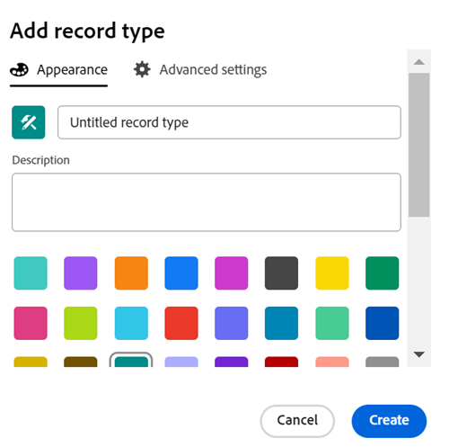
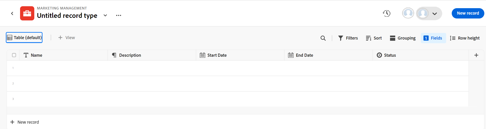

<!--this is linked to the UI in an empty workspace screen-->

<!--keep the yellow for cross-workspace functionality till Jan 2026-->

# レコードタイプの作成

このページでハイライト表示されている情報は、まだ一般に利用できない機能を示します。すべてのユーザーのプレビュー環境でのみ使用できます。 実稼動環境への毎月のリリース後、高速リリースを有効にしたお客様は、実稼動環境でも同じ機能を利用できます。

迅速リリースについて詳しくは、[組織での迅速リリースを有効または無効にする](/help/quicksilver/administration-and-setup/set-up-workfront/configure-system-defaults/enable-fast-release-process.md)を参照してください。

{{planning-important-intro}}

レコードタイプは、Adobe Workfront Planning のオブジェクトタイプです。Workfront計画では、組織のライフサイクルで必要な作業関連項目を示すカスタムレコードタイプを作成できます。

レコードタイプについて詳しくは、[&#x200B; レコードタイプの概要](/help/quicksilver/planning/architecture/overview-of-record-types.md)を参照してください。

## アクセス要件

+++ 展開して、この記事の機能のアクセス要件を表示します。 

<table style="table-layout:auto"> 
<col> 
</col> 
<col> 
</col> 
<tbody> 
    <tr> 
<tr> 
</tr>   
<tr> 
   <td role="rowheader">
Adobe Workfront パッケージ
</td> 
   <td> 

任意のWorkfrontおよびプランニングパッケージ

任意のワークフローとプランニングパッケージ

<b>メモ</b>

接続可能なレコードタイプを設定するには： 

<ul> 
<li>
任意のWorkfront パッケージと任意のPlanning パッケージ
</li>
または
<li>
任意のワークフローとプランニング PrimeまたはUltimate パッケージ
</li></ul>

グローバルレコードタイプを設定するには：

<ul> 
<li>
任意のWorkfront パッケージとPlanning Plus パッケージ
</li>
または
<li>
任意のワークフローとプランニング PrimeまたはUltimate パッケージ
</li></ul>

各Workfront計画パッケージに含まれる内容について詳しくは、Workfrontの担当者にお問い合わせください。 

</td> </tr>
  <tr> 
   <td role="rowheader">
Adobe Workfront プラン
</td> 
   <td>
標準

   </td> 
  </tr> 
  <tr> 
   <td role="rowheader">
オブジェクト権限
</td> 
   <td>   
ワークスペースに対する権限の管理
  
   
システム管理者は、作成しなかったワークスペースも含め、すべてのワークスペースに対する権限を持っています。
  </td> 
  </tr>  
</tbody> 
</table>

Workfrontのアクセス要件について詳しくは、[Workfront ドキュメント &#x200B;](/help/quicksilver/administration-and-setup/add-users/access-levels-and-object-permissions/access-level-requirements-in-documentation.md)のアクセス要件を参照してください。

+++   

<!--
Old:
 <table style="table-layout:auto"> 
<col> 
</col> 
<col> 
</col> 
<tbody> 
    <tr> 
<tr> 
<td> 
   
 Products
 </td> 
   <td> 
   <ul><li>
 Adobe Workfront
</li> 
   <li>
 Adobe Workfront Planning
</li></ul></td> 
  </tr>   
<tr> 
   <td role="rowheader">
Adobe Workfront plan*
</td> 
   <td> 

Any of the following Workfront plans:
 
<ul><li>Select</li> 
<li>Prime</li> 
<li>Ultimate</li></ul> 

Workfront Planning is not available for legacy Workfront plans
 
   </td> 
<tr> 
   <td role="rowheader">
Adobe Workfront Planning package*
</td> 
   <td> 

Any 
 

For more information about what is included in each Workfront Planning plan, contact your Workfront account manager. 
 
   </td> 
 <tr> 
   <td role="rowheader">
Adobe Workfront platform
</td> 
   <td> 

Your organization's instance of Workfront must be onboarded to the Adobe Unified Experience to be able to access Workfront Planning.
 

For more information, see <a href="/help/quicksilver/workfront-basics/navigate-workfront/workfront-navigation/adobe-unified-experience.md">Adobe Unified Experience for Workfront</a>. 
 
   </td> 
   </tr> 
  </tr> 
  <tr> 
   <td role="rowheader">
Adobe Workfront license*
</td> 
   <td>
 Standard

   
Workfront Planning is not available for legacy Workfront licenses
 
  </td> 
  </tr> 
  <tr> 
   <td role="rowheader">
Access level configuration
</td> 
   <td> 
There are no access level controls for Adobe Workfront Planning
   
</td> 
  </tr> 
<tr> 
   <td role="rowheader">
Object permissions
</td> 
   <td>   
Manage permissions to a workspace
  
   
System Administrators have permissions to all workspaces, including the ones they did not create
  </td> 
  </tr> 
</tbody> 
</table>
-->

## レコードタイプの作成に関する考慮事項

* 以下の方法で、ワークスペースでレコードタイプを作成できます。

   * 自動：
      * テンプレートを使用してワークスペースを作成する場合。

        詳しくは、[ワークスペースの作成](/help/quicksilver/planning/architecture/create-workspaces.md)を参照してください。

      * CSVまたはExcel ファイルを使用してデータをインポートする場合。

        詳しくは、[CSVまたはExcel ファイルから情報を読み込んでレコードタイプを作成](/help/quicksilver/planning/architecture/import-file-to-create-record-types.md)を参照してください。

     >[!TIP]
     >
     >CSVまたはExcel ファイルからレコードタイプを読み込む場合は、レコードとフィールドも読み込むことができます。

   * 手動：

      * 最初から。

        この記事では、レコードタイプをゼロから作成する方法について説明します。

      * 別のワークスペースから追加することで
詳しくは、[別のワークスペースから既存のレコードタイプを追加](/help/quicksilver/planning/architecture/add-existing-record-types-from-another-workspace.md)を参照してください。

* レコードタイプは、セクション内で、およびワークスペースのあるセクションから別のセクションに移動できます。あるワークスペースから別のワークスペースに移動することはできません。

## ワークスペーステンプレートを使用してレコードタイプを作成

Workfront Planning テンプレートを使用してワークスペースを作成すると、レコードタイプを自動的に作成できます。各テンプレートには、サンプルレコードタイプが含まれています。

ワークスペースの作成については、[ワークスペースの作成](/help/quicksilver/planning/architecture/create-workspaces.md)を参照してください。

各テンプレートに含まれているレコードタイプについては、[ワークスペーステンプレートのリスト](/help/quicksilver/planning/architecture/workspace-templates.md)を参照してください。

テンプレートからワークスペースを作成する場合、レコードタイプは次のセクションにグループ化されます。

* 運用中のレコードタイプ
* 分類

操作レコードタイプと分類セクションの両方で、レコードタイプを手動で追加できます。 詳しくは、この記事の「[最初からレコードを作成](#create-a-record-type-from-scratch)」の節を参照してください。

## レコードタイプを最初から作成

{{step1-to-planning}}

1. レコードタイプを作成するワークスペースをクリックします，

   または

   ワークスペースから、既存のワークスペース名の右側にある下向き矢印を展開し、ワークスペースを検索して、リストに表示されるときに選択します。

   >[!TIP]
   >
   >次のキーボードの組み合わせを使用して、任意のWorkfront計画ページからグローバル検索ボックスを開き、ワークスペースを検索できます。
   >
   >* WindowsのCTRL+K
   >* Mac⌘の+K
   >
   >

1. （任意）「**セクションを追加**」をクリックし、新規セクションをワークスペースに追加します。
1. 「**レコードタイプを追加**」をクリックしてから、**手動で追加**」をクリックします。

   「レコードタイプを追加」ボックスが開きます。

   

1. 「**アピアランス**」タブの次の情報を更新します。

   * 「名称未設定のレコードタイプ」を、将来のレコードタイプの名前に置き換えます。<!--did they bring back the field label here and did they rename it to "Name"-->
   * **説明**: レコードタイプに関する詳細情報を追加します。
   * レコードタイプに関連付けられているアイコンの色とシェイプを選択します。 次の操作を実行します。
      * 新しいレコードタイプを識別する色を選択します。これは、レコードタイプアイコンの色です。灰色はデフォルトで選択されています。
      * リストからアイコンを選択するか、検索フィールドにアイコンの名前を入力して、それが何を表しているかを説明してから、表示されたらアイコンを選択します。 これは、レコードタイプのアイコンです。ファイルのアイコンはデフォルトで選択されています。

1. （オプションおよび条件付き）システム管理者の場合は、「**クロスワークスペース設定**」タブをクリックし、レコードタイプのクロスワークスペース機能に関する情報を更新します。

    

   詳細については、[&#x200B; レコードタイプのクロスワークスペース機能の設定](/help/quicksilver/planning/architecture/configure-record-type-cross-workspace-capabilities.md)を参照してください。

1. 「**保存**」をクリックします。

   選択したセクションとワークスペースにレコードタイプカードが追加されます。
レコードタイプの説明がカードに表示されます。

   

   このレコードを他のワークスペースから接続することを選択した場合、**接続可能なレコード** アイコン がレコードカードに表示されます。

   このレコードを他のワークスペースに追加することを許可するように選択した場合、**グローバルレコード** アイコン がレコードカードに表示されます。

1. （オプション）レコードタイプカードにカーソルを合わせ、右上隅の&#x200B;**詳細** アイコン をクリックし、**編集**&#x200B;または&#x200B;**設定**&#x200B;をクリックして、レコードタイプに関する情報を変更します。

   詳しくは、[&#x200B; レコードタイプの編集](/help/quicksilver/planning/architecture/edit-record-types.md)を参照してください。

1. （オプション）レコードタイプカードをクリックして、レコードタイプのページを開きます。

   

   デフォルトでは、レコードタイプページがテーブルビューに表示されます。テーブルの列は、新しいレコードタイプに関連付けられたフィールドです。各行は、追加する必要がある一意のレコードです。

   デフォルトでは、次のフィールドが、運用中のレコードタイプのテーブルビュー列に表示されます。

   * 名前
   * 説明
   * 開始日
   * 終了日
   * ステータス

1. （オプション）ページのヘッダーのレコードタイプ名を更新します。

   または

   レコードタイプ名の右側にある&#x200B;**詳細** アイコン をクリックし、**編集**&#x200B;をクリックして名前を変更するか、情報を変更します。 詳しくは、[&#x200B; レコードタイプの編集](/help/quicksilver/planning/architecture/edit-record-types.md)を参照してください。

1. （オプション）「**+ 新規レコード**」をクリックして、選択したレコードタイプのレコードを追加します。詳しくは、[レコードの作成](/help/quicksilver/planning/records/create-records.md)を参照してください。
1. （オプション）テーブルの右上隅にある「**+**」アイコンをクリックして、レコードタイプにさらにフィールドを追加します。

   フィールドの作成について詳しくは、[フィールドの作成](/help/quicksilver/planning/fields/create-fields.md)を参照してください。

1. （オプション）見出しのレコードタイプ名の左側にある左向き矢印をクリックして、選択したワークスペースに戻ります。

1. （オプション）ワークスペースでレコードタイプカードをクリックして保持し、目的の場所でレコードタイプをドラッグ＆ドロップするか、別のセクションに移動します。

   変更は自動的に保存されます。

   レコードの追加、レコードタイプの削除または編集、レコードタイプページでのビューの更新について詳しくは、次の記事を参照してください。

   * [レコードの作成](/help/quicksilver/planning/records/create-records.md)
   * [レコードタイプの削除](/help/quicksilver/planning/architecture/delete-record-types.md)
   * [レコードタイプの編集](/help/quicksilver/planning/architecture/edit-record-types.md)
   * [レコードビューの管理](/help/quicksilver/planning/views/manage-record-views.md)

## CSVまたはExcel ファイルから情報を読み込んで、レコードタイプを作成する

CSVまたはExcel ファイルから情報を読み込む場合は、次の操作を行うことができます。

* レコードタイプ
* レコード
* レコードフィールド

詳しくは、[CSVまたはExcel ファイルから情報を読み込んでレコードタイプを作成](/help/quicksilver/planning/architecture/import-file-to-create-record-types.md)を参照してください。

## 別のワークスペースから既存のレコードタイプを追加して、レコードタイプを作成する

別のワークスペースから既存のレコードタイプを追加することで、レコードタイプをワークスペースに追加できます。 追加できるのは、グローバルレコードタイプとして設定されたレコードタイプのみです。

詳しくは、[別のワークスペースから既存のレコードタイプを追加](/help/quicksilver/planning/architecture/add-existing-record-types-from-another-workspace.md)を参照してください。
