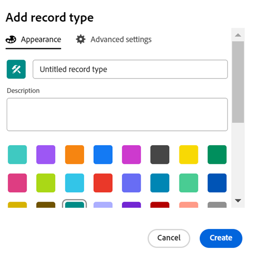

<!--update the metadata with real information when making this available in TOC and in the left nav-->
<!--this is linked to the UI in an empty workspace screen-->

# レコードタイプの作成

{{planning-important-intro}}

レコードタイプは、Adobe Workfront Planning のオブジェクトタイプです。Workfront Planning では、組織のライフサイクルで必要な作業に関連するアイテムを示すカスタムレコードタイプを作成できます。

レコードタイプについて詳しくは、を参照してください。 [レコードタイプの概要](/help/quicksilver/planning/architecture/overview-of-record-types.md).

## アクセス要件

この記事の手順を実行するには、次のアクセス権が必要です。

<table style="table-layout:auto">
 <col>
 </col>
 <col>
 </col>
 <tbody>
    <tr>
<tr>
<td>
   
 製品
 </td>
   <td> Adobe Workfront
   </td>
  </tr>  
 <td role="rowheader">
Adobe Workfront 契約
</td>
   <td>

Workfront Planning の早期アクセス段階に登録されている必要があります 

   </td>
  </tr>
  <tr>
   <td role="rowheader">
Adobe Workfront プラン
</td>
   <td>

任意

   </td>
  </tr>
  <tr>
   <td role="rowheader">
Adobe Workfront プラン
</td>
   <td>
   
現在：プラン

   または
   
新規：標準 
 
  </td>
  </tr>

<tr>
   <td role="rowheader">
アクセスレベル設定
</td>
   <td> 
Workfront Planning に対するアクセスレベルのコントロールはありません
  
</td>
  </tr>
<tr>
   <td role="rowheader">
レイアウトテンプレート
</td>
   <td> 
Workfront 管理者やグループ管理者は、レイアウトテンプレートに Planning エリアを追加する必要があります。詳しくは、<a href="/help/quicksilver/planning/access/access-overview.md">アクセス権の概要</a>を参照してください。 
  
</td>
  </tr>
<tr>
   <td role="rowheader">
権限
</td>
   <td> 
ワークスペースへの権限の管理</a> 
  
   
システム管理者は、作成しなかったワークスペースも含め、すべてのワークスペースに対する権限を持っています。
</td>
  </tr>
 </tbody>
</table>

<!--Maybe enable this at GA - but Planning is not supposed to have Access controls in the Workfront Access Level: 
>[!NOTE]
>
>If you don't have access, ask your Workfront administrator if they set additional restrictions in your access level. For information on how a Workfront administrator can change your access level, see [Create or modify custom access levels](/help/quicksilver/administration-and-setup/add-users/configure-and-grant-access/create-modify-access-levels.md). -->

<!-- Notes to add for the table: for the "Workfront plans" row: the above is only for closed beta; when going to GA - activate the following plans:    

Current plan: Prime and Ultimate

Legacy plan: Enterprise
-->

<!-- Notes for the table: for the "Workfront access" row: 
For more information, see <a href="../../administration-and-setup/add-users/access-levels-and-object-permissions/wf-licenses.md" class="MCXref xref">Adobe Workfront licenses overview</a>.
-->

## レコードタイプの作成に関する考慮事項

* 以下の方法で、ワークスペースでレコードタイプを作成できます。

   * 自動：
      * テンプレートを使用してワークスペースを作成する場合。

        詳しくは、[ワークスペースの作成](/help/quicksilver/planning/architecture/create-workspaces.md)を参照してください。

      * Excel ファイルまたは CSV ファイルを使用して読み込む場合。

        >[!IMPORTANT]
        >
        >この機能は 2024年3月21日（PT）から一時的に無効になっていますが、後日有効になる予定です。

     <!--this should not ne known anymore: * When you add objects from another application to a linked record field of a record. This creates a read-only record type in Workfront Planning which is connected to object types from the original application. 
        For information about connecting record types with object types from another application, see [Connect record types](/help/quicksilver/planning/architecture/connect-record-types.md).
        For information about connecting objects with records, see [Connect records](/help/quicksilver/planning/records/connect-records.md). -->
   * 手動：

      * 最初から。

        この記事では、レコードタイプをゼロから作成する方法について説明します。

* レコードタイプは、セクション内で、およびワークスペースのあるセクションから別のセクションに移動できます。あるワークスペースから別のワークスペースに移動することはできません。

## ワークスペーステンプレートを使用してレコードタイプを作成

Workfront Planning テンプレートを使用してワークスペースを作成すると、レコードタイプを自動的に作成できます。各テンプレートには、サンプルレコードタイプが含まれています。

テンプレートからワークスペースを作成する場合、レコードタイプは次のセクションにグループ化されます。

* 運用中のレコードタイプ
* 分類

運用レコードタイプおよび分類セクションの両方で、レコードタイプを手動で追加できます。

ワークスペースの作成については、[ワークスペースの作成](/help/quicksilver/planning/architecture/create-workspaces.md)を参照してください。

各テンプレートに含まれているレコードタイプについては、[ワークスペーステンプレートのリスト](/help/quicksilver/planning/architecture/workspace-templates.md)を参照してください。

## レコードタイプを最初から作成

{{step1-to-planning}}

1. レコードタイプを作成するワークスペースをクリックし、

   または

   ワークスペースから、既存のワークスペース名の右側にある下向き矢印を展開してワークスペースを検索し、リストに表示されたら選択します。
1. （任意）「**セクションを追加**」をクリックし、新規セクションをワークスペースに追加します。
1. 「**レコードタイプを追加**」をクリックします。
1. （条件付き）Excel ファイルまたは CSV ファイルのインポートによるレコードタイプの作成が有効な場合は、「**ゼロから**」をクリックします。そうでない場合は、「**レコードタイプを追加**」ボックスが開きます。

   

1. 次の情報を更新します。

   * 「名称未設定のレコードタイプ」を、今後のレコードタイプの名前に置き換えます。 <!--did they bring back the field label here and did they rename it to "Name"-->
   * **説明**：レコードタイプに関する詳細情報を追加します。
   * レコードタイプに関連付けられたアイコンの色と形状を選択します。 次の操作を実行します。
      * 新しいレコードタイプを識別する色を選択します。これは、レコードタイプアイコンの色です。灰色はデフォルトで選択されています。
      * リストからアイコンを選択するか、アイコンの名前を入力して何を表しているか説明し、表示されたら選択します。これは、レコードタイプのアイコンです。ファイルのアイコンはデフォルトで選択されています。

1. 「**作成**」をクリックします。

   選択したセクションとワークスペースにレコードタイプカードが追加されます。
レコードタイプの説明がカードに表示されます。

   

1. （任意）レコードタイプカードにポインタを合わせ、 **詳細** アイコン  右上隅のをクリックします。 **編集** レコードタイプに関する情報を変更します。
1. （オプション）レコードタイプカードをクリックして、レコードタイプのページを開きます。

   

   デフォルトでは、レコードタイプページがテーブルビューに表示されます。テーブルの列は、新しいレコードタイプに関連付けられたフィールドです。各行は、追加する必要がある一意のレコードです。

   >[!TIP]
   >
   >    Excel ファイルまたは CSV ファイルからレコードタイプを読み込むと、レコードも読み込まれます。

   デフォルトでは、次のフィールドが、運用中のレコードタイプのテーブルビュー列に表示されます。

   * 名前
   * 説明
   * 開始日
   * 終了日
   * ステータス

1. （オプション）ページのヘッダーのレコードタイプ名を更新します。

   または

   「」をクリックします **詳細** アイコン  レコードタイプ名の右側にあるをクリックします。 **編集** 名前を変更するか、情報を変更します。 詳しくは、を参照してください [レコードタイプを編集](/help/quicksilver/planning/architecture/edit-record-types.md).

1. （オプション）「**+ 新規レコード**」をクリックして、選択したレコードタイプのレコードを追加します。詳しくは、[レコードの作成](/help/quicksilver/planning/records/create-records.md)を参照してください。
1. （オプション）テーブルの右上隅にある「**+**」アイコンをクリックして、レコードタイプにさらにフィールドを追加します。

   フィールドの作成について詳しくは、[フィールドの作成](/help/quicksilver/planning/fields/create-fields.md)を参照してください。

1. （オプション）レコードタイプ名の左側にある左向き矢印をクリックして、選択したワークスペースに戻ります。

1. （オプション）ワークスペースでレコードタイプカードをクリックして保持し、目的の場所でレコードタイプをドラッグ＆ドロップするか、別のセクションに移動します。

   変更は自動的に保存されます。

   レコードの追加、レコードタイプの削除または編集、レコードタイプページでのビューの更新について詳しくは、次の記事を参照してください。

   * [レコードの作成](/help/quicksilver/planning/records/create-records.md)
   * [レコードタイプの削除](/help/quicksilver/planning/architecture/delete-record-types.md)
   * [レコードタイプの編集](/help/quicksilver/planning/architecture/edit-record-types.md)
   * [レコードビューの管理](/help/quicksilver/planning/views/manage-record-views.md)

## Excel または CSV ファイルをインポートしてレコードタイプを作成

>[!IMPORTANT]
>
>この機能は 2024年3月21日（PT）から一時的に無効になっていますが、後日有効になる予定です。

Excel または CSV ファイルを使用してレコードタイプをインポートする場合は、次の点を考慮してください。

* Excel ファイルの各シートはレコードタイプになります。
* 各シートの列は、各レコードタイプに関連付けられたフィールドになります。
* フィールドは、それぞれのレコードタイプについて一意です。
* 各シートの各行は、各レコードタイプに関連付けられた一意のレコードになります。
* Excel ファイルの各シートの上限は次のとおりです：
   * 50,000 行
   * 500 列
* Excel ファイルのサイズは 5 MB 以下にする必要があります。
* 空のシートはサポートされていません。

Excel ファイルを使用してレコードタイプを読み込むには：

{{step1-to-planning}}

1. レコードタイプを作成するワークスペースをクリックします。

   または

   ワークスペースから、既存のワークスペース名の右側にある下向き矢印を展開してワークスペースを検索し、リストに表示されたら選択します。
1. 「**レコードタイプを追加**」をクリックします。
1. 「**Excel/CSV**」をクリックします。
1. コンピューターに保存済みの Excel ファイルまたは CSV ファイルをドラッグアンドドロップするか、「**CSV ファイルまたは Excel ファイルを選択**」をクリックして参照します。
1. 「**データをレビュー**」をクリックします。

   「プレビューと編集」ボックスに次の情報が表示されます。

   * 左パネルに、シートまたは将来のレコードタイプの名前が表示されます。Workfront Planning により、新しいレコードタイプごとにデフォルトでアイコンとカラーが選択されます。
   * 最初のシートまたはレコードタイプが選択され、関連付けられたフィールド名が列ヘッダーとして表示されます。各フィールドのタイプは、デフォルトで選択されています。
   * 各行は新しいレコードを表します。「プレビューと編集」ボックスには、最初の 10 レコードのみが表示されます。

   

1. （オプション）左パネルの各シート名をクリックすると、シートに含まれる情報を確認できます。

   >[!NOTE]
   >
   >    空のシートはサポートされておらず、淡色の表示になります。

1. （オプション）「**読み込むシートを選択**」ドロップダウンメニューをクリックし、読み込まないシートの選択を解除します。

   

   選択を解除したシートは、グレーの背景で表示されます。

1. ファイルを読み込む準備が整ったら「**読み込み**」をクリックします。

   次の情報が Workfront Planning にインポートされます。

   * 新しいレコードタイプ
   * 各レコードタイプに関連付けられた新しいフィールド
   * 各レコードタイプに関連付けられた新しいレコード

   レコードタイプページのフィールドとレコードの管理を開始できます。

   Workfront Planning にアクセスできる全員が、インポートされたレコードタイプとその情報を表示および編集できるようになりました。<!--this will change with permissions-->

<!--## Connect record types with object types from another application

You can connect a record type and an object type from another application. This creates a read-only record type in Workfront Planning that corresponds to the object type in the other application. 

For example, you can create record types by connecting Workfront Planning record types with Workfront projects. As a result, the Workfront project object type is imported into Workfront Planning as a read-only record type. By default, the record type is named "Workfront Project." (********************)has this name changed? Lusine wanted to change it at some point***********)
    
You can import the following objects from the following applications: 

* From Workfront:

    * Projects
    * Portfolios
    * Programs
    * Company
    * Group

For more information, see [Connect record types](/help/quicksilver/planning/architecture/connect-record-types.md). 
-->