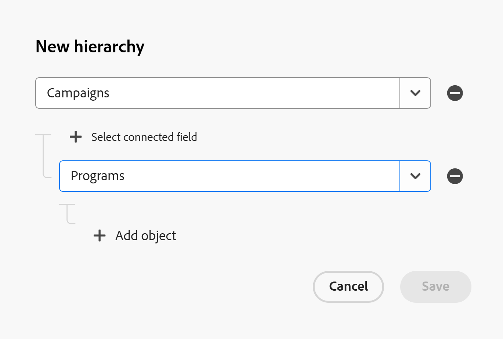
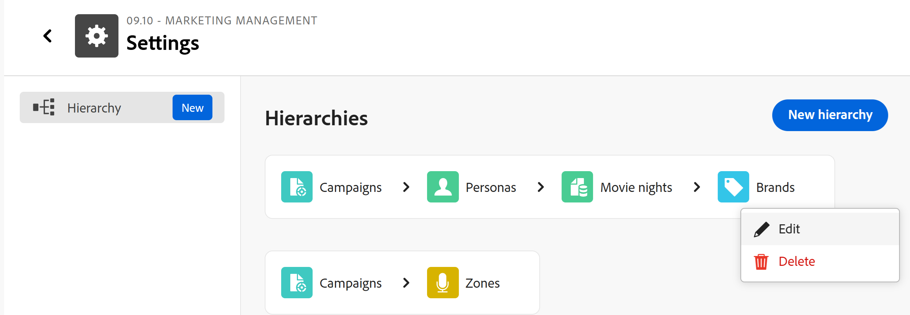

# ワークスペース階層の作成

<!--The information on this page refers to functionality not yet generally available. It is available only in the Preview environment for all customers. After the monthly releases to Production, the same features are also available in the Production environment for customers who enabled fast releases.    

For information about fast releases, see [Enable or disable fast releases for your organization](/help/quicksilver/administration-and-setup/set-up-workfront/configure-system-defaults/enable-fast-release-process.md). -->

Workspace Managerでは、Adobe Workfront Planningのレコードタイプ間に複数のWorkspace階層を作成できます。

レコードタイプをワークスペース内で接続した後、それらの接続を整理する階層を作成できます。

階層は、レコードとオブジェクトタイプを親子関係に整理し、それぞれ最大4つのオブジェクトタイプを含めることができます。 1つのワークスペースに最大5つの階層を作成できます。

2つのレコードタイプ間の接続がまだ存在しない場合は、階層を設定するときに作成できます。 定義されると、階層は、ワークスペース内の関連するレコードタイプ間で構造化パスを確立します。

階層は、ヘッダーに表示される各レコードのパンくずリストを生成します。 これにより、ユーザーはワークフローのどの段階においても、階層のどの段階にいるのかを把握できます。

階層とパンくずリストの一般的な情報については、[階層とパンくずリストの概要](/help/quicksilver/planning/architecture/hierarchy-and-breadcrumb-overview.md)を参照してください。

## アクセス要件

+++ 展開してアクセス要件を表示し、この記事の手順を実行します。  

<table style="table-layout:auto"> 
<col> 
</col> 
<col> 
</col> 
<tbody> 
    <tr> 
<tr> 
</tr>   
<tr> 
   <td role="rowheader">
Adobe Workfront パッケージ
</td> 
   <td> 
<ul> 
<li>
任意のWorkfrontおよびプランニングパッケージ
</li>
または
<li>
任意のワークフローとプランニングパッケージ
</li></ul>

各Workfront計画パッケージに含まれる内容について詳しくは、Workfrontの担当者にお問い合わせください。 
 
   </td> 
  <tr> 
   <td role="rowheader">
Adobe Workfront プラン
</td> 
   <td>
標準

   </td> 
  </tr> 
  <tr> 
   <td role="rowheader">
オブジェクト権限
</td> 
   <td>   
ワークスペースに対する権限の管理
  
   
システム管理者は、作成しなかったワークスペースも含め、すべてのワークスペースに対する権限を持っています。
  </td> 
  </tr>  
</tbody> 
</table>

Workfrontのアクセス要件について詳しくは、[Workfront ドキュメント &#x200B;](/help/quicksilver/administration-and-setup/add-users/access-levels-and-object-permissions/access-level-requirements-in-documentation.md)のアクセス要件を参照してください。

+++

## ワークスペース階層の作成

{#step1-to-planning}

1. ワークスペースカードをクリックします。
1. ワークスペース名の右側にある&#x200B;**詳細** メニューをクリックし、**設定**&#x200B;をクリックします。
**階層** セクションがデフォルトで開きます。
1. **階層** ページの右上隅にある&#x200B;**新しい階層**&#x200B;をクリックします。
1. **オブジェクトを追加**&#x200B;をクリックし、ドロップダウンメニューからオブジェクトタイプを選択します。 これは階層内の最初のオブジェクトタイプです。<!--logged bug to correct to "Add object type"-->

   最初のオブジェクトタイプは、プランニングレコードタイプのみにできます。

   Workfront プロジェクトは、階層内の他のオブジェクトタイプの親として選択することはできません。

1. 「**オブジェクトを追加**」をクリックして、階層内の最初の子である2番目のオブジェクトタイプを追加し、ドロップダウンメニューで別のオブジェクトタイプを選択します。
追加の各オブジェクトタイプは、前のオブジェクトタイプの子になります。

   

1. 「**接続フィールドを選択**」をクリックして、2つのオブジェクトを接続するフィールドを指定します。
1. （条件付き）複数の接続フィールドがある場合は、リストから1つ選択し，

   または

   「**新しい接続を追加**」をクリックして、新しい接続フィールドを追加します。

   これにより、親として使用しているレコードタイプから接続フィールドが作成され、子として使用しているレコードタイプから対応する接続フィールドが作成されます。

   Workfront プロジェクトへの接続を作成する場合、プロジェクトにフィールドは作成されません。

1. （条件付き）使用可能な接続フィールドがない場合は、**接続の作成**&#x200B;をクリックして新しい接続を追加し、**保存**&#x200B;をクリックします。

1. （条件付き）新しい接続を追加する場合は、次の操作を行います。

   1. 接続されたフィールドの名前を&#x200B;**名前** ボックスに追加します。
   1. 次の接続タイプから選択します。

      * **多対多**
      * **1個から多数へ**
      * **多数から1個へ**
      * **1対1**

   1. 次のいずれかの種類のレコードの表示を選択します。

      * **名前と画像**
      * **名前**
      * **画像**

      詳しくは、[レコードタイプの接続](/help/quicksilver/planning/architecture/connect-record-types.md)を参照してください。

   1. 「**保存**」をクリックします。

1. （条件付き）接続されたフィールドの作成時に、リンクされたレコードタイプ **に対応するフィールドを**&#x200B;作成が選択されていない場合、エラーが発生し、最初に次の操作を行う必要があります。<!--check back on these steps; this is supposed to be seamless, but now you have to abandon creating a hierarchy to do this-->

   1. **新規階層** ボックスの&#x200B;**キャンセル**&#x200B;をクリックします。
   1. ワークスペース名の左側にある戻る矢印をクリックし、親として選択するレコードタイプのカードをクリックします。
   1. 上記の手順で選択したレコードタイプのテーブルビューを開き、子として使用するオブジェクトタイプの接続フィールドに移動し、列ヘッダーにカーソルを合わせて、**編集** フィールドをクリックします。
   1. リンクされたレコードタイプ **の設定で「**&#x200B;対応するフィールドを作成」をオンにし、「**保存**」をクリックします。
   1. ワークスペースの&#x200B;**設定**&#x200B;領域に戻り、**新規階層**&#x200B;をもう一度クリックしてから、手順に従って階層を作成します。

1. （オプション）上記の手順に従って、最大4つのオブジェクトタイプを階層に追加し続けます。 最初にすべてのオブジェクトタイプを追加してから、それらの間に接続フィールドを追加できます。
1. （オプション） **削除** アイコン をクリックして、接続を削除します。
1. **保存**&#x200B;をクリックして、階層を保存します。

   >[!TIP]
   >
   >接続されているすべてのフィールドが配置されていない場合、**保存** ボタンはグレー表示になります。

   次のことが発生します。

   * 階層がワークスペースの&#x200B;**階層** セクションに追加されます。
   * 接続フィールドに入力されたレコードには、レコードのページに移動すると、そのパンくずリスト内のすべての接続が表示されます。

   >[!NOTE]
   >
   >子レコードタイプの1つのレコードを、親レコードタイプの最大10件のレコードに接続できます。
   >
   >詳しくは、[階層とパンくずリストの概要](/help/quicksilver/planning/architecture/hierarchy-and-breadcrumb-overview.md)を参照してください。

1. （オプション）階層にカーソルを合わせ、**詳細** メニューをクリックします。

   

1. 次のいずれかをクリックします。

   * **編集**：これにより、**階層を編集** ボックスが開き、変更を加えることができます。
   * **削除**：これにより、階層が完全に削除されます。 削除された階層は復元できません。 接続フィールドは削除されません。

1. （オプション）階層内の最後のレコードタイプの名前をクリックし、そのレコードタイプのビューからレコードの名前をクリックします。 これにより、レコードの詳細ページが開きます。 レコードのページの上部にあるレコードのパンくずリストで、作成した階層を検索します。

   詳しくは、[&#x200B; レコードページレイアウトの管理](/help/quicksilver/planning/records/manage-the-record-page.md)を参照してください。

