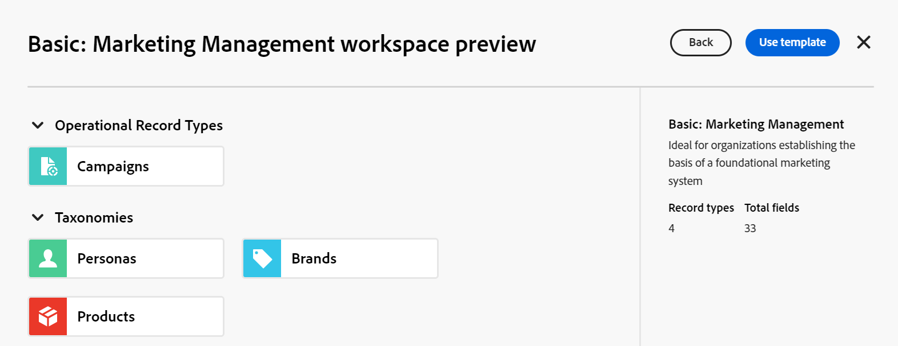

<!--udpate the metadata with real information when making this avilable in TOC and in the left nav-->

# ワークスペースを作成

<!--The information on this page refers to functionality not yet generally available. It is available only in the Preview environment for all customers. After the monthly releases to Production, the same features are also available in the Production environment for customers who enabled fast releases.    

For information about fast releases, see [Enable or disable fast releases for your organization](/help/quicksilver/administration-and-setup/set-up-workfront/configure-system-defaults/enable-fast-release-process.md). -->

{{planning-important-intro}}

Adobe Workfront Planning では、ワークスペースは、チームが作業を計画する一元的な場所です。

ワークスペースは、チームが使用するレコードタイプのコレクションで、チームの作業ライフサイクルを表します。Adobe Workfront Planning では、ワークスペースを完全にカスタマイズできます。

ワークスペースの一般的な情報については、[ ワークスペースの概要 ](/help/quicksilver/planning/architecture/workspaces-overview.md) を参照してください。

## アクセス要件

+++ 展開して、この記事の機能のアクセス要件を表示します。 

<table style="table-layout:auto"> 
<col> 
</col> 
<col> 
</col> 
<tbody> 
    <tr> 
<tr> 
</tr>   
<tr> 
   <td role="rowheader">
Adobe Workfront パッケージ
</td> 
   <td> 
<ul> 
<li>
任意のWorkfrontと任意の Planning パッケージ
</li>
または
<li>
任意のワークフローおよび任意の計画パッケージ
</li></ul>

各Workfront Planning パッケージに含まれる内容について詳しくは、Workfront アカウント担当者にお問い合わせください。 
 
   </td> 
  <tr> 
   <td role="rowheader">
Adobe Workfront プラン
</td> 
   <td>
標準

   </td> 
  </tr> 
  <tr> 
   <td role="rowheader">
オブジェクト権限
</td> 
   <td>   
ワークスペースに対する権限の管理
  
   
システム管理者は、作成しなかったワークスペースも含め、すべてのワークスペースに対する権限を持っています。
  </td> 
  </tr>  
</tbody> 
</table>

Workfrontのアクセス要件について詳しくは、[Workfront ドキュメントのアクセス要件 ](/help/quicksilver/administration-and-setup/add-users/access-levels-and-object-permissions/access-level-requirements-in-documentation.md) を参照してください。

+++   

<!--Old:

<table style="table-layout:auto"> 
<col> 
</col> 
<col> 
</col> 
<tbody> 
    <tr> 
<tr> 
<td> 
   
 Products
 </td> 
   <td> 
   <ul><li>
 Adobe Workfront
</li> 
   <li>
 Adobe Workfront Planning
</li></ul></td> 
  </tr>   
<tr> 
   <td role="rowheader">
Adobe Workfront plan*
</td> 
   <td> 

Any of the following Workfront plans:
 
<ul><li>Select</li> 
<li>Prime</li> 
<li>Ultimate</li></ul> 

Workfront Planning is not available for legacy Workfront plans
 
   </td> 
<tr> 
   <td role="rowheader">
Adobe Workfront Planning package*
</td> 
   <td> 

Any 
 

For more information about what is included in each Workfront Planning plan, contact your Workfront account manager. 
 
   </td> 
 <tr> 
   <td role="rowheader">
Adobe Workfront platform
</td> 
   <td> 

Your organization's instance of Workfront must be onboarded to the Adobe Unified Experience to be able to access Workfront Planning.
 

For more information, see <a href="/help/quicksilver/workfront-basics/navigate-workfront/workfront-navigation/adobe-unified-experience.md">Adobe Unified Experience for Workfront</a>. 
 
   </td> 
   </tr> 
  </tr> 
  <tr> 
   <td role="rowheader">
Adobe Workfront license*
</td> 
   <td>
 Standard 

   
Workfront Planning is not available for legacy Workfront licenses
 
  </td> 
  </tr> 
  <tr> 
   <td role="rowheader">
Access level configuration
</td> 
   <td> 
There are no access level controls for Adobe Workfront Planning
   
</td> 
  </tr> 
<tr> 
   <td role="rowheader">
Object permissions
</td> 
   <td>   
You receive Manage permissions to the workspaces you create. 
 </td> 
  </tr> 
</tbody> 
</table> -->

## ワークスペースの作成

ワークスペースを作成し、それにレコードタイプを追加して、Workfront Planning でオブジェクトを整理できます。 ワークスペースの編集について詳しくは、[ ワークスペースの編集 ](/help/quicksilver/planning/architecture/edit-workspaces.md) を参照してください。

{{step1-to-planning}}

1. **ワークスペースを作成** をクリックします

   ワークスペースを作成ボックスが表示されます。 ワークスペースは、最初から作成することも、使用可能なテンプレートの 1 つを使用して作成することもできます。

1. （オプションおよび条件付き）次の事前定義済みのワークスペーステンプレートのいずれかで「**プレビュー**」をクリックします。

   * 基本：マーケティング管理
   * 詳細：マーケティング管理
   * エンタープライズ：マーケティング管理
   * セールス管理
   * 製品管理

   テンプレートのプレビューボックスが開きます。

   運用中のレコードタイプ、分類および各テンプレートに関連付けられているフィールドの数が示されます。

   

   Workfront Planning ワークスペーステンプレートについて詳しくは、[ワークスペーステンプレートのリスト](/help/quicksilver/planning/architecture/workspace-templates.md)を参照してください。

1. テンプレートプレビューボックスで「**テンプレートを使用**」をクリックして、選択したテンプレートからワークスペースの作成を開始します

   または

   「**戻る**」をクリックし、「**新しいワークスペース**」をクリックしてワークスペースを最初から作成します。

   次のタイプのワークスペースの 1 つが作成されます。

   * ワークスペースをゼロから作成する際にレコードタイプの手動追加を開始できる **名称未設定Workspace** という空のワークスペース。
   * サンプルレコードタイプが入力される、選択したテンプレートにちなんで名前が付けられたワークスペース。 レコードタイプとワークスペースをさらにカスタマイズできます。

   Workfront管理者の場合、新しいワークスペースが **現在のワークスペース** タブに表示されます。

   ワークスペースを作成できるその他すべてのユーザーには、新しいワークスペースが **ワークスペース** 領域に表示されます。

1. 新しいワークスペースのヘッダーでワークスペースの名前の内側をクリックして名前を変更し、Enter キーを押します。

1. （オプションおよび条件付き）ワークスペースをテンプレートから作成した場合は、「**運用中のレコードタイプ**」または「**分類**」セクションの名前内をクリックします。

   または

   セクションの名前にポインタを合わせ、**その他** メニュー  をクリックしてから、**名前を変更** をクリックしてセクションの名前を変更します。

   >[!TIP]
   >
   >セクションを作成していない場合でも、任意のワークスペースから任意のセクションの名前を変更できます。

   「ワークスペース」セクションの編集を含む、ワークスペースの編集の詳細については、「[ ワークスペースの編集 ](/help/quicksilver/planning/architecture/edit-workspaces.md)」を参照してください。

1. （オプション）「**レコードタイプを追加**」をクリックして、任意のセクションのワークスペースにレコードタイプを追加します。

   詳しくは、[リクエストタイプの作成](/help/quicksilver/planning/architecture/create-record-types.md)を参照してください。

   ワークスペース内のレコードの種類の編集および削除の詳細については、「[ ワークスペースの編集 ](/help/quicksilver/planning/architecture/edit-workspaces.md)」を参照してください。

1. （オプション）新しいワークスペースの左側にある戻る矢印をクリックして、Planning のメイン・ページを開きます。 「現在のワークスペース **タブに、新しいワークスペース用の新しいワークスペースカードが作成され** す。

   ワークスペースを作成したユーザーの名前は、所有者としてワークスペースカードに保存されます。

   >[!NOTE]
   >
   >現在、Adobe Identity Management System （IMS）に移行中のユーザーの場合、IMS ユーザーではないWorkfront専用ユーザーが作成したワークスペースは、**System** によって作成されたものとして表示されます。
   >
   >IMS について詳しくは、[WorkfrontのAdobe統合エクスペリエンス ](/help/quicksilver/workfront-basics/navigate-workfront/workfront-navigation/adobe-unified-experience.md) を参照してください。

