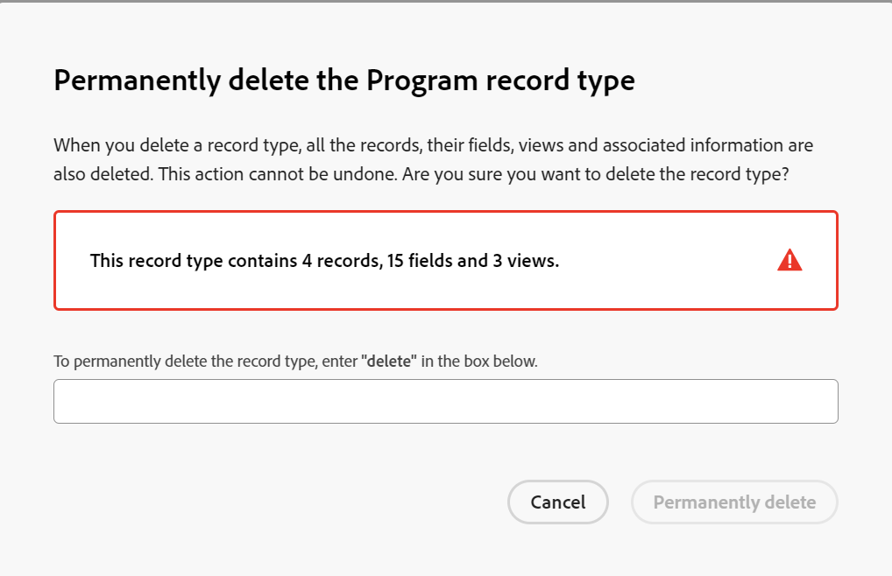
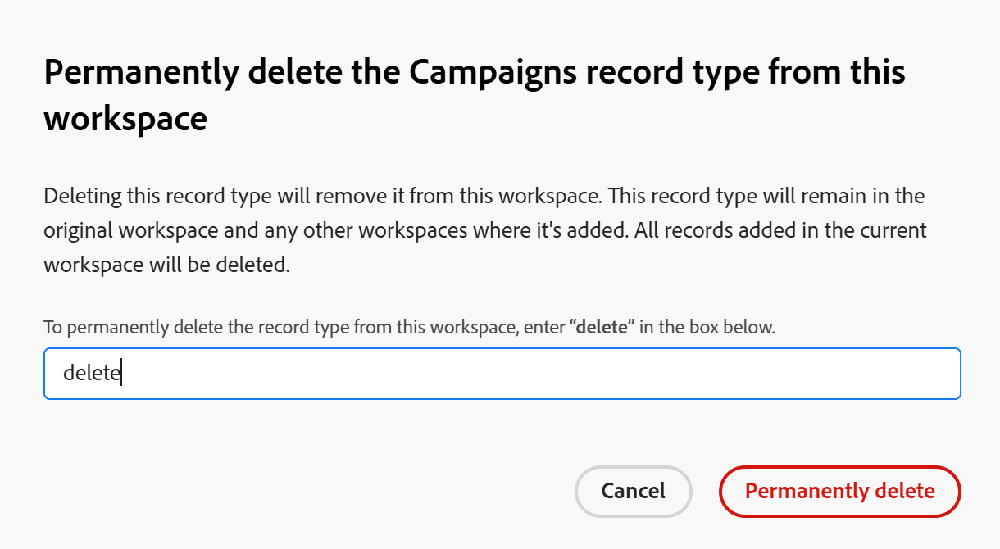

<!--keep the global record type reference in yellow till January 2026-->

# レコードタイプの削除

このページでハイライト表示されている情報は、まだ一般に利用できない機能を示します。すべてのユーザーのプレビュー環境でのみ使用できます。 実稼動環境への毎月のリリース後、高速リリースを有効にしたお客様は、実稼動環境でも同じ機能を利用できます。

迅速リリースについて詳しくは、[組織での迅速リリースを有効または無効にする](/help/quicksilver/administration-and-setup/set-up-workfront/configure-system-defaults/enable-fast-release-process.md)を参照してください。

{{planning-important-intro}}

関係がなくなったレコードタイプは削除できます。

ただし、レコードタイプを削除すると、そのレコードタイプに関連付けられているすべての情報も削除されます。詳しくは、この記事で[レコードタイプを削除する際の考慮事項](#considerations-when-deleting-record-types)の節を参照してください。

レコードタイプについて詳しくは、[ レコードタイプの概要](/help/quicksilver/planning/architecture/overview-of-record-types.md)を参照してください。

<!-- last sentence might need to be deleted when we can recover or replace deleted record types-->

## アクセス要件

+++ 展開して、この記事の機能のアクセス要件を表示します。 

<table style="table-layout:auto"> 
<col> 
</col> 
<col> 
</col> 
<tbody> 
    <tr> 
<tr> 
</tr>   
<tr> 
   <td role="rowheader">
Adobe Workfront パッケージ
</td> 
   <td> 
<ul> 
<li>
任意のWorkfrontおよびプランニングパッケージ
</li>
または
<li>
任意のワークフローとプランニングパッケージ
</li></ul>

グローバルレコードタイプを削除するには：

<ul><li>
任意のWorkfront パッケージとPlanning Plus パッケージ
</li>
または
<li>
任意のワークフローとプランニング PrimeまたはUltimate パッケージ
</li></ul>

各Workfront計画パッケージに含まれる内容について詳しくは、Workfrontの担当者にお問い合わせください。 
 
   </td> 
  <tr> 
   <td role="rowheader">
Adobe Workfront プラン
</td> 
   <td>
標準

   </td> 
  </tr> 
  <tr> 
   <td role="rowheader">
オブジェクト権限
</td> 
   <td>   
ワークスペースに対する権限の管理
  
   
システム管理者は、作成しなかったワークスペースも含め、すべてのワークスペースに対する権限を持っています。
  </td> 
  </tr>  
</tbody> 
</table>

Workfrontのアクセス要件について詳しくは、[Workfront ドキュメント ](/help/quicksilver/administration-and-setup/add-users/access-levels-and-object-permissions/access-level-requirements-in-documentation.md)のアクセス要件を参照してください。

+++   

<!--
Old:
<table style="table-layout:auto"> 
<col> 
</col> 
<col> 
</col> 
<tbody> 
    <tr> 
<tr> 
<td> 
   
 Products
 </td> 
   <td> 
   <ul><li>
 Adobe Workfront
</li> 
   <li>
 Adobe Workfront Planning
</li></ul></td> 
  </tr>   
<tr> 
   <td role="rowheader">
Adobe Workfront plan*
</td> 
   <td> 

Any of the following Workfront plans:
 
<ul><li>Select</li> 
<li>Prime</li> 
<li>Ultimate</li></ul> 

Workfront Planning is not available for legacy Workfront plans
 
   </td> 
<tr> 
   <td role="rowheader">
Adobe Workfront Planning package*
</td> 
   <td> 

Any 
 

For more information about what is included in each Workfront Planning plan, contact your Workfront account manager. 
 
   </td> 
 <tr> 
   <td role="rowheader">
Adobe Workfront platform
</td> 
   <td> 

Your organization's instance of Workfront must be onboarded to the Adobe Unified Experience to be able to access Workfront Planning.
 

For more information, see <a href="/help/quicksilver/workfront-basics/navigate-workfront/workfront-navigation/adobe-unified-experience.md">Adobe Unified Experience for Workfront</a>. 
 
   </td> 
   </tr> 
  </tr> 
  <tr> 
   <td role="rowheader">
Adobe Workfront license*
</td> 
   <td>
 Standard

   
Workfront Planning is not available for legacy Workfront licenses
 
  </td> 
  </tr> 
  <tr> 
   <td role="rowheader">
Access level configuration
</td> 
   <td> 
There are no access level controls for Adobe Workfront Planning
   
</td> 
  </tr> 
<tr> 
   <td role="rowheader">
Object permissions
</td> 
   <td>   
Manage permissions to a workspace and record type
  
   
System Administrators have permissions to all workspaces, including the ones they did not create
</td> 
  </tr> 
</tbody> 
</table> 
-->

## レコードタイプを削除する際の考慮事項

<!--check this and ensure these are still true - some things might change with / after closed beta-->

* 自分が管理権限を持つワークスペースからは、レコードタイプのみを削除できます。
* レコードタイプを削除すると、それに関連付けられている次の情報が削除されます。

   * そのタイプのすべてのレコード。
   * そのレコードタイプに関連付けられているすべてのフィールド。
   * そのレコードタイプのすべてのビュー（フィルター、グループ化、並べ替え条件を含む）。
* そのレコードタイプは、ワークスペースにアクセスするすべてのユーザーから削除されます。
* 削除したレコードタイプやその情報は復元できません。
* 削除するレコードタイプに関連付けられているフィールドとレコードを別のレコードタイプで再作成してから削除することをお勧めします。

* 他のワークスペースに追加されたグローバルレコードタイプは削除できません。

  詳しくは、この記事の「[ グローバルレコードタイプを削除](#delete-global-record-types)」の節を参照してください。

## レコードタイプの削除

{{step1-to-planning}}

1. 削除するレコードタイプのワークスペースをクリックします。

   または

   ワークスペースから、既存のワークスペース名の右側にある下向き矢印を展開し、ワークスペースを検索して、リストに表示されるときに選択します。

   >[!TIP]
   >
   >次のキーボードの組み合わせを使用して、任意のWorkfront計画ページからグローバル検索ボックスを開き、ワークスペースを検索できます。
   >
   >* WindowsのCTRL+K
   >* Mac⌘の+K

   ワークスペースが開き、レコードタイプが表示されます。
1. 次のいずれかの操作を行います。

   * レコードタイプカードにカーソルを合わせ、**詳細** メニューをクリックしてから&#x200B;**削除**&#x200B;します。
   * 削除するレコードタイプのカードをクリックし、レコードタイプページから、レコードタイプ名の右側にある&#x200B;**詳細** メニューをクリックし、**削除**&#x200B;をクリックします。

     >[!TIP]
     >
     >レコードの種類ページから追加されたセカンダリワークスペースから、グローバルなレコードの種類を削除することはできません。 削除できるのは、ワークスペースのレコードタイプカードのみです。

     

1. 確認ボックスに「**delete**」と入力し、**完全に削除**」をクリックします。 大文字と小文字を区別しません。

   選択したレコードタイプとそのフィールド、関連するレコード、ビューは削除され、復元できません。

## グローバルなレコードタイプの削除

グローバルレコードタイプを削除する場合、次のシナリオが存在します。

* グローバルとして設定されたレコードタイプがまだ別のワークスペースに追加されていない場合は、そのレコードタイプを元のワークスペースから削除できます。

* グローバルレコードタイプとして設定されたレコードタイプが、他の少なくとも1つのワークスペースに追加されている場合、元のワークスペースから削除することはできません。 最初に追加されたセカンダリワークスペースからグローバルレコードタイプを削除（削除）する必要があります。次に、元のワークスペースからグローバルレコードタイプを完全に削除できます。

### 元のワークスペースからグローバルレコードタイプを削除する

レコードタイプが関連性がなくなった場合は、元のワークスペースからレコードタイプを削除できます。

すべてのレコードとフィールドも削除され、復元できません。

1. 元のワークスペースのグローバルレコードタイプに移動します。

1. （条件付き）グローバルレコードタイプがセカンダリワークスペースに追加されているかどうかに応じて、次のいずれかの操作を行います。

   * レコードタイプがセカンダリワークスペースに追加されていない場合は、レコードタイプのカードの&#x200B;**詳細** メニューをクリックするか、ページのレコードタイプの名前の右側にある「**削除**」をクリックします。
   * レコードタイプが他の少なくとも1つのセカンダリワークスペースに追加された場合は、まずセカンダリワークスペースに移動し、そのスペースからグローバルレコードを削除します。

     詳しくは、この記事の「[ セカンダリワークスペースからグローバルレコードタイプを削除する](#delete-a-global-record-type-from-a-secondary-workspace)」の節を参照してください。

1. （条件付き）この記事の「[ レコードタイプを削除](#delete-record-types-1)」の節で説明しているように、レコードタイプの削除を続行します。

   次のことが発生します。

   * グローバルなレコードタイプは元のワークスペースから削除され、レコードタイプは、そのレコードとフィールドを復元できません。
   * セカンダリワークスペースからのすべてのグローバルレコードとそのレコードも、このワークスペースから削除されます。

### セカンダリワークスペースからグローバルレコードタイプを削除する

不要になった場合は、別のワークスペースから追加したレコードタイプを削除できます。

次の点に注意してください。

* セカンダリワークスペースからグローバルレコードタイプを削除すると、レコードタイプは元のワークスペースに残ります。

* セカンダリワークスペースからグローバルレコードタイプを削除すると、次の項目も削除されます。

   * セカンダリワークスペースから追加されたレコードは、セカンダリワークスペースと元のワークスペースから削除され、復元できません。

  <!--Coming later: * The fields added from the secondary workspace.-->

* セカンダリワークスペースから削除されたグローバルレコードタイプは復元できません。

* 元のレコードタイプは、元のワークスペースと、追加された他のワークスペースに残ります。

* セカンダリワークスペースのレコードタイプに追加されたビューは保持され、共有されている場合は、他のワークスペースに表示されます。

セカンダリワークスペースからグローバルレコードタイプを削除するには：

1. セカンダリワークスペースのグローバルレコードタイプに移動します。

1. （オプション）レコードタイプのカードの&#x200B;**詳細** メニューをクリックし、**削除**&#x200B;をクリックします。
1. （条件付き）指定されたフィールドに「**delete**」と入力し、**完全に削除**」をクリックします。

   

   次のことが発生します。

   * グローバルレコードタイプから作成されたレコードタイプは、選択したセカンダリワークスペースから削除されます。
   * フィールドを含む元のレコードタイプは、元のワークスペースに残ります。
   * レコードタイプは、追加された他のすべてのワークスペースに残ります。
   * セカンダリワークスペースからレコードタイプに追加されたレコード <!--and fields-->が削除されます。 グローバルレコードタイプが追加された追加のワークスペースから追加されたその他すべてのレコードは、それぞれのワークスペースと元のワークスペースに保存されます。 &lt;! – フィールドは、追加されたワークスペースに保存されます。

