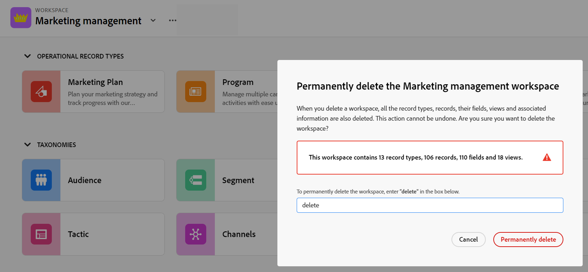

# ワークスペースの削除

{{planning-important-intro}}

Adobe Workfront Planning では、ワークスペースは、チームが作業を計画する一元的な場所です。詳しくは、[ワークスペースの作成](/help/quicksilver/planning/architecture/create-workspaces.md)を参照してください。

不要になったワークスペースは削除できます。

ワークスペースを削除する前に、そのワークスペースに関連付けられているレコードタイプ、レコード、フィールド、ビューの一部またはすべてを、別のワークスペースで再作成することをお勧めします。

## アクセス要件

+++ 展開すると、Workfront Planning のアクセス要件が表示されます。

Workfront Planning にアクセスするには、次のものが必要です：

<table style="table-layout:auto"> 
<col> 
</col> 
<col> 
</col> 
<tbody> 
    <tr> 
<tr> 
<td> 
   
 製品
 </td> 
   <td> 
   <ul><li>
 Adobe Workfront
</li> 
   <li>
 Adobe Workfrontの計画
</li></ul></td> 
  </tr>   
<tr> 
   <td role="rowheader">
Adobe Workfront プラン*
</td> 
   <td> 

次のいずれかのWorkfront プラン：
 
<ul><li>選択</li> 
<li>Prime</li> 
<li>Ultimate</li></ul> 

Workfront Planning は、従来のWorkfront プランでは使用できません
 
   </td> 
<tr> 
   <td role="rowheader">
Adobe Workfront計画*
</td> 
   <td> 

任意 
 

各Workfront Planning プランに含まれる内容の詳細については、<a href="https://business.adobe.com/products/workfront/pricing.html">Adobe Workfrontの価格とパッケージ </a> を参照してください。 
 
   </td> 
 <tr> 
   <td role="rowheader">
Adobe Workfront platform
</td> 
   <td> 

組織のWorkfront インスタンスは、Workfront Planning のすべての機能にアクセスできるように、Adobe Unified Experience にオンボーディングされる必要があります。
 

詳しくは、<a href="/help/quicksilver/workfront-basics/navigate-workfront/workfront-navigation/adobe-unified-experience.md">Workfront の Adobe Unified Experience</a> を参照してください。 
 
   </td> 
   </tr> 
  </tr> 
  <tr> 
   <td role="rowheader">
Adobe Workfront プラン*
</td> 
   <td>
 標準 

   
Workfront Planning は、従来のWorkfront ライセンスでは使用できません
 
  </td> 
  </tr> 
  <tr> 
   <td role="rowheader">
アクセスレベルの設定
</td> 
   <td> 
Adobe Workfront Planning に対するアクセスレベルのコントロールはありません。
   
</td> 
  </tr> 
<tr> 
   <td role="rowheader">
オブジェクト権限
</td> 
   <td>   
ワークスペースへの権限の管理</a> 
  
   
システム管理者は、作成しなかったワークスペースも含め、すべてのワークスペースに対する権限を持っています。
 </td> 
  </tr> 
<tr> 
   <td role="rowheader">
レイアウトテンプレート
</td> 
   <td> 
Workfront の管理者を含むすべてのユーザーには、メインメニューの Planning エリアを含むレイアウトテンプレートを割り当てる必要があります。 
 </td> 
  </tr> 
</tbody> 
</table>

*Workfront のアクセス要件について詳しくは、[Workfront ドキュメントのアクセス要件](/help/quicksilver/administration-and-setup/add-users/access-levels-and-object-permissions/access-level-requirements-in-documentation.md)を参照してください。

+++

<!--
OLD: 

<table style="table-layout:auto">
 <col>
 </col>
 <col>
 </col>
 <tbody>
    <tr>
<tr>
<td>
   
 Product
 </td>
   <td>
   
 Adobe Workfront
 </td>
  </tr>  
 <td role="rowheader">
Adobe Workfront agreement
</td>
   <td>

Your organization must be enrolled in the early access stage for Workfront Planning 

   </td>
  </tr>
  <tr>
   <td role="rowheader">
Adobe Workfront plan
</td>
   <td>

Any

   </td>
  </tr>
  <tr>
   <td role="rowheader">
Adobe Workfront license*
</td>
   <td>
   
New: Standard

   
Current: Plan
 
  </td>
  </tr>
  
  <tr>
   <td role="rowheader">
Access level configuration
</td>
   <td> 
There are no access level controls for Adobe Workfront Planning
  
</td>
  </tr>

  <tr>
   <td role="rowheader">
Permissions
</td>
   <td> 
Manage permissions to a workspace</a> 
  
   
System Administrators have permissions to all workspaces, including the ones they did not create

    
</td>
  </tr>
<tr>
   <td role="rowheader">
Layout template
</td>
   <td> 
Your Workfront or group administrator must add the Planning area in your layout template. For information, see <a href="/help/quicksilver/planning/access/access-overview.md">Access overview</a>. 
  
</td>
  </tr>

 </tbody>
</table>

*For more information about access requirements, see [Access requirements in Workfront documentation](/help/quicksilver/administration-and-setup/add-users/access-levels-and-object-permissions/access-level-requirements-in-documentation.md). 

-->

## ワークスペースの削除に関する考慮事項

* ワークスペースを削除すると、すべてのレコードタイプ、レコード、そのフィールドおよびビューも削除されます。
* 削除したワークスペースとそれらに含まれる情報は復元できません。

## ワークスペースの削除

{{step1-to-planning}}

1. （条件付き）Workfront管理者の場合は、「**自分が参加しているワークスペース** **」をクリックして作成したワークスペースにアクセスしたり、「その他のワークスペース** をクリックして自分と共有されている他のワークスペースにアクセスしたりします。

1. （任意）「**すべて表示**」をクリックして、追加のワークスペースを表示します。 **すべてを表示** リンクは、ワークスペースカードが 3 行を超える場合にのみ表示されます。
1. （任意） ClicK **表示を減らす** を使用して、画面に表示するワークスペースの数を制限します。
1. ワークスペースを削除するには、次のいずれかの操作を行います。

   * ワークスペースカードにポインタを合わせ、カードの右上隅にある **詳細** メニュー  ージをクリックします
または
   * ワークスペースカードをクリックしてワークスペースを開き、ワークスペース名の右  にある **詳細** メニューをクリックします。
1. 「**削除**」をクリックします。

   

1. 表示されたスペースに「**削除**」と入力し、「**完全に削除**」をクリックします。 これは、大文字と小文字を区別しません。

   ワークスペースは削除され、復元できません。レコードタイプ、レコード、フィールドおよびそれらに関連付けられているビューも削除されます。<!--ensure this is right at or before GA-->
