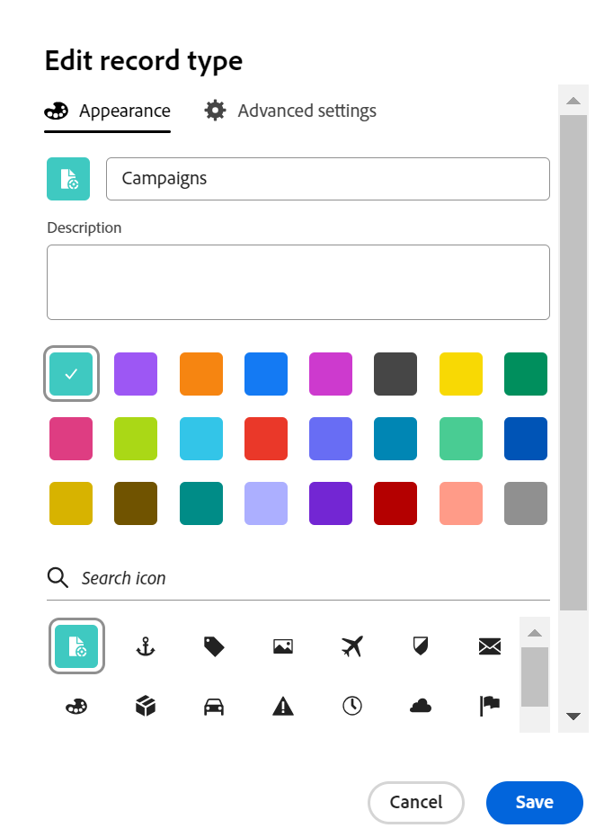

# レコードタイプの編集

このページの情報は、まだ一般に提供されていない機能を指します。すべてのお客様が、プレビュー環境でのみ使用できます。 実稼動環境への毎月のリリースの後、迅速なリリースを有効にしたお客様には、実稼動環境でも同じ機能を利用できます。

迅速リリースについて詳しくは、[組織での迅速リリースを有効または無効にする](/help/quicksilver/administration-and-setup/set-up-workfront/configure-system-defaults/enable-fast-release-process.md)を参照してください。

{{planning-important-intro}}

レコードタイプは、Adobe Workfront Planning のオブジェクトタイプです。自分または他のユーザーが作成したレコードタイプの外観を編集できます。Workfront Planning レコードタイプの作成について詳しくは、[レコードタイプの作成](/help/quicksilver/planning/architecture/create-record-types.md)を参照してください。

## アクセス要件

+++ 展開して、この記事の機能のアクセス要件を表示します。 

<table style="table-layout:auto"> 
<col> 
</col> 
<col> 
</col> 
<tbody> 
    <tr> 
<tr> 
</tr>   
<tr> 
   <td role="rowheader">
Adobe Workfront パッケージ
</td> 
   <td> 

接続可能レコード・タイプを使用可能にする手順は、次のとおりです。 

<ul> 
<li>
任意のWorkfront パッケージと任意の Planning パッケージ
</li>

または

<li>
ワークフローおよび計画のPrimeとUltimate パッケージ
</li></ul>

グローバルレコードタイプを有効にするには：

<ul> 
<li>
任意のWorkfront パッケージと Planning Plus パッケージ
</li>

または

<li>
ワークフローおよび計画のPrimeとUltimate パッケージ
</li></ul>

各Workfront Planning パッケージに含まれる内容について詳しくは、Workfront アカウント担当者にお問い合わせください。 
 
   </td> 
  <tr> 
   <td role="rowheader">
Adobe Workfront プラン
</td> 
   <td>
標準

   </td> 
  </tr> 
  <tr> 
   <td role="rowheader">
オブジェクト権限
</td> 
   <td>   
ワークスペースに対する権限の管理
  
   
システム管理者は、作成しなかったワークスペースも含め、すべてのワークスペースに対する権限を持っています。
  </td> 
  </tr>  
</tbody> 
</table>

Workfrontのアクセス要件について詳しくは、[Workfront ドキュメントのアクセス要件 &#x200B;](/help/quicksilver/administration-and-setup/add-users/access-levels-and-object-permissions/access-level-requirements-in-documentation.md) を参照してください。

+++   

<!--Old:
<table style="table-layout:auto"> 
<col> 
</col> 
<col> 
</col> 
<tbody> 
    <tr> 
<tr> 
<td> 
   
 Products
 </td> 
   <td> 
   <ul><li>
 Adobe Workfront
</li> 
   <li>
 Adobe Workfront Planning
</li></ul></td> 
  </tr>   
<tr> 
   <td role="rowheader">
Adobe Workfront plan*
</td> 
   <td> 

Any of the following Workfront plans:
 
<ul><li>Select</li> 
<li>Prime</li> 
<li>Ultimate</li></ul> 

Workfront Planning is not available for legacy Workfront plans
 
   </td> 
<tr> 
   <td role="rowheader">
Adobe Workfront Planning package*
</td> 
   <td> 

Any 
 

For more information about what is included in each Workfront Planning plan, contact your Workfront account manager. 
 
   </td> 
 <tr> 
   <td role="rowheader">
Adobe Workfront platform
</td> 
   <td> 

Your organization's instance of Workfront must be onboarded to the Adobe Unified Experience to be able to access Workfront Planning.
 

For more information, see <a href="/help/quicksilver/workfront-basics/navigate-workfront/workfront-navigation/adobe-unified-experience.md">Adobe Unified Experience for Workfront</a>. 
 
   </td> 
   </tr> 
  </tr> 
  <tr> 
   <td role="rowheader">
Adobe Workfront license*
</td> 
   <td>
 Standard 

   
Workfront Planning is not available for legacy Workfront licenses
 
  </td> 
  </tr> 
  <tr> 
   <td role="rowheader">
Access level configuration
</td> 
   <td> 
There are no access level controls for Adobe Workfront Planning
   
</td> 
  </tr> 
<tr> 
   <td role="rowheader">
Object permissions
</td> 
   <td>   
Manage permissions to a workspace and record type 
  
   
System Administrators have permissions to all workspaces, including the ones they did not create

   
Only system administrators can enable record types to connect from other workspaces
 </td> 
  </tr> 

</tbody> 
</table> -->

## レコードタイプの編集

{{step1-to-planning}}

1. レコードタイプを編集するワークスペースをクリックします。

   ワークスペースページが開き、レコードタイプが表示されます。
1. 次のいずれかの操作を行います。

   * レコードタイプのカードにポインタを合わせ、レコードタイプのカードの右上隅にある **その他** メニュー  をクリックしてから、**編集** をクリックします
     <!--or **Settings**-->
または
   *  レコードタイプカードをクリックしてレコードタイプページを開き、レコードタイプ名の右側にある **詳細** メニュー  をクリックしてから、**編集**<!--or **Settings**. --> をクリックします

   <!---->

1. **レコードタイプを編集** ボックスで、「**外観** タブがデフォルトで開きます。<!--update screen shot below at preview-->

   

   「**外観**」タブで次の情報を更新します。

   * 必要に応じて、レコードタイプ名を編集します。<!--did they add a field label for this?-->
   * **説明**：詳しい情報を含むレコードタイプの説明を編集または追加します。
   * レコードタイプに関連付けられたアイコンの色と形状を編集します。 次の操作を実行します。
      * レコードタイプを識別するための色を選択します。これは、レコードタイプアイコンの色です。
      * リストからアイコンを選択するか、アイコンの名前を入力して何を表しているか説明し、表示されたら選択します。これは、レコードタイプのアイコンです。ファイルのアイコンはデフォルトで選択されています。

1. （オプションおよび条件付き）システム管理者の場合は、「**詳細設定**」をクリックして、「**クロスワークスペース機能**」セクションで次の情報を更新します。<!--the info here is duplicated in the Create record types article-->
   * **他のワークスペースでこのレコードタイプへの接続を許可** 設定を有効にする：これにより、ワークスペースマネージャーは他のワークスペースからこのレコードタイプに接続できます。\
     このレコードタイプを接続できるワークスペースを指定できます。 すべてのワークスペースで使用できるようにすることも、読み込み先となる特定のワークスペースを指定することもできます。
詳しくは、[&#x200B; レコードタイプに対するクロスワークスペース機能の設定 &#x200B;](/help/quicksilver/planning/architecture/configure-record-type-cross-workspace-capabilities.md) を参照してください。

   

   <!--replace last point with this when we release global record types; the preview tags might need to be edited, too:
    1. (Optional and conditional) If you are a system administrator, update the information in the **Cross-workspace settings** tab.
    For more information, see [Configure cross-workspace capabilities for record types](/help/quicksilver/planning/architecture/configure-record-type-cross-workspace-capabilities.md).
    ***********Add screenshot***********
    -->

1. 「**保存**」をクリックします。

   ワークスペースのレコードタイプカードの右上隅に、接続アイコン  が表示され、レコードが他のワークスペースからアクセスできるようになったことを示します。

   <!--replace the blurb above after "Save" with this: If you configured the cross-workspace capabilities for the record, the **connectable record type** icon  and the **global record type** icon  also display on the card. -->

1. （オプション）ワークスペース領域からレコードタイプカードをクリックしてレコードタイプのページを開き、ヘッダーでレコードタイプの名前を変更します。

1. （オプション）別のレコードの種類を編集するには、レコードの種類のページで、レコードの種類名の右側にある下向き矢印を展開し、レコードの種類を検索してから、一覧に表示されるときにその種類を選択します。

   
