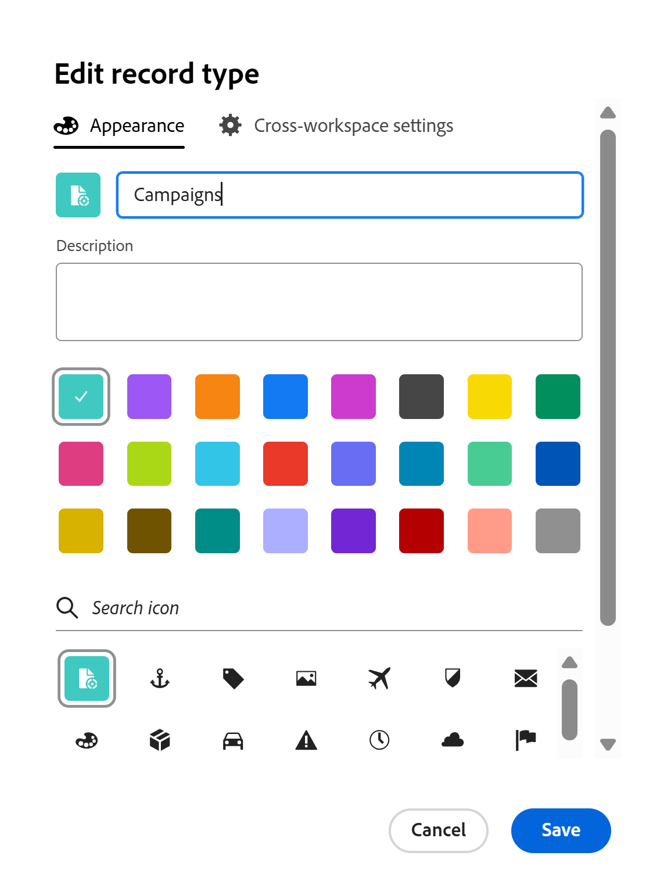

# レコードタイプの編集

このページでハイライト表示されている情報は、まだ一般に利用できない機能を示します。すべてのユーザーのプレビュー環境でのみ使用できます。 実稼動環境への毎月のリリース後、高速リリースを有効にしたお客様は、実稼動環境でも同じ機能を利用できます。

迅速リリースについて詳しくは、[組織での迅速リリースを有効または無効にする](/help/quicksilver/administration-and-setup/set-up-workfront/configure-system-defaults/enable-fast-release-process.md)を参照してください。

{{planning-important-intro}}

レコードタイプは、Adobe Workfront Planning のオブジェクトタイプです。自分または他のユーザーが作成したレコードタイプの外観を編集できます。Workfront Planning レコードタイプの作成について詳しくは、[レコードタイプの作成](/help/quicksilver/planning/architecture/create-record-types.md)を参照してください。

## アクセス要件

+++ 展開して、この記事の機能のアクセス要件を表示します。 

<table style="table-layout:auto"> 
<col> 
</col> 
<col> 
</col> 
<tbody> 
    <tr> 
<tr> 
</tr>   
<tr> 
   <td role="rowheader">
Adobe Workfront パッケージ
</td> 
   <td> 

任意のWorkfrontおよびプランニングパッケージ

任意のWorkfrontおよびプランニングパッケージ

<b>メモ</b>

接続可能なレコードタイプを設定するには： 

<ul> 
<li>
任意のWorkfront パッケージと任意のPlanning パッケージ
</li>
または
<li>
任意のワークフローとプランニング PrimeまたはUltimate パッケージ
</li></ul>

グローバルレコードタイプを設定するには：

<ul> 
<li>
任意のWorkfront パッケージとPlanning Plus パッケージ
</li>
または
<li>
任意のワークフローとプランニング PrimeまたはUltimate パッケージ
</li></ul>

各Workfront計画パッケージに含まれる内容について詳しくは、Workfrontの担当者にお問い合わせください。 

</td> </tr>
  <tr> 
   <td role="rowheader">
Adobe Workfront プラン
</td> 
   <td>
標準

   </td> 
  </tr> 
  <tr> 
   <td role="rowheader">
オブジェクト権限
</td> 
   <td>   
ワークスペースに対する権限の管理
  
   
システム管理者は、作成しなかったワークスペースも含め、すべてのワークスペースに対する権限を持っています。
  </td> 
  </tr>  
</tbody> 
</table>

Workfrontのアクセス要件について詳しくは、[Workfront ドキュメント ](/help/quicksilver/administration-and-setup/add-users/access-levels-and-object-permissions/access-level-requirements-in-documentation.md)のアクセス要件を参照してください。

+++   

<!--
Old:
<table style="table-layout:auto"> 
<col> 
</col> 
<col> 
</col> 
<tbody> 
    <tr> 
<tr> 
<td> 
   
 Products
 </td> 
   <td> 
   <ul><li>
 Adobe Workfront
</li> 
   <li>
 Adobe Workfront Planning
</li></ul></td> 
  </tr>   
<tr> 
   <td role="rowheader">
Adobe Workfront plan*
</td> 
   <td> 

Any of the following Workfront plans:
 
<ul><li>Select</li> 
<li>Prime</li> 
<li>Ultimate</li></ul> 

Workfront Planning is not available for legacy Workfront plans
 
   </td> 
<tr> 
   <td role="rowheader">
Adobe Workfront Planning package*
</td> 
   <td> 

Any 
 

For more information about what is included in each Workfront Planning plan, contact your Workfront account manager. 
 
   </td> 
 <tr> 
   <td role="rowheader">
Adobe Workfront platform
</td> 
   <td> 

Your organization's instance of Workfront must be onboarded to the Adobe Unified Experience to be able to access Workfront Planning.
 

For more information, see <a href="/help/quicksilver/workfront-basics/navigate-workfront/workfront-navigation/adobe-unified-experience.md">Adobe Unified Experience for Workfront</a>. 
 
   </td> 
   </tr> 
  </tr> 
  <tr> 
   <td role="rowheader">
Adobe Workfront license*
</td> 
   <td>
 Standard 

   
Workfront Planning is not available for legacy Workfront licenses
 
  </td> 
  </tr> 
  <tr> 
   <td role="rowheader">
Access level configuration
</td> 
   <td> 
There are no access level controls for Adobe Workfront Planning
   
</td> 
  </tr> 
<tr> 
   <td role="rowheader">
Object permissions
</td> 
   <td>   
Manage permissions to a workspace and record type 
  
   
System Administrators have permissions to all workspaces, including the ones they did not create

   
Only system administrators can enable record types to connect from other workspaces
 </td> 
  </tr> 

</tbody> 
</table>
-->

## レコードタイプの編集

{{step1-to-planning}}

1. レコードタイプを編集するワークスペースをクリックします。

   ワークスペースページが開き、レコードタイプが表示されます。
1. 次のいずれかの操作を行います。

   * レコードタイプのカードにカーソルを合わせ、レコードタイプカードの右上隅にある&#x200B;**詳細** メニューをクリックし、**編集**&#x200B;または&#x200B;**設定**をクリックします
または
   * レコードタイプカードをクリックしてレコードタイプページを開き、レコードタイプ名の右側にある&#x200B;**詳細** メニューをクリックし、**編集**&#x200B;または&#x200B;**設定**&#x200B;をクリックします。

   

1. **レコードタイプを編集** ボックスで、**アピアランス** タブがデフォルトで開きます。

   

   「**アピアランス**」タブの次の情報を更新します。

   * 必要に応じて、レコードタイプ名を編集します。<!--did they add a field label for this?-->
   * **説明**: レコードタイプの説明を、その詳細を含めて編集または追加します。
   * レコードタイプに関連付けられているアイコンの色と形状を編集します。 次の操作を実行します。
      * レコードタイプを識別するための色を選択します。これは、レコードタイプアイコンの色です。
      * リストからアイコンを選択するか、アイコンの名前を入力して何を表しているか説明し、表示されたら選択します。これは、レコードタイプのアイコンです。ファイルのアイコンはデフォルトで選択されています。

1. （オプションおよび条件付き）システム管理者の場合は、「**クロスワークスペース設定**」タブをクリックし、レコードタイプのクロスワークスペース機能に関する情報を更新します。

   詳細については、[ レコードタイプのクロスワークスペース機能の設定](/help/quicksilver/planning/architecture/configure-record-type-cross-workspace-capabilities.md)を参照してください。

   

1. 「**保存**」をクリックします。

   このレコードを他のワークスペースから接続することを選択した場合、**接続可能なレコード** アイコン がレコードカードに表示されます。

   このレコードを他のワークスペースに追加することを許可するように選択した場合、**グローバルレコード** アイコン がレコードカードに表示されます。

1. （オプション）ワークスペース領域のレコードタイプカードをクリックしてレコードタイプのページを開き、ヘッダーのレコードタイプの名前を変更します。

1. （オプション）別のレコードタイプを編集するには、レコードタイプページから、レコードタイプ名の右側にある下向き矢印を展開し、レコードタイプを検索して、リストに表示されたら選択します。

   

   >[!TIP]
   >
   >次のキーボードの組み合わせを使用して、任意のWorkfront Planning ページからグローバル検索ボックスを開き、レコードタイプ :を検索できます
   >
   >* WindowsのCTRL+K
   >* Mac⌘の+K
   >
   >
