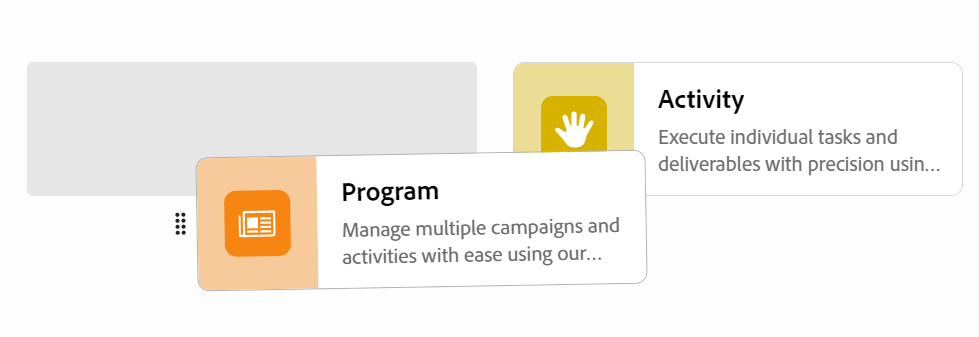

# ワークスペースの編集

このページの情報は、まだ一般に提供されていない機能を指します。すべてのユーザーのプレビュー環境でのみ使用できます。 実稼動環境への毎月のリリース後、高速リリースを有効にしたお客様は、実稼動環境でも同じ機能を利用できます。

迅速リリースについて詳しくは、[組織での迅速リリースを有効または無効にする](/help/quicksilver/administration-and-setup/set-up-workfront/configure-system-defaults/enable-fast-release-process.md)を参照してください。

{{planning-important-intro}}

Adobe Workfront Planning では、ワークスペースは、チームが作業を計画する一元的な場所です。

ワークスペースは、チームが使用するレコードタイプのコレクションで、チームの作業ライフサイクルを表します。Adobe Workfront Planning では、ワークスペースを完全にカスタマイズできます。

ワークスペースの作成については、[ワークスペースの作成](/help/quicksilver/planning/architecture/create-workspaces.md)を参照してください。

ワークスペースに加えたすべての変更は、少なくともワークスペースに対する表示権限を持っているすべてのユーザーに対して表示されます。

ワークスペースは、次の方法で編集できます。

* 手作業で。

  この記事では、ワークスペースを手動で編集する方法について説明します。

* AIを活用したPlanning Designerを使用します。 この機能は、現在、限定的なBeta プログラムでのみ使用できます。

  詳しくは、「[Adobe Workfront計画Designerの基本を学ぶ](/help/quicksilver/planning/general/planning-ai-designer.md)」を参照してください。

## アクセス要件

+++ 展開して、この記事の機能のアクセス要件を表示します。 

<table style="table-layout:auto"> 
<col> 
</col> 
<col> 
</col> 
<tbody> 
    <tr> 
<tr> 
</tr>   
<tr> 
   <td role="rowheader">
Adobe Workfront パッケージ
</td> 
   <td> 
<ul> 
<li>
任意のWorkfrontおよびプランニングパッケージ
</li>
または
<li>
任意のワークフローとプランニングパッケージ
</li></ul>

各Workfront計画パッケージに含まれる内容について詳しくは、Workfrontの担当者にお問い合わせください。 
 
   </td> 
  <tr> 
   <td role="rowheader">
Adobe Workfront プラン
</td> 
   <td>
標準

   </td> 
  </tr> 
  <tr> 
   <td role="rowheader">
オブジェクト権限
</td> 
   <td>   
ワークスペースに対する権限の管理
  
   
システム管理者は、作成しなかったワークスペースも含め、すべてのワークスペースに対する権限を持っています。
  </td> 
  </tr>  
</tbody> 
</table>

Workfrontのアクセス要件について詳しくは、[Workfront ドキュメント &#x200B;](/help/quicksilver/administration-and-setup/add-users/access-levels-and-object-permissions/access-level-requirements-in-documentation.md)のアクセス要件を参照してください。

+++   

<!--
Old:
<table style="table-layout:auto"> 
<col> 
</col> 
<col> 
</col> 
<tbody> 
    <tr> 
<tr> 
<td> 
   
 Products
 </td> 
   <td> 
   <ul><li>
 Adobe Workfront
</li> 
   <li>
 Adobe Workfront Planning
</li></ul></td> 
  </tr>   
<tr> 
   <td role="rowheader">
Adobe Workfront plan*
</td> 
   <td> 

Any of the following Workfront plans:
 
<ul><li>Select</li> 
<li>Prime</li> 
<li>Ultimate</li></ul> 

Workfront Planning is not available for legacy Workfront plans
 
   </td> 
<tr> 
   <td role="rowheader">
Adobe Workfront Planning package*
</td> 
   <td> 

Any 
 

For more information about what is included in each Workfront Planning plan, contact your Workfront account manager. 
 
   </td> 
 <tr> 
   <td role="rowheader">
Adobe Workfront platform
</td> 
   <td> 

Your organization's instance of Workfront must be onboarded to the Adobe Unified Experience to be able to access Workfront Planning.
 

For more information, see <a href="/help/quicksilver/workfront-basics/navigate-workfront/workfront-navigation/adobe-unified-experience.md">Adobe Unified Experience for Workfront</a>. 
 
   </td> 
   </tr> 
  </tr> 
  <tr> 
   <td role="rowheader">
Adobe Workfront license*
</td> 
   <td>
 Standard

   
Workfront Planning is not available for legacy Workfront licenses
 
  </td> 
  </tr> 
  <tr> 
   <td role="rowheader">
Access level configuration
</td> 
   <td> 
There are no access level controls for Adobe Workfront Planning
   
</td> 
  </tr> 
<tr> 
   <td role="rowheader">
Object permissions
</td> 
   <td>  
Manage permissions to the workspace 
   </td> 
  </tr> 
</tbody> 
</table>
-->

## ワークスペースの編集

{{step1-to-planning}}

1. （条件付き）Workfront管理者の場合は、次のいずれかをクリックします。

   * **作成したワークスペースにアクセスするための**&#x200B;のワークスペース
   * **自分または自分が作成したワークスペースで共有されているワークスペースにアクセスするためのワークスペース**&#x200B;すべて

1. （オプション）「**すべてを表示**」をクリックして、追加のワークスペースを表示します。 **すべてを表示** リンクは、2行以上のワークスペースカードがある場合にのみ表示されます。
1. （オプション）「**表示回数**」をクリックして、画面に表示されるワークスペースの数を制限します。
1. ワークスペースを編集するには、次のいずれかの操作を行います。

   * ワークスペースカードにカーソルを合わせ、カードの右上隅にある&#x200B;**詳細** メニューをクリックします
または
   * ワークスペースページの右上隅にある&#x200B;**検索** アイコン をクリックして、ワークスペースを名前で検索し、ワークスペースカードをクリックしてワークスペースを開き、ワークスペース名の右側にある&#x200B;**詳細** メニューをクリックします。

   >[!TIP]
   >
   >次のキーボードの組み合わせを使用して、任意のWorkfront Planning ページからグローバル検索ボックスを開き、ワークスペースを検索できます：
   >
   >* WindowsのCTRL+K
   >* Mac⌘の+K
   >
   >

1. 「**編集**」をクリックします。

   「**ワークスペースを編集**」ボックスが表示されます。

   

1. 「**ワークスペースを編集**」ボックスで、次の情報を更新します。

   * ワークスペースの名前を追加します。<!--did they add a label for this field?-->
   * **説明**: ワークスペースに関する情報を追加します。
   * ワークスペースに関連付けるアイコンを選択します。

1. 「**保存**」をクリックして「ワークスペースを編集」ボックスを閉じ、変更を適用します。

1. （オプション）新しいワークスペースセクションを追加するには、次のいずれかの操作を行います。

   * ワークスペースの下部にある「**セクションを追加**」をクリックします。
   * セクション名にカーソルを合わせ、**詳細** メニューをクリックし、**上のセクションを追加**&#x200B;または&#x200B;**下のセクションを追加**&#x200B;をクリックします。

1. （オプション）セクションの場所を変更するには、次のいずれかの操作を行います。

   * セクション名にカーソルを合わせて&#x200B;**グラブ** アイコン をクリックし、右側の場所にドラッグ&amp;ドロップします。
   * セクション名にカーソルを合わせ、**詳細** メニューをクリックし、**上に移動**&#x200B;または&#x200B;**下に移動**&#x200B;をクリックします。 セクションは、ワークスペース内で上下に移動します。

1. （オプション）ワークスペースセクションを削除するには、次の操作を行います。

   1. セクションの名前にカーソルを合わせ、**詳細** メニューをクリックし、**削除**&#x200B;をクリックします。<!--add screen shot when UI is final?-->
   1. 新しいセクションを選択し、すべてのレコードタイプをそのセクションに移動して、「**削除**」をクリックします。<!--check the button name; logged a bug to change it to "Delete" from "Delete section".-->

      すべてのレコードタイプが選択セクションに移動され、セクションが削除されます。

1. （オプション）「**レコードタイプを追加**」をクリックして、ワークスペースにレコードタイプを追加します。

   詳しくは、[レコードタイプの作成](/help/quicksilver/planning/architecture/create-record-types.md)を参照してください。

1. （オプション）レコードタイプカードにカーソルを合わせ、右上隅の&#x200B;**詳細** メニューをクリックし、**編集**&#x200B;をクリックしてレコードタイプの外観を変更します。

   詳しくは、[&#x200B; レコードタイプの編集](/help/quicksilver/planning/architecture/edit-record-types.md)を参照してください。

1. （オプション）レコードタイプカードにカーソルを合わせ、右上隅の&#x200B;**詳細** メニューをクリックし、**削除**&#x200B;をクリックしてレコードタイプを削除します。

   詳しくは、[&#x200B; レコードタイプの削除](/help/quicksilver/planning/architecture/delete-record-types.md)を参照してください。

1. （オプション）レコードタイプのカードを押しながらクリックしてドラッグし、新しい場所にドロップします。 レコードタイプをワークスペースセクションから別のセクションにドラッグ&amp;ドロップできます。

   

1. （オプション）ワークスペースの右上隅にある「**共有**」をクリックして、ワークスペースを他のユーザーと共有します。

   詳しくは、[ワークスペースの共有](/help/quicksilver/planning/access/share-workspaces.md)を参照してください。
