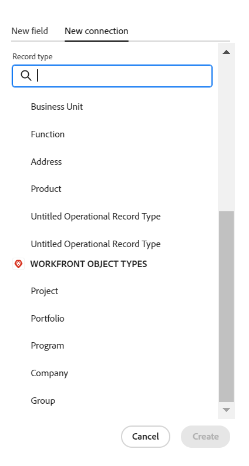

# レコードタイプとレコードの接続例

{{planning-important-intro}}

この記事では、次の例を説明します。

* 2 つの Workfront Planning レコードタイプと 2 つのレコード間の接続を作成する方法。

* Workfront Planning レコードタイプと Workfront プロジェクトオブジェクトタイプの間の接続、およびレコードとプロジェクトの間の接続を作成する方法。

詳しくは、次の記事も参照してください。

* [レコードタイプの接続](/help/quicksilver/planning/architecture/connect-record-types.md)
* [レコードの接続](/help/quicksilver/planning/records/connect-records.md)

## 2 つの Workfront Planning レコードタイプとレコードを接続（例）

例えば、元のレコードタイプとして「キャンペーン」という名前のレコードタイプがあるとします。

また「製品」という別のレコードタイプもあり、そのレコードタイプには「予算」という通貨フィールドがあります。

「キャンペーン」レコードタイプにフィールドを作成し、「製品」レコードタイプの「予算」フィールドの値を表示できるようにしたいと思います。

手順は次のとおりです。

1. ワークスペースで、「キャンペーン」レコードタイプのテーブルビューを開きます。
1. テーブルビューの右上隅にある「**+**」アイコンをクリックして新しいフィールドを追加したあと、「**新しい接続**」をクリックし、更に、選択した「ワークスペース」セクションで「**製品**」をクリックします。
1. 例として、次の情報を追加します。

   * **レコードタイプ**：製品 <!--did they change the casing here?-->
   * **名前**：新しいフィールドに名前を付けます。例：「製品情報」。これは、リンクされたレコードフィールドの名前です。
   * **名前**：新しいフィールドの説明を追加します。例：「自身のキャンペーンを関連付けたい製品です」。フィールドの説明は、列ヘッダーのフィールドにポインタを合わせると表示されます。
   * **接続タイプ**：次のいずれかのオプションを選択します。
      * **多対多**：ユーザーは、1 つのキャンペーンを複数の製品に接続し、1 つの製品を複数のキャンペーンに接続できます。
      * **1 対多**：ユーザーは、1 つのキャンペーンを複数の製品に接続し、1 つの製品を 1 つのキャンペーンに接続できます。
      * **多対 1**：ユーザーは、1 つのキャンペーンを 1 つの製品に、1 つの製品を複数のキャンペーンに接続できます。
      * **1 対 1**：ユーザーは、1 つのキャンペーンを 1 つの製品に、1 つの製品を 1 つのキャンペーンに接続できます。

     >[!NOTE]
     >
     >異なるワークスペースのレコードを接続する場合や、Experience Manager Assets を接続する場合、「**接続タイプ**」オプションは使用できません。 詳しくは、[&#x200B; 接続されたレコードタイプの概要 &#x200B;](/help/quicksilver/planning/architecture/connect-record-types-overview.md) を参照してください。

   * **レコードの外観**：次のいずれかのオプションを選択します。
      * **名前と画像**：接続されたレコードの名前とサムネールまたはアイコンを表示します。 これはデフォルトで選択されています。
      * **名前**：接続されたレコードの名前のみを表示します。
      * **画像**：接続されたレコードのサムネールまたはアイコンのみを表示します。
   * **参照フィールドを選択**：このオプションを選択したままにすると、「**参照フィールドを追加**」ボックスが開き、製品フィールドをキャンペーンレコードタイプにリンクできるようになります。「**スキップ**」をクリックしてこの手順をスキップし、製品フィールドを後で追加することができます。

     

1. （条件付き）前の手順で&#x200B;**参照フィールドを選択**&#x200B;を選択した場合は、**製品**&#x200B;レコードタイプに関連付けられたフィールドのリストから、**予算**&#x200B;フィールドの **+** アイコンを選択し、**フィールドを追加**&#x200B;をクリックします。これにより、**予算（製品情報から）**&#x200B;というフィールドが作成されます。これは、リンクされたフィールドの名前です。製品予算に関する情報は、キャンペーンレコードのこのフィールドに表示されます。

   

   >[!TIP]
   >
   >    選択したすべての製品の予算を 1 つの合計値として表示する場合は、フィールド名の右にあるドロップダウンメニューで&#x200B;**SUM**&#x200B;を選択します。ユーザーが&#x200B;**製品情報**&#x200B;のリンクされたレコードフィールドで複数の製品を選択した場合、**予算（製品情報から）**&#x200B;フィールドには、すべての予算値を合算した合計が表示されます。<!-- check the shot below - added a bug with a couple of UI changes here-->
   >
   > **SUM** ではなく **なし** を選択した場合、選択した商品の個々の予算がコンマで区切って表示されます。

   これにより、次のフィールドが生成されます。

   * あるキャンペーンのキャンペーンレコードテーブルビューとキャンペーンレコードページでは：

      * **製品情報** （リンクされたレコードフィールド）：製品を追加すると、製品の名前が表示されます。
      * **予算（製品情報から）**（リンクされたフィールド）:「製品の情報」フィールドで選択した製品の予算が表示されます。

   * ある製品の製品レコードテーブルビューと製品レコードページでは：

      * **キャンペーン**：製品レコードタイプがキャンペーンレコードタイプからリンクされていることを示します。

     

   >[!TIP]
   >
   >    リンクされたレコードフィールドの前には、関係アイコン  が付きます。

1. **キャンペーン**&#x200B;レコードタイプテーブルビューから、「キャンペーン」レコードタイプページのテーブルに新しい行を追加して、キャンペーンを作成します。

1. 新しいキャンペーンの **製品情報** 列内をダブルクリックします。

   

1. 次のいずれかの操作を行います。

   * 接続されている製品の名前をリストでクリックして、選択したレコードに追加します。製品が自動的に追加されます。
   * 製品の名前を入力していき、リストに名前が表示されたらクリックします。製品が自動的に追加されます。
   * 「**すべて表示**」をクリックして、すべての製品を表示します。

1. （条件付き）前の手順で「**すべて表示**」をクリックした場合、「**オブジェクトを接続**」ボックスが表示されます。

   

1. 検索ボックスに製品の名前を入力していき、リストに名前が表示されたら選択します。

   または

   キャンペーンレコードと接続する製品レコードを選択し、「**オブジェクトを接続**」をクリックします。

   >[!TIP]
   >
   >    キャンペーンのレコードページを開き、リンクされたレコードフィールドを見つけ、そのフィールド内の **+** アイコンをクリックして、接続された製品レコードタイプから製品を追加します。

   次の列が、キャンペーンレコードタイプのテーブルに入力されます。
   * **製品情報**&#x200B;フィールドには、選択した製品がキャンペーンレコードに入力されます。
   * **予算（製品情報から）**&#x200B;フィールドには、選択した各製品の予算値か、（アグリゲーターに「SUM」を選択した場合）選択したすべての製品の予算の合計が入力されます。

   

   >[!TIP]
   >
   >複数の値に対して集計を選択しない場合、選択した製品のすべての値がコンマ区切りで表示されます。

1. **製品**&#x200B;テーブルビューから&#x200B;**キャンペーン**&#x200B;フィールドにデータを入力するには、「製品」レコードタイプテーブルビューから始めてキャンペーン情報を選択する手順 5～7 を繰り返します。これにより、キャンペーンレコードタイプページのテーブルの「製品情報」フィールドも更新されます。<!--ensure the step numbers remain correct-->

## Workfront Planning レコードタイプと Workfront プロジェクトオブジェクトタイプ、およびレコードと個別のプロジェクトを接続する

>[!IMPORTANT]
>
>    ワークスペースに対する表示以上の権限を持つユーザーは、Workfrontでの権限やアクセスレベルに関係なく、リンクされたフィールドの情報を表示できます。

例えば、元のレコードタイプとして「キャンペーン」という名前のレコードタイプがあるとします。

また、Workfront には「予定収益」と呼ばれるフィールドを持つプロジェクトがあります。

キャンペーンのレコードタイプで接続フィールドを作成し、そこで Workfront Planning のキャンペーンに接続されている Workfront のプロジェクトの予定収益フィールドの値を表示したい場合は、次の操作を行います。

手順は次のとおりです。

1. キャンペーンレコードタイプを、Workfront プロジェクトに接続するワークスペースへと移動します。
1. 選択したワークスペースで、キャンペーンレコードタイプのテーブルビューを開きます。
1. テーブルビューの右上隅にある **+** アイコンをクリックして新しいフィールドを追加し、「**新しい接続**」をクリックし、更に「**Workfront オブジェクトタイプ**」セクション内の「**プロジェクト**」をクリックします。
1. 例として、次の情報を追加します。

   * **レコードタイプ**：プロジェクト（Workfront サブセクションから）
   * **名前**：新しいフィールドに名前を付けます（例：「プロジェクト情報」）。
   * **説明**：新しいフィールドの説明を追加します。例：「自身のキャンペーンを関連付けたい製品です」。説明は、列ヘッダーのフィールド名の上にポインタを合わせると、テーブルビューに表示されます。
   * **接続タイプ**：次のいずれかのオプションを選択します。
      * **多対多**：ユーザーは、1 つのキャンペーンを複数の製品に接続し、1 つの製品を複数のキャンペーンに接続できます。
      * **1 対多**：ユーザーは、1 つのキャンペーンを複数の製品に接続し、1 つの製品を 1 つのキャンペーンに接続できます。
      * **多対 1**：ユーザーは、1 つのキャンペーンを 1 つの製品に、1 つの製品を複数のキャンペーンに接続できます。
      * **1 対 1**：ユーザーは、1 つのキャンペーンを 1 つの製品に、1 つの製品を 1 つのキャンペーンに接続できます。
   * **この条件に一致するオブジェクトのみをリンク**:「**カスタムフォーム**」ドロップダウンメニューからカスタムフォームを選択します。 指定したフォームに関連付けられているプロジェクトのみをキャンペーンに接続できます。 複数のフォームを選択できます。
   * **ルックアップフィールドを選択**：このオプションを選択したままにすると、「**ルックアップフィールドを追加**」ボックスが開き、製品フィールドをキャンペーンレコードタイプにリンクできるようになります。「**スキップ**」をクリックしてこの手順をスキップし、製品フィールドを後で追加することができます。

   

1. （条件付き）前の手順で&#x200B;**ルックアップフィールドを選択**」オプションを選択した場合、**プロジェクト**&#x200B;オブジェクトタイプに関連付けられたフィールドのリストから&#x200B;**予定収益**&#x200B;フィールドの **+** をクリックし、**フィールドを追加**&#x200B;をクリックします。これにより&#x200B;**予定収益（プロジェクト情報から）**&#x200B;というフィールドが作成されます。これは、リンクされたフィールドの名前です。プロジェクト予定収益フィールドのすべての情報は、キャンペーンレコードのこのフィールドに自動的に表示されます。

   >[!TIP]
   >
   >    選択したすべてのプロジェクトの予定収益を 1 つの合計として表示する場合は、フィールド名の右にあるドロップダウンメニューで「**SUM**」を選択します。ユーザーが&#x200B;**プロジェクト情報**&#x200B;のリンクされたオブジェクトフィールドで複数のプロジェクトを選択すると、**予定収益（製品情報から）**&#x200B;フィールドにすべての値を合算した合計が表示されます。<!-- check the shot below - added a bug with a couple of UI changes here-->
   >
   > **合計**&#x200B;ではなく&#x200B;**なし**&#x200B;を選択すると、個々の予定収益がカンマで区切られて表示されます。

   

   これにより、次のフィールドが生成されます。

   * キャンペーンレコードテーブルビューおよびキャンペーンレコードページでは：

      * **プロジェクト情報** （「リンクされたオブジェクト」フィールド）：プロジェクトの名前が表示されます。
      * **予定収益（プロジェクト情報から）**（リンクされたフィールド）:「プロジェクト情報」フィールドで選択したプロジェクトの予定収益が表示されます。

   >[!TIP]
   >
   >    リンクされたオブジェクトフィールドの前には、関係アイコン  が付きます。

1. **キャンペーン**&#x200B;レコードタイプテーブルビューから、テーブルに新しい行を追加してキャンペーンを作成します。

1. 新しいキャンペーンの「プロジェクト情報**」列内をダブルクリックします。

   

1. 次のいずれかの操作を行います。

   * リストからプロジェクト名をクリックして、選択したレコードに追加します。プロジェクトが自動的に追加されます。
   * プロジェクト名の入力を開始し、リストに名前が表示されたらクリックします。プロジェクトが自動的に追加されます。
   * **すべてを表示**&#x200B;をクリックして、すべてのプロジェクトを表示します。

1. （条件付き）前の手順で「**すべて表示**」をクリックした場合、「**オブジェクトを接続**」ボックスが表示されます。

   

1. 検索ボックスにプロジェクトの名前の入力を開始し、リストに名前が表示されたら選択します。

   または

   キャンペーンレコードと接続するプロジェクトレコードを選択し、「**オブジェクトを接続**」をクリックします。

   >[!TIP]
   >
   >    キャンペーンのページを開き、リンクされたプロジェクトフィールドを見つけ、フィールド内の **+** アイコンをクリックして、接続された製品レコードタイプからプロジェクトを追加することができます。

   これにより、選択したワークスペースに以下が追加されます。

   * キャンペーンレコードタイプテーブルで、以下の操作が実行されます。
      * **プロジェクト情報**&#x200B;フィールドに、選択したプロジェクトのキャンペーンレコードが入力されます。
      * **予定収益（製品情報から）**&#x200B;フィールドに、選択した各製品の予算値が入力されます。これは読み取り専用フィールドです。

   

   >[!TIP]
   >
   >複数値の集計を選択せずに、オブジェクトにリンクされたフィールドで複数のオブジェクトを選択すると、すべての値がカンマで区切られて表示されます。

1. 接続されたレコードフィールドでプロジェクトの名前をクリックします。

   プロジェクトに対する表示権限がある場合は、Workfrontでプロジェクトが開きます。
1. （オプション）権限がある場合は、Workfront でプロジェクトに関する情報を更新します。

1. （オプション）キャンペーンテーブルビューで、**プロジェクト情報**&#x200B;フィールドヘッダーの上にポインタを合わせ、下向きの矢印をクリックしてから、「**ルックアップフィールドを編集**」を選択します。
1. 「**未選択のフィールド**」セクションで、プロジェクトのWorkfront計画レコードに追加するプロジェクトフィールドの「**+**」アイコンをクリックします。
1. **選択したフィールド** セクションのWorkfront プロジェクト計画レコードから削除するプロジェクトフィールドの **ルトア** トアイコンをクリックします。
1. 「**保存**」をクリックします。

   追加のリンクされたフィールドが、キャンペーンレコードタイプに追加されます。
