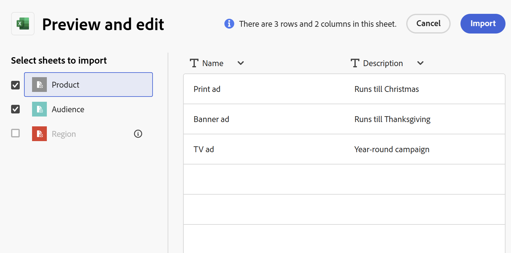
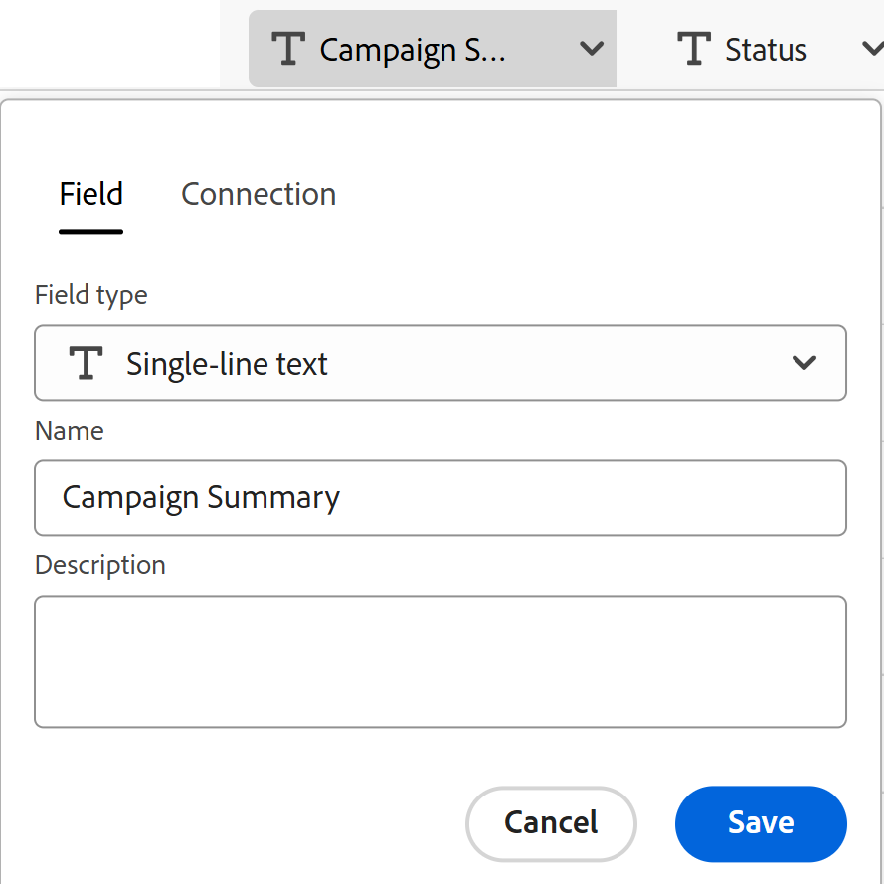
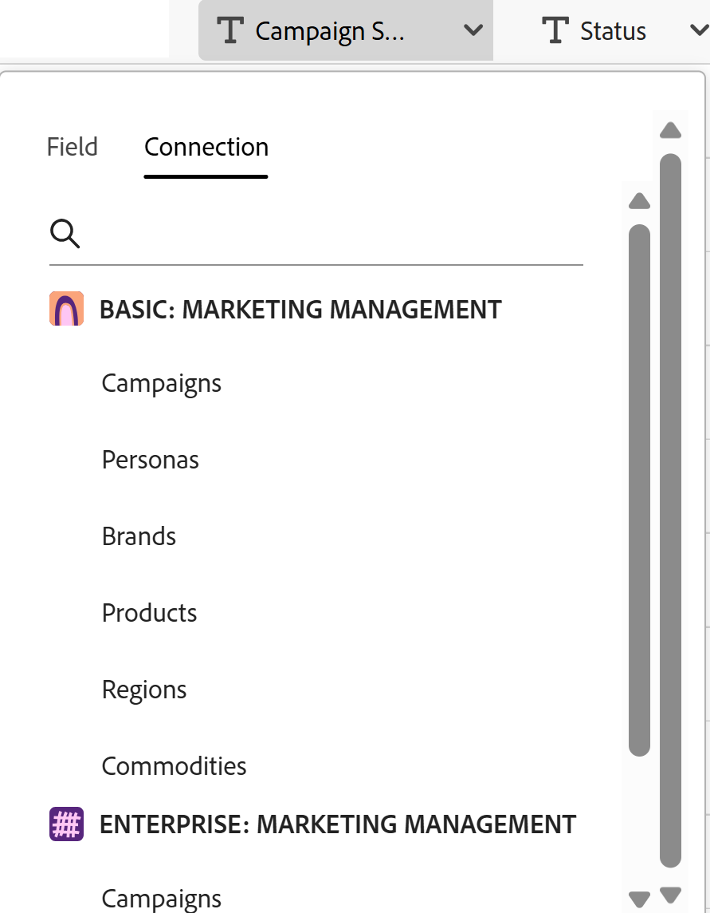

# CSVまたはExcel ファイルから情報を読み込んで、レコードタイプを作成する

<!--
The information on this page refers to functionality not yet generally available. It is available only in the Preview environment for all customers. After the monthly releases to Production, the same features are also available in the Production environment for customers who enabled fast releases.    

For information about fast releases, see [Enable or disable fast releases for your organization](/help/quicksilver/administration-and-setup/set-up-workfront/configure-system-defaults/enable-fast-release-process.md). 
-->

{{planning-important-intro}}

レコードタイプは、Adobe Workfront Planning のオブジェクトタイプです。Workfront Planningでは、CSVまたはExcel ファイルから情報をインポートすることで、組織のライフサイクルに必要な作業項目を示すカスタムレコードタイプを作成できます。

## アクセス要件

+++ 展開して、この記事の機能のアクセス要件を表示します。 

<table style="table-layout:auto"> 
<col> 
</col> 
<col> 
</col> 
<tbody> 
    <tr> 
<tr> 
</tr>   
<tr> 
   <td role="rowheader">
Adobe Workfront パッケージ
</td> 
   <td> 

任意のWorkfrontおよびプランニングパッケージ

または

任意のワークフローとプランニングパッケージ

各Workfront計画パッケージに含まれる内容について詳しくは、Workfrontの担当者にお問い合わせください。 
 
   </td> 
  <tr> 
   <td role="rowheader">
Adobe Workfront プラン
</td> 
   <td>
標準

   </td> 
  </tr> 
  <tr> 
   <td role="rowheader">
オブジェクト権限
</td> 
   <td>   
ワークスペースに対する権限の管理
  
   
システム管理者は、作成しなかったワークスペースも含め、すべてのワークスペースに対する権限を持っています。
  </td> 
  </tr>  
</tbody> 
</table>

Workfrontのアクセス要件について詳しくは、[Workfront ドキュメント ](/help/quicksilver/administration-and-setup/add-users/access-levels-and-object-permissions/access-level-requirements-in-documentation.md)のアクセス要件を参照してください。

+++   

<!--
Old:
<table style="table-layout:auto"> 
<col> 
</col> 
<col> 
</col> 
<tbody> 
    <tr> 
<tr> 
<td> 
   
 Products
 </td> 
   <td> 
   <ul><li>
 Adobe Workfront
</li> 
   <li>
 Adobe Workfront Planning
</li></ul></td> 
  </tr>   
<tr> 
   <td role="rowheader">
Adobe Workfront plan*
</td> 
   <td> 

Any of the following Workfront plans:
 
<ul><li>Select</li> 
<li>Prime</li> 
<li>Ultimate</li></ul> 

Workfront Planning is not available for legacy Workfront plans
 
   </td> 
<tr> 
   <td role="rowheader">
Adobe Workfront Planning package*
</td> 
   <td> 

Any 
 

For more information about what is included in each Workfront Planning plan, contact your Workfront account manager. 
 
   </td> 
 <tr> 
   <td role="rowheader">
Adobe Workfront platform
</td> 
   <td> 

Your organization's instance of Workfront must be onboarded to the Adobe Unified Experience to be able to access Workfront Planning.
 

For more information, see <a href="/help/quicksilver/workfront-basics/navigate-workfront/workfront-navigation/adobe-unified-experience.md">Adobe Unified Experience for Workfront</a>. 
 
   </td> 
   </tr> 
  </tr> 
  <tr> 
   <td role="rowheader">
Adobe Workfront license*
</td> 
   <td>
 Standard

   
Workfront Planning is not available for legacy Workfront licenses
 
  </td> 
  </tr> 
  <tr> 
   <td role="rowheader">
Access level configuration
</td> 
   <td> 
There are no access level controls for Adobe Workfront Planning
   
</td> 
  </tr> 
<tr> 
   <td role="rowheader">
Object permissions
</td> 
   <td>   
Manage permissions to a workspace
  
   
System Administrators have permissions to all workspaces, including the ones they did not create
  </td> 
  </tr> 
 
</tbody> 
</table>
-->

## ExcelまたはCSV ファイルを使用したレコードタイプの読み込みに関する考慮事項

* Excel ファイルの各シートがレコードタイプになります。 シートの名前は、レコードタイプの名前になります。
* シートが1枚しかない場合、またはCSV ファイルを読み込む場合、ファイル名はレコードタイプの名前になります。
* 各シートの列ヘッダーは、各レコードタイプに関連付けられたフィールドになります。
* フィールドは、それぞれのレコードタイプについて一意です。
* 各シートの各行は、各レコードタイプに関連付けられた一意のレコードになります。
* Excel ファイルの各シートの上限は次のとおりです：
   * 25,000 行
   * 500 列
* ファイルのサイズは5 MB以下にする必要があります。
* 空のシートはサポートされていません。
* 次のタイプのフィールドはサポートされていないため、インポートシートのフィールドにマッピングできません。

   * フィールドをWorkfront、Adobe Experience Manager オブジェクトタイプ、またはGenStudio Brandsに接続します。
   * 接続されたプランニングレコード、Workfront、Adobe Experience Manager オブジェクトまたはGenStudio Brandsからフィールドを検索します。
   * 数式フィールド
   * 作成日、作成者
   * 最終変更日、最終変更者
   * 承認日、承認者
   * ユーザー
   * レコード ID

ExcelまたはCSV ファイルを使用してレコードタイプを読み込むには：

{{step1-to-planning}}

1. レコードタイプを作成するワークスペースをクリックします，

   または

   ワークスペースから、既存のワークスペース名の右側にある下向き矢印を展開し、ワークスペースを検索して、リストに表示されるときに選択します。

   >[!TIP]
   >
   >次のキーボードの組み合わせを使用して、任意のWorkfront計画ページからグローバル検索ボックスを開き、ワークスペースを検索できます。
   >
   >* Windowsの場合はCTRL+K
   >* Macの⌘+K

1. 「**レコードタイプを追加**」をクリックします。
1. 「**ファイルからアップロード**」をクリックします。
1. 以前にコンピューターに保存したExcelまたはCSV ファイルをドラッグ&amp;ドロップするか、**CSVまたはExcel ファイルを選択**&#x200B;して参照し、選択します。
1. 「**プレビューして編集**」をクリックします。

   「**プレビューと編集**」ボックスに次の情報が表示されます。

   * 左パネルに、シートまたは将来のレコードタイプの名前が表示されます。Workfront Planning により、新しいレコードタイプごとにデフォルトでアイコンとカラーが選択されます。
   * 最初のシートまたはレコードタイプが選択され、関連付けられたフィールド名が列ヘッダーとして表示されます。各フィールドのタイプは、デフォルトで選択されています。
   * 各行は新しいレコードを表します。「プレビューと編集」ボックスには、最初の 10 レコードのみが表示されます。

   

1. （オプション）左パネルの各シート名をクリックすると、シートに含まれる情報を確認できます。

   >[!NOTE]
   >
   >空のシートはサポートされておらず、淡色の表示になります。

1. （オプション）左側のパネルから読み込みたくないシートの選択を解除します。

   

   選択を解除したシートは、グレーの背景で表示されます。

1. （オプション）列ヘッダーの右側にある下向き矢印をクリックして、「**フィールド**」タブで次のいずれかを実行します。

   レコードタイプマッピングインポートボックスの

   * フィールドの1つの名前を変更する
   * **フィールドタイプ**&#x200B;の変更
   * フィールド **説明**&#x200B;を更新します

1. （オプション）「**接続**」タブをクリックして、列の情報を他のレコードタイプから接続されたフィールドにマッピングします。

   レコードタイプ読み込みマッピングボックスの

   >[!TIP]
   >
   >Workfront Planningの接続されたレコードのフィールドにのみマッピングできます。 Workfront、Adobe Experience Manager、またはGenStudio Brandsの接続からフィールドにマッピングすることはできません。 詳細については、この記事の「[ExcelまたはCSV ファイルを使用したレコードタイプの読み込みに関する考慮事項](#considerations-about-importing-record-types-using-an-excel-or-csv-file)」を参照してください。

1. （条件付き）フィールドに関する情報を更新したら、**保存**&#x200B;をクリックします。

1. ファイルを読み込む準備が整ったら「**読み込み**」をクリックします。

   次の情報が Workfront Planning にインポートされます。

   * 新しいレコードタイプ
   * 各レコードタイプに関連付けられた新しいフィールド
   * 各レコードタイプに関連付けられた新しいレコード

   レコードタイプページのフィールドとレコードの管理を開始できます。

   Workfront Planningおよびワークスペースにアクセスできるユーザーは、読み込まれたレコードタイプとその情報を表示および編集できるようになりました。
