<!--
Should the structure of this article be like this other one: https://experienceleague.adobe.com/docs/workfront/using/administration-and-setup/customize/custom-forms/custom-form-builder/use-the-custom-form-builder/add-a-custom-field-to-a-custom-form.html?lang=ja ??
-->

<!--
will they add a way to create fields elsewhere than in a table?! - how will that change the structure of this article? 
-->

<!--
Do we need this for FORMULAS: when we release permissions to RECORDS and we release referring lookup fields in a formula field, update considerations to say that lookup fields from linked records depends on the permissions to the record; if they have no permissions to view a linked record, they won't be able to use that records's lookup fields in a formula - not sure is needed??
-->

# フィールドの作成

<!--information about choice values must stay in yellow till Jan 2026-->

<span class="preview">このページでハイライト表示されている情報は、まだ一般に利用できない機能を示します。すべてのユーザーのプレビュー環境でのみ使用できます。 実稼動環境への毎月のリリース後、高速リリースを有効にしたお客様は、実稼動環境でも同じ機能を利用できます。</span>

<span class="preview">迅速リリースについて詳しくは、[組織での迅速リリースを有効または無効にする](/help/quicksilver/administration-and-setup/set-up-workfront/configure-system-defaults/enable-fast-release-process.md)を参照してください。</span>


{{planning-important-intro}}

Adobe Workfront Planning では、レコードタイプのカスタムフィールドを作成できます。そしてフィールドを Workfront Planning レコードに関連付けて、レコードの情報を強化できます。

レコードタイプに関連付けるフィールドを作成するには、まずレコードタイプを作成する必要があります。詳しくは、[リクエストタイプの作成](/help/quicksilver/planning/architecture/create-record-types.md)を参照してください。

Workfront Planningでは、次の方法でフィールドを作成できます。

* [最初から](#create-fields-from-scratch)
* [レコードタイプの接続による](#create-fields-by-connecting-record-types)
* [レコードタイプの作成による](#create-fields-by-creating-a-record-type)
* [テンプレートからのワークスペースの作成による](#create-fields-by-creating-a-workspace-from-a-template)
* [ExcelまたはCSV ファイルを使用してレコードタイプを読み込む](#create-fields-when-importing-record-types-from-a-csv-or-excel-file)
* [既存のWorkfrontフィールドのコピーを](#create-fields-by-importing-them-from-workfront)

Workfront計画フィールドについて詳しくは、[&#x200B; フィールドの概要](/help/quicksilver/planning/fields/fields-overview.md)を参照してください。

## アクセス要件

+++ 展開して、この記事の機能のアクセス要件を表示します。 

<table style="table-layout:auto"> 
<col> 
</col> 
<col> 
</col> 
<tbody> 
    <tr> 
<tr> 
</tr>   
<tr> 
   <td role="rowheader"><p>Adobe Workfront パッケージ</p></td> 
   <td> 
<ul> 
<li><p>任意のWorkfrontおよびプランニングパッケージ</p></li>
または
<li><p>任意のワークフローとプランニングパッケージ</p></li></ul>
<p>各Workfront計画パッケージに含まれる内容について詳しくは、Workfrontの担当者にお問い合わせください。 </p> 
   </td> 
  <tr> 
   <td role="rowheader"><p>Adobe Workfront プラン</p></td> 
   <td><p>標準</p>
   </td> 
  </tr> 
  <tr> 
   <td role="rowheader"><p>オブジェクト権限</p></td> 
   <td>   <p>ワークスペースに対する権限の管理</p>  
   <p>システム管理者は、作成しなかったワークスペースも含め、すべてのワークスペースに対する権限を持っています。</p>  </td> 
  </tr>  
</tbody> 
</table>

Workfrontのアクセス要件について詳しくは、[Workfront ドキュメント &#x200B;](/help/quicksilver/administration-and-setup/add-users/access-levels-and-object-permissions/access-level-requirements-in-documentation.md)のアクセス要件を参照してください。

+++   

<!--

Old:
 <table style="table-layout:auto"> 
<col> 
</col> 
<col> 
</col> 
<tbody> 
    <tr> 
<tr> 
<td> 
   <p> Products</p> </td> 
   <td> 
   <ul><li><p> Adobe Workfront</p></li> 
   <li><p> Adobe Workfront Planning<p></li></ul></td> 
  </tr>   
<tr> 
   <td role="rowheader"><p>Adobe Workfront plan*</p></td> 
   <td> 
<p>Any of the following Workfront plans:</p> 
<ul><li>Select</li> 
<li>Prime</li> 
<li>Ultimate</li></ul> 
<p>Workfront Planning is not available for legacy Workfront plans</p> 
   </td> 
<tr> 
   <td role="rowheader"><p>Adobe Workfront Planning package*</p></td> 
   <td> 
<p>Any </p> 
<p>For more information about what is included in each Workfront Planning plan, contact your Workfront account manager. </p> 
   </td> 
 <tr> 
   <td role="rowheader"><p>Adobe Workfront platform</p></td> 
   <td> 
<p>Your organization's instance of Workfront must be onboarded to the Adobe Unified Experience to be able to access Workfront Planning.</p> 
<p>For more information, see <a href="/help/quicksilver/workfront-basics/navigate-workfront/workfront-navigation/adobe-unified-experience.md">Adobe Unified Experience for Workfront</a>. </p> 
   </td> 
   </tr> 
  </tr> 
  <tr> 
   <td role="rowheader"><p>Adobe Workfront license*</p></td> 
   <td><p> Standard </p>
   <p>Workfront Planning is not available for legacy Workfront licenses</p> 
  </td> 
  </tr> 
  <tr> 
   <td role="rowheader"><p>Access level configuration</p></td> 
   <td> <p>There are no access level controls for Adobe Workfront Planning</p>   
</td> 
  </tr> 
<tr> 
   <td role="rowheader"><p>Object permissions</p></td> 
   <td>   <p>Manage permissions to a workspace and record type</a> </p>  
   <p>System Administrators have permissions to all workspaces, including the ones they did not create.</p> </td> 
  </tr> 
</tbody> 
</table>
-->

## レコードタイプを連結してフィールドを作成する

2 つのレコードタイプ間で、または、1 つのレコードタイプと他のアプリケーションのオブジェクトタイプとの間で新しい接続を追加する際に、リンクされるレコードフィールドを作成できます。

Workfront Planningのレコードタイプの接続について詳しくは、[&#x200B; レコードタイプの接続](/help/quicksilver/planning/architecture/connect-record-types.md)を参照してください。

<!--

## Create fields by importing record types using an Excel or CSV file
For more information, see [Create record types](/help/quicksilver/planning/architecture/create-record-types.md).
-->

## レコードタイプを作成してフィールドを作成する

レコードタイプを作成すると、新しいレコードタイプに関連付けられた複数のフィールドもデフォルトで作成されます。詳しくは、[レコードタイプの作成](/help/quicksilver/planning/architecture/create-record-types.md)を参照してください。

## テンプレートからワークスペースを作成することでフィールドを作成

テンプレートからワークスペースを作成する際に、Adobe Workfront Planning はレコードタイプ用のフィールドを作成します。

詳しくは、[ワークスペースの作成](/help/quicksilver/planning/architecture/create-workspaces.md)を参照してください。


## CSVまたはExcel ファイルからレコードタイプを読み込む際にフィールドを作成する

CSVまたはExcel ファイルを使用してレコードタイプを読み込むと、フィールドを読み込むことができます。

詳しくは、[リクエストタイプの作成](/help/quicksilver/planning/architecture/create-record-types.md)を参照してください。

## Workfrontからフィールドを読み込んで作成する

既存のWorkfront フィールドのコピーを読み込むことができます。

Workfrontからフィールドを読み込むと、Workfront計画レコードタイプの各フィールドのコピーが作成されます。

フィールドをコピーした後、フィールドは互いに独立し、情報を交換しません。

詳しくは、[Workfrontからのフィールドの読み込みを参照してください](/help/quicksilver/planning/fields/import-fields-from-workfront.md)。


## フィールドを最初から作成 {#create-fields-from-scratch}

<!--in a table (not sure if this can be done elsewhere?!-->

<!--the first 3 steps are the same as in Import fields from Workfront-->

{{step1-to-planning}}

1. フィールドを作成するレコードを持つワークスペースをクリックします。

   ワークスペースが開き、レコードタイプが表示されます。

1. レコードタイプのカードをクリックします。

   そのレコードタイプに関連付けられている既存のすべてのレコードが、テーブルビューの行に表示されます。

   >[!TIP]
   >
   >    レコードが表示されない場合は、まだレコードが存在しないか、画面に表示される内容を制限するフィルターが適用されている可能性があります。

   レコードタイプに関連付けられている既存のすべてのフィールドが、テーブルビューの列に表示されます。

   >[!TIP]
   >
   >    一部のフィールドは非表示になっている可能性があります。 「フィールド」をクリックし、テーブルビューで列として表示するフィールドの切り替えスイッチを有効にします。

1. テーブルビューの右上隅にある&#x200B;**+** アイコンをクリックします

   または

   任意の列のヘッダーにカーソルを合わせ、フィールド名の後にある下向き矢印をクリックし、**左に挿入**&#x200B;または&#x200B;**右に挿入**&#x200B;をクリックして新しいフィールドを追加します。
1. 「**新しいフィールド**」タブで、「**フィールドタイプ**」ボックスからフィールドタイプを検索するか、次のフィールドタイプの中から選択します。

   **新規フィールド** タブで、関連するキーワードを使用して&#x200B;**フィールドタイプ** ボックスでフィールドタイプを検索するか、以下に示すフィールドタイプから選択します。

   >[!TIP]
   >
   >    「予算」を入力すると、数値と通貨のフィールドタイプが短いリストで表示されます。


   * [1 行テキスト](#single-line-text)
   * [段落](#paragraph)
   * [複数選択](#multi-select)
   * [単一選択](#single-select)
   * [日付](#date)
   * [数値](#number)
   * [パーセンテージ](#percentage)
   * [通貨](#currency)
   * [チェックボックス](#checkbox)
   * [式](#formula)
   * [ユーザー](#people)
   * [作成者](#created-by)
   * [作成日](#created-date)
   * [最終変更者](#last-modified-by)
   * [最終変更日](#last-modified-date)
   * [承認日](#approved-date)
   * [承認者](#approved-by)
   * <span class="preview">[&#x200B; レコード ID](#record-id)</span>
     <!--* [Object](#object-field-type)-->

   >[!IMPORTANT]
   >
   >フィールドのフィールドタイプは、保存すると変更できません。

   <!--
    Add this to the IMPORTANT above and make it a NOTE - should do directly to Prod:
    * You can use any keyword that might be related to any of the field type names. For example, a search for "Budget" will display the Number or Currency field type.
    -->

1. 以下の節の説明に従って、各フィールドの追加に進みます。

### 1 行テキスト {#single-line-text}

1 行テキストフィールドは、限られた英数字の情報を取り込みます。例えば、所有者、関係者、チームまたは組織単位の情報を 1 行テキストフィールドに取り込むことができます。1 行テキストフィールドのコンテンツは、1,000 文字までです。<!-- used to be 250 but just tested with 1000 and it allowed this as a maximum. -->

1. この記事の[フィールドを最初から作成](#create-fields-from-scratch)の節の説明に従ってフィールドの作成を開始し、**1 行テキスト**&#x200B;フィールドタイプを選択します。

   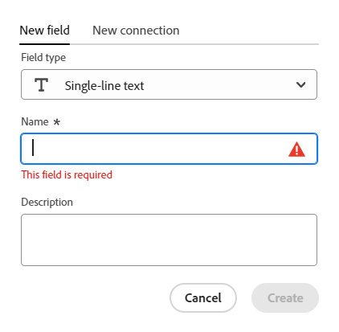

1. 「**新しいフィールド**」タブで次の情報を追加します。
   * **名前**: レコードのテーブルまたは詳細ページに表示されるフィールドの名前。<!--ensure they updated this; and update the screen shot: it used to be "Label"-->
   * **説明**：フィールドに関する追加情報。フィールドの説明は、テーブル内のフィールドの列ヘッダーにカーソルを合わせたときや、レコードの詳細ページのフィールド名の横にある情報アイコンをクリックしたときに表示されます。
1. 「**作成**」をクリックします。

   新しい1行のフィールドがレコードタイプに列として追加され、その値をレコードに関連付けることができます。


### 段落 {#paragraph}

段落フィールドは、「説明」フィールドと同様に、レコードに関する追加の英数字情報を取り込みます。

>[!TIP]
>
>* 1つのレコードタイプに対して、最大20個の段落フィールドを設定できます。
>
>* 段落フィールドのコンテンツは、10,000 文字までです。
>* リッチテキスト形式を使用して、テーブルビューやレコードの詳細ページに表示される際に、段落フィールドの内容を向上させることができます。詳しくは、[レコードの編集](/help/quicksilver/planning/records/edit-records.md)を参照してください。
>


1. この記事の[フィールドを最初から作成](#create-fields-from-scratch)の節の説明に従ってフィールドの作成を開始し、**段落**&#x200B;フィールドタイプを選択します。

   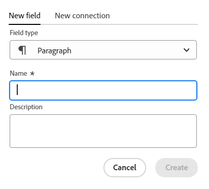


1. 「**新しいフィールド**」タブで次の情報を追加します。
   * **名前**: レコードのテーブルまたは詳細ページに表示されるフィールドの名前。<!--ensure they updated this; and update the screen shot: it used to be "Label"-->
   * **説明**：フィールドに関する追加情報。フィールドの説明は、テーブル内のフィールドの列にカーソルを合わせたときや、レコードの詳細ページのフィールド名の横にある情報アイコンをクリックしたときに表示されます。
1. 「**作成**」をクリックします。

   新しい段落フィールドが列としてレコードタイプに追加され、その値をレコードに関連付けることができます。


### 複数選択 {#multi-select}

複数選択フィールドを使用すると、ドロップダウンメニューから複数のオプションを選択して、追加情報を任意の形式で取り込むことができます。

>[!NOTE]
>
>この節で説明する機能に加えて、レコードの複数選択フィールド値をインラインで編集する際に、テーブルビューで新しい選択肢を追加できます。 詳しくは、[&#x200B; レコードの編集](/help/quicksilver/planning/records/edit-records.md)の「単一選択または複数選択フィールドに関する情報の編集」の節を参照してください。
>

1. この記事の[フィールドを最初から作成](#create-fields-from-scratch)の節の説明に従ってフィールドの作成を開始し、**複数選択**&#x200B;フィールドタイプを選択します。

   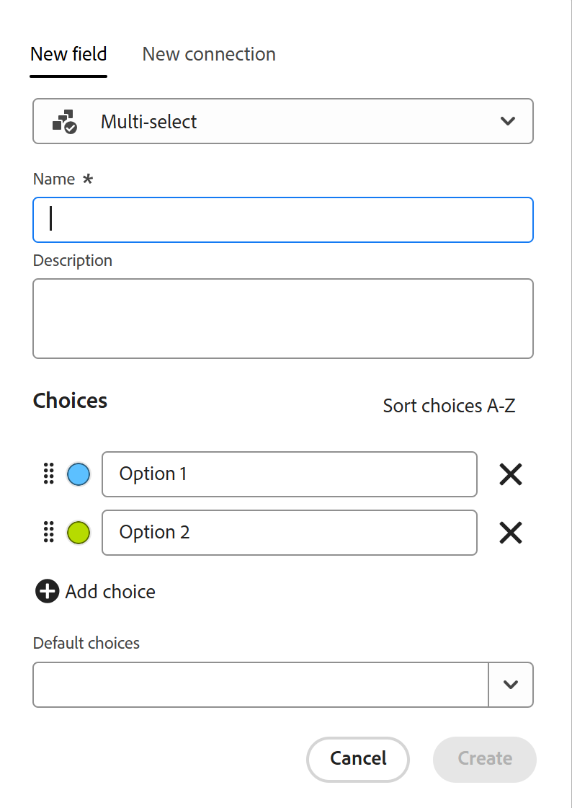


1. 「**新しいフィールド**」タブで次の情報を追加します。
   * **名前**: レコードのテーブルまたは詳細ページに表示されるフィールドの名前。<!--ensure they updated this; and update the screen shot: it used to be "Label"-->
   * **説明**：フィールドに関する追加情報。フィールドの説明は、テーブル内のフィールドの列にカーソルを合わせたときや、レコードの詳細ページのフィールド名の横にある情報アイコンをクリックしたときに表示されます。
   * **選択肢**：このフィールドを更新する際にユーザーが選択できるオプション。 各選択肢の名前には、数字と文字の両方を使用できます。
1. 「**選択肢を追加**」をクリックして、選択肢を追加します。 複数選択フィールドに追加できる選択肢の数に制限はありません。
1. （オプション）各選択肢を希望の順序で手動でドラッグ＆ドロップするか、
   選択肢を自動的にアルファベット順に表示する場合は、「**A ～ Z の順に選択肢を並べ替える**」オプションを選択します。<!--Add this if they added this functionality: You cannot edit this option after you save the field.-->
1. （オプション）選択肢を削除するには、その右側にある&#x200B;**x** アイコンをクリックします。
1. 選択肢の左側にあるカラースウォッチをクリックしてカラーセレクターを展開し、各オプションの色をカスタマイズします。

1. **スウォッチ**&#x200B;をクリックして、定義済みのカラーを選択します

   または

   **カスタム**&#x200B;をクリックして、カラーピッカーまたは16進数コードを使用してカスタムカラーを選択します。
1. カラーボックスの外側をクリックして閉じます。
1. 「**作成**」をクリックします。

   新しい複数選択フィールドがレコードタイプに列として追加され、その値をレコードに関連付けることができます。

1. （オプション）テーブルビューでフィールド名にカーソルを合わせ、フィールド名の右側にあるドロップダウンメニューをクリックし、**フィールドを編集**&#x200B;をクリックします。
1. **値を表示**&#x200B;設定をオンにして、各選択肢の値を表示します。 値は、Workfront データベースに表示される各選択肢の名前です。

   >[!NOTE]
   >
   >* Workfrontは、各選択肢に一意の値を割り当てます。
   >
   >* 値は小文字の選択肢名と一致します。 複数の単語はアンダースコアで区切られます。
   >
   >* 値は複数のフィールド間で繰り返すことができますが、1つのフィールドに対して一意である必要があります。
   >
   > 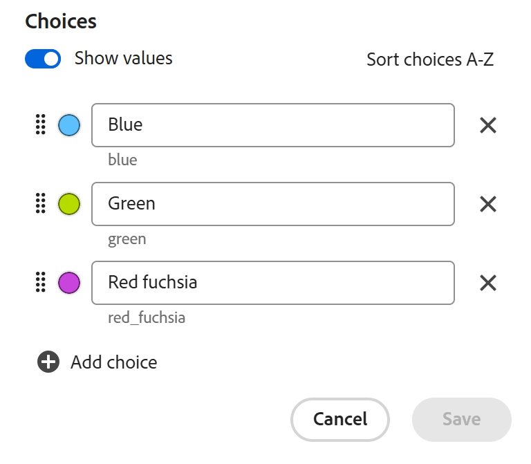

1. （オプション） API呼び出しやその他の統合で選択肢の値を使用します。

### 単一選択 {#single-select}

単一選択フィールドでは、ドロップダウンメニューから 1 つのオプションを選択することで、追加情報を任意の形式で取り込むことができます。

>[!NOTE]
>
>この節で説明する機能に加えて、レコードの単一選択フィールド値をインラインで編集する際に、テーブルビューで新しい選択肢を追加できます。 詳しくは、[&#x200B; レコードの編集](/help/quicksilver/planning/records/edit-records.md)の「単一選択または複数選択フィールドに関する情報の編集」の節を参照してください。
>

1. この記事の[フィールドを最初から作成](#create-fields-from-scratch)の節の説明に従ってフィールドの作成を開始し、**単一選択**&#x200B;というフィールドタイプを選択します。

   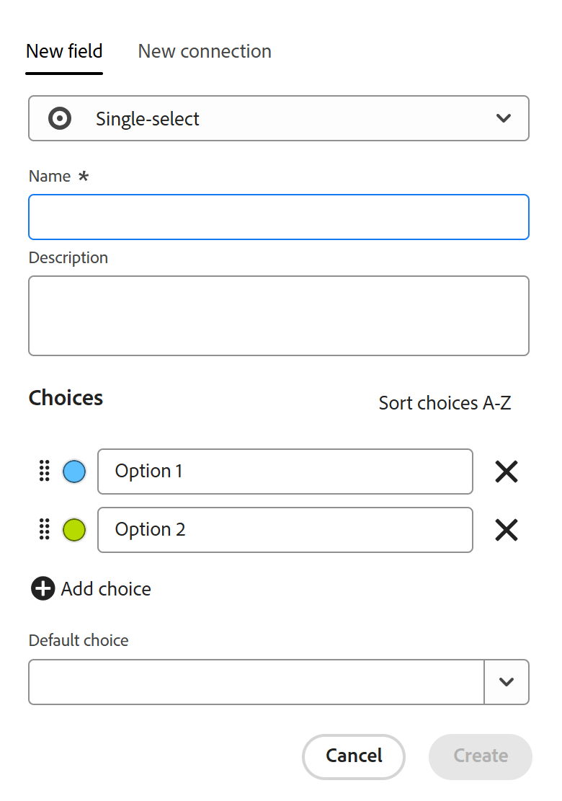

1. 「**新しいフィールド**」タブで次の情報を追加します。
   * **名前**: レコードのテーブルまたは詳細ページに表示されるフィールドの名前。<!--ensure they updated this; and update the screen shot: it used to be "Label"-->
   * **説明**：フィールドに関する追加情報。フィールドの説明は、テーブル内のフィールドの列にカーソルを合わせたときや、レコードの詳細ページのフィールド名の横にある情報アイコンをクリックしたときに表示されます。
   * **選択肢**：フィールドを保存した後、ドロップダウンメニューから選択できるオプション。各選択肢の名前には、数字と文字の両方を使用できます。

1. 「**選択肢を追加**」をクリックして、選択肢を追加します。 単一選択フィールドに追加できる選択肢の数に制限はありません。
1. （オプション）各選択肢を希望の順序で手動でドラッグ＆ドロップするか、選択肢を自動的にアルファベット順に表示する場合は、「**A ～ Z の順に選択肢を並べ替える**」オプションを選択します。<!--Add this if they added this functionality: You cannot edit this option after you save the field.-->
1. （オプション）選択肢を削除するには、その右側にある&#x200B;**x** アイコンをクリックします。
1. 選択肢の左側にあるカラースウォッチをクリックしてカラーセレクターを展開し、各オプションの色をカスタマイズします。
1. **スウォッチ**&#x200B;をクリックして、定義済みのカラーを選択します

   または

   **カスタム**&#x200B;をクリックして、カラーピッカーまたは16進数コードを使用してカスタムカラーを選択します。

1. カラーボックスの外側をクリックして閉じます。
1. 「**作成**」をクリックします。

   新しい単一選択フィールドは、レコードタイプに列として追加され、その値をレコードに関連付けることができます。

1. （オプション）テーブルビューでフィールド名にカーソルを合わせ、フィールド名の右側にあるドロップダウンメニューをクリックし、**フィールドを編集**&#x200B;をクリックします。
1. **値を表示**&#x200B;設定をオンにして、各選択肢の値を表示します。 値は、Workfront データベースに表示される各選択肢の名前です。

   >[!NOTE]
   >
   >* Workfrontは、各選択肢に一意の値を割り当てます。
   >
   >* 値は小文字の選択肢名と一致します。 複数の単語はアンダースコアで区切られます。
   >
   >* 値は複数のフィールド間で繰り返すことができますが、1つのフィールドに対して一意である必要があります。
   >
   > 

1. （オプション） API呼び出しやその他の統合で選択肢の値を使用します。

### 日付 {#date}

日付フィールドを使用すると、追加情報を日時形式で取り込むことができます。

1. この記事の[フィールドを最初から作成](#create-fields-from-scratch)の節の説明に従ってフィールドの作成を開始し、**日付**&#x200B;フィールドタイプを選択します。

   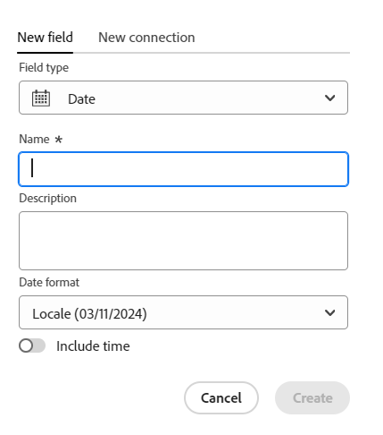


1. 「**新しいフィールド**」タブで次の情報を追加します。
   * **名前**: テーブルまたはレコードページに表示されるフィールドの名前。<!--ensure they updated this; and update the screen shot: it used to be "Label"-->
   * **説明**：フィールドに関する追加情報。フィールドの説明は、テーブル内のフィールドの列にカーソルを合わせたときや、レコードの詳細ページのフィールド名の横にある情報アイコンをクリックしたときに表示されます。
   * **日付形式**：このフィールドに表示する日付形式のタイプ。<!--update this casing - submitted bug for it-->

     次の形式から選択します。
      * **ロケール**：ブラウザーのロケールに一致します。
      * **標準**：例：2023/05/16
      * **長い形式**：例：2023年5月16日
      * **ヨーロッパ式**：例：16/05/2023
      * **ISO**：例：2023-05-16
   * **時刻を含める**: タイムスタンプを含める場合は、このオプションを選択します。 これはデフォルトでは選択されていません。 フィールドを保存した後は、時間を含めることはできません。

     次のオプションから選択します。

      * **24hr**：例：18:00
      * **12hr**：例：午後6:00

1. 「**作成**」をクリックします。

   新しい日付フィールドは、レコードタイプに列として追加され、その値をレコードに関連付けることができます。

### 数値 {#number}

数値フィールドタイプは、情報を数値形式で取り込みます。

>[!TIP]
>
>数値フィールドは、リクエストフォームビルダーで1行のテキストフィールドタイプとして表示されます。
>
>ただし、フィールド形式は保持され、これらのフィールドの値は、リクエストの送信後、レコードタイプおよびリクエストの詳細ページに数値として表示されます。
>詳しくは、[Adobe Workfront Planning](/help/quicksilver/planning/requests/create-request-form.md)でのリクエストフォームの作成と管理を参照してください。


1. この記事の[フィールドを最初から作成](#create-fields-from-scratch)の節の説明に従ってフィールドの作成を開始し、**数値**&#x200B;フィールドタイプを選択します。

   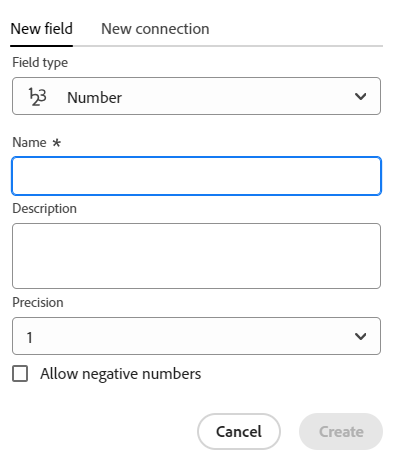
1. 「**新しいフィールド**」タブで次の情報を追加します。

   * **名前**: テーブルまたはレコードページに表示されるフィールドの名前。
   * **説明**：フィールドに関する追加情報。フィールドの説明は、テーブル内のフィールドの列にカーソルを合わせたときや、レコードの詳細ページのフィールド名の横にある情報アイコンをクリックしたときに表示されます。
   * **Precision**: フィールドに記録する小数点以下桁の数。 小数点以下桁を6つまで表示できます。
   * **負の数を許可**：このフィールドで負の数値を許可する場合は、このオプションを選択します。このオプションは、デフォルトで無効になっています。

   >[!NOTE]
   >
   >    「負の数を許可」を選択し、フィールドが関連付けられているレコードに負の値が格納されている場合、今後この設定の選択は解除できなくなります。

1. 「**作成**」をクリックします。

   新しい数値フィールドは、レコードタイプに列として追加され、その値をレコードに関連付けることができます。

### パーセンテージ {#percentage}

パーセンテージフィールドタイプでは、パーセント記号が後ろに付いた数値書式の情報を取り込みます。

>[!TIP]
>
>パーセンテージフィールドは、リクエストフォームビルダーで1行のテキストフィールドタイプとして表示されます。
>
>ただし、フィールド形式は保持され、これらのフィールドの値は、リクエストの送信後、レコードタイプおよびリクエストの詳細ページにパーセンテージとして表示されます。
>詳しくは、[Adobe Workfront Planning](/help/quicksilver/planning/requests/create-request-form.md)でのリクエストフォームの作成と管理を参照してください。


1. この記事の[フィールドを最初から作成する](#create-fields-from-scratch)の節の説明に従ってフィールドの作成を開始し、**パーセント**&#x200B;フィールドタイプを選択します。

   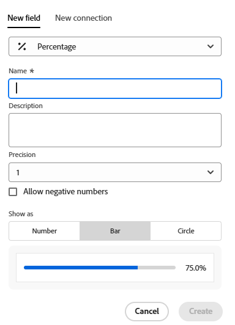

1. 「**新しいフィールド**」タブで次の情報を追加します。
   * **名前**: テーブルまたはレコードページに表示されるフィールドの名前。
   * **説明**：フィールドに関する追加情報。フィールドの説明は、テーブル内のフィールドの列にカーソルを合わせたときや、レコードの詳細ページのフィールド名の横にある情報アイコンをクリックしたときに表示されます。
   * **Precision**: フィールドに記録する小数点以下桁の数。 小数点以下桁を6つまで表示できます。
   * **負の数を許可**：このフィールドで負の割合の値を許可する場合は、このオプションを選択します。このオプションは、デフォルトで無効になっています。

     >[!NOTE]
     >
     >「負の数を許可」を選択し、フィールドが関連付けられているレコードに負の値が格納されている場合、今後この設定の選択は解除できなくなります。

   * **別名で表示**: ドロップダウンメニューから、テーブルビューでのパーセント値の表示方法を選択します。 次のオプションから選択します。
      * **数値**: パーセント値は、数字の後にパーセント記号が表示されます。
      * **棒**：パーセント値は、パーセント番号の横に棒グラフとして表示されます。 バーの塗りの色は、パーセント値を示します。 これはデフォルトの選択です。
      * **円**：パーセント値は、パーセント番号の横にある円のアウトラインとして表示されます。 円のアウトラインの塗りのカラーは、パーセント値を示します。

   >[!NOTE]
   >
   >* 「別名で表示」フィールドで選択した内容は、テーブルビューに表示されるパーセント値にのみ適用されます。 フィールドのパーセント値は、数値として表示され、その後にWorkfront Planningの他の場所でパーセント記号が表示されます。 これは、他のレコードのテーブルビューにルックアップフィールドとして表示されるパーセンテープフィールドにも適用されます。
   >* 後でフィールドを編集する際に、「選択範囲として表示」を変更できます。

1. 「**作成**」をクリックします。

   新しいパーセンテージフィールドがレコードタイプに列として追加され、その値をレコードに関連付けることができます。

### 通貨 {#currency}

通貨フィールドタイプでは、通貨記号が前に付いた数値書式の情報を取り込みます。

>[!TIP]
>
>通貨フィールドは、リクエストフォームビルダーで1行テキストフィールドタイプとして表示されます。
>
>ただし、フィールド形式は保持され、これらのフィールドの値は、リクエストの送信後、レコードタイプおよびリクエストの詳細ページに通貨として表示されます。
>詳しくは、[Adobe Workfront Planning](/help/quicksilver/planning/requests/create-request-form.md)でのリクエストフォームの作成と管理を参照してください。

1. この記事の[フィールドを最初から作成する](#create-fields-from-scratch)の節の説明に従ってフィールドの作成を開始し、**通貨**&#x200B;フィールドタイプを選択します。

   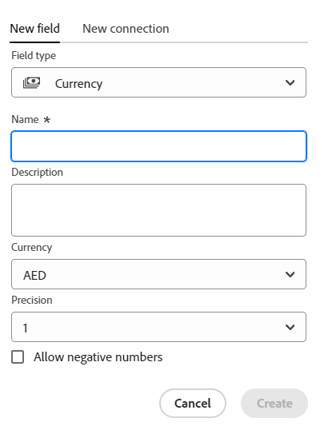

1. 「**新しいフィールド**」タブで次の情報を追加します。
   * **名前**: テーブルまたはレコードページに表示されるフィールドの名前。<!--ensure they updated this; and update the screen shot: it used to be "Label"-->
   * **説明**：フィールドに関する追加情報。フィールドの説明は、テーブル内のフィールドの列にカーソルを合わせたときや、レコードの詳細ページのフィールド名の横にある情報アイコンをクリックしたときに表示されます。
   * **通貨**：このフィールドに表示する通貨のタイプ。これは、国際標準化機構（ISO）に基づく通貨のリストです。
   * **Precision**: フィールドに記録する小数点以下桁の数。 6 桁まで表示できます。
   * **負の数を許可**：このフィールドで負の通貨の値を許可する場合は、このオプションを選択します。このオプションは、デフォルトで無効になっています。

   >[!NOTE]
   >
   >    「負の数を許可」を選択し、フィールドが関連付けられているレコードに負の値が格納されている場合、今後この設定の選択は解除できなくなります。

1. 「**作成**」をクリックします。

   新しい通貨フィールドは、レコードタイプに列として追加され、その値をレコードに関連付けることができます。

### チェックボックス

チェックボックスフィールドタイプを使用すると、レコードに単一のチェックボックスオプションを追加できます。このフィールドを使用して、特定のレコードの特定の属性またはステータスを示すことができます。例えば、各レコードのトラッキング完了、承認またはその他のバイナリ属性のフラグとして使用できます。

1. この記事の[最初からフィールドを作成する](#create-fields-from-scratch)の節の説明に従ってフィールドの作成を開始し、**チェックボックス**&#x200B;フィールドタイプを選択します。

   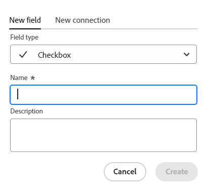

1. 「**新しいフィールド**」タブで次の情報を追加します。
   * **名前**: テーブルまたはレコードページに表示されるフィールドの名前。<!--ensure they updated this; and update the screen shot: it used to be "Label"-->
   * **説明**：フィールドに関する追加情報。フィールドの説明は、テーブル内のフィールドの列にカーソルを合わせたときや、レコードの詳細ページのフィールド名の横にある情報アイコンをクリックしたときに表示されます。
1. 「**作成**」をクリックします。

   新しいチェックボックスフィールドは、レコードタイプに列として追加され、その値をレコードに関連付けることができます。

### 式

数式フィールドは、レコードタイプの他のフィールドの既存の値と、既存の値の計算方法を示す関数を使用して、新しい値を生成します。

詳しくは、[式フィールドの概要](/help/quicksilver/planning/fields/formula-fields.md)を参照してください。

1. この記事の[フィールドを最初から作成する](#create-fields-from-scratch)の節の説明に従ってフィールドの作成を開始し、**式**&#x200B;フィールドタイプを選択します。

   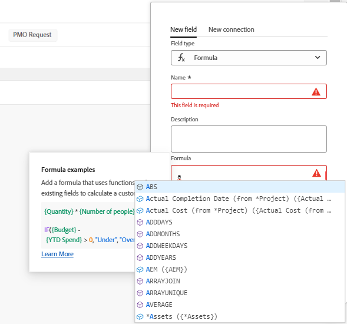

1. 次の情報を「**新規フィールド**」タブに追加します。

   * **名前**：新しいフィールドの名前を入力します。
   * **説明**：新しいフィールドに関する情報を追加します。 フィールドの説明は、テーブル内のフィールドの列にカーソルを合わせたときや、レコードの詳細ページのフィールド名の横にある情報アイコンをクリックしたときに表示されます。
   * **式**：少なくとも 1 文字を入力し始めて式にアクセスし、式がリストに表示されたら選択します。

1. 選択した式をクリックすると、定義が表示され、書式が表示されます。

   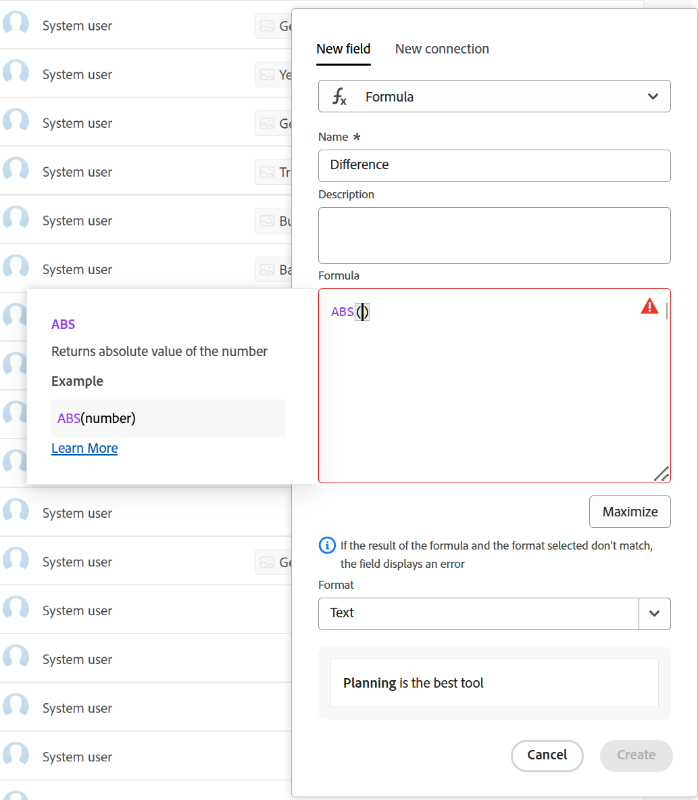

   サポートされている式について詳しくは、[式フィールドの概要](/help/quicksilver/planning/fields/formula-fields.md)を参照してください。


   >[!TIP]
   >
   >自分自身または共有フィールドへの循環参照を引き起こす可能性のある数式フィールドを編集または作成すると、警告メッセージが表示されます。 自身を参照する数式フィールドや、計算で参照される項目を参照する数式フィールドは保存できません。


1. Workfront Planningに表示されるフィールド名を追加して、数式で参照します。

   >[!NOTE]
   >
   >* 複数選択タイプのフィールドは、式に追加できません。
   >
   >
   >* Workfront Planningで表示される数式に含めるフィールドの名前を入力する必要があります。 Workfront テキストモードの構文とワイルドカードは、Workfront Planningの数式ではサポートされていません。
   >
   >* 現在のレコードタイプから最大4つのフィールド（およびオブジェクト）を参照できます。 例えば、アクティビティレコードタイプ（1）の数式フィールドを作成し、アクティビティがWorkfront プロジェクト（3）に接続されているCampaign レコードタイプ（2）に接続されている場合、アクティビティレコードタイプ用に作成する数式でプロジェクトの「予算」フィールド（4）を参照できます。
   >
   >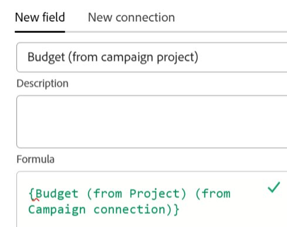
   >

1. （オプション）「**最大化**」をクリックして、大きな領域で数式ボックスを開きます。

   「数式」ボックスが大きなウィンドウで開きます。
1. （オプションおよび条件付き）大きな領域で数式ボックスを開いた場合は、**最小化**&#x200B;をクリックして、元の数式フィールドボックスに戻ります。

1. 「**形式**」フィールドで、次の選択肢から選択して、数式タイプフィールドに表示される結果の形式を特定します。

   * **テキスト**：数式フィールドの結果はプレーンテキストとして表示されます。
   * **数値**：数式フィールドの結果が数値として表示されます。
   * **パーセント**：数式フィールドの結果は、数字の後にパーセント記号が表示されます。
   * **通貨**：数式フィールドの結果は、通貨記号の前または後に数値として表示されます。
   * **タグ**：数式フィールドの結果は、オブジェクトの名前を持つタグとして表示されます。

     >[!TIP]
     >
     >配列を表示するフィールドのタグをお勧めします。 この場合、各配列メンバーは個別のタグとして表示されます。

     タグが選択された数式フィールド形式リストがハイライト表示されます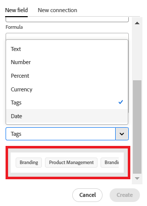

   * **日付**：数式フィールドの結果が日付として表示されます。

     結果がどのように表示されるかのプレビューは、**形式** フィールドの下に表示されます。

     >[!WARNING]
     >
     >数式の結果が選択した形式と一致しない場合、フィールドにはエラーメッセージが表示されます。

1. 「**作成**」をクリックします。

   新しい数式フィールドは、レコードタイプに列として追加され、その値をレコードに関連付けることができます。

### ユーザー

「人物」フィールドタイプを使用して、ユーザーをレコードに追加できます。 これは先行入力フィールドで、Workfront インスタンスに既に存在するユーザー<!--, roles, or teams-->のみを追加できます。

>[!TIP]
>
>* 「人物」フィールドにユーザーの名前を追加すると、そのユーザーのプライマリジョブの役割<span class="preview">とその電子メール </span>もフィールドに表示されます。 ユーザーの電子メールを表示するには、アクセスレベルのUsers オブジェクトで「連絡先情報を表示」設定を有効にする必要があります。
>
>* 人物フィールドは、リクエストフォームビルダーで参照（または接続）フィールドタイプとして表示されます。
>
>詳しくは、[Adobe Workfront Planning](/help/quicksilver/planning/requests/create-request-form.md)でのリクエストフォームの作成と管理を参照してください。

1. この記事の[最初からフィールドを作成する](#create-fields-from-scratch)の節の説明に従ってフィールドの作成を開始し、**ユーザー**&#x200B;フィールドタイプを選択します。

   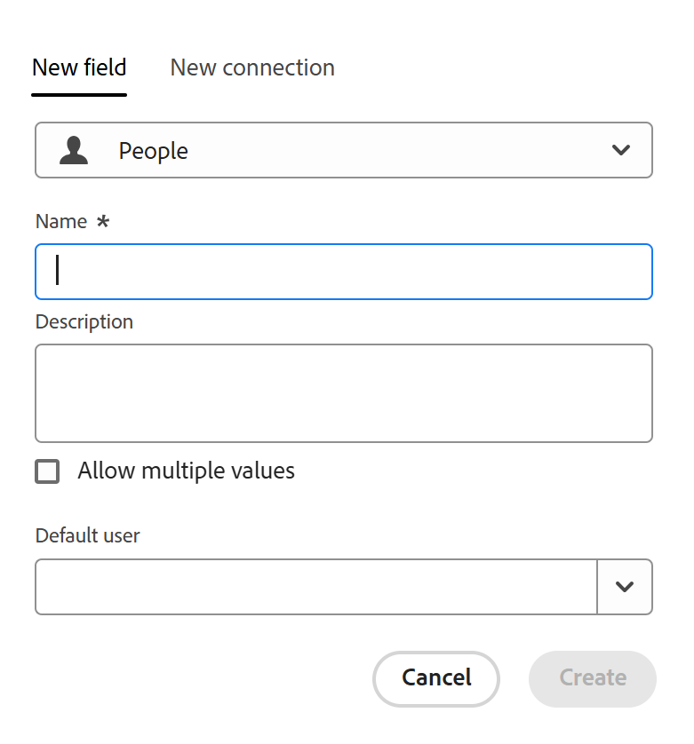

1. 「**新しいフィールド**」タブで次の情報を追加します。
   * **名前**: テーブルまたはレコードページに表示されるフィールドの名前。
   * **説明**：フィールドに関する追加情報。フィールドの説明は、テーブル内のフィールドの列にカーソルを合わせたときや、レコードの詳細ページのフィールド名の横にある情報アイコンをクリックしたときに表示されます。
   * **複数の値を許可**：ユーザーがこのフィールドに複数のユーザーを追加できるようにする場合は、このオプションを選択します。このオプションは、デフォルトで無効になっています。

   >[!NOTE]
   >
   >    「複数の値を許可」を選択し、フィールドが関連付けられたレコードに複数のユーザーが格納されている場合、今後このフィールドの編集時にこの設定の選択を解除することはできなくなります。

1. 「**作成**」をクリックします。

   新しいPeople-type フィールドは、レコードタイプに列として追加され、その値をレコードに関連付けることができます。

### 作成者

「作成者」フィールドタイプを使用すると、レコードを作成したユーザーをレコードに追加できます。これは読み取り専用フィールドであり、レコードの作成時にログインしたユーザーの名前が自動的に入力されます。

1. この記事の[最初からフィールドを作成する](#create-fields-from-scratch)の節の説明に従ってフィールドの作成を開始し、「**作成者**」フィールドタイプを選択します。

   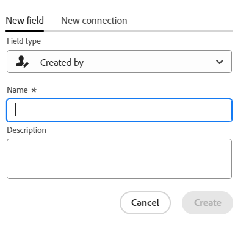

1. 「**新しいフィールド**」タブで次の情報を追加します。

   * **名前**: テーブルまたはレコードページに表示されるフィールドの名前。<!--this might change and they might prepopulate it with "Created by"-->
   * **説明**：フィールドに関する追加情報。フィールドの説明は、テーブル内のフィールドの列にカーソルを合わせたときや、レコードの詳細ページのフィールド名の横にある情報アイコンをクリックしたときに表示されます。

1. 「**作成**」をクリックします。

   新しい「作成者」タイプフィールドがレコードタイプに列として追加され、その値には各レコードを作成したユーザーの名前が事前入力されます。


### 作成日

「作成日」フィールドタイプを使用して、レコードが作成された日付をレコードに追加できます。 これは読み取り専用フィールドであり、レコードが作成された日付（およびオプションで時刻）が自動的に入力されます。

1. この記事の[フィールドを最初から作成する](#create-fields-from-scratch)の節の説明に従ってフィールドの作成を開始し、「**作成日**」フィールドタイプを選択します。

   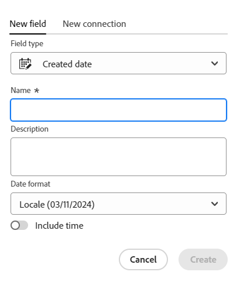を作成しました

   <!--check the image above - added bug fix for UI text changes-->

1. 「**新しいフィールド**」タブで次の情報を追加します。

   * **名前**: テーブルまたはレコードページに表示されるフィールドの名前。<!--this might change and they might prepopulate it with "Created date"-->
   * **説明**：フィールドに関する追加情報。フィールドの説明は、テーブル内のフィールドの列にカーソルを合わせたときや、レコードの詳細ページのフィールド名の横にある情報アイコンをクリックしたときに表示されます。
   * **日付形式**：次の形式から選択します。

      * **ロケール**：ブラウザーのロケールに一致します。
      * **標準**：例：2023/05/16
      * **長い形式**：例：2023年5月16日
      * **ヨーロッパ式**：例：16/05/2023
      * **ISO**：例：2023-05-16
   * **時刻を含める**: タイムスタンプを含める場合は、このオプションを選択します。 これはデフォルトでは選択されていません。 フィールドを保存した後は、時間を含めることはできません。

     次のオプションから選択します。

      * **24hr**：例：18:00
      * **12hr**：例：午後6:00

1. 「**作成**」をクリックします。

   新しい「作成日」タイプフィールドがレコードタイプに列として追加され、その値にはレコードが作成された日付（または日付と時刻）が事前入力されます。

### 最終変更者

「最終更新者」フィールドタイプを使用すると、レコードを最後に更新したユーザーをレコードに追加できます。これは読み取り専用フィールドであり、レコードが最後に更新されたときにログインしたユーザーの名前が自動的に入力されます。

1. この記事の[最初からフィールドを作成する](#create-fields-from-scratch)の節の説明に従ってフィールドの作成を開始し、「**最終更新者**」フィールドタイプを選択します。

   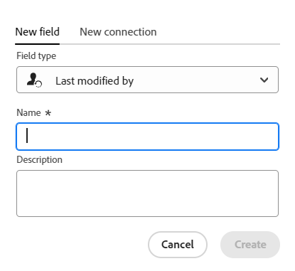

1. 「**新しいフィールド**」タブで次の情報を追加します。

   * **名前**: テーブルまたはレコードページに表示されるフィールドの名前。<!--this might change and they might prepopulate it with "Created by"-->
   * **説明**：フィールドに関する追加情報。フィールドの説明は、テーブル内のフィールドの列にカーソルを合わせたときや、レコードの詳細ページのフィールド名の横にある情報アイコンをクリックしたときに表示されます。

1. 「**作成**」をクリックします。

   新しい「最終更新者」タイプフィールドがレコードタイプに列として追加され、その値には、各レコードを最後に更新したユーザーの名前が事前入力されます。

### 最終変更日

「最終更新日」フィールドタイプを使用すると、レコードが最後に更新された日付をレコードに追加できます。これは読み取り専用フィールドであり、レコードが最後に更新された日付（およびオプションで時刻）を自動的に入力します。

1. この記事の[フィールドを最初から作成する](#create-fields-from-scratch)の節の説明に従ってフィールドの作成を開始し、「**最終更新日**」フィールドタイプを選択します。

   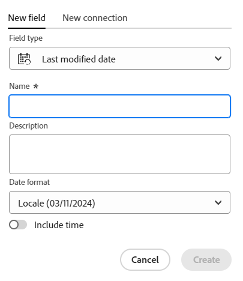

   <!--check the image above - added bug fix for UI text changes-->

1. 「**新しいフィールド**」タブで次の情報を追加します。

   * **名前**: テーブルまたはレコードページに表示されるフィールドの名前。<!--this might change and they might prepopulate it with "Created date"-->
   * **説明**：フィールドに関する追加情報。フィールドの説明は、テーブル内のフィールドの列にカーソルを合わせたときや、レコードの詳細ページのフィールド名の横にある情報アイコンをクリックしたときに表示されます。
   * **日付形式**：次の形式から選択します。

      * **ロケール**：ブラウザーのロケールに一致します。
      * **標準**：例：2023/05/16
      * **長い形式**：例：2023年5月16日
      * **ヨーロッパ式**：例：16/05/2023
      * **ISO**：例：2023-05-16
   * **時刻を含める**: タイムスタンプを含める場合は、このオプションを選択します。 これはデフォルトでは選択されていません。 フィールドを保存した後は、時間を含めることはできません。

     次のオプションから選択します。

      * **24hr**：例：18:00
      * **12hr**：例：午後6:00

1. 「**作成**」をクリックします。

   新しい「最終更新日タイプ」フィールドがレコードタイプの列として追加され、その値にはレコードが最後に更新された日付（または日付と時刻）が事前入力されます。

### 承認日

承認済み日付フィールドタイプを使用して、リクエストが承認され、レコードが作成された日付を追加できます。 これは読み取り専用のフィールドで、最後の承認者によってリクエストが承認された日付（およびオプションで時間）が自動的に入力されます。 この場合、承認日はレコードの作成日と一致する必要があります。

>[!TIP]
>
>承認済み日付フィールドには、承認者に関連付けられたリクエストフォームを送信して作成されたレコードに関する情報のみが入力されます。
>
>フォームが複数の承認者に関連付けられている場合、最終承認決定の日付のみが「承認日」フィールドに記録されます。

1. この記事の[フィールドを最初から作成する](#create-fields-from-scratch)の節の説明に従ってフィールドの作成を開始し、「**作成日**」フィールドタイプを選択します。

   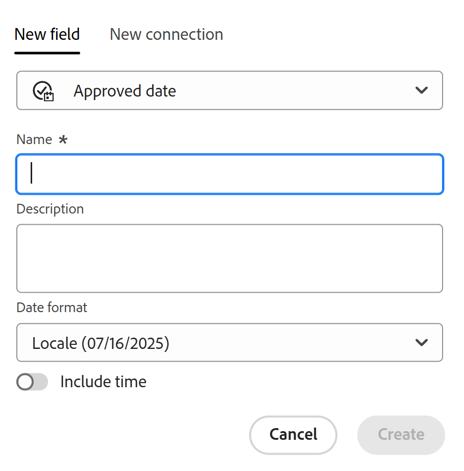

   1. 「**新しいフィールド**」タブで次の情報を追加します。

   * **名前**: テーブルまたはレコードページに表示されるフィールドの名前。
   * **説明**：フィールドに関する追加情報。フィールドの説明は、テーブル内のフィールドの列にカーソルを合わせたときや、レコードの詳細ページのフィールド名の横にある情報アイコンをクリックしたときに表示されます。
   * **日付形式**：次の形式から選択します。

      * **ロケール**：ブラウザーのロケールに一致します。
      * **標準**：例：2023/05/16
      * **長い形式**：例：2023年5月16日
      * **ヨーロッパ式**：例：16/05/2023
      * **ISO**：例：2023-05-16

   * **時刻を含める**: タイムスタンプを含める場合は、このオプションを選択します。 これはデフォルトでは選択されていません。 フィールドを保存した後は、時間を含めることはできません。

     次のオプションから選択します。

      * **24hr**：例：18:00
      * **12hr**：例：午後6:00

1. 「**作成**」をクリックします。

   新しい「承認済み日付タイプ」フィールドが列としてレコードタイプに追加され、その値には、レコードが承認者に関連付けられたリクエストを送信して作成された場合、レコードリクエストが承認された日付（または日時）が事前入力されます。

### 承認者

「承認済み」フィールドタイプを使用して、リクエストを最後に承認したユーザーを追加し、レコードを作成できます。 これは読み取り専用のフィールドで、レコードを作成するリクエストを承認したユーザーの名前が自動的に入力されます。

>[!TIP]
>
>「承認者」フィールドには、承認者に関連付けられたリクエストフォームを送信して作成したレコードに対してのみ、情報が入力されます。
>
>フォームが複数の承認者に関連付けられている場合、すべての承認者の名前は、コンマで区切られた「承認日」フィールドに記録されます。

1. この記事の「[&#x200B; ゼロからフィールドを作成](#create-fields-from-scratch)」の節で説明されているようにフィールドの作成を開始し、**承認者** フィールドタイプを選択します。

   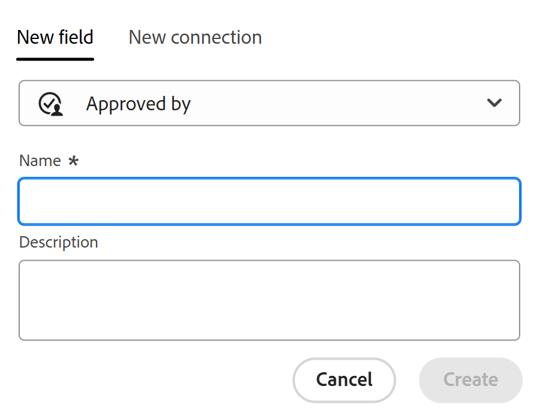

1. 「**新しいフィールド**」タブで次の情報を追加します。

   * **名前**: テーブルまたはレコードページに表示されるフィールドの名前。
   * **説明**：フィールドに関する追加情報。フィールドの説明は、テーブル内のフィールドの列にカーソルを合わせたときや、レコードの詳細ページのフィールド名の横にある情報アイコンをクリックしたときに表示されます。

1. 「**作成**」をクリックします。

   新しい「承認済みタイプ」フィールドがレコードタイプに列として追加され、その値には、各レコードを最後に変更したユーザーの名前が事前入力されます。

<span class="preview">

## レコード ID

「レコード ID」フィールドタイプを使用すると、各レコードのシステム生成の読み取り専用IDを表示できます。

レコード ID フィールドを作成すると、英数字が自動的に入力されます。 数式フィールドやAPI統合で使用し、各レコードを一意に識別できます。

レコード ID フィールドの値を手動で変更することはできません。

1. この記事の「[&#x200B; ゼロからフィールドを作成](#create-fields-from-scratch)」の節で説明されているようにフィールドの作成を開始し、**レコード ID** フィールドタイプを選択します。

   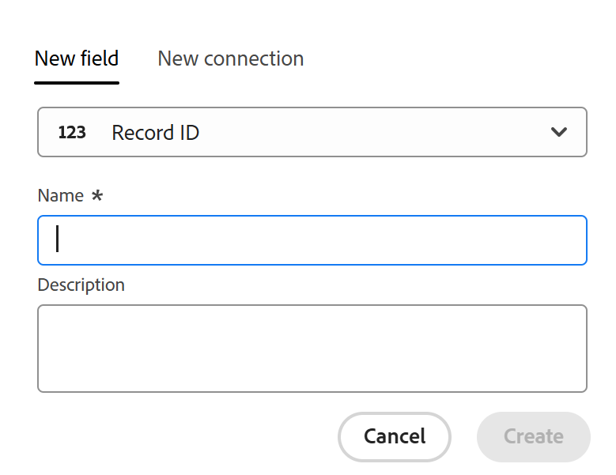

1. 「**新しいフィールド**」タブで次の情報を追加します。

   * **名前**: テーブルまたはレコードページに表示されるフィールドの名前。
   * **説明**：フィールドに関する追加情報。フィールドの説明は、テーブル内のフィールドの列にカーソルを合わせたときや、レコードの詳細ページのフィールド名の横にある情報アイコンをクリックしたときに表示されます。

1. 「**作成**」をクリックします。

   新しいレコード ID タイプ フィールドは、レコードタイプに列として追加され、その値には英数字が事前に入力されます。

</span>


<!--

## Object field type

You can use the Object field type when you need to store several fields that might include several pieces of information. For example, you can store the source, code, error message, or details of an object in one field. In this case, instead of having several separate single-line text fields for that, you can use an Object field to store all information in one place. 

For example, when using an Object-type field, you can store the following type of information: 

```
"{
""source"": ""string"",
""code"": ""string"",
""subCode"": ""string"",
""message"": ""string"",
""details"": ""string""
}"

```

You can also store an array of values in one field and you would rather rely on user input for each element of the array, instead of using a multi-select field type for the same purpose. For example, you can store information in the following format: 

`["EMEA", "APAC"] `

Consider the following when using Object-type fields:

* In addition to strings and arrays, you can store other value formats like HTML.
* There is no format validation for this field. 
* Object-type fields have a limit of 10,000 characters.

Create an Object field: 

1. Start creating a field as described in the section [Create fields from scratch](#create-fields-from-scratch) in this article, then select the **Created date** field type.

    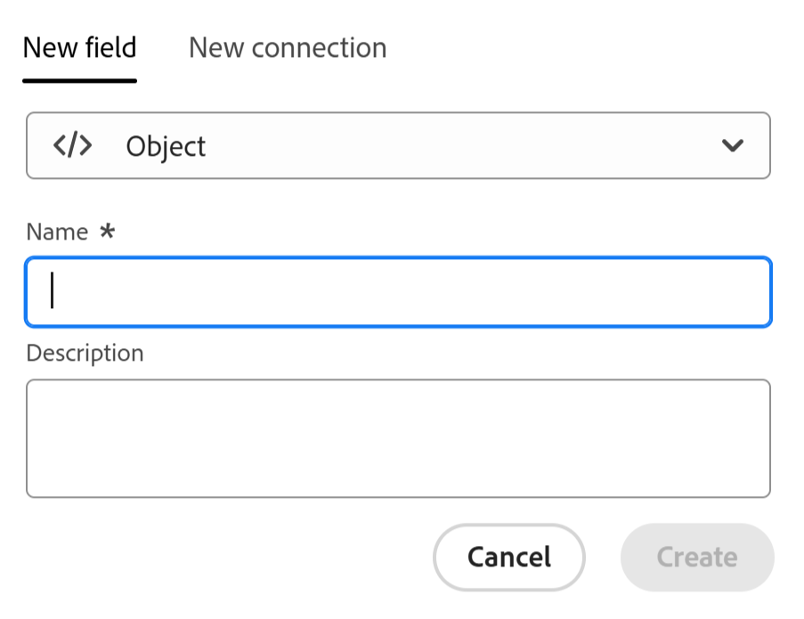

1. Add the following information in the **New field** tab:

     * **Name**: The name of the field, as it will appear in a table or the record page. (***********this might change and they might prepopulate it with "Created date"********)
     * **Description**: Additional information about the field. The description of a field displays when you hover over the field's column in a table, or when you click the information icon next to the field name in the record's details page.

1. Click **Create**.

    The new Object-type field is added as a column to the record type.

-->


