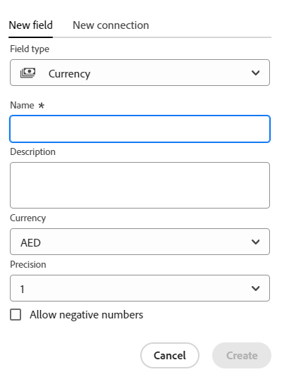
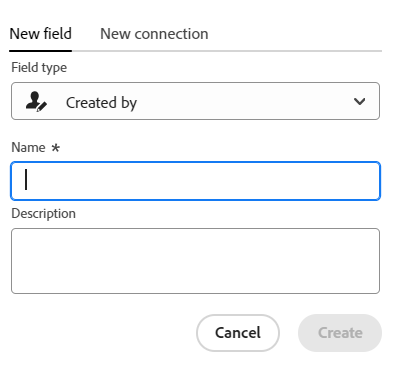
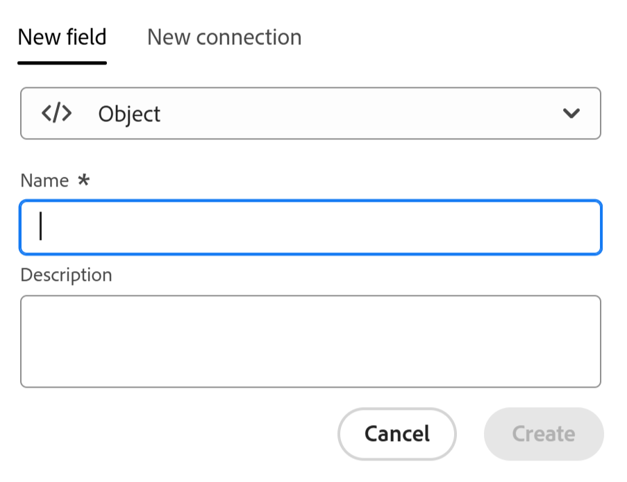

<!--Should the structure of this article be like this other one: https://experienceleague.adobe.com/docs/workfront/using/administration-and-setup/customize/custom-forms/custom-form-builder/use-the-custom-form-builder/add-a-custom-field-to-a-custom-form.html?lang=en ??-->

<!--will they add a way to create fields elsewhere than in a table?! - how will that change the structure of this article? -->

<!--Do we need this for FORMULAS: when we release permissions to RECORDS and we release referring lookup fields in a formula field, update considerations to say that lookup fields from linked records depends on the permissions to the record; if they have no permissions to view a linked record, they won't be able to use that records's lookup fields in a formula - not sure is needed??-->

# フィールドの作成

<span class="preview">このページでハイライト表示されている情報は、まだ一般に利用できない機能を示します。すべてのお客様が、プレビュー環境でのみ使用できます。 実稼動環境への毎月のリリースの後、迅速なリリースを有効にしたお客様には、実稼動環境でも同じ機能を利用できます。</span>

<span class="preview">迅速リリースについて詳しくは、[組織での迅速リリースを有効または無効にする](/help/quicksilver/administration-and-setup/set-up-workfront/configure-system-defaults/enable-fast-release-process.md)を参照してください。</span>


{{planning-important-intro}}

Adobe Workfront Planning では、レコードタイプのカスタムフィールドを作成できます。そしてフィールドを Workfront Planning レコードに関連付けて、レコードの情報を強化できます。

レコードタイプに関連付けるフィールドを作成するには、まずレコードタイプを作成する必要があります。詳しくは、[リクエストタイプの作成](/help/quicksilver/planning/architecture/create-record-types.md)を参照してください。

Workfront Planning では、次の方法でフィールドを作成できます。

* 最初から
* レコードタイプの接続による
* レコードタイプの作成による
* テンプレートからのワークスペースの作成による
* Excel または CSV ファイルを使用してレコードタイプを読み込む
* 既存のWorkfront フィールドのコピーを読み込む

Workfrontの計画フィールドについて詳しくは、[ フィールドの概要 ](/help/quicksilver/planning/fields/fields-overview.md) を参照してください。

## アクセス要件

+++ 展開すると、アクセス要件が表示されます。

この記事の手順を実行するには、次のアクセス権が必要です。

<table style="table-layout:auto"> 
<col> 
</col> 
<col> 
</col> 
<tbody> 
    <tr> 
<tr> 
<td> 
   <p> 製品</p> </td> 
   <td> 
   <ul><li><p> Adobe Workfront</p></li> 
   <li><p> Adobe Workfrontの計画<p></li></ul></td> 
  </tr>   
<tr> 
   <td role="rowheader"><p>Adobe Workfront プラン*</p></td> 
   <td> 
<p>次のいずれかのWorkfront プラン：</p> 
<ul><li>選択</li> 
<li>Prime</li> 
<li>Ultimate</li></ul> 
<p>Workfront Planning は、従来のWorkfront プランでは使用できません</p> 
   </td> 
<tr> 
   <td role="rowheader"><p>Adobe Workfront Planning パッケージ*</p></td> 
   <td> 
<p>任意 </p> 
<p>各Workfront Planning プランに含まれる内容について詳しくは、Workfront担当営業または販売店にお問い合わせください。 </p> 
   </td> 
 <tr> 
   <td role="rowheader"><p>Adobe Workfront platform</p></td> 
   <td> 
<p>Workfront Planning にアクセスするには、組織のWorkfront インスタンスをAdobe Unified Experience にオンボーディングする必要があります。</p> 
<p>詳しくは、<a href="/help/quicksilver/workfront-basics/navigate-workfront/workfront-navigation/adobe-unified-experience.md">Workfront の Adobe Unified Experience</a> を参照してください。 </p> 
   </td> 
   </tr> 
  </tr> 
  <tr> 
   <td role="rowheader"><p>Adobe Workfront プラン*</p></td> 
   <td><p> 標準 </p>
   <p>Workfront Planning は、従来のWorkfront ライセンスでは使用できません</p> 
  </td> 
  </tr> 
  <tr> 
   <td role="rowheader"><p>アクセスレベルの設定</p></td> 
   <td> <p>Adobe Workfront Planning に対するアクセスレベルのコントロールはありません。</p>   
</td> 
  </tr> 
<tr> 
   <td role="rowheader"><p>オブジェクト権限</p></td> 
   <td>   <p>ワークスペース <span class="preview"> およびレコードタイプ </span></a> に対する権限の管理 </p>  
   <p>システム管理者は、自分が作成したものでないものも含めて、すべてのワークスペースに対する権限を持っています。</p> </td> 
  </tr> 
<tr> 
   <td role="rowheader"><p>レイアウトテンプレート</p></td> 
   <td> <p>実稼動環境では、システム管理者を含むすべてのユーザーを、Planning を含むレイアウト・テンプレートに割り当てる必要があります。</p>
<p><span class="preview">プレビュー環境では、標準ユーザーとシステム管理者は、デフォルトで計画を有効にしています。</span></p></td> 
  </tr> 
</tbody> 
</table>

*Workfront のアクセス要件について詳しくは、[Workfront ドキュメントのアクセス要件](/help/quicksilver/administration-and-setup/add-users/access-levels-and-object-permissions/access-level-requirements-in-documentation.md)を参照してください。

+++

## フィールドを最初から作成 {#create-fields-from-scratch}

<!--in a table (not sure if this can be done elsewhere?!-->

<!--the first 3 steps are the same as in Import fields from Workfront-->

{{step1-to-planning}}

1. フィールドを作成するレコードがあるワークスペースをクリックします。

   ワークスペースが開き、レコードタイプが表示されます。

1. レコードタイプのカードをクリックします。

   そのレコードタイプに関連付けられている既存のすべてのレコードが、テーブルビューの行に表示されます。

   >[!TIP]
   >
   >    レコードが表示されない場合は、まだレコードが存在しないか、画面に表示される内容を制限するフィルターが適用されている可能性があります。

   レコードタイプに関連付けられたすべての既存のフィールドが、テーブルビューの列に表示されます。

   >[!TIP]
   >
   >    一部のフィールドが非表示になっている可能性があります。 「フィールド」をクリックし、テーブル表示で列として表示するフィールドの切り替えを有効にします。

1. テーブルビューの右上隅にある「**+**」アイコンをクリックします

   または

   任意の列のヘッダーにポインタを合わせ、フィールド名の後の下向き矢印をクリックしてから、「**左に挿入** または **右に挿入** をクリックして新しいフィールドを追加します。
1. 「**新しいフィールド**」タブで、「**フィールドタイプ**」ボックスからフィールドタイプを検索するか、次のフィールドタイプの中から選択します。

   「**新規フィールド**」タブで、関連するキーワードを使用して「**フィールドタイプ**」ボックスでフィールドタイプを検索するか、以下に示すフィールドタイプから選択します。

   >[!TIP]
   >
   >    「予算」と入力すると、「数値」と「通貨」のフィールドタイプが短いリストに表示されます。


   * [1 行テキスト](#single-line-text)
   * [段落](#paragraph)
   * [複数選択](#multi-select)
   * [単一選択](#single-select)
   * [日付](#date)
   * [数値](#number)
   * [パーセンテージ](#percentage)
   * [通貨](#currency)
   * [チェックボックス](#checkbox)
   * [式](#formula)
   * [ユーザー](#people)
   * [作成者](#created-by)
   * [作成日](#created-date)
   * [最終変更者](#last-modified-by)
   * [ 最終変更日 ](#last-modified-date)
     <!--* [Object](#object-field-type)-->

   >[!IMPORTANT]
   >
   >フィールドのフィールドタイプは、保存すると変更できません。

   <!--Add this to the IMPORTANT above and make it a NOTE - should do directly to Prod:
    * You can use any keyword that might be related to any of the field type names. For example, a search for "Budget" will display the Number or Currency field type.-->

1. 以下の節の説明に従って、各フィールドの追加に進みます。

### 1 行テキスト {#single-line-text}

1 行テキストフィールドは、限られた英数字の情報を取り込みます。例えば、所有者、関係者、チームまたは組織単位の情報を 1 行テキストフィールドに取り込むことができます。1 行テキストフィールドのコンテンツは、1,000 文字までです。<!-- used to be 250 but just tested with 1000 and it allowed this as a maximum. -->

1. この記事の[フィールドを最初から作成](#create-fields-from-scratch)の節の説明に従ってフィールドの作成を開始し、**1 行テキスト**&#x200B;フィールドタイプを選択します。

   

1. 「**新しいフィールド**」タブで次の情報を追加します。
   * **名前**：テーブルまたはレコードの詳細ページに表示される、フィールドタイプの名前。<!--ensure they updated this; and update the screen shot: it used to be "Label"-->
   * **説明**：フィールドに関する追加情報。フィールドの説明は、テーブルのフィールドの列ヘッダーにポインタを合わせたり、レコードの詳細ページのフィールド名の横にある情報アイコンをクリックしたりすると表示されます。
1. 「**作成**」をクリックします。

   新しい単一行フィールドが列としてレコードタイプに追加され、その値をレコードに関連付けることができます。


### 段落 {#paragraph}

段落フィールドは、「説明」フィールドと同様に、レコードに関する追加の英数字情報を取り込みます。

>[!TIP]
>
>* 1 つのレコードタイプに対して最大 20 個の段落フィールドを持つことができます。
>
>* 段落フィールドのコンテンツは、10,000 文字までです。
>* リッチテキスト形式を使用して、テーブルビューやレコードの詳細ページに表示される際に、段落フィールドの内容を向上させることができます。詳しくは、[レコードの編集](/help/quicksilver/planning/records/edit-records.md)を参照してください。
>


1. この記事の[フィールドを最初から作成](#create-fields-from-scratch)の節の説明に従ってフィールドの作成を開始し、**段落**&#x200B;フィールドタイプを選択します。

   


1. 「**新しいフィールド**」タブで次の情報を追加します。
   * **名前**：テーブルまたはレコードの詳細ページに表示される、フィールドタイプの名前。<!--ensure they updated this; and update the screen shot: it used to be "Label"-->
   * **説明**：フィールドに関する追加情報。フィールドの説明は、テーブルのフィールド列にポインタを合わせたり、レコードの詳細ページのフィールド名の横にある情報アイコンをクリックしたりすると表示されます。
1. 「**作成**」をクリックします。

   新しい段落フィールドが列としてレコードタイプに追加され、その値をレコードに関連付けることができます。


### 複数選択 {#multi-select}

複数選択フィールドを使用すると、ドロップダウンメニューから複数のオプションを選択して、追加情報を任意の形式で取り込むことができます。

1. この記事の[フィールドを最初から作成](#create-fields-from-scratch)の節の説明に従ってフィールドの作成を開始し、**複数選択**&#x200B;フィールドタイプを選択します。

   


1. 「**新しいフィールド**」タブで次の情報を追加します。
   * **名前**：テーブルまたはレコードの詳細ページに表示される、フィールドタイプの名前。<!--ensure they updated this; and update the screen shot: it used to be "Label"-->
   * **説明**：フィールドに関する追加情報。フィールドの説明は、テーブルのフィールド列にポインタを合わせたり、レコードの詳細ページのフィールド名の横にある情報アイコンをクリックしたりすると表示されます。
   * **選択肢**：ユーザーがこのフィールドを更新する際に選択できるオプション。 各選択肢の名前には、数字と文字の両方を使用できます。
1. 「**選択肢を追加**」をクリックして、選択肢をさらに追加します。 複数選択フィールドに追加できる選択肢の数に制限はありません。
1. （オプション）各選択肢を希望の順序で手動でドラッグ＆ドロップするか、
   選択肢を自動的にアルファベット順に表示する場合は、「**A ～ Z の順に選択肢を並べ替える**」オプションを選択します。<!--Add this if they added this functionality: You cannot edit this option after you save the field.-->
1. （オプション）選択肢を削除するには、右側の「**x**」アイコンをクリックします。
1. 選択肢の左側にあるカラースウォッチをクリックしてカラーセレクターを展開し、各オプションの色をカスタマイズします。

1. **スウォッチ** をクリックして、定義済みの色を選択します

   または

   「**カスタム**」をクリックし、カラーピッカーまたは 16 進コードを使用してカスタムカラーを選択します。
1. カラーボックスの外側をクリックして閉じます。
1. 「**作成**」をクリックします。

   新しい複数選択フィールドが列としてレコードタイプに追加され、その値をレコードに関連付けることができます。

### 単一選択 {#single-select}

単一選択フィールドでは、ドロップダウンメニューから 1 つのオプションを選択することで、追加情報を任意の形式で取り込むことができます。

1. この記事の[フィールドを最初から作成](#create-fields-from-scratch)の節の説明に従ってフィールドの作成を開始し、**単一選択**&#x200B;というフィールドタイプを選択します。

   


1. 「**新しいフィールド**」タブで次の情報を追加します。
   * **名前**：テーブルまたはレコードの詳細ページに表示される、フィールドタイプの名前。<!--ensure they updated this; and update the screen shot: it used to be "Label"-->
   * **説明**：フィールドに関する追加情報。フィールドの説明は、テーブルのフィールド列にポインタを合わせたり、レコードの詳細ページのフィールド名の横にある情報アイコンをクリックしたりすると表示されます。
   * **選択肢**：フィールドを保存した後、ドロップダウンメニューから選択できるオプション。各選択肢の名前には、数字と文字の両方を使用できます。

1. 「**選択肢を追加**」をクリックして、選択肢をさらに追加します。 単一選択フィールドに追加できる選択肢の数に制限はありません。
1. （オプション）各選択肢を希望の順序で手動でドラッグ＆ドロップするか、選択肢を自動的にアルファベット順に表示する場合は、「**A ～ Z の順に選択肢を並べ替える**」オプションを選択します。<!--Add this if they added this functionality: You cannot edit this option after you save the field.-->
1. （オプション）選択肢を削除するには、右側の「**x**」アイコンをクリックします。
1. 選択肢の左側にあるカラースウォッチをクリックしてカラーセレクターを展開し、各オプションの色をカスタマイズします。
1. **スウォッチ** をクリックして、定義済みの色を選択します

   または

   「**カスタム**」をクリックし、カラーピッカーまたは 16 進コードを使用してカスタムカラーを選択します。

1. カラーボックスの外側をクリックして閉じます。
1. 「**作成**」をクリックします。

   新しい単一選択フィールドが列としてレコードタイプに追加され、その値をレコードに関連付けることができます。

### 日付 {#date}

日付フィールドを使用すると、追加情報を日時形式で取り込むことができます。

1. この記事の[フィールドを最初から作成](#create-fields-from-scratch)の節の説明に従ってフィールドの作成を開始し、**日付**&#x200B;フィールドタイプを選択します。

   


1. 「**新しいフィールド**」タブで次の情報を追加します。
   * **名前**：テーブルまたはレコードページに表示される、フィールドタイプの名前。<!--ensure they updated this; and update the screen shot: it used to be "Label"-->
   * **説明**：フィールドに関する追加情報。フィールドの説明は、テーブルのフィールド列にポインタを合わせたり、レコードの詳細ページのフィールド名の横にある情報アイコンをクリックしたりすると表示されます。
   * **日付形式**：このフィールドに表示する日付形式のタイプ。<!--update this casing - submitted bug for it-->

     次の形式から選択します。
      * **ロケール**：ブラウザーのロケールに一致します。
      * **標準**：例：2023/05/16
      * **長い形式**：例：2023年5月16日
      * **ヨーロッパ式**：例：16/05/2023
      * **ISO**：例：2023-05-16
      * **時間を含める**：タイムスタンプを含める場合は、このオプションを選択します。 デフォルトでは選択されていません。 フィールドを安全にした後に時間を含めることはできません。

     次のオプションから選択します。

      * **24 時間**：例：18:00
      * **12 時間**：例：午後 6:00

1. 「**作成**」をクリックします。

   新しい日付フィールドが列としてレコードタイプに追加され、その値をレコードに関連付けることができます。

### 数値 {#number}

数値フィールドタイプは、情報を数値形式で取り込みます。

>[!TIP]
>
>数値フィールドは、リクエストフォームビルダーで 1 行のテキストフィールドタイプとして表示されます。
>
>ただし、フィールド形式は保持され、これらのフィールドの値は、リクエストの送信後に、レコードタイプとリクエストの詳細ページに数値として表示されます。
>>詳しくは、[Adobe Workfront Planning でのリクエストフォームの作成と管理 ](/help/quicksilver/planning/requests/create-request-form.md) を参照してください。


1. この記事の[フィールドを最初から作成](#create-fields-from-scratch)の節の説明に従ってフィールドの作成を開始し、**数値**&#x200B;フィールドタイプを選択します。

   
1. 「**新しいフィールド**」タブで次の情報を追加します。

   * **名前**：テーブルまたはレコードページに表示される、フィールドタイプの名前。
   * **説明**：フィールドに関する追加情報。フィールドの説明は、テーブルのフィールド列にポインタを合わせたり、レコードの詳細ページのフィールド名の横にある情報アイコンをクリックしたりすると表示されます。
   * **精度**：フィールドに記録する小数点以下の桁数です。 小数点以下 6 桁まで表示できます。
   * **負の数を許可**：このフィールドで負の数値を許可する場合は、このオプションを選択します。このオプションは、デフォルトで無効になっています。

   >[!NOTE]
   >
   >    「負の数を許可」を選択し、フィールドが関連付けられているレコードに負の値が格納されている場合、今後この設定の選択は解除できなくなります。

1. 「**作成**」をクリックします。

   新しい数値フィールドが列としてレコードタイプに追加され、その値をレコードに関連付けることができます。

### パーセンテージ {#percentage}

パーセンテージフィールドタイプでは、パーセント記号が後ろに付いた数値書式の情報を取り込みます。

>[!TIP]
>
>割合フィールドは、リクエストフォームビルダーで 1 行のテキストフィールドタイプとして表示されます。
>
>ただし、フィールド形式は保持され、これらのフィールドの値は、リクエストの送信後に、レコードタイプとリクエストの詳細ページにパーセンテージとして表示されます。
>>詳しくは、[Adobe Workfront Planning でのリクエストフォームの作成と管理 ](/help/quicksilver/planning/requests/create-request-form.md) を参照してください。


1. この記事の[フィールドを最初から作成する](#create-fields-from-scratch)の節の説明に従ってフィールドの作成を開始し、**パーセント**&#x200B;フィールドタイプを選択します。

   

1. 「**新しいフィールド**」タブで次の情報を追加します。
   * **名前**：テーブルまたはレコードページに表示される、フィールドタイプの名前。
   * **説明**：フィールドに関する追加情報。フィールドの説明は、テーブルのフィールド列にポインタを合わせたり、レコードの詳細ページのフィールド名の横にある情報アイコンをクリックしたりすると表示されます。
   * **精度**：フィールドに記録する小数点以下の桁数です。 小数点以下 6 桁まで表示できます。
   * **負の数を許可**：このフィールドで負の割合の値を許可する場合は、このオプションを選択します。このオプションは、デフォルトで無効になっています。

     >[!NOTE]
     >
     >「負の数を許可」を選択し、フィールドが関連付けられているレコードに負の値が格納されている場合、今後この設定の選択は解除できなくなります。

   * **表示方法**：ドロップダウンメニューから、テーブルビューでのパーセンテージ値の表示方法を選択します。 次のオプションから選択します。
      * **数値**：パーセント値は、数値の後にパーセント記号を付けて表示されます。
      * **棒グラフ**：割合の値は、割合の数値の横に棒グラフとして表示されます。 バーの塗りつぶしの色は、パーセント値を示します。 これはデフォルトの選択です。
      * **円**：割合の値は、割合の横に円のアウトラインとして表示されます。 円のアウトラインの塗りつぶしの色は、パーセント値を示します。

   >[!NOTE]
   >
   >* 「表示形式」フィールドでの選択は、テーブルビューに表示されるパーセンテージの値にのみ適用されます。 Workfront Planning の他の場所では、フィールドのパーセント値は、数値の後にパーセント記号が付いたように表示されます。 これは、他のレコードのテーブル ビューのルックアップ フィールドとして表示されるパーセンテージ タイプ フィールドにも適用されます。
   >* 後でフィールドを編集するときに、「別名で表示」の選択を変更できます。

1. 「**作成**」をクリックします。

   新しいパーセンテージ フィールドは、レコードの種類に列として追加され、その値をレコードに関連付けることができます。

### 通貨 {#currency}

通貨フィールドタイプでは、通貨記号が前に付いた数値書式の情報を取り込みます。

>[!TIP]
>
>通貨フィールドは、リクエストフォームビルダーで 1 行のテキストフィールドタイプとして表示されます。
>
>ただし、フィールド形式は保持され、これらのフィールドの値は、リクエストの送信後に、レコードタイプとリクエストの詳細ページに通貨として表示されます。
>>詳しくは、[Adobe Workfront Planning でのリクエストフォームの作成と管理 ](/help/quicksilver/planning/requests/create-request-form.md) を参照してください。

1. この記事の[フィールドを最初から作成する](#create-fields-from-scratch)の節の説明に従ってフィールドの作成を開始し、**通貨**&#x200B;フィールドタイプを選択します。

   

1. 「**新しいフィールド**」タブで次の情報を追加します。
   * **名前**：テーブルまたはレコードページに表示される、フィールドタイプの名前。<!--ensure they updated this; and update the screen shot: it used to be "Label"-->
   * **説明**：フィールドに関する追加情報。フィールドの説明は、テーブルのフィールド列にポインタを合わせたり、レコードの詳細ページのフィールド名の横にある情報アイコンをクリックしたりすると表示されます。
   * **通貨**：このフィールドに表示する通貨のタイプ。これは、国際標準化機構（ISO）に基づく通貨のリストです。
   * **精度**：フィールドに記録する小数点以下の桁数です。 6 桁まで表示できます。
   * **負の数を許可**：このフィールドで負の通貨の値を許可する場合は、このオプションを選択します。このオプションは、デフォルトで無効になっています。

   >[!NOTE]
   >
   >    「負の数を許可」を選択し、フィールドが関連付けられているレコードに負の値が格納されている場合、今後この設定の選択は解除できなくなります。

1. 「**作成**」をクリックします。

   新しい通貨フィールドは、列としてレコードタイプに追加され、その値をレコードに関連付けることができます。

### チェックボックス

チェックボックスフィールドタイプを使用すると、レコードに単一のチェックボックスオプションを追加できます。このフィールドを使用して、特定のレコードの特定の属性またはステータスを示すことができます。例えば、各レコードのトラッキング完了、承認またはその他のバイナリ属性のフラグとして使用できます。

1. この記事の[最初からフィールドを作成する](#create-fields-from-scratch)の節の説明に従ってフィールドの作成を開始し、**チェックボックス**&#x200B;フィールドタイプを選択します。

   

1. 「**新しいフィールド**」タブで次の情報を追加します。
   * **名前**：テーブルまたはレコードページに表示される、フィールドタイプの名前。<!--ensure they updated this; and update the screen shot: it used to be "Label"-->
   * **説明**：フィールドに関する追加情報。フィールドの説明は、テーブルのフィールド列にポインタを合わせたり、レコードの詳細ページのフィールド名の横にある情報アイコンをクリックしたりすると表示されます。
1. 「**作成**」をクリックします。

   新しいチェックボックスフィールドが、列としてレコードタイプに追加され、その値をレコードに関連付けることができます。

### 式

数式フィールドは、レコードタイプの他のフィールドの既存の値と、既存の値の計算方法を示す関数を使用して、新しい値を生成します。

詳しくは、[式フィールドの概要](/help/quicksilver/planning/fields/formula-fields.md)を参照してください。

1. この記事の[フィールドを最初から作成する](#create-fields-from-scratch)の節の説明に従ってフィールドの作成を開始し、**式**&#x200B;フィールドタイプを選択します。

   

1. 次の情報を「**新規フィールド**」タブに追加します。

   * **名前**：新しいフィールドの名前を入力します。
   * **説明**：新しいフィールドに関する情報を追加します。 フィールドの説明は、テーブルのフィールド列にポインタを合わせたり、レコードの詳細ページのフィールド名の横にある情報アイコンをクリックしたりすると表示されます。
   * **式**：少なくとも 1 文字を入力し始めて式にアクセスし、式がリストに表示されたら選択します。

1. 選択した式をクリックすると、定義が表示され、書式が表示されます。

   

   サポートされている式について詳しくは、[ 式フィールドの概要 ](/help/quicksilver/planning/fields/formula-fields.md) を参照してください。


   >[!TIP]
   >
   >式フィールドを編集または作成すると、その式フィールドまたは共有フィールドへの循環参照が発生する可能性があるという警告メッセージが表示されます。 自身を参照する数式フィールド、または計算内で参照されている項目を参照する数式フィールドを保存することはできません。


1. フィールド名をWorkfront Planning に表示されるとおりに追加して、式で参照します。

   >[!NOTE]
   >
   >* 複数選択タイプのフィールドは、式に追加できません。
   >
   >* 現在のレコードタイプから最大 4 つのフィールド（およびオブジェクト）を参照できます。 例えば、アクティビティレコードタイプ（1）の数式フィールドを作成し、そのアクティビティがWorkfront プロジェクト（3）に接続されたキャンペーンレコードタイプ（2）に接続されている場合、アクティビティのレコードタイプに対して作成する数式で、プロジェクトの予算フィールド（4）を参照できます。
   >
   >
   >

1. 「**フォーマット**」フィールドで、式タイプ・フィールドに表示される結果のフォーマットを次の中から選択します。

   * **テキスト**：式フィールドの結果は、プレーンテキストで表示されます。
   * **数値**：式フィールドの結果は数値として表示されます。
   * **割合**：式フィールドの結果は、数値の後にパーセント記号を付けて表示されます。
   * **通貨**：式フィールドの結果は、通貨記号の前後に数字で表示されます。
   * **タグ**：式フィールドの結果は、オブジェクトの名前を持つタグとして表示されます。

     >[!TIP]
     >
     >配列を表示するフィールドには、タグを使用することをお勧めします。 この場合、各配列メンバーは個別のタグとして表示されます。

     

   * **日付**：式フィールドの結果は日付として表示されます。

     結果がどのようなものになるかのプレビューが「**形式**」フィールドの下に表示されます。

     >[!WARNING]
     >
     >式の結果が選択した形式と一致しない場合、フィールドにはエラーメッセージが表示されます。

1. 「**作成**」をクリックします。

   新しい式フィールドが列としてレコードタイプに追加され、その値をレコードに関連付けることができます。

### ユーザー

ユーザーフィールドタイプを使用すると、レコードにユーザー <!--, job role, or team--> を追加できます。これは「先行入力」フィールドで <!--, roles, or teams-->Workfront インスタンスに既に存在するユーザーのみを追加できます。

>[!TIP]
>
>* ユーザーの名前を「人物」フィールドに追加すると、ユーザーの名前とプライマリ担当業務がフィールドに表示されます。
>
>* 人物フィールドは、リクエストフォームビルダーで参照（または接続）フィールドタイプとして表示されます。
>
>詳しくは、[Adobe Workfront Planning でのリクエストフォームの作成と管理 ](/help/quicksilver/planning/requests/create-request-form.md) を参照してください。

1. この記事の[最初からフィールドを作成する](#create-fields-from-scratch)の節の説明に従ってフィールドの作成を開始し、**ユーザー**&#x200B;フィールドタイプを選択します。

   

1. 「**新しいフィールド**」タブで次の情報を追加します。
   * **名前**：テーブルまたはレコードページに表示される、フィールドタイプの名前。
   * **説明**：フィールドに関する追加情報。フィールドの説明は、テーブルのフィールド列にポインタを合わせたり、レコードの詳細ページのフィールド名の横にある情報アイコンをクリックしたりすると表示されます。
   * **複数の値を許可**：ユーザーがこのフィールドに複数のユーザーを追加できるようにする場合は、このオプションを選択します。このオプションは、デフォルトで無効になっています。

   >[!NOTE]
   >
   >    「複数の値を許可」を選択し、フィールドが関連付けられたレコードに複数のユーザーが格納されている場合、今後このフィールドの編集時にこの設定の選択を解除することはできなくなります。

1. 「**作成**」をクリックします。

   新しい人物タイプ フィールドが列としてレコードタイプに追加され、その値をレコードに関連付けることができます。

### 作成者

「作成者」フィールドタイプを使用すると、レコードを作成したユーザーをレコードに追加できます。これは読み取り専用フィールドであり、レコードの作成時にログインしたユーザーの名前が自動的に入力されます。

1. この記事の[最初からフィールドを作成する](#create-fields-from-scratch)の節の説明に従ってフィールドの作成を開始し、「**作成者**」フィールドタイプを選択します。

   

1. 「**新しいフィールド**」タブで次の情報を追加します。

   * **名前**：テーブルまたはレコードページに表示される、フィールドタイプの名前。<!--this might change and they might prepopulate it with "Created by"-->
   * **説明**：フィールドに関する追加情報。フィールドの説明は、テーブルのフィールド列にポインタを合わせたり、レコードの詳細ページのフィールド名の横にある情報アイコンをクリックしたりすると表示されます。

1. 「**作成**」をクリックします。

   新しい「作成者」タイプフィールドがレコードタイプに列として追加され、その値には各レコードを作成したユーザーの名前が事前入力されます。


### 作成日

「作成日」フィールドタイプを使用して、レコードが作成された日付をレコードに追加できます。 これは読み取り専用フィールドであり、レコードが作成された日付（およびオプションで時刻）が自動的に入力されます。

1. この記事の[フィールドを最初から作成する](#create-fields-from-scratch)の節の説明に従ってフィールドの作成を開始し、「**作成日**」フィールドタイプを選択します。

   

   <!--check the image above - added bug fix for UI text changes-->

1. 「**新しいフィールド**」タブで次の情報を追加します。

   * **名前**：テーブルまたはレコードページに表示される、フィールドタイプの名前。<!--this might change and they might prepopulate it with "Created date"-->
   * **説明**：フィールドに関する追加情報。フィールドの説明は、テーブルのフィールド列にポインタを合わせたり、レコードの詳細ページのフィールド名の横にある情報アイコンをクリックしたりすると表示されます。
   * **日付形式**：次の形式から選択します。

      * **ロケール**：ブラウザーのロケールに一致します。
      * **標準**：例：2023/05/16
      * **長い形式**：例：2023年5月16日
      * **ヨーロッパ式**：例：16/05/2023
      * **ISO**：例：2023-05-16
   * **時間フィールドを含める**：タイムスタンプを含める場合はこのオプションを選択します。このオプションは、デフォルトでは選択されていません。<!--submitted a UI text change for this - check the UI-->

     次のオプションから選択します。

      * **24 時間**：例：18:00
      * **12 時間**：例：午後 6:00

1. 「**作成**」をクリックします。

   新しい「作成日」タイプフィールドがレコードタイプに列として追加され、その値にはレコードが作成された日付（または日付と時刻）が事前入力されます。


### 最終変更者

「最終更新者」フィールドタイプを使用すると、レコードを最後に更新したユーザーをレコードに追加できます。これは読み取り専用フィールドであり、レコードが最後に更新されたときにログインしたユーザーの名前が自動的に入力されます。

1. この記事の[最初からフィールドを作成する](#create-fields-from-scratch)の節の説明に従ってフィールドの作成を開始し、「**最終更新者**」フィールドタイプを選択します。

   

1. 「**新しいフィールド**」タブで次の情報を追加します。

   * **名前**：テーブルまたはレコードページに表示される、フィールドタイプの名前。<!--this might change and they might prepopulate it with "Created by"-->
   * **説明**：フィールドに関する追加情報。フィールドの説明は、テーブルのフィールド列にポインタを合わせたり、レコードの詳細ページのフィールド名の横にある情報アイコンをクリックしたりすると表示されます。

1. 「**作成**」をクリックします。

   新しい「最終更新者」タイプフィールドがレコードタイプに列として追加され、その値には、各レコードを最後に更新したユーザーの名前が事前入力されます。


### 最終変更日

「最終更新日」フィールドタイプを使用すると、レコードが最後に更新された日付をレコードに追加できます。これは読み取り専用フィールドであり、レコードが最後に更新された日付（およびオプションで時刻）を自動的に入力します。

1. この記事の[フィールドを最初から作成する](#create-fields-from-scratch)の節の説明に従ってフィールドの作成を開始し、「**最終更新日**」フィールドタイプを選択します。

   

   <!--check the image above - added bug fix for UI text changes-->

1. 「**新しいフィールド**」タブで次の情報を追加します。

   * **名前**：テーブルまたはレコードページに表示される、フィールドタイプの名前。<!--this might change and they might prepopulate it with "Created date"-->
   * **説明**：フィールドに関する追加情報。フィールドの説明は、テーブルのフィールド列にポインタを合わせたり、レコードの詳細ページのフィールド名の横にある情報アイコンをクリックしたりすると表示されます。
   * **日付形式**：次の形式から選択します。

      * **ロケール**：ブラウザーのロケールに一致します。
      * **標準**：例：2023/05/16
      * **長い形式**：例：2023年5月16日
      * **ヨーロッパ式**：例：16/05/2023
      * **ISO**：例：2023-05-16

   * **時間フィールドを含める**：タイムスタンプを含める場合はこのオプションを選択します。このオプションは、デフォルトでは選択されていません。<!--submitted a UI text change for this - check the UI-->

     次のオプションから選択します。

      * **24 時間**：例：18:00
      * **12 時間**：例：午後 6:00

1. 「**作成**」をクリックします。

   新しい「最終更新日タイプ」フィールドがレコードタイプの列として追加され、その値にはレコードが最後に更新された日付（または日付と時刻）が事前入力されます。

<!--

## Object field type

You can use the Object field type when you need to store several fields that might include several pieces of information. For example, you can store the source, code, error message, or details of an object in one field. In this case, instead of having several separate single-line text fields for that, you can use an Object field to store all information in one place. 

For example, when using an Object-type field, you can store the following type of information: 

```
"{
""source"": ""string"",
""code"": ""string"",
""subCode"": ""string"",
""message"": ""string"",
""details"": ""string""
}"

```

You can also store an array of values in one field and you would rather rely on user input for each element of the array, instead of using a multi-select field type for the same purpose. For example, you can store information in the following format: 

`["EMEA", "APAC"] `

Consider the following when using Object-type fields:

* In addition to strings and arrays, you can store other value formats like HTML.
* There is no format validation for this field. 
* Object-type fields have a limit of 10,000 characters.

Create an Object field: 

1. Start creating a field as described in the section [Create fields from scratch](#create-fields-from-scratch) in this article, then select the **Created date** field type.

    

1. Add the following information in the **New field** tab:

     * **Name**: The name of the field type, as it will appear in a table or the record page. (***********this might change and they might prepopulate it with "Created date"********)
     * **Description**: Additional information about the field. The description of a field displays when you hover over the field's column in a table, or when you click the information icon next to the field name in the record's details page.

1. Click **Create**.

    The new Object-type field is added as a column to the record type.

-->

## レコードタイプを連結してフィールドを作成する

2 つのレコードタイプ間で、または、1 つのレコードタイプと他のアプリケーションのオブジェクトタイプとの間で新しい接続を追加する際に、リンクされるレコードフィールドを作成できます。

Workfront Planning レコード・タイプの接続の詳細は、[ レコード・タイプの接続 ](/help/quicksilver/planning/architecture/connect-record-types.md) を参照してください。

<!--## Create fields by importing record types using an Excel or CSV file

For more information, see [Create record types](/help/quicksilver/planning/architecture/create-record-types.md).-->

## レコードタイプを作成してフィールドを作成する

レコードタイプを作成すると、新しいレコードタイプに関連付けられた複数のフィールドもデフォルトで作成されます。詳しくは、[レコードタイプの作成](/help/quicksilver/planning/architecture/create-record-types.md)を参照してください。

## テンプレートからワークスペースを作成することでフィールドを作成

テンプレートからワークスペースを作成する際に、Adobe Workfront Planning はレコードタイプ用のフィールドを作成します。

詳しくは、[ワークスペースの作成](/help/quicksilver/planning/architecture/create-workspaces.md)を参照してください。


## レコードタイプを CSV または Excel ファイルから読み込む際のフィールドの作成

CSV または Excel ファイルを使用してレコードタイプを読み込む際に、フィールドを読み込むことができます。

詳しくは、[リクエストタイプの作成](/help/quicksilver/planning/architecture/create-record-types.md)を参照してください。

## Workfrontから読み込んでフィールドを作成する

既存のWorkfront フィールドのコピーを読み込むことができます。

Workfrontからフィールドを読み込むと、Workfront Planning レコードタイプの各フィールドのコピーが作成されます。

フィールドをコピーした後、フィールドは互いに独立しており、情報を交換しません。

詳しくは、[Workfrontからのフィールドの読み込み ](/help/quicksilver/planning/fields/import-fields-from-workfront.md) を参照してください。


