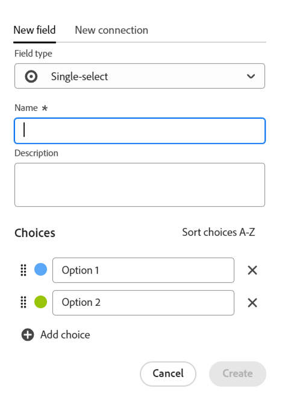
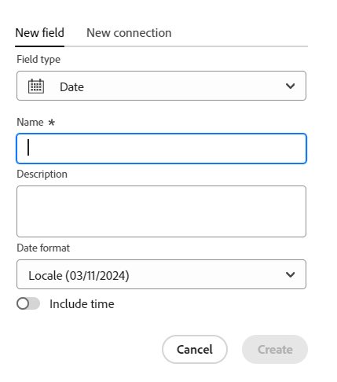

<!--Should the structure of this article be like this one: https://experienceleague.adobe.com/docs/workfront/using/administration-and-setup/customize/custom-forms/custom-form-builder/use-the-custom-form-builder/add-a-custom-field-to-a-custom-form.html?lang=en ??-->

<!--will they add a way to create fields elsewhere than in a table?! - how will that change the structure of this article? -->

<!--Do we need this for FORMULAS: when we release permissions to RECORDS and we release referring lookup fields in a formula field, update considerations to say that lookup fields from linked records depends on the permissions to the record; if they have no permissions to view a linked record, they won't be able to use that records's lookup fields in a formula - not sure is needed??-->

# フィールドの作成

{{planning-important-intro}}

Adobe Workfront Planning では、レコードタイプのカスタムフィールドを作成できます。そしてフィールドを Workfront Planning レコードに関連付けて、レコードの情報を強化できます。

レコードタイプに関連付けるフィールドを作成するには、まずレコードタイプを作成する必要があります。詳しくは、[リクエストタイプの作成](/help/quicksilver/planning/architecture/create-record-types.md)を参照してください。

Workfront Planning では、次の方法でフィールドを作成できます。

* 最初から
* レコードタイプの接続による
* レコードタイプの作成による
* テンプレートからのワークスペースの作成による
  <!--* By importing record types using an Excel or CSV file-->

Workfrontの計画フィールドについて詳しくは、[ フィールドの概要 ](/help/quicksilver/planning/fields/fields-overview.md) を参照してください。

## アクセス要件

+++ 展開すると、Workfront Planning のアクセス要件が表示されます。

Workfront Planning にアクセスするには、次のものが必要です：

<table style="table-layout:auto"> 
<col> 
</col> 
<col> 
</col> 
<tbody> 
    <tr> 
<tr> 
<td> 
   
 製品
 </td> 
   <td> 
   <ul><li>
 Adobe Workfront
</li> 
   <li>
 Adobe Workfrontの計画
</li></ul></td> 
  </tr>   
<tr> 
   <td role="rowheader">
Adobe Workfront プラン*
</td> 
   <td> 

次のいずれかのWorkfront プラン：
 
<ul><li>選択</li> 
<li>Prime</li> 
<li>Ultimate</li></ul> 

Workfront Planning は、従来のWorkfront プランでは使用できません
 
   </td> 
<tr> 
   <td role="rowheader">
Adobe Workfront計画*
</td> 
   <td> 

任意 
 

各Workfront Planning プランに含まれる内容の詳細については、<a href="https://business.adobe.com/products/workfront/pricing.html">Adobe Workfrontの価格とパッケージ </a> を参照してください。 
 
   </td> 
 <tr> 
   <td role="rowheader">
Adobe Workfront platform
</td> 
   <td> 

組織のWorkfront インスタンスは、Workfront Planning のすべての機能にアクセスできるように、Adobe Unified Experience にオンボーディングされる必要があります。
 

詳しくは、<a href="/help/quicksilver/workfront-basics/navigate-workfront/workfront-navigation/adobe-unified-experience.md">Workfront の Adobe Unified Experience</a> を参照してください。 
 
   </td> 
   </tr> 
  </tr> 
  <tr> 
   <td role="rowheader">
Adobe Workfront プラン*
</td> 
   <td>
 標準 

   
Workfront Planning は、従来のWorkfront ライセンスでは使用できません
 
  </td> 
  </tr> 
  <tr> 
   <td role="rowheader">
アクセスレベルの設定
</td> 
   <td> 
Adobe Workfront Planning に対するアクセスレベルのコントロールはありません。
   
</td> 
  </tr> 
<tr> 
   <td role="rowheader">
オブジェクト権限
</td> 
   <td>   
ワークスペースに対する管理権限</a> 
  
   
システム管理者は、自分が作成したものでないものも含めて、すべてのワークスペースに対する権限を持っています。
 </td> 
  </tr> 
<tr> 
   <td role="rowheader">
レイアウトテンプレート
</td> 
   <td> 
Workfront の管理者を含むすべてのユーザーには、メインメニューの Planning エリアを含むレイアウトテンプレートを割り当てる必要があります。 
 </td> 
  </tr> 
</tbody> 
</table>

*Workfront のアクセス要件について詳しくは、[Workfront ドキュメントのアクセス要件](/help/quicksilver/administration-and-setup/add-users/access-levels-and-object-permissions/access-level-requirements-in-documentation.md)を参照してください。

+++

<!--
OLD:

<table style="table-layout:auto">
 <col>
 </col>
 <col>
 </col>
 <tbody>
    <tr>
<tr>
<td>
   
 Product
 </td>
   <td>
   
 Adobe Workfront
 </td>
  </tr>  
 <td role="rowheader">
Adobe Workfront agreement
</td>
   <td>

Your organization must be enrolled in the early access stage for Workfront Planning 

   </td>
  </tr>
  <tr>
   <td role="rowheader">
Adobe Workfront plan
</td>
   <td>

Any

   </td>
  </tr>
  <tr>
   <td role="rowheader">
Adobe Workfront license*
</td>
   <td>
   
New: Standard
 
   
Current: Plan

  </td>
  </tr>
  
  <tr>
   <td role="rowheader">
Access level configurations
</td>
   <td> 
There are no access level control for Workfront Planning
  
</td>
  </tr>

  <tr>
   <td role="rowheader">
Permissions
</td>
   <td> 
Manage permissions to a workspace</a> 
  
   
System Administrators have permissions to all workspaces, including the ones they did not create.

</td>
  </tr>
<tr>
   <td role="rowheader">
Layout template
</td>
   <td> 
Your Workfront or group administrator must add the Planning area in your layout template. For information, see <a href="/help/quicksilver/planning/access/access-overview.md">Access overview</a>. 
  
</td>
  </tr>

 </tbody>
</table>

*For information, see [Access requirements in Workfront documentation](/help/quicksilver/administration-and-setup/add-users/access-levels-and-object-permissions/access-level-requirements-in-documentation.md). 

-->

## フィールドを最初から作成 {#create-fields-from-scratch}

<!--in a table (not sure if this can be done elsewhere?!-->

{{step1-to-planning}}

1. フィールドを作成するレコードがあるワークスペースをクリックします。

   ワークスペースが開き、レコードタイプが表示されます。

1. レコードタイプのカードをクリックします。

   そのレコードタイプに関連付けられている既存のすべてのレコードが、テーブルビューの行に表示されます。

   >[!TIP]
   >
   >    レコードが表示されない場合は、まだレコードが存在しないか、画面に表示される内容を制限するフィルターが適用されている可能性があります。

   レコードタイプに関連付けられたすべての既存のフィールドが、テーブルビューの列に表示されます。

   >[!TIP]
   >
   >    一部のフィールドが非表示になっている可能性があります。 「フィールド」をクリックし、テーブル表示で列として表示するフィールドの切り替えを有効にします。

1. テーブルビューの右上隅にある「**+**」アイコンをクリックします

   または

   任意の列のヘッダーにポインタを合わせ、フィールド名の後の下向き矢印をクリックしてから、「**左に挿入** または **右に挿入** をクリックして新しいフィールドを追加します。
1. 「**新しいフィールド**」タブで、「**フィールドタイプ**」ボックスからフィールドタイプを検索するか、次のフィールドタイプの中から選択します。

   * [1 行テキスト](#single-line-text)
   * [段落](#paragraph)
   * [複数選択](#multi-select)
   * [単一選択](#single-select)
   * [日付](#date)
   * [数値](#number)
   * [パーセンテージ](#percentage)
   * [通貨](#currency)
   * [チェックボックス](#checkbox)
   * [式](#formula)
   * [ユーザー](#people)
   * [作成者](#created-by)
   * [作成日](#created-date)
   * [最終変更者](#last-modified-by)
   * [最終変更日](#last-modified-date)

   >[!IMPORTANT]
   >
   >    フィールドのフィールドタイプは、保存すると変更できません。

1. 以下の節の説明に従って、各フィールドの追加に進みます。

### 1 行テキスト {#single-line-text}

1 行テキストフィールドは、限られた英数字の情報を取り込みます。例えば、所有者、関係者、チームまたは組織単位の情報を 1 行テキストフィールドに取り込むことができます。1 行テキストフィールドのコンテンツは、250 文字までです。<!-- asked Lilit if we can change this to "Single-line" since this can have numbers and text.-->

1. この記事の[フィールドを最初から作成](#create-fields-from-scratch)の節の説明に従ってフィールドの作成を開始し、**1 行テキスト**&#x200B;フィールドタイプを選択します。

   

1. 「**新しいフィールド**」タブで次の情報を追加します。
   * **名前**：テーブルまたはレコードの詳細ページに表示される、フィールドタイプの名前。<!--ensure they updated this; and update the screen shot: it used to be "Label"-->
   * **説明**：フィールドに関する追加情報。フィールドの説明は、テーブル内でフィールドの列ヘッダーにポインタを合わせると表示されます。
1. 「**作成**」をクリックします。

   新しい単一行フィールドが列としてレコードタイプに追加され、その値をレコードに関連付けることができます。

### 段落 {#paragraph}

段落フィールドは、「説明」フィールドと同様に、レコードに関する追加の英数字情報を取り込みます。

>[!TIP]
>
>* 段落フィールドのコンテンツは、1,000 文字まで可能です。
>
>* リッチテキスト形式を使用して、テーブルビューやレコードの詳細ページに表示される際に、段落フィールドの内容を向上させることができます。詳しくは、[レコードの編集](/help/quicksilver/planning/records/edit-records.md)を参照してください。

1. この記事の[フィールドを最初から作成](#create-fields-from-scratch)の節の説明に従ってフィールドの作成を開始し、**段落**&#x200B;フィールドタイプを選択します。

   

1. 「**新しいフィールド**」タブで次の情報を追加します。
   * **名前**：テーブルまたはレコードの詳細ページに表示される、フィールドタイプの名前。<!--ensure they updated this; and update the screen shot: it used to be "Label"-->
   * **説明**：フィールドに関する追加情報。フィールドの説明は、テーブル内でフィールドの列にポインタを合わせると表示されます。
1. 「**作成**」をクリックします。

   新しい段落フィールドが列としてレコードタイプに追加され、その値をレコードに関連付けることができます。

### 複数選択 {#multi-select}

複数選択フィールドを使用すると、ドロップダウンメニューから複数のオプションを選択して、追加情報を任意の形式で取り込むことができます。

1. この記事の[フィールドを最初から作成](#create-fields-from-scratch)の節の説明に従ってフィールドの作成を開始し、**複数選択**&#x200B;フィールドタイプを選択します。

   

1. 「**新しいフィールド**」タブで次の情報を追加します。
   * **名前**：テーブルまたはレコードの詳細ページに表示される、フィールドタイプの名前。<!--ensure they updated this; and update the screen shot: it used to be "Label"-->
   * **説明**：フィールドに関する追加情報。フィールドの説明は、テーブル内でフィールドの列にポインタを合わせると表示されます。
   * **選択肢**：フィールドを保存した後、ドロップダウンメニューから選択できるオプション。各選択肢の名前には、数字と文字の両方を使用できます。
1. 「**選択肢を追加**」をクリックして、必要な数だけ選択肢を追加します。複数選択フィールドに追加できる選択肢の数に制限はありません。
1. （オプション）各選択肢を希望の順序で手動でドラッグ＆ドロップするか、
   選択肢を自動的にアルファベット順に表示する場合は、「**A ～ Z の順に選択肢を並べ替える**」オプションを選択します。<!--Add this if they added this functionality: You cannot edit this option after you save the field.-->
1. （オプション）選択肢を削除するには、右側の「**x**」アイコンをクリックします。
1. 選択肢の左側にあるカラースウォッチをクリックしてカラーセレクターを展開し、各オプションの色をカスタマイズします。
1. 「**作成**」をクリックします。

   新しい複数選択フィールドが列としてレコードタイプに追加され、その値をレコードに関連付けることができます。

### 単一選択 {#single-select}

単一選択フィールドでは、ドロップダウンメニューから 1 つのオプションを選択することで、追加情報を任意の形式で取り込むことができます。

1. この記事の[フィールドを最初から作成](#create-fields-from-scratch)の節の説明に従ってフィールドの作成を開始し、**単一選択**&#x200B;というフィールドタイプを選択します。

   

1. 「**新しいフィールド**」タブで次の情報を追加します。
   * **名前**：テーブルまたはレコードの詳細ページに表示される、フィールドタイプの名前。<!--ensure they updated this; and update the screen shot: it used to be "Label"-->
   * **説明**：フィールドに関する追加情報。フィールドの説明は、テーブル内でフィールドの列にポインタを合わせると表示されます。
   * **選択肢**：フィールドを保存した後、ドロップダウンメニューから選択できるオプション。各選択肢の名前には、数字と文字の両方を使用できます。

1. 「**選択肢を追加**」をクリックして、必要な数だけ選択肢を追加します。単一選択フィールドに追加できる選択肢の数に制限はありません。
1. （オプション）各選択肢を希望の順序で手動でドラッグ＆ドロップするか、選択肢を自動的にアルファベット順に表示する場合は、「**A ～ Z の順に選択肢を並べ替える**」オプションを選択します。<!--Add this if they added this functionality: You cannot edit this option after you save the field.-->
1. （オプション）選択肢を削除するには、右側の「**x**」アイコンをクリックします。
1. 選択肢の左側にあるカラースウォッチをクリックしてカラーセレクターを展開し、各オプションの色をカスタマイズします。
1. 「**作成**」をクリックします。

   新しい単一選択フィールドが列としてレコードタイプに追加され、その値をレコードに関連付けることができます。

### 日付 {#date}

日付フィールドを使用すると、追加情報を日時形式で取り込むことができます。

1. この記事の[フィールドを最初から作成](#create-fields-from-scratch)の節の説明に従ってフィールドの作成を開始し、**日付**&#x200B;フィールドタイプを選択します。

   

1. 「**新しいフィールド**」タブで次の情報を追加します。
   * **名前**：テーブルまたはレコードページに表示される、フィールドタイプの名前。<!--ensure they updated this; and update the screen shot: it used to be "Label"-->
   * **説明**：フィールドに関する追加情報。フィールドの説明は、テーブル内でフィールドの列にポインタを合わせると表示されます。
   * **日付形式**：このフィールドに表示する日付形式のタイプ。<!--update this casing - submitted bug for it-->

     次の形式から選択します。
      * **ロケール**：ブラウザーのロケールに一致します。
      * **標準**：例：2023/05/16
      * **長い形式**：例：2023年5月16日
      * **ヨーロッパ式**：例：16/05/2023
      * **ISO**：例：2023-05-16
   * **時間フィールドを含める**：タイムスタンプを含める場合はこのオプションを選択します。このオプションは、デフォルトでは選択されていません。<!--update this setting name - submitted bug for it to be changed-->

     次のオプションから選択します。

      * **24 時間**：例：18:00
      * **12 時間**：例：午後 6:00

1. 「**作成**」をクリックします。

   新しい日付フィールドが列としてレコードタイプに追加され、その値をレコードに関連付けることができます。

### 数値 {#number}

数値フィールドタイプは、情報を数値形式で取り込みます。

1. この記事の[フィールドを最初から作成](#create-fields-from-scratch)の節の説明に従ってフィールドの作成を開始し、**数値**&#x200B;フィールドタイプを選択します。

   
1. 「**新しいフィールド**」タブで次の情報を追加します。

   * **名前**：テーブルまたはレコードページに表示される、フィールドタイプの名前。
   * **説明**：フィールドに関する追加情報。フィールドの説明は、テーブル内でフィールドの列にポインタを合わせると表示されます。
   * **精度**：フィールドに記録する小数点以下の桁数です。 6 桁まで表示できます。
   * **負の数を許可**：このフィールドで負の数値を許可する場合は、このオプションを選択します。このオプションは、デフォルトで無効になっています。

   >[!NOTE]
   >
   >    「負の数を許可」を選択し、フィールドが関連付けられているレコードに負の値が格納されている場合、今後この設定の選択は解除できなくなります。

1. 「**作成**」をクリックします。

   新しい数値フィールドが列としてレコードタイプに追加され、その値をレコードに関連付けることができます。

### パーセンテージ {#percentage}

パーセンテージフィールドタイプでは、パーセント記号が後ろに付いた数値書式の情報を取り込みます。

1. この記事の[フィールドを最初から作成する](#create-fields-from-scratch)の節の説明に従ってフィールドの作成を開始し、**パーセント**&#x200B;フィールドタイプを選択します。

   

1. 次の情報を「**新規フィールド**」タブに追加します。
   * **名前**：テーブルまたはレコードページに表示される、フィールドタイプの名前。
   * **説明**：フィールドに関する追加情報。フィールドの説明は、テーブル内でフィールドの列にポインタを合わせると表示されます。
   * **精度**：フィールドに記録する小数点以下の桁数です。 6 桁まで表示できます。
   * **負の数を許可**：このフィールドで負の割合の値を許可する場合は、このオプションを選択します。このオプションは、デフォルトで無効になっています。

   >[!NOTE]
   >
   >    「負の数を許可」を選択し、フィールドが関連付けられているレコードに負の値が格納されている場合、今後この設定の選択は解除できなくなります。

1. 「**作成**」をクリックします。

   新しいパーセンテージ フィールドは、レコードの種類に列として追加され、その値をレコードに関連付けることができます。

### 通貨 {#currency}

通貨フィールドタイプでは、通貨記号が前に付いた数値書式の情報を取り込みます。

1. この記事の[フィールドを最初から作成する](#create-fields-from-scratch)の節の説明に従ってフィールドの作成を開始し、**通貨**&#x200B;フィールドタイプを選択します。

   

1. 次の情報を「**新規フィールド**」タブに追加します。
   * **名前**：テーブルまたはレコードページに表示される、フィールドタイプの名前。<!--ensure they updated this; and update the screen shot: it used to be "Label"-->
   * **説明**：フィールドに関する追加情報。フィールドの説明は、テーブル内でフィールドの列にポインタを合わせると表示されます。
   * **通貨**：このフィールドに表示する通貨のタイプ。これは、国際標準化機構（ISO）に基づく通貨のリストです。
   * **精度**：フィールドに記録する小数点以下の桁数です。 6 桁まで表示できます。
   * **負の数を許可**：このフィールドで負の通貨の値を許可する場合は、このオプションを選択します。このオプションは、デフォルトで無効になっています。

   >[!NOTE]
   >
   >    「負の数を許可」を選択し、フィールドが関連付けられているレコードに負の値が格納されている場合、今後この設定の選択は解除できなくなります。

1. 「**作成**」をクリックします。

   新しい通貨フィールドは、列としてレコードタイプに追加され、その値をレコードに関連付けることができます。

### チェックボックス

チェックボックスフィールドタイプを使用すると、レコードに単一のチェックボックスオプションを追加できます。このフィールドを使用して、特定のレコードの特定の属性またはステータスを示すことができます。例えば、各レコードのトラッキング完了、承認またはその他のバイナリ属性のフラグとして使用できます。

1. この記事の[最初からフィールドを作成する](#create-fields-from-scratch)の節の説明に従ってフィールドの作成を開始し、**チェックボックス**&#x200B;フィールドタイプを選択します。

   

1. 次の情報を「**新規フィールド**」タブに追加します。
   * **名前**：テーブルまたはレコードページに表示される、フィールドタイプの名前。<!--ensure they updated this; and update the screen shot: it used to be "Label"-->
   * **説明**：フィールドに関する追加情報。フィールドの説明は、テーブル内でフィールドの列にポインタを合わせると表示されます。
1. 「**作成**」をクリックします。

   新しいチェックボックスフィールドが、列としてレコードタイプに追加され、その値をレコードに関連付けることができます。

### 式

数式フィールドは、レコードタイプの他のフィールドの既存の値と、既存の値の計算方法を示す関数を使用して、新しい値を生成します。

詳しくは、[式フィールドの概要](/help/quicksilver/planning/fields/formula-fields.md)を参照してください。

1. この記事の[フィールドを最初から作成する](#create-fields-from-scratch)の節の説明に従ってフィールドの作成を開始し、**式**&#x200B;フィールドタイプを選択します。

   

1. 次の情報を「**新規フィールド**」タブに追加します。

   * **名前**：新しいフィールドの名前を入力します。
   * **説明**：新しいフィールドに関する追加情報。
   * **式**：少なくとも 1 文字を入力し始めて式にアクセスし、式がリストに表示されたら選択します。

1. 選択した式をクリックすると、定義が表示され、書式が表示されます。

   

   サポートされている式について詳しくは、[ 式フィールドの概要 ](/help/quicksilver/planning/fields/formula-fields.md) を参照してください。

1. フィールド名をWorkfront Planning に表示されるとおりに追加して、式で参照します。

   >[!NOTE]
   >
   >* 複数選択タイプのフィールドは、式に追加できません。
   >
   >* 現在のレコードタイプから最大 4 レベル離れたフィールドを参照できます。 例えば、アクティビティ レコードタイプの数式フィールドを作成し、アクティビティが、Workfront プロジェクトに接続されたキャンペーンレコードタイプに接続された製品レコードタイプに接続されている場合、アクティビティ レコードタイプに対して作成している数式でプロジェクトの予算を参照できます。

<!--1. In the **Format** field, select from the following choices to identify the format of the result displayed in the formula-type field:

    * **Text**: The result of the formula field displays as plain text. 
    * **Number**: The result of the formula field displays as a number. 
    * **Percent**: The result of the formula field displays as a number followed by a percentage symbol.  
    * **Currency**: The result of the formula field displays as a number preceded or followed by a currency symbol.  
    * **Tags**: The result of the formula field displays as a tag with the object's name. 
    
        >[!TIP]
        >
        >Tags is the perfect format for fields that show arrays. In this case, each array member displays as a separate tag.

    * **Date**: The result of the formula field displays as a date. 

        A preview of what the result will look like displays under the **Format** field. 

        

        >[!WARNING]
        >
        >If the result of the formula does not match the selected format, the field will show an error message where it displays. 

-->
1. 「**作成**」をクリックします。

   新しい式フィールドが列としてレコードタイプに追加され、その値をレコードに関連付けることができます。

### ユーザー

ユーザーフィールドタイプを使用すると、レコードにユーザー <!--, job role, or team--> を追加できます。これは「先行入力」フィールドで <!--, roles, or teams-->Workfront インスタンスに既に存在するユーザーのみを追加できます。

1. この記事の[最初からフィールドを作成する](#create-fields-from-scratch)の節の説明に従ってフィールドの作成を開始し、**ユーザー**&#x200B;フィールドタイプを選択します。

   

1. 次の情報を「**新規フィールド**」タブに追加します。
   * **名前**：テーブルまたはレコードページに表示される、フィールドタイプの名前。
   * **説明**：フィールドに関する追加情報。フィールドの説明は、テーブル内でフィールドの列にポインタを合わせると表示されます。
   * **複数の値を許可**：ユーザーがこのフィールドに複数のユーザーを追加できるようにする場合は、このオプションを選択します。このオプションは、デフォルトで無効になっています。

   >[!NOTE]
   >
   >    「複数の値を許可」を選択し、フィールドが関連付けられたレコードに複数のユーザーが格納されている場合、今後このフィールドの編集時にこの設定の選択を解除することはできなくなります。

1. 「**作成**」をクリックします。

   新しい人物タイプ フィールドが列としてレコードタイプに追加され、その値をレコードに関連付けることができます。

### 作成者

「作成者」フィールドタイプを使用すると、レコードを作成したユーザーをレコードに追加できます。これは読み取り専用フィールドであり、レコードの作成時にログインしたユーザーの名前が自動的に入力されます。

1. この記事の[最初からフィールドを作成する](#create-fields-from-scratch)の節の説明に従ってフィールドの作成を開始し、「**作成者**」フィールドタイプを選択します。

   

1. 次の情報を「**新規フィールド**」タブに追加します。

   * **名前**：テーブルまたはレコードページに表示される、フィールドタイプの名前。<!--this might change and they might prepopulate it with "Created by"-->
   * **説明**：フィールドに関する追加情報。フィールドの説明は、テーブル内でフィールドの列にポインタを合わせると表示されます。

1. 「**作成**」をクリックします。

   新しい「作成者」タイプフィールドがレコードタイプに列として追加され、その値には各レコードを作成したユーザーの名前が事前入力されます。

### 作成日

「作成日」フィールドタイプを使用して、レコードが作成された日付をレコードに追加できます。 これは読み取り専用フィールドであり、レコードが作成された日付（およびオプションで時刻）が自動的に入力されます。

1. この記事の[フィールドを最初から作成する](#create-fields-from-scratch)の節の説明に従ってフィールドの作成を開始し、「**作成日**」フィールドタイプを選択します。

   

   <!--check the image above - added bug fix for UI text changes-->

1. 次の情報を「**新規フィールド**」タブに追加します。

   * **名前**：テーブルまたはレコードページに表示される、フィールドタイプの名前。<!--this might change and they might prepopulate it with "Created date"-->
   * **説明**：フィールドに関する追加情報。フィールドの説明は、テーブル内でフィールドの列にポインタを合わせると表示されます。
   * **日付形式**：次の形式から選択します。

      * **ロケール**：ブラウザーのロケールに一致します。
      * **標準**：例：2023/05/16
      * **長い形式**：例：2023年5月16日
      * **ヨーロッパ式**：例：16/05/2023
      * **ISO**：例：2023-05-16
   * **時間フィールドを含める**：タイムスタンプを含める場合はこのオプションを選択します。このオプションは、デフォルトでは選択されていません。<!--submitted a UI text change for this - check the UI-->

     次のオプションから選択します。

      * **24 時間**：例：18:00
      * **12 時間**：例：午後 6:00

1. 「**作成**」をクリックします。

   新しい「作成日」タイプフィールドがレコードタイプに列として追加され、その値にはレコードが作成された日付（または日付と時刻）が事前入力されます。

### 最終変更者

「最終更新者」フィールドタイプを使用すると、レコードを最後に更新したユーザーをレコードに追加できます。これは読み取り専用フィールドであり、レコードが最後に更新されたときにログインしたユーザーの名前が自動的に入力されます。

1. この記事の[最初からフィールドを作成する](#create-fields-from-scratch)の節の説明に従ってフィールドの作成を開始し、「**最終更新者**」フィールドタイプを選択します。

   

1. 次の情報を「**新規フィールド**」タブに追加します。

   * **名前**：テーブルまたはレコードページに表示される、フィールドタイプの名前。<!--this might change and they might prepopulate it with "Created by"-->
   * **説明**：フィールドに関する追加情報。フィールドの説明は、テーブル内でフィールドの列にポインタを合わせると表示されます。

1. 「**作成**」をクリックします。

   新しい「最終更新者」タイプフィールドがレコードタイプに列として追加され、その値には、各レコードを最後に更新したユーザーの名前が事前入力されます。

### 最終変更日

「最終更新日」フィールドタイプを使用すると、レコードが最後に更新された日付をレコードに追加できます。これは読み取り専用フィールドであり、レコードが最後に更新された日付（およびオプションで時刻）を自動的に入力します。

1. この記事の[フィールドを最初から作成する](#create-fields-from-scratch)の節の説明に従ってフィールドの作成を開始し、「**最終更新日**」フィールドタイプを選択します。

   

   <!--check the image above - added bug fix for UI text changes-->

1. 次の情報を「**新規フィールド**」タブに追加します。

   * **名前**：テーブルまたはレコードページに表示される、フィールドタイプの名前。<!--this might change and they might prepopulate it with "Created date"-->
   * **説明**：フィールドに関する追加情報。フィールドの説明は、テーブル内でフィールドの列にポインタを合わせると表示されます。
   * **日付形式**：次の形式から選択します。

      * **ロケール**：ブラウザーのロケールに一致します。
      * **標準**：例：2023/05/16
      * **長い形式**：例：2023年5月16日
      * **ヨーロッパ式**：例：16/05/2023
      * **ISO**：例：2023-05-16
   * **時間フィールドを含める**：タイムスタンプを含める場合はこのオプションを選択します。このオプションは、デフォルトでは選択されていません。<!--submitted a UI text change for this - check the UI-->

     次のオプションから選択します。

      * **24 時間**：例：18:00
      * **12 時間**：例：午後 6:00

1. 「**作成**」をクリックします。

   新しい「最終更新日タイプ」フィールドがレコードタイプの列として追加され、その値にはレコードが最後に更新された日付（または日付と時刻）が事前入力されます。

## レコードタイプを連結してフィールドを作成する

2 つのレコードタイプ間で、または、1 つのレコードタイプと他のアプリケーションのオブジェクトタイプとの間で新しい接続を追加する際に、リンクされるレコードフィールドを作成できます。

Workfront Planning レコードタイプの接続について詳しくは、[レコードタイプの接続](/help/quicksilver/planning/architecture/connect-record-types.md)を参照してください。

<!--## Create fields by importing record types using an Excel or CSV file

For more information, see [Create record types](/help/quicksilver/planning/architecture/create-record-types.md).-->

## レコードタイプを作成してフィールドを作成する

レコードタイプを作成すると、新しいレコードタイプに関連付けられた複数のフィールドもデフォルトで作成されます。詳しくは、[レコードタイプの作成](/help/quicksilver/planning/architecture/create-record-types.md)を参照してください。

## テンプレートからワークスペースを作成することでフィールドを作成

テンプレートからワークスペースを作成する際に、Adobe Workfront Planning はレコードタイプ用のフィールドを作成します。

詳しくは、[ワークスペースの作成](/help/quicksilver/planning/architecture/create-workspaces.md)を参照してください。