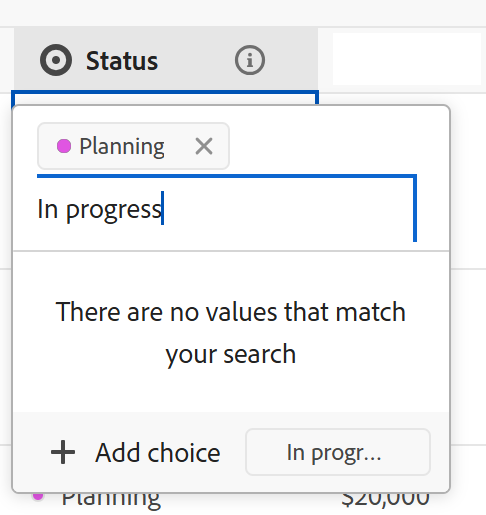

# フィールド設定を編集

<!--leave the choice value information in yellow till January 2026-->

このページでハイライト表示されている情報は、まだ一般に利用できない機能を示します。すべてのお客様が、プレビュー環境でのみ使用できます。 実稼動環境への毎月のリリースの後、迅速なリリースを有効にしたお客様には、実稼動環境でも同じ機能を利用できます。

迅速リリースについて詳しくは、[組織での迅速リリースを有効または無効にする](/help/quicksilver/administration-and-setup/set-up-workfront/configure-system-defaults/enable-fast-release-process.md)を参照してください。

{{planning-important-intro}}

Adobe Workfront Planning の既存のフィールドの設定を編集できます。

Adobe Workfront Planning フィールドの作成については、[フィールドの作成](/help/quicksilver/planning/fields/create-fields.md)を参照してください。

この記事では、Workfront Planning フィールドの設定を編集する方法について説明します。レコードのフィールド値の編集については、[レコードの編集](/help/quicksilver/planning/records/edit-records.md)を参照してください。

## アクセス要件

+++ 展開して、この記事の機能のアクセス要件を表示します。 

<table style="table-layout:auto"> 
<col> 
</col> 
<col> 
</col> 
<tbody> 
    <tr> 
<tr> 
</tr>   
<tr> 
   <td role="rowheader">
Adobe Workfront パッケージ
</td> 
   <td> 
<ul> 
<li>
任意のWorkfrontと任意の Planning パッケージ
</li>
または
<li>
任意のワークフローおよび任意の計画パッケージ
</li></ul>

各Workfront Planning パッケージに含まれる内容について詳しくは、Workfront アカウント担当者にお問い合わせください。 
 
   </td> 
  <tr> 
   <td role="rowheader">
Adobe Workfront プラン
</td> 
   <td>
標準

   </td> 
  </tr> 
  <tr> 
   <td role="rowheader">
オブジェクト権限
</td> 
   <td>   
ワークスペースに対する権限の管理
  
   
システム管理者は、作成しなかったワークスペースも含め、すべてのワークスペースに対する権限を持っています。
  </td> 
  </tr>  
</tbody> 
</table>

Workfrontのアクセス要件について詳しくは、[Workfront ドキュメントのアクセス要件 ](/help/quicksilver/administration-and-setup/add-users/access-levels-and-object-permissions/access-level-requirements-in-documentation.md) を参照してください。

+++     

<!--Old:

<table style="table-layout:auto"> 
<col> 
</col> 
<col> 
</col> 
<tbody> 
    <tr> 
<tr> 
<td> 
   
 Products
 </td> 
   <td> 
   <ul><li>
 Adobe Workfront
</li> 
   <li>
 Adobe Workfront Planning
</li></ul></td> 
  </tr>   
<tr> 
   <td role="rowheader">
Adobe Workfront plan*
</td> 
   <td> 

Any of the following Workfront plans:
 
<ul><li>Select</li> 
<li>Prime</li> 
<li>Ultimate</li></ul> 

Workfront Planning is not available for legacy Workfront plans
 
   </td> 
<tr> 
   <td role="rowheader">
Adobe Workfront Planning package*
</td> 
   <td> 

Any 
 

For more information about what is included in each Workfront Planning plan, contact your Workfront account manager. 
 
   </td> 
 <tr> 
   <td role="rowheader">
Adobe Workfront platform
</td> 
   <td> 

Your organization's instance of Workfront must be onboarded to the Adobe Unified Experience to be able to access Workfront Planning.
 

For more information, see <a href="/help/quicksilver/workfront-basics/navigate-workfront/workfront-navigation/adobe-unified-experience.md">Adobe Unified Experience for Workfront</a>. 
 
   </td> 
   </tr> 
  </tr> 
  <tr> 
   <td role="rowheader">
Adobe Workfront license*
</td> 
   <td>
 Standard 

   
Workfront Planning is not available for legacy Workfront licenses
 
  </td> 
  </tr> 
  <tr> 
   <td role="rowheader">
Access level configuration
</td> 
   <td> 
There are no access level controls for Adobe Workfront Planning
   
</td> 
  </tr> 
<tr> 
   <td role="rowheader">
Object permissions
</td> 
   <td>   
Manage permissions to a workspace and record type</a> 
  
   
System Administrators have permissions to all workspaces, including the ones they did not create
</td> 
  </tr> 
</tbody> 
</table> -->

## フィールド設定の編集に関する考慮事項

フィールドの設定を変更する前に、次の点を考慮する必要があります。

* フィールド設定は、レコードタイプ テーブルからのみ編集できます。
* レコードページまたはテーブルビュー以外の他のビューでは、フィールドの設定を編集できません。
* フィールドを保存した後は、フィールドタイプを編集できません。
* 数値、パーセンテージ、通貨のいずれかのフィールドについて、そのフィールドが添付されているレコードに既に負の値が格納されている場合は、選択済みの「負の数を許可」設定の選択を解除することはできません。
* フィールドを保存した後で、次のフィールド要素の設定を編集できます。

   * フィールドの名前または説明
   * 単一選択または複数選択フィールドのオプション。
   * 数式フィールドの式を指定します。

  >[!WARNING]
  >
  >数式が変更されたり、選択タイプ フィールドにオプションが追加または削除されたりすると、設定が変更されたフィールドに既に情報が保存されているレコードのデータが失われます。
  >
  >フィールドの設定を変更した場合、このデータ損失が発生する可能性があることを示す警告や表示はありません。
  >
  >フィールドの設定が変更されたという通知は他のユーザーには送信されません。

* 接続されたレコードから既存の参照フィールドを編集できます。
* この記事の [ フィールド設定の編集 ](#edit-field-settings-1) の節で説明したフィールドの編集に加えて、 テーブル ビューでレコードを編集するときに、フィールド値を更新しながら、単一選択フィールドまたは複数選択フィールドの選択肢を編集することができます。 詳しくは、この記事の [ テーブル ビューでレコードを編集するときに既存の選択フィールドに新しい選択肢を追加する ](#add-new-choices-to-an-existing-select-field-when-editing-records-in-the-table-view) を参照してください。

<!--at production - April 10, 2025 - remove the last bullet altogether-->

<!--this is not yet true, but it might come later:
* You can deselect Allow negative numbers option from a Number, Percentage, or Currency field after you save the field. 
-->

## フィールド設定を編集

{{step1-to-planning}}

1. レコード フィールドを編集するワークスペースをクリックします。

   ワークスペースが開き、ワークスペース内のすべてのレコードタイプがカードに表示されます。

1. レコードタイプのカードをクリックします。

   レコードタイプのページが開きます。

1. （条件付き） **テーブル表示** のタブをクリックします。

   そのレコードタイプに関連付けられている既存のすべてのレコードが、テーブルビューの行に表示されます。
1. 編集するフィールドの列ヘッダーにポインタを合わせ、フィールド名の後の下向き矢印をクリックして「**フィールドを編集**」をクリックします。

   または

   フィールドの列ヘッダーをダブルクリックします。

   

1. フィールドに関する情報を更新し、「**保存**」をクリックします。

   詳しくは、[フィールドの作成](/help/quicksilver/planning/fields/create-fields.md)を参照してください。

   <!--insert screen shot when finalized-->

   >[!TIP]
   >
   >* フィールドを保存した後は、フィールドタイプを更新できません。
   >
   >* フィールド設定（フィールドのオプションや数式）を変更すると、変更されたフィールドに既に情報が含まれているレコードの値は、リアルタイムで更新されます。 フィールド設定の変更によってトリガーされる値の変更に関する警告や監査ログはありません。 フィールドを表示するすべてのユーザーには、変更を加えた新しい値が直ちに表示されます。

   フィールド情報は、ワークスペースを表示するアクセス権を持つすべてのユーザーに対して更新されます。

1. （条件付き）接続されたレコードフィールドの場合は、**ルックアップフィールドを編集** をクリックし、接続されたレコードタイプにルックアップフィールドを追加または削除します。

   詳しくは、[レコードタイプの接続](/help/quicksilver/planning/architecture/connect-record-types.md)を参照してください。

## テーブル ビューでレコードを編集するときに、既存の選択フィールドに新しい選択肢を追加する

<!--some of this information is also available in Edit records article - update both when necessary-->

テーブル ビューでレコードを編集するときに、新しい選択肢を既存の単一選択フィールドまたは複数選択フィールドに追加できます。

>[!IMPORTANT]
>
>この節で説明する機能は、テーブル表示でのみ使用できます。 単一選択フィールドまたは複数選択フィールドが表示される他の領域では使用できません。

**例**

「ステータス」という単一選択フィールドに「新規」および「クローズ」の選択肢があり、「処理中」ステータスの選択肢を追加するとします。 次のいずれかの操作を行って、選択肢を追加できます。

* フィールドを編集しています。 詳しくは、この記事の「フィールド設定を編集 [ の節を参照し ](#edit-field-settings-1) ください。
* テーブル表示でレコードを編集する際に、新しいオプションを追加します（下図を参照）。

レコードの編集時に既存の選択フィールドに新しい選択肢を追加するには、次の手順を実行します。

1. レコードタイプのページに移動し、テーブル表示を開きます。
1. 選択肢を追加する単一選択フィールドまたは複数選択フィールドを、新しい列としてテーブル ビューに追加します。 詳しくは、[フィールドの作成](/help/quicksilver/planning/fields/create-fields.md)を参照してください。
1. フィールドのセルをダブルクリックして、フィールドをインラインで編集し始めます。
1. 追加する選択肢の名前を入力し、[**選択肢の追加**] をクリックします。

   

   新しい選択肢が単一選択フィールドにすぐに追加されます。

   <!--A new choice value is also added to each choice. You can use the choice values in API calls or other integrations. For information, see [Create fields](/help/quicksilver/planning/fields/create-fields.md). -->

