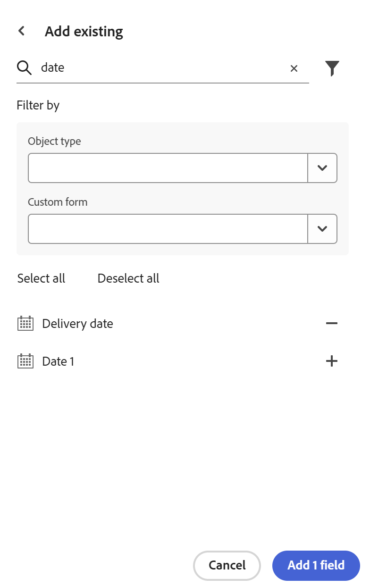

<!--add to TOC-->

# Adobe Workfront からのフィールドの読み込み

<!--
The highlighted information on this page refers to functionality not yet generally available. It is available only in the Preview environment for all customers. After the monthly releases to Production, the same features are also available in the Production environment for customers who enabled fast releases.    

For information about fast releases, see [Enable or disable fast releases for your organization](/help/quicksilver/administration-and-setup/set-up-workfront/configure-system-defaults/enable-fast-release-process.md). 
-->

{{planning-important-intro}}

既存のWorkfront フィールドのコピーを読み込むことができます。 Workfrontからフィールドを読み込むと、Workfront計画レコードタイプの各フィールドのコピーが作成されます。

## アクセス要件

+++ 展開して、この記事の機能のアクセス要件を表示します。 

<table style="table-layout:auto"> 
<col> 
</col> 
<col> 
</col> 
<tbody> 
    <tr> 
<tr> 
</tr>   
<tr> 
   <td role="rowheader">
Adobe Workfront パッケージ
</td> 
   <td> 

任意のWorkfrontおよびプランニングパッケージ
 
任意のワークフローとプランニングパッケージ

各Workfront計画パッケージに含まれる内容について詳しくは、Workfrontの担当者にお問い合わせください。 
 
   </td> 
  <tr> 
   <td role="rowheader">
Adobe Workfront プラン
</td> 
   <td>
標準

   </td> 
  </tr> 
  <tr> 
   <td role="rowheader">
オブジェクト権限
</td> 
   <td>   
ワークスペースに対する権限の管理
  
   
システム管理者は、作成しなかったワークスペースも含め、すべてのワークスペースに対する権限を持っています。
  </td> 
  </tr>  
</tbody> 
</table>

Workfrontのアクセス要件について詳しくは、[Workfront ドキュメント &#x200B;](/help/quicksilver/administration-and-setup/add-users/access-levels-and-object-permissions/access-level-requirements-in-documentation.md)のアクセス要件を参照してください。

+++  

<!--
Old:

<table style="table-layout:auto"> 
<col> 
</col> 
<col> 
</col> 
<tbody> 
    <tr> 
<tr> 
<td> 
   
 Products
 </td> 
   <td> 
   <ul><li>
 Adobe Workfront
</li> 
   <li>
 Adobe Workfront Planning
</li></ul></td> 
  </tr>   
<tr> 
   <td role="rowheader">
Adobe Workfront plan*
</td> 
   <td> 

Any of the following Workfront plans:
 
<ul><li>Select</li> 
<li>Prime</li> 
<li>Ultimate</li></ul> 

Workfront Planning is not available for legacy Workfront plans
 
   </td> 
<tr> 
   <td role="rowheader">
Adobe Workfront Planning package*
</td> 
   <td> 

Any 
 

For more information about what is included in each Workfront Planning plan, contact your Workfront account manager. 
 
   </td> 
 <tr> 
   <td role="rowheader">
Adobe Workfront platform
</td> 
   <td> 

Your organization's instance of Workfront must be onboarded to the Adobe Unified Experience to be able to access Workfront Planning.
 

For more information, see <a href="/help/quicksilver/workfront-basics/navigate-workfront/workfront-navigation/adobe-unified-experience.md">Adobe Unified Experience for Workfront</a>. 
 
   </td> 
   </tr> 
  </tr> 
  <tr> 
   <td role="rowheader">
Adobe Workfront license*
</td> 
   <td>
 Standard 

   
Workfront Planning is not available for legacy Workfront licenses
 
  </td> 
  </tr> 
  <tr> 
   <td role="rowheader">
Access level configuration
</td> 
   <td> 
There are no access level controls for Adobe Workfront Planning
   
</td> 
  </tr> 
<tr> 
   <td role="rowheader">
Object permissions
</td> 
   <td>   
Manage permissions to a workspace and record type </a> 
  
   
System Administrators have permissions to all workspaces, including the ones they did not create.
 </td> 
  </tr> 
</tbody> 
</table>
-->

## Workfrontからのフィールドの読み込みに関する考慮事項

* Workfront Planningでは、ネイティブまたはカスタムのWorkfront フィールドをレコードタイプに読み込むことができます。
* Workfront フィールドを読み込むと、同じフィールドのコピーが作成され、Workfront Planningのフィールド名が保持されます。 Workfront Planningにコピーした後、フィールドは元のWorkfront フィールドから独立しており、情報は共有されません。
<!--check this: * You do not need permissions or access to Workfront objects to be able to add their fields to Workfront Planning. -->
* 次のWorkfront オブジェクトからネイティブフィールドまたはカスタムフィールドを追加できます。
   * ポートフォリオ
   * プログラム
   * プロジェクト
   * タスク
   * イシュー
   * ドキュメント
   * 会社
   * グループ
   * ユーザー
   * 担当業務
   * 割り当て
   * 時間
   * 請求記録
     <!--Available only to Preview, but might not come to Prod:* Rate card - visible in Production but asking PM if it should be hidden-->
   * 費用
   * イテレーション
     <!--* Non-labor resource - - visible in Production but asking PM if it should be hidden-->
     <!--* Non-labour resource category - - visible in Production but asking PM if it should be hidden-->
* Workfront フィールドは、Workfront Planningで読み込まれた後、フィールドタイプが保持されない場合があります。

  次の表は、Workfrontのフィールドタイプと、対応するWorkfront計画フィールドタイプを示しています。

  | Workfront フィールドタイプ | Workfront計画フィールドタイプ |
  |------------------------------------------|-------------------------------|
  | テキスト形式の単一行テキスト | 1 行テキスト |
  | 数値形式の単一行テキスト | 数値 |
  | 通貨形式の単一行テキスト | 通貨 |
  | 段落 | 段落 |
  | 書式付きテキスト | 段落 |
  | 単一選択ドロップダウン | 単一選択 |
  | 複数選択ドロップダウン | 複数選択 |
  | ユーザー先行入力フィルターはサポートされていません | ユーザー |
  | 予定* | 式 |
  | 日付 | 日付 |
  | チェックボックスグループ | 複数選択 |
  | ラジオボタン | 複数選択 |

  * 計算フィールドは後日ご利用いただけます。
その他のすべてのWorkfront フィールドタイプは、Workfront Planningではサポートされていません。

## Workfront からのフィールドを読み込み

<!--the first 3 steps are the same as in Create fields-->

{{step1-to-planning}}

1. フィールドを作成するレコードタイプを持つワークスペースをクリックします。

   ワークスペースが開き、レコードタイプが表示されます。

1. レコードタイプのカードをクリックします。

   そのレコードタイプに関連付けられている既存のすべてのレコードが、テーブルビューの行に表示されます。

   >[!TIP]
   >
   >    一部のフィールドは非表示になっている可能性があります。 **フィールド**&#x200B;をクリックし、テーブルビューで列として表示するフィールドの切り替えスイッチを有効にします。

1. テーブルビューの右上隅にある&#x200B;**+** アイコンをクリックします

   または

   任意の列のヘッダーにカーソルを合わせ、フィールド名の後にある下向き矢印をクリックし、**左に挿入**&#x200B;または&#x200B;**右に挿入**&#x200B;をクリックして新しいフィールドを追加します。
1. 「**新規フィールド**」タブの右下隅にある「**既存の**&#x200B;を追加」をクリックします。<!--check UI - did they change this??-->

   

1. 検索領域に既存のWorkfront フィールドの名前を入力し、リストに表示されたら「**+**」をクリックします。
1. （オプション）別のフィールドを入力し、リストに表示されたら「**+**」をクリックします。
1. （オプション）「**フィルター**」アイコン「」をクリックし、次のいずれかのフィールドまたは両方のフィールドを更新します。

   * オブジェクトタイプ：フィールドを読み込むWorkfront オブジェクトタイプを選択します。
   * カスタムフォーム：Workfrontから1つまたは複数のカスタムフォームを選択します。 最初にオブジェクトタイプを選択せずにカスタムフォームを選択できます。
1. 「**+**」をクリックし、「**フィールドを追加**」をクリックします。
フィールドはテーブルビューとレコードの詳細ページに追加されます。

   >[!IMPORTANT]
   >
   >    任意のレコードタイプには、500件のフィールドの制限があります。 既存のフィールドと読み込まれたフィールドは、この制限に貢献します。

   追加されたフィールドは、Workfront フィールドのコピーであり、Workfrontの元のフィールドには接続されなくなりました。
