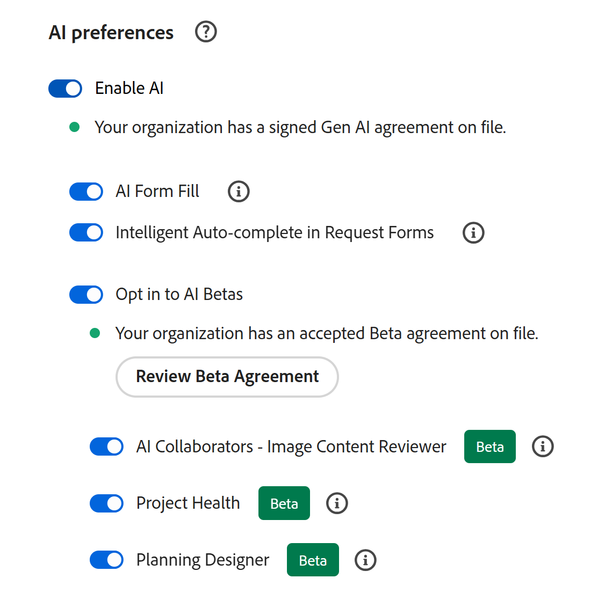

# Adobe Workfront計画Designerの基本を学ぶ

<!--remove the Beta tags in the screen shots on this page when this is released to GA - maybe March 2, 2026-->

>[!IMPORTANT]
>
>現在、Planning Designerは、Beta州のすべてのユーザーが利用できます。
>
>この記事の情報は、Adobe Workfront の追加機能である Adobe Workfront Planning に関するものです。
>
>Workfront Planning へのアクセス要件のリストについて詳しくは、[Adobe Workfront Planning へのアクセスの概要](/help/quicksilver/planning/access/access-overview.md)を参照してください。
> 
>Workfront計画の一般的な詳細については、[Adobe Workfront計画の基本を学ぶ](/help/quicksilver/planning/general/planning-overview.md)を参照してください。

AIを活用したAdobe Planning Designerを使用すると、ワークスペースとデータ構造を簡単に設定できます。 Planning Designerは、ワークスペースの作成と設定、フィールドと式の定義、レコードの管理、変更履歴の確認、カスタムビューの構築など、あらゆることをサポートしています。

直接またはAI アシスタントを通じて使用する場合でも、Planning Designerは、構造化され、連続性のある情報を構築および管理するための柔軟で強力な環境を提供します。

Workfront Planningについて詳しくは、次の記事を参照してください。

* [Adobe Workfront計画の一般的な情報と記事インデックス](/help/quicksilver/planning/planning-information.md)
* [Adobe Workfront Planning の基本を学ぶ](/help/quicksilver/planning/general/planning-overview.md)
* [Adobe Workfront Planning へのアクセスの概要](/help/quicksilver/planning/access/access-overview.md)

## アクセス要件<!--edit theses??-->

+++ 展開すると、この記事の機能のアクセス要件が表示されます。 

<table style="table-layout:auto"> 
<col> 
</col> 
<col> 
</col> 
<tbody> 
<tr> 
   <td role="rowheader">
Adobe Workfront パッケージ
</td> 
   <td> 

プランニングパッケージを含む任意のWorkfrontまたはワークフローパッケージ

スタンドアロン製品パッケージとしてのプランニング

   </td> </tr>
  </tr> 
  <tr> 
   <td role="rowheader">
Workfront ライセンス
</td> 
   <td>
標準
 
   
Workfront管理者は、組織のPlanning Designerを有効にする必要があります

  </td> 
  </tr> 
  <tr> 
   <td role="rowheader">
プランニングライセンス
</td> 
   <td>
標準
 
   
Workfront管理者は、組織のPlanning Designerを有効にする必要があります

  </td> 
  </tr> 
  <tr> 
   <td role="rowheader">
オブジェクト権限
</td> 
   <td>   
ワークスペースへの権限の管理</a> 
  
   
システム管理者は、作成しなかったワークスペースも含め、すべてのワークスペースに対する権限を持っています。
  
   </td> 
  </tr>  
</tbody> 
</table>

Workfrontのアクセス要件について詳しくは、[Workfront ドキュメント &#x200B;](/help/quicksilver/administration-and-setup/add-users/access-levels-and-object-permissions/access-level-requirements-in-documentation.md)のアクセス要件を参照してください。

+++

## 組織のPlanning Designerを有効にする

システム管理者は、組織のPlanning Designer Betaを有効にできます。 この設定をオンにすると、Workfront インスタンスの全員が計画領域でDesignerの計画機能を表示できるようになります。

1. Workfront管理者としてログインします。
1. **メインメニュー** をクリックし、**セットアップ**&#x200B;をクリックします。
1. **システム** > **環境設定** > **AI環境設定**&#x200B;に移動します。
1. **AIを有効にする**&#x200B;をオンにします。

   >[!NOTE]
   >
   >ベータ版のPlanning Designerを使用する場合、AI契約に同意する必要はありません。

1. AI Beta **の設定に** オプトインを有効にします。
1. 「**Planning Designer**」設定を有効にします。

   

1. 「**保存**」をクリックします。

   ワークスペースを作成または編集するためのPlanning Designer機能が、組織内のPlanningにアクセスできるすべてのユーザーで使用できるようになりました。

<!--

## Turn off the Planing Designer for your organization

After your Workfront administrator accepts the AI Assistant agreement, the Planning Designer is turned on for everyone in your organization, by default. 

To turn it off: 

1. Log in to Workfront as a System Administrator. 
1. Click **Main Menu**  in the upper-left corner of the screen, then click **Setup**.
1. Click **System** >  in the left panel, then go to the **AI preferences** area.
1. Turn off the **Planning Onboarding** setting.
1. Click **Save**.

    This removes the Planning Designer for all users in the system.

-->

<!--

## Enroll in the Closed Beta program for the Planning Designer

Currently, you can request to participate in the Closed Beta program for the Planning Designer by sending us an email to sargism@adobe.com.

After we receive the email, our Engineering team will turn on the Planning Designer in your Workfront instance. 

>[!IMPORTANT]
>
>Your company must first accept the AI Assistant agreement before the Planning Designer is available in your system. 

-->

## Planning Designerに関するフィードバックの送信

ベータプログラム中に、Planning Designerに関するフィードバックを送信できます。

1. Workfrontにログインし、左上隅の&#x200B;**メインメニュー** アイコン をクリックしてから、**計画**&#x200B;をクリックします。

   **計画**&#x200B;領域が開きます。

1. 「**AIを使用して作成**」をクリックします。<!--update this tag name when they change it-->

   **計画Designer** ウィンドウが開きます。

1. ページの下部にある&#x200B;**フィードバックを送信**&#x200B;をクリックします。
1. 提供されたスペースにフィードバックを追加し、**送信**&#x200B;をクリックします。
ご意見はエンジニアリングチームと製品チームに送信されます。

## Planning Designerに関する考慮事項

* Planning Designerにアクセスする前に、AI契約書を有効にする必要はありません。

* Planning Designerにアクセスするには、Beta契約書に署名する必要があります。

<!--
Sargis and Ashot  said these are not required: 

* To use the Planning Designer, you first need to enable AI for your organization. The following must be in place for the AI features to be available to everyone in your organization:

    * Workfront must make the AI features available for your organization.

        For details, see [Prerequisites to AI Assistant](/help/quicksilver/workfront-basics/ai-assistant/ai-assistant-overview.md#prerequisites-to-ai-assistant).
    * After Workfront makes the AI features available for your organization, the main Workfront administrator can access it. 

        For information, see [Configure basic information for your system](/help/quicksilver/administration-and-setup/get-started-wf-administration/configure-basic-info.md). 
    * The Workfront administrator must accept the Gen AI agreement, and then turn on AI and the Planning Designer for your organization. 

        For more information, see [Enable or disable AI Assistant](/help/quicksilver/workfront-basics/ai-assistant/enable-or-disable-assistant.md). 

-->

* Workfront管理者は、組織のPlanning Designerを有効にする必要があります。 この後、デフォルトでは、すべてのユーザーがPlanning Designerを使用できます。
* 組織がAI契約書に署名している場合、計画領域でAI アシスタントを使用すると、計画Designerで実行されたアクションもAI アシスタントで実行できます。
* 計画領域でAI アシスタントによって実行されるアクションまたは計画Designerによって実行されるアクションは、Workfront計画の権限とWorkfront アクセスレベルのコンテキストにあります。

  詳しくは、次の記事を参照してください。

  * [Adobe Workfront Planning での共有権限の概要](/help/quicksilver/planning/access/sharing-permissions-overview.md)
  * [Adobe Workfront Planning 使用時のライセンスタイプの概要](/help/quicksilver/planning/access/license-type-overview.md)

* AI アシスタントまたはPlanning Designerがユーザーの代わりに行った変更は、レコードの履歴パネルで追跡されます。

* 計画Designerによって行われたアクションは永続的であり、元に戻せない可能性があります。 例えば、フィールドの削除を元に戻すことはできません。 Designerが提案したすべての措置を承認する前に再検討する。

  >[!IMPORTANT]
  >
  >Planning Designerを使用してオブジェクトを作成、更新または削除する場合、取り消せないアクションに対してのみ確認を求めるプロンプトが表示されます。 例えば、レコードタイプやワークスペースの削除は元に戻せません。 レコードの削除は行われません。 Planning Designerは、レコードタイプまたはワークスペースを削除する場合にのみ、確認を求めます。

* Planning Designerを使用してワークスペースとレコードタイプを作成すると、ビューとフィールドも自動的に作成されます。

## Planning Designerで現在使用できる機能

Planning DesignerまたはAI アシスタントを使用して、次のいずれかのアクションを実行できます。

* ワークスペースの作成と設定

* ワークスペースの編集

* グローバルなレコードタイプの定義やワークスペースへの追加など、レコードタイプを作成します

* フィールドまたは数式フィールドのデザイン

* レコードの作成、削除、複製、復元

* レコードのフィールドを編集、更新、追加する

* レコードを他のレコードにリンク

* アクセス レコードの変更履歴

* カスタムビューの構築

* ドキュメントを読み込んでレコードを作成する

  例えば、組織図の画像を社内にアップロードし、その画像をもとにPlanning Designerでワークスペースを作成できます。

  読み込んだドキュメントからオブジェクトを作成できるのは、Planning Designerのみで、AI アシスタントでは使用できません。

  >[!IMPORTANT]
  >
  >.XLSX ファイル形式はサポートしていますが、Planning Designerを使用した大規模なレコード読み込みには使用できません。
  >現時点でかなりの数のレコードをインポートする必要がある場合は、Planningで使用可能な手動機能を使用してインポートすることをお勧めします。
  >
  >詳しくは、[CSVまたはExcel ファイルから情報を読み込んでレコードを作成](/help/quicksilver/planning/records/import-file-to-create-records.md)を参照してください。
  >ファイルタイプの制限については、[AIによるフォーム入力を使用してプロンプトまたはドキュメントを使用してリクエストを入力する](/help/quicksilver/manage-work/requests/create-requests/autofill-from-prompt-document.md)の「 アップロードしたドキュメントに基づいて提案を取得する」セクションを参照してください。

  <!--* Generate thumbnail and over image for a record (not available yet, maybe Q2) -->

## Planning Designerを使用したオブジェクトの作成または更新

特に指定がない限り、Workfront Planningでオブジェクトを作成または更新するには、Planning DesignerまたはAI アシスタントを使用します。

1. Workfrontにログインし、左上隅の&#x200B;**メインメニュー** アイコン をクリックしてから、**計画**&#x200B;をクリックします。

   **計画**&#x200B;領域が開きます。<!--update screen shot when they change the name of the button-->

   

1. 「**AIを使用して作成**」または「**ワークスペースを作成**」をクリックし、上部のプロンプトウィンドウを使用して、作成するワークスペースの種類を指定します。<!--update this when they change it to Generate with AI-->

   **計画Designer** ウィンドウが開きます。<!--remove the Beta tag here when this removes from Beta-->

   

1. 提供されたスペースで、AI アシスタントのプロンプトを入力し始め、完了したら「Enter」をクリックします。

   <!--add screen shot-->

   例えば、次のようなプロンプトを入力できます。

   * 5つのレコードタイプを含むワークスペースを作成して設定し、キャンペーンを管理できます

   * 今年度の各月のマーケティング施策の作成

   * マーケティングデザインワークスペースのステータスのキャンペーンフィールドを追加します

   * ステータスが「古い」のすべてのレコードを削除

   * すべての計画キャンペーンをアクティブのステータスに更新します

   * マーケティングデザインワークスペースでキャンペーンをペルソナに接続すると

   * 「バレンタインデー」キャンペーンの変更履歴の表示

   * マーケティングデザインワークスペースでキャンペーンのタイムラインビューを構築する

   * ドキュメントを読み込んでレコードを作成します。 読み込んだドキュメントからレコードを作成できるのは、Planning Designerのみで、AI アシスタントでは使用できません。

   <!--* Generate thumbnail and over image for a record (not available yet, maybe Q2) -->

1. 応答が成功したら、プロンプト領域に表示されるリンクに従って、リクエストのオブジェクトを作成、更新、レビューします。

   オブジェクトの作成に同意すると、変更内容がプロンプト領域の右側に表示されます。

   ワークスペース、レコードタイプ、フィールド、ビュー、レコードは、プロンプトの右側にあるプレビュー領域で表示できます。

   >[!TIP]
   >
   >確認を必要とせずに、すぐに作成されるオブジェクトもあります。

1. （オプション）追加のプロンプトを入力して、オブジェクトをさらに編集します。
1. （オプション）「**プレビュー画面を表示または非表示にする**」アイコン「」をクリックして、右側のプレビュー画面を開いたり閉じたりします。
1. **新しいタブでワークスペースを開くアイコン** をクリックして、新しいタブで更新しているワークスペースを開きます。
1. **閉じる** アイコン **X**&#x200B;をクリックして、プランニング Designerを閉じ、ワークスペース エリアを開きます。
1. （オプション）ワークスペースを編集するには、次のいずれかの操作を行います。

   * ワークスペースを開き、手動で変更します。 詳しくは、[ワークスペースの編集](/help/quicksilver/planning/architecture/edit-workspaces.md)を参照してください。
   * ワークスペースを開き、**AIで編集**&#x200B;をクリックします。 これでPlanning Designerが開きます。 上記の手順を繰り返して、AIを使用し、ワークスペースをさらに変更します。

