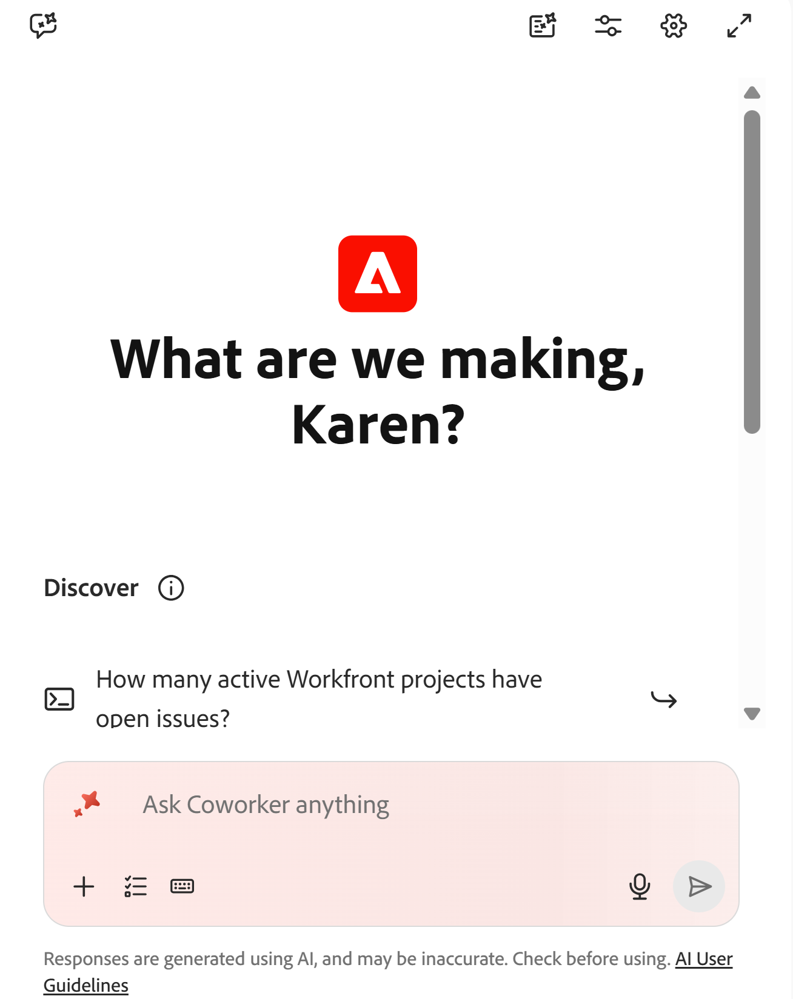

# Adobe Workfront計画CX Coworkerの概要

<!--replaced information from the AI Assistant for Planning article with CX Coworker-->

このページの情報は、まだ一般に提供されていない機能を指します。 すべてのユーザーのプレビュー環境でのみ使用できます。 リリースからプレビューの後、高速リリースを有効にしたお客様は、同じ機能を毎月実稼動環境でも使用できます。

迅速リリースについて詳しくは、[組織での迅速リリースを有効または無効にする](/help/quicksilver/administration-and-setup/set-up-workfront/configure-system-defaults/enable-fast-release-process.md)を参照してください。

{{planning-important-intro}}

CX Coworkerは対話型のインターフェイスです。目的を平易な言葉で説明し、Workfront計画やその他の接続されたAdobeシステムをまたいで作業を計画、実行、検証してから、承認用に戻します。

CX Coworkerは、現在のAI アシスタントの機能をすべて保持しながら、新しいフルスクリーン体験とWorkfrontの右側のパネルの両方に、より強力なエンドツーエンドの機能を追加しています。

組織の既存の製品レベルのアクセス制御内で動作するため、ユーザーはWorkfrontで既に許可されているアクションのみを実行でき、デフォルトでは読み取り専用アクセスが使用され、Workfront管理者は書き込みアクセスを制御できます。

>[!IMPORTANT]
>
>CX Coworkerは現在、ヘルスケアや金融などの機密性の高いデータを扱う企業では利用できません。 AI アシスタントは、これらの組織で利用できます。
>
>詳しくは、[AI アシスタントの概要](/help/quicksilver/workfront-basics/ai-assistant/ai-assistant-overview.md)を参照してください。

## アクセス要件

+++ 展開すると、この記事の機能のアクセス要件が表示されます。 

<table style="table-layout:auto"> 
<col> 
</col> 
<col> 
</col> 
<tbody> 
<tr> 
   <td role="rowheader">
Adobe Workfront パッケージ
</td> 
   <td> 

プランニングパッケージを含む任意のWorkfrontまたはワークフロー

または

スタンドアロン製品として購入された場合の任意のプランニング・パッケージ

   </td> </tr>
 <tr> 
   <td role="rowheader">
Adobe Workfront プラン
</td> 
   <td>
標準

   </td> 
  </tr> 
<tr> 
   <td role="rowheader">
Adobe計画ライセンス
</td> 
   <td>
標準

   </td> 
  </tr> 
<tr> 
   <td role="rowheader">
アクセスレベルの設定
</td> 
   <td>  
   
PlanningでCX Coworkerへのアクセスを許可するには、管理者が次の操作を行う必要があります。

   <ul>
   <li>
ワークフローとプランニングパッケージの両方を持っている場合は、ワークフローとプランニングライセンスタイプの両方をアクセスレベルに追加します
</li>
   <li>
アクセスレベルの「WorkfrontでCX Coworker パネルを無効にする」設定の選択を解除します。 デフォルトで選択されています。
</li></ul>
</td> 
  </tr> 
  <tr> 
   <td role="rowheader">
オブジェクト権限
</td> 
   <td>   
ワークスペースへの権限の管理</a> 
  
   
システム管理者は、作成しなかったワークスペースも含め、すべてのワークスペースに対する権限を持っています。
  </td> 
  </tr>

<tr> 
   <td role="rowheader">
システム設定
</td> 
   <td>   
Workfront管理者は、設定の「システム環境設定」セクションで「読み取り専用」および「書き込み専用」のMCP ツールを選択する必要があります。 デフォルトでは、「読み取り専用」 MCP ツールが選択されています。
 
    </td> 
  </tr> 
</tbody> 
</table>

Workfrontのアクセス要件について詳しくは、[Workfront ドキュメント ](/help/quicksilver/administration-and-setup/add-users/access-levels-and-object-permissions/access-level-requirements-in-documentation.md)のアクセス要件を参照してください。

+++

## CX Coworkerの考慮事項

* CX Coworkerは、社内のユーザーが利用できるようにする前に、自社に対して有効にする必要があります。

  詳しくは、[CX Coworkerの概要](/help/quicksilver/workfront-basics/coworker-in-workfront/coworker-overview.md)を参照してください。

* WorkfrontでWorkfront インスタンスのエージェントを有効にすると、メインのWorkfront管理者がエージェントを有効にでき、組織に対してエージェントを有効にすることができます。 詳しくは、[ システム環境設定の設定](/help/quicksilver/administration-and-setup/manage-workfront/security/configure-security-preferences.md)を参照してください。

* Workfront管理者は、アクセスレベルでCX Coworkerを有効にする必要があります。 詳しくは、[ アクセスレベルの作成と変更](/help/quicksilver/administration-and-setup/add-users/configure-and-grant-access/create-modify-access-levels.md)を参照してください。

* CX Coworkerは、WorkfrontまたはWorkfront Planningにあり、アクセス権を持つ情報とオブジェクトで動作します。 プランニングの右側パネルで、共同作業者パネルは、開いているワークスペース、レコードタイプ、またはレコードページのコンテキストで動作します。

* 計画領域でCX Coworkerによって実行されるアクションは、Workfront計画権限とWorkfront アクセスレベルのコンテキストにあります。 詳しくは、次の記事を参照してください。

  * [Adobe Workfront プランニングでの共有権限の概要](/help/quicksilver/planning/access/sharing-permissions-overview.md)
  * [Adobe Workfront プランニング使用時のライセンスタイプの概要](/help/quicksilver/planning/access/license-type-overview.md)

* ユーザーに代わってCX Coworkerが行った変更は、レコードの履歴パネルで追跡されます。

* CX Coworkerの行動は恒久的なものであり、取り返しのつかない可能性がある。 例えば、フィールドの削除を元に戻すことはできません。 CX Coworkerが提案したすべての措置を承認する前に再検討する。

* CX Coworkerを使用してオブジェクトを作成、更新、または削除する場合、CX Coworkerには意図された操作が表示され、確認を求められます。 その後、アクションを確認またはキャンセルできます。

## CX Coworkerで現在利用可能な機能

現在、CX CoworkerはWorkfrontのプランニング エリアで使用でき、プランニング オブジェクトの情報にアクセスして操作するための一連のスキルを使用します。 詳しくは、[CX Coworker スキル ](/help/quicksilver/workfront-basics/coworker-in-workfront/coworker-skills.md)を参照してください。

CX Coworkerを使用して、次の操作を実行できます。

* レコードの検索： 任意のレコードフィールドに含まれる情報で検索できます。
* レコードを作成します。 新しいレコードへのリンクを含むIDは、レコードの作成後に表示されます。 日付や説明など、作成プロセス中に更新するフィールドを指定できます。
* アップロードしたドキュメントに基づいてレコードを作成します。 Workfrontでは、CX Coworkerの次のドキュメントフォーマットをサポートしています。

  PPTX、PDF、DOCX、XLSX、PPT、DOC、TXT、およびほとんどの画像フォーマット
* 画面に表示されるレコードのフィールドを更新する
* レコードの削除、複製、復元
* レコードを他のレコードにリンク
* レコードの変更履歴の表示

## Workfront PlanningでCX Coworkerを探します

CX Coworkerは、Workfront Planningの次の領域に配置できます。

* 画面の右上隅にあるメインナビゲーションバー。
* 新しいタブでレコードを開いたときに、レコードの詳細エリア内に表示されます。

## 計画領域のCX Coworkerにアクセスします

1. Workfrontにログインし、左上隅の&#x200B;**メインメニュー** アイコン をクリックしてから、**計画**&#x200B;をクリックします。

   計画領域が開きます。

   ページの右上隅にある&#x200B;**AI アイコン** を見つけるか、以下の手順に進みます。

1. **ワークスペースカード**&#x200B;をクリックします。

1. **レコードタイプカード**&#x200B;をクリックします。

1. **レコード**&#x200B;をクリックしてレコードの&#x200B;**詳細** ページを開き、「で開く」をクリックします。

1. 画面の右上隅にある&#x200B;**CX Coworker アイコン**&#x200B;をクリックします。

1. 提供されたスペースで、CX Coworkerのコマンドを入力し始め、完了したら「Enter」をクリックします。

   

   例えば、次のいずれかを入力します。

   * 「Summer Sale 2026」という新しいキャンペーンレコードを作成します
   * サマーキャンペーンのレコードの予算フィールドを$75,000に更新します
   * Old Promoという名前のキャンペーンレコードを削除します
   * 誤って削除したキャンペーンを復元する

   >[!TIP]
   >
   >Workfront管理者がシステム環境設定で書き込み専用のMCP ツールを有効にしていることを確認してから、CX Coworkerにオブジェクトの編集アクションを実行するように依頼してください。

   CX Coworkerがコマンドを処理する間、視覚的なインジケーターが表示され、応答時間に対する期待値が設定されます。

   応答が成功した後、提供されたリンクに従うか、左側の変更に注意してください。

1. （オプション）「**フルスクリーンを展開**」アイコン「」をクリックすると、フルブラウザータブで同僚のチャットボックスが開きます。

