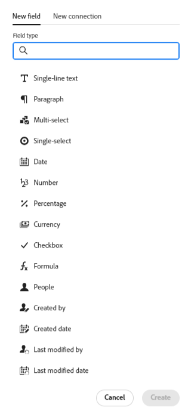

# Adobe Workfront Planning の概要

<!--this article is linked to the WF Planning landing page - do not change URL or move it; send the team a new URL after we add the redirects for this page-->

<!--update the metadata with real information when making this available in TOC and in the left nav-->

<!-- remove the references to closed beta from the entire article-->

<!--update the video in the IMPORTANT below, when we have something better, especially after Open Beta - remove it-->

>[!IMPORTANT]
>
>この記事の情報は、Adobe Workfront からの新しいオファーである Adobe Workfront Planning を説明するものです。
>
>現在、Workfrontプランニングは、限られた数のお客様に提供される早期アクセス段階にあります。
>
>これらの機能を使用するには、Workfront の顧客である必要があります。
>
>この段階に属している場合は、アカウント担当者から通知されています。
>
>Adobe Workfront Planning を説明するすべてのセクションと記事の一覧については、[Workfront Planning：記事一覧 ](/help/quicksilver/planning/planning-information.md) を参照してください。

<!--[View a video demonstration of Adobe Workfront Planning capabilities.](https://video.tv.adobe.com/v/3424253/){target=_blank}-->

## Adobe Workfront Planning の概要

Adobe Workfront Planning は、Adobe Workfront が提供する新しいオファーです。Workfront Planning の目的は、組織の運用上の詳細に関する包括的な可視性を解き放ち、作業管理ライフサイクルの各段階で重要なビジネス上の質問に答えることです。

チームやリーダーは、次のような質問に対する明確な答えを必要としています。

* 第 4 四半期に EMEA で実行しているキャンペーンの数は？
* 同時開催のキャンペーンでオーディエンスが重複していないか？
* 認知プログラムは今どの程度順調に進んでいるのか？
* 特定のキャンペーンのアセットはどのようなものか？どれが承認を必要としているのか？

このような質問に答えるために、リーダーシップは、計画から実行、配信から結果の測定まで、あらゆる作業段階の全体像を提供できるソリューションを必要とします。現在、組織にはそのプロセスの一部をカバーできるツールがあるかもしれませんが、その多くは作業の全段階に適切なつながりがなく、また結果を確実に提供できるものでもありません。

主な機能の一部を次に示します。

* すべての段階にわたって、また作業プロセスに参加するすべての関係者に対して、作業を管理するという問題を解決します。
* 組織で使用するオブジェクトタイプ（またはレコードタイプ）を決定することから、それらのオブジェクトを相互にリンクする方法を設定することまで、ワークフローを完全にカスタマイズします。
* 他のシステムからオブジェクトタイプにリンクし、すべてのプロセスに対して一貫性のあるフレームワークを作成します。

## 現在利用可能な Adobe Workfront Planning の機能

Workfront Planning で使用可能な主な機能と、その使用可能なタイムラインを次の表に示します。このリストには、すべての機能が含まれているわけではありません。

新機能とそのリリース時期について詳しくは、[Adobe Workfront Planning の現在のリリースアクティビティ ](/help/quicksilver/planning/general/release-activity.md) を参照してください。

| 機能 | 現在利用可能 | 近日中に利用可能 | 調査中 |
|----------------------------------------------------|:-----------------------------:|:--------------------------------:|:----------------:|
| ワークスペースの作成 | ✓ |                                  |                  |
| レコードタイプの作成 | ✓ |                                  |                  |
| レコードのカスタムフィールドの作成 | ✓ |                                  |                  |
| Excel または CSV ファイルを使用したレコードタイプとフィールドを読み込む* | ✓ |                                  |                  |
| レコードのリンク | ✓ |                                  |                  |
| テーブル内のレコードの表示 | ✓ |                                  |                  |
| タイムラインでのレコードの表示 | ✓ |                                  |                  |
| カレンダーでレコードを表示 | ✓ |                                  |                  |
| レコードのフィルタリング | ✓ |                                  |                  |
| タイムラインビューでのレコードのグループ化 | ✓ |                                  |                  |
| テーブルビューでのレコードのグループ化 | ✓ |                                 |                  |
| テーブルビューでのレコードの並べ替え | ✓ |                                 |                  |
| タイムラインビューでのレコードの並べ替え |                               | ✓ |                  |
| テーブルビューでのグループ化の並べ替え |                               | ✓ |                  |
| タイムラインビューでのグループ化の並べ替え |                               | ✓ |                  |
| ワークスペースの接続 |                               | ✓ |                  |
| テーブルビューでのレコードの検索 | ✓ |   |
| タイムラインビューでのレコードの検索 | ✓ |   |
| Workfront Planning レコードを Workfront のプロジェクト、プログラム、ポートフォリオ、会社、グループに接続 | ✓ |                                 |                  |
| Workfront Planning レコードを Adobe Experience Manager のアセットに接続 | ✓ |                                  |                 |
| 詳細情報を含むレコードページ | ✓ |                                  |                  |
| レコードのページのレイアウトを更新 | ✓ |                                 |                  |
| ワークスペースの共有 | ✓ | |  |
| ビューの共有 | ✓ | |  |
| 外部リソースと公開でビューを共有 | ✓ | |  |
| ビューを複製 | ✓ | |  |
| リクエストの送信 |                               |                                  | ✓ |
| クリエイティブ概要 |                               |                                  | ✓ |
| レコードの色とアイコンのカスタマイズ | ✓ |                                  |                 |
| レコードへのコメントの追加 | ✓ |                                  |                 |
| アプリ内通知を受信 | ✓ |                                  |                 |
| メール通知を受信 | ✓ |                                  |                 |
| レコードにサムネールを追加 | ✓ |                                  |                 |
| レコードの変更履歴の表示 | ✓ |                                  |                 |
| 段落フィールドのリッチテキスト書式設定 | ✓ |                                  |                 |
| Adobe Workfront Fusion 用 Adobe Workfront Planning モジュール | ✓ |                                  |                 |
| あるフィールドから別のフィールドへの情報のコピーと貼り付け | ✓ |                                  |                 |
| Workfrontオブジェクトからの Planning レコードへのアクセス | ✓ |                                  |                 |
| Workfront オブジェクトから Planning レコードを接続する | ✓ |                                  |                 |
| Workfront計画パブリック API | ✓ |                                  |                 |

## Workfront インスタンスのユーザーに対して Adobe Workfront Planning を有効にする

機能にアクセスするには、組織がAdobe Workfront計画プログラムに登録する必要があります。 条件を満たす場合、アカウント担当者からこのプログラムへの登録に関する情報が提供されています。

他のユーザーが Workfront Planning を使用できるようにアクセス権を付与して有効にする方法について詳しくは、[アクセス権の概要](/help/quicksilver/planning/access/access-overview.md)を参照してください。

## Adobe Workfront Planning の用語

Workfront Planning は Workfront の一部ですが、独自の概念と用語を備えています。Workfront Planning を組織で設定する前に、新しい概念をよく理解してください。

Workfront Planning のフレームワークは完全なカスタマイズが可能です。組織の正確なニーズに合わせて、すべてのレコードタイプとその属性、およびそれらに関連付けられた任意のフィールドを作成できます。

作成できるWorkfront Planning オブジェクトの数には制限があります。 詳しくは、[Adobe Workfront Planning オブジェクトの制限事項の概要 ](/help/quicksilver/planning/general/limitations-overview.md) を参照してください。

Workfront Planning の主なオブジェクトと概念は次のとおりです。

* **ワークスペース**：特定の組織の運用ライフサイクルを定義するレコードタイプのコレクション。ワークスペースは、組織単位の作業フレームです。

  1 つの Workfront インスタンスに最大 1,000 個のワークスペースを設定できます。

  

  詳しくは、[ワークスペースの作成](/help/quicksilver/planning/architecture/create-workspaces.md)を参照してください。

* **レコードタイプ**：オブジェクトタイプまたは Workfront Planning。

  オブジェクトタイプが事前に定義されている Workfront とは異なり、Workfront Planning では独自のオブジェクトタイプを作成できます。

  例えば、Workfront では、プログラム、ポートフォリオ、プロジェクト、タスクやイシューのオブジェクトタイプがあらかじめ作成されています。

  Workfront Planning では、組織のワークフローを満たす任意のレコードタイプを作成できます。後で、レコードタイプを相互に関連付けたり、フォームの依存関係を定義したりできます。

  詳しくは、[ レコードタイプの概要 ](/help/quicksilver/planning/architecture/overview-of-record-types.md) を参照してください。

* **レコード**：レコードタイプのインスタンス。

  

  レコードタイプをワークスペースに追加した後、そのタイプのレコードをレコードタイプのページに追加することができます。

  例えば、「キャンペーン」はレコードタイプにでき、「EMEA 向け夏のキャンペーン」はキャンペーンレコードタイプのレコードです。

  詳しくは、[レコードの作成](/help/quicksilver/planning/records/create-records.md)を参照してください。

* **ワークスペーステンプレート**：定義済みのテンプレートを使用して、ワークスペースを作成できます。テンプレートに含まれる定義済みのレコードタイプ、フィールドを使用するか、自分で追加することができます。

  

  Adobe Workfront Planning には、セールス、マーケティング、製品管理それぞれのワークスペーステンプレートが付属しています。

  詳しくは、[ワークスペースの作成](/help/quicksilver/planning/architecture/create-workspaces.md)を参照してください。

* **フィールド**：フィールドは、レコードタイプに追加できる属性です。フィールドには、レコードタイプに関する情報が含まれます。<!--check the shot below, "Connection" needs to be in lowercase-->

  

  レコードフィールドに関する考慮事項は、次のとおりです。

   * レコードタイプに追加したフィールドは、自動的にそのタイプのすべてのレコードに関連付けられ、それらのレコードに関するデータの取り込みに使用できます。

   * レコードタイプのページに適用されたテーブルビューでは、フィールドが列として表示されます。また、レコードのページにも表示されます。

   * フィールドはレコードタイプに固有で、レコードタイプ間では転送されません。

   * フィールドは完全なカスタマイズが可能で、Workfront Planning 内でのみアクセスできます。Workfront からは Workfront Planning のフィールドにアクセスできません。

  詳しくは、[フィールドの作成](/help/quicksilver/planning/fields/create-fields.md)を参照してください。

  新しいレコードタイプは、デフォルトで次の定義済みフィールドに関連付けられます。

   * 名前
   * 説明
   * 開始日
   * 終了日
   * ステータス

  次のタイプのカスタムフィールドを作成できます。

   * 1 行テキスト
   * 段落
   * 複数選択
   * 単一選択
   * 日付
   * 数値
   * パーセンテージ
   * 通貨
   * チェックボックス
   * 式
   * ユーザー
   * 作成者
   * 作成日
   * 最終変更者
   * 最終変更日

* **リンクされたレコードタイプ**、**リンクされたレコード**、**リンクされたレコードフィールド** または **接続されたレコードタイプ**、**接続されたレコード**、**接続されたフィールド**: Workfront Planning では、次のエンティティ間の接続を作成できます。

   * 2 つのレコードタイプ
   * レコードタイプと Workfront のプロジェクト、プログラム、ポートフォリオ、会社またはグループオブジェクトタイプ。
   * レコードタイプと Adobe Experience Manager のアセットまたはフォルダー。

     レコードタイプを Experience Manager のオブジェクトとリンクするには、Adobe Experience Manager のライセンスが必要です。

     

  レコードタイプ間の接続を確立すると、各タイプの個々のレコードを相互に接続できます。レコード間の接続は、リンクされたレコードフィールドとして表示されます。

* **リンクされたフィールド**（またはルックアップフィールド）：2 つのレコードタイプ間の接続を確立し、個別のレコードをリンクすると、接続元のレコード上で、リンクされたレコードのフィールドを参照できます。

  例えば、キャンペーンレコードタイプをWorkfront プロジェクト オブジェクトタイプに関連付けると、キャンペーンレコードで、接続されたプロジェクトの「予算」フィールドを表示できます。

  

  >[!TIP]
  >
  > 次のフィールドタイプを参照フィールドとして追加することはできません。
  >
  >* ユーザー
  >* 作成者
  >* 最終変更者
  >* Workfrontの先行入力フィールド（「プロジェクト所有者」や「プロジェクトスポンサー」などのフィールドを含む）

  レコードタイプのリンク、レコード、リンクされたフィールドの作成については、次の記事を参照してください。

   * [レコードタイプの接続](/help/quicksilver/planning/architecture/connect-record-types.md)
   * [レコードの接続](/help/quicksilver/planning/records/connect-records.md)

<!--not yet:* Fields are reusable across Record Types.  -->

* **ビュー**：レコードは、それぞれのレコードタイプページに異なるタイプのビューで表示されます。

  

  ビューには、フィールド（列）のリスト、レコード（行）のリスト、レコードの順序（並べ替え）、適用済みまたは適用可能なフィルターとグループ化など、特定のビュータイプのパーソナライズされた設定が含まれています。

  レコードタイプページに適用できるビュータイプは次のとおりです。

   * **テーブルビュー**：レコードとそのフィールドを表形式で表示します。テーブルの行は個々のレコードであり、列はレコードのフィールドです。これはデフォルトのビューです。

     

   * **タイムラインビュー**：少なくとも 2 つの日付タイプフィールドを持つレコードを時系列で表示します。

     

   * **カレンダービュー**：2 つ以上の日付タイプフィールドを持つレコードをカレンダー形式で表示します。
     

詳しくは、[レコードビューを管理](/help/quicksilver/planning/views/manage-record-views.md)を参照してください。

## Adobe Workfront Planning の検索

組織に Workfront Planning へのアクセス権が付与されており、システム管理者またはグループ管理者が Planning エリアをメインメニューに追加してあることを確認します。詳しくは、[アクセス権の概要](/help/quicksilver/planning/access/access-overview.md)を参照してください。

Workfront Planning を検索するには、次の手順に従います。

1. Adobe Workfront にログインします。

{{step1-click-main-menu}}

1. **Planning**  をクリックします。

   Workfront計画のメインページが開きます。

   

   >[!TIP]
   >
   >    Workfront管理者は、レイアウトテンプレートの「ランディングページを選択」オプションに Planning 領域を追加できるので、Workfrontにログインするとすぐに Planning を開くことができます。 詳しくは、[ レイアウトテンプレートを使用したランディングページのカスタマイズ ](/help/quicksilver/administration-and-setup/customize-workfront/use-layout-templates/customize-landing-page.md) を参照してください。

1. （条件付きおよびオプション）Workfrontの管理者は、次のいずれかのタブをクリックします。
   * **マイワークスペース**：作成したワークスペースが表示されます。<!--Replace with: Workspaces I'm on: Displays workspaces you created or workspaces that are shared with you.-->
   * **その他のワークスペース**：共有されているワークスペースを含む、システム内のその他すべてのワークスペースを表示します。<!--Replace with: Other workspaces: Displays all other workspaces in the system.-->

   その他のすべてのユーザーについては、ユーザーが作成したワークスペースまたはユーザーと共有されているすべてのワークスペースが **ワークスペース** 領域に表示されます。

1. （オプションおよび推奨）次のいくつかの操作を続行して、作業構造を構築します。

   1. ゼロから、またはテンプレートを使用してワークスペースを作成します。 詳しくは、[ワークスペースの概要](/help/quicksilver/planning/architecture/create-workspaces.md)を参照してください。

   1. 新しいワークスペースにセクションを追加します。 詳しくは、[ ワークスペースの編集 ](/help/quicksilver/planning/architecture/edit-workspaces.md) を参照してください。
   1. 新しいワークスペースで既存のセクションの名前を変更します。
   1. 新しいワークスペースにレコードタイプを追加します。 詳しくは、[リクエストタイプの作成](/help/quicksilver/planning/architecture/create-record-types.md)を参照してください。

   1. レコードタイプの名前をクリックして、レコードタイプのページを開きます。デフォルトでは、レコードタイプページがテーブルビューで開きます。

      タイムラインビューやカレンダービューを作成することもできます。 詳しくは、[レコードビューの管理](/help/quicksilver/planning/views/manage-record-views.md)を参照してください。

   1. テーブルビューで、行を追加してレコードを追加していきます。

      または

      列を追加して、レコードフィールドを追加していきます。

      詳しくは、次の記事を参照してください。

      * [レコードの作成](/help/quicksilver/planning/records/create-records.md)
      * [ フィールドを作成 ](/help/quicksilver/planning/fields/create-fields.md).

## Adobe Workfront Planning リリースアクティビティ

アドビでは、定期的に Workfront Planning の新機能をリリースしています。

リリースされた機能の最新の一覧については、[Adobe Workfront Planning の現在のリリース アクティビティを参照してください ](/help/quicksilver/planning/general/release-activity.md)

