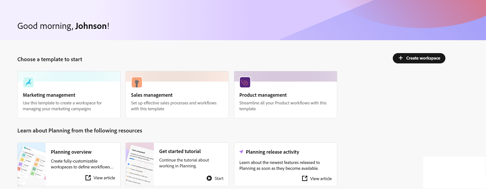
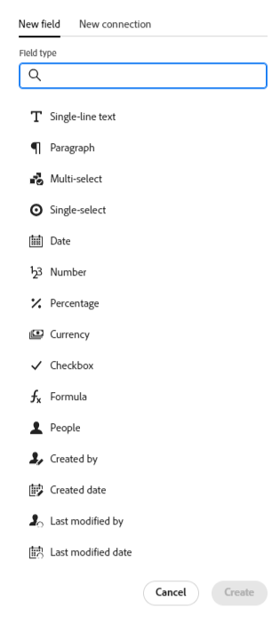
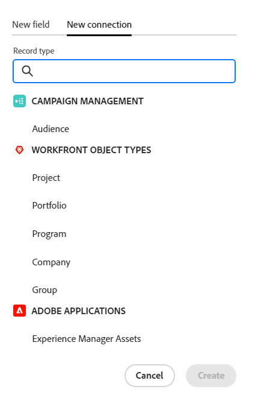
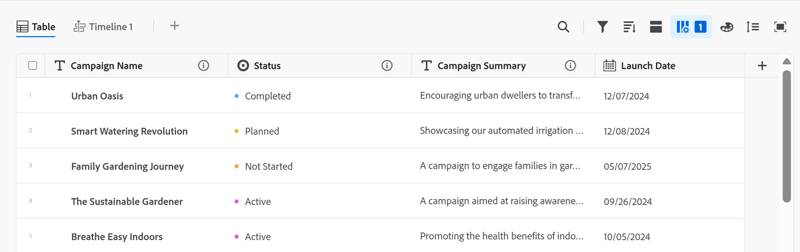
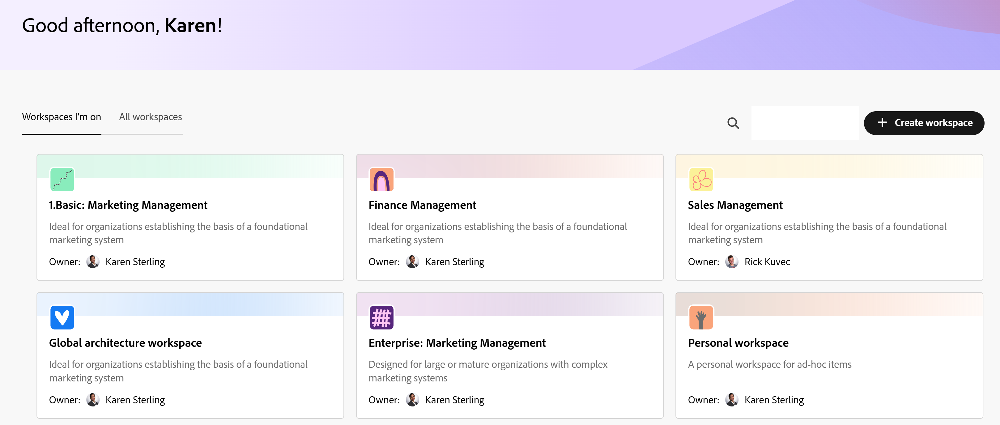

# Adobe Workfront Planning の基本を学ぶ

<!--this article is linked to the WF Planning landing page - do not change URL or move it; send the team a new URL after we add the redirects for this page-->

<!--do not use the snippet for IMPORTANT as it links to this article-->

このページでハイライト表示されている情報は、まだ一般に利用できない機能を示します。すべてのお客様が、プレビュー環境でのみ使用できます。 実稼動環境への毎月のリリースの後、迅速なリリースを有効にしたお客様には、実稼動環境でも同じ機能を利用できます。

迅速リリースについて詳しくは、[組織での迅速リリースを有効または無効にする](/help/quicksilver/administration-and-setup/set-up-workfront/configure-system-defaults/enable-fast-release-process.md)を参照してください。

>[!IMPORTANT]
>
>この記事の情報は、Adobe Workfront の追加機能である Adobe Workfront Planning に関するものです。
>
>Workfront Planning へのアクセス要件のリストについて詳しくは、[Adobe Workfront Planning へのアクセスの概要](/help/quicksilver/planning/access/access-overview.md)を参照してください。

この記事には、Workfront Planning に関する一般的な情報が含まれています。

Adobe Workfront計画のドキュメントが含まれている記事の完全なリストについては、[Workfront計画の一般情報と記事一覧 ](/help/quicksilver/planning/planning-information.md) を参照してください。

## Adobe Workfront Planning の概要

Adobe Workfront Planning は、Adobe Workfront の追加機能です。Workfront Planning の目的は、組織の運用上の詳細に関する包括的な可視性を解き放ち、作業管理ライフサイクルの各段階で重要なビジネス上の質問に答えることです。

Workfront Planning は、次のような質問に回答できます。

* 第 4 四半期に EMEA で実行しているキャンペーンの数は？
* 同時開催のキャンペーンでオーディエンスが重複していないか？
* 認知プログラムは今どの程度順調に進んでいるのか？
* 特定のキャンペーンのアセットはどのようなものか？どれが承認を必要としているのか？

このような質問に答えるために、リーダーシップは、計画から実行、配信から結果の測定まで、あらゆる作業段階の全体像を提供できるソリューションを必要とします。現在、組織にはそのプロセスの一部をカバーできるツールがあるかもしれませんが、その多くは作業の全段階に適切なつながりがなく、また結果を確実に提供できるものでもありません。

主な機能の一部を次に示します。

* すべての段階にわたって、また作業プロセスに参加するすべての関係者に対して、作業を管理するという問題を解決します。
* 組織で使用するオブジェクトタイプ（またはレコードタイプ）を決定することから、それらのオブジェクトを相互にリンクする方法を設定することまで、ワークフローを完全にカスタマイズします。
* 他のシステムからオブジェクトタイプにリンクし、すべてのプロセスに対して一貫性のあるフレームワークを作成します。

<!--
## Currently available Workfront Planning features
(*****for GA just make a list of what features ARE included in Planning and eliminate the last 2 columns; also update the title of this section*****)

(*****at GA: update the link below to the new place for release notes *****)

For information about new features and when they are released, see [Adobe Workfront Planning release activity for 2024](/help/quicksilver/planning/general/release-activity.md). 

The following features are currently available in Workfront Planning:

* Create workspaces             
* Create record types             
* Create record custom fields             
(************ * Import record types and fields using an Excel or CSV file*****)
          
* Display records in a table view            
* Display records in a timeline view            
* Display records in a calendar view            
* Filter, sort, and group records in a table view
* Filter, group, and color code records in the timeline view
* Filter records in the calendar view 
* Search for records in the table and timeline views             
* Connect records that belong to the same workspace  
* Connect records that belong to different workspaces   
* Connect Workfront Planning records to Workfront projects, programs, portfolios, companies, groups             
* Connect Workfront Planning records to Adobe Experience Manager assets          
    You must have an Adobe Experience Manager Assets license and an integration between AEM Assets and Workfront.
    For information, see [Adobe Workfront for Experience Manager Assets and Assets Essentials: article index](/help/quicksilver/documents/adobe-workfront-for-experience-manager-assets-essentials/workfront-for-aem-asset-essentials.md). 
* View record information in the Details tab
* View record connections in the Connections tab
* Customize the layout of a record's page             
* Share workspaces             
* Share views             
* Share views publicly with any external resource, even people who are not Workfront users         
* Duplicate views             
* Submit requests to create records            
* Export record details to Word and PDF.
* Add comments to records             
* Receive in-app notifications             
* Receive email notifications             
* Add thumbnails and cover pages to records             
* View the history of changes on a record             
* Rich Text formatting for Paragraph fields             
* Access Planning records from Workfront objects             
* Connect and disconnect Planning records from Workfront objects 
* Create Planning records by submitting a request form            
* Workfront Planning public API             
* Adobe Workfront Planning modules for Adobe Workfront Fusion             
* Workfront Planning AI Assistant
* Reporting on Workfront Planning information
    You can report on Planning information using the Canvas Dashboard. For information, see [Canvas Dashboards overview](/help/quicksilver/reports-and-dashboards/canvas-dashboards/canvas-dashboards-overview.md). 

-->

<!--OLD: 

|       Feature                                      |     Available now  |     Coming soon   |     In research  |
|----------------------------------------------------|:-----------------------------:|:--------------------------------:|:----------------:|
|     Create workspaces                              |   ✓                           |                                  |                  |
|     Create record types                |   ✓                           |                                  |                  |
|     Create record custom fields                    |   ✓                           |                                  |                  |
|     Import record types and fields using an Excel  or CSV file                              |                              |           ✓                       |                  |
|     Link records                                   |   ✓                           |                                  |                  |
|     View records in a table                        |   ✓                           |                                  |                  |
|     View records in a timeline                     |   ✓                           |                                  |                  |
|     View records in a calendar                     |   ✓                           |                                  |                  |
|     Filter records                                 |   ✓                           |                                  |                  |
|     Group records in the timeline view             |   ✓                           |                                  |                  |
|     Group records in the table view                | ✓                              |                                 |                  |
|     Sort records in the table view                                 |  ✓                             |                                 |                  |
|     Sort records in the timeline view                                 |                               |   ✓                              |                  |
|     Sort groupings in the table view                                 |                               |   ✓                              |                  |
|     Sort groupings in the timeline view                                 |                               |   ✓                              |                  |
|   Search for records in the table view    | ✓    |   |
|   Search for records in the timeline view    | ✓    |   |
|     Connect Workfront Planning records to Workfront projects, programs, portfolios, companies, groups  |   ✓                            |                                 |                  |
|     Connect Workfront Planning records to Adobe Experience Manager assets                                  |      ✓                         |                                  |                 |
|     Connect Planning records from different workspaces                                  |      ✓                         |                                  |                 |
|     Record page with detailed information                            |   ✓                           |                                  |                  |
|     Update the layout of the record's page              |    ✓                           |                                 |                  |
|  Share workspaces | ✓| |  |
|  Share views |✓ | |  |
|  Share views publicly with external resources |✓ | |  |
|  Duplicate views |✓ | |  |
|     Submit requests                                |                               |          ✓                        |                 |
|     Export record details to Word                                 |    ✓                           |                                  |                 |
|     Export record details to PDF                                 |                               |                                  |       ✓          |
|     Customize the color and icon of a record                                 |      ✓                         |                                  |                 |
|     Add comments to records                                 | ✓                              |                                  |                 |
|     Receive in-app notifications                                 | ✓                              |                                  |                 |
|     Receive email notifications                                 | ✓                              |                                  |                 |
|     Add thumbnails to records                                 | ✓                              |                                  |                 |
|     View history of changes on a record                                 | ✓                              |                                  |                 |
|     Rich Text formatting for Paragraph fields                                 |      ✓                         |                                  |                 |
|     Adobe Workfront Planning modules for Adobe Workfront Fusion                                 |      ✓                         |                                  |                 |
|     Copy and paste information from one field to another                                  |      ✓                         |                                  |                 |
|     Access Planning records from Workfront objects                                  |      ✓                         |                                  |                 |
|     Connect Planning records from Workfront objects                                  |      ✓                         |                                  |                 |
|     Workfront Planning public API                                 |      ✓                         |                                  |                 |
|     Workfront Planning AI Assistant*                                 |      ✓                         |                                  |                 |
|     Reporting on Workfront Planning information (Canvas Dashboard)                              |                               |       ✓                           |                 |
-->

## Workfront インスタンスのユーザーに対する Workfront Planning の有効化

組織で Workfront Planning のパッケージを購入後、ユーザーが Workfront Planning にアクセスする前に、Workfront 管理者として次の点を確認する必要があります。

* メインメニューに Planning が含まれるレイアウトテンプレートを次のユーザーに割り当てます。

   * ライトユーザーとコントリビューターユーザーにレイアウトテンプレートを割り当てます。

     標準ユーザーとシステム管理者の場合、Planning はデフォルトで有効になっています。

  詳しくは、[レイアウトテンプレートを使用したメインメニューのカスタマイズ](/help/quicksilver/administration-and-setup/customize-workfront/use-layout-templates/customize-main-menu.md)と[レイアウトテンプレートへのユーザーの割り当て](/help/quicksilver/administration-and-setup/customize-workfront/use-layout-templates/assign-users-to-layout-template.md)を参照してください。

* ユーザーに Workfront ライセンスと、Workfront Planning でオブジェクトを表示または作成できる Workfront Planning 権限を割り当てます。他のユーザーが Workfront Planning を使用できるようにアクセス権を付与して有効にする方法について詳しくは、[Adobe Workfront Planning へのアクセスの概要](/help/quicksilver/planning/access/access-overview.md)を参照してください。

## Workfront Planning の用語

Workfront Planning は Workfront の一部ですが、独自の概念と用語を備えています。組織で Workfront Planning の設定を開始する前に、新しい概念を十分に理解する必要があります。

Workfront Planning のフレームワークは完全なカスタマイズが可能です。組織の正確なニーズに合わせて、すべてのレコードタイプとその属性、およびそれらに関連付けられた任意のフィールドを作成できます。

作成できる Workfront Planning オブジェクトの数には制限があります。詳しくは、[Adobe Workfront Planning のオブジェクト数の制限の概要](/help/quicksilver/planning/general/limitations-overview.md)を参照してください。

Workfront Planning の主なオブジェクトと概念は次のとおりです。

* [ワークスペース](#workspaces)
* [レコードタイプ](#record-types)
* [レコード](#records)
* [Workspace テンプレート](#workspace-templates)
* [フィールド](#fields)
* [接続されたレコードタイプ、レコード、フィールド](#connected-record-types-records-and-fields)
* [参照フィールド](#lookup-fields)
* [階層](#hierarchies)
* [ビュー](#views)
* [自動化](#automations)
* [リクエストフォーム](#request-forms)

### ワークスペース

ワークスペースは、組織単位のフレームワークを表します。 特定の組織の運用ライフサイクルを定義するレコードタイプのコレクションです。

詳しくは、[ワークスペースの作成](/help/quicksilver/planning/architecture/create-workspaces.md)を参照してください。

### レコードタイプ

レコードタイプは、Workfront Planning のオブジェクトタイプです。

ワークスペースにはレコードタイプが入力されます。

オブジェクトタイプが事前に定義されている Workfront とは異なり、Workfront Planning では独自のオブジェクトタイプを作成できます。

例えば、Workfront では、プログラム、ポートフォリオ、プロジェクト、タスクやイシューのオブジェクトタイプがあらかじめ作成されています。

Workfront Planning では、組織のワークフローを満たす任意のレコードタイプを作成できます。後で、レコードタイプを相互に関連付けたり、フォームの依存関係を定義したりできます。

詳しくは、[レコードタイプの概要](/help/quicksilver/planning/architecture/overview-of-record-types.md)を参照してください。

### レコード

レコードは、レコードタイプのインスタンスです。

レコードタイプをワークスペースに追加したら、そのタイプのレコードをレコードタイプのページに追加できます。

例えば、「キャンペーン」をレコードタイプとして設定し、「EMEA 向け夏のキャンペーン」をキャンペーンレコードタイプのレコードにすることができます。

詳しくは、[レコードの作成](/help/quicksilver/planning/records/create-records.md)を参照してください。

### Workspace テンプレート

定義済みのテンプレートを使用してワークスペースを作成できます。 テンプレートに含まれる定義済みのレコードタイプ、フィールドを使用するか、自分で追加することができます。

Adobe Workfront Planning には、次のテンプレートが含まれています。

* ベーシック：マーケティング管理
* アドバンスト：マーケティング管理
* エンタープライズ：マーケティング管理
* セールス管理
* 製品管理

詳しくは、[ワークスペーステンプレートのリスト](/help/quicksilver/planning/architecture/workspace-templates.md)を参照してください。

### フィールド

フィールドは、レコードタイプに追加できる属性です。 フィールドには、レコードタイプに関する情報が含まれます。

レコードフィールドに関する考慮事項は、次のとおりです。

* レコードタイプに追加したフィールドは、自動的にそのタイプのすべてのレコードに関連付けられ、それらのレコードに関するデータの取り込みに使用できます。

* レコードタイプのページに適用されたテーブルビューでは、フィールドが列として表示されます。また、レコードのページにも表示されます。

* フィールドはレコードタイプに固有で、レコードタイプ間では転送されません。

* フィールドは完全なカスタマイズが可能で、Workfront Planning 内でのみアクセスできます。Workfront からは Workfront Planning のフィールドにアクセスできません。

詳しくは、[フィールドの作成](/help/quicksilver/planning/fields/create-fields.md)を参照してください。

新しいレコードタイプは、デフォルトで次の定義済みフィールドに関連付けられます。

* 名前
* 説明
* 開始日
* 終了日
* ステータス

次のタイプのカスタムフィールドを作成できます。

* 1 行テキスト
* 段落
* 複数選択
* 単一選択
* 日付
* 数値
* パーセンテージ
* 通貨
* チェックボックス
* 式
* ユーザー
* 作成者
* 作成日
* 最終変更者
* 最終変更日

### 接続されたレコードタイプ、レコード、フィールド

Workfront Planning では、次のエンティティ間の接続を作成できます。

* Workfront Planning の 2 つのレコードタイプ。
* レコードタイプと Workfront のプロジェクト、プログラム、ポートフォリオ、会社またはグループオブジェクトタイプ。
* レコードタイプと Adobe Experience Manager のアセットまたはフォルダー。

  レコードタイプを Experience Manager のオブジェクトと接続するには、Adobe Experience Manager のライセンスが必要です。

  

* レコードタイプと Adobe GenStudio for Performance Marketing ブランド。

  レコードタイプを GenStudio ブランドと接続するには、Adobe GenStudio for Performance Marketing ライセンスが必要です。

  

レコードの種類またはレコードとオブジェクトの種類の間の接続を確立すると、それらの種類の個々のレコードまたはオブジェクトを相互に接続できます。 レコード間の接続は、接続済みレコードフィールドまたは接続として表示されます。

相互に影響を与える複数のタイプの作業オブジェクトがある場合、レコードタイプを接続すると便利です。例えば、キャンペーンの作業をする際に、各キャンペーンが複数のブランドを対象としている場合があります。この関係を示すために、ブランドにキャンペーンを接続できます。また、Workfront の複数のプロジェクトで各キャンペーンの作業が計画されることもあります。これを示すには、関連するプロジェクトにキャンペーンを接続します。レコードタイプを接続してから、個々のレコードを接続すると、Workfront Planning でこの関係性を確立できます。

### 参照フィールド

2 つのレコードタイプ間の接続を確立し、個々のレコードを接続したら、接続元のレコードから接続されたレコードのフィールドを参照できます。

例えば、キャンペーンレコードタイプを Workfront プロジェクトのオブジェクトタイプと接続する場合、接続されたプロジェクトの「予算」フィールドをキャンペーンレコードに表示できます。

>[!TIP]
>
>* 次のフィールドタイプは、接続済みレコードタイプまたはオブジェクトタイプのルックアップフィールドとして追加できません。
>
>   * 作成者
>   * 最終変更者
>   * Workfront の先行入力フィールド（「プロジェクト所有者」や「プロジェクトスポンサー」などのフィールドを含む）
>
>* 次のフィールドタイプを、実稼動環境の接続されたレコードまたはオブジェクトタイプのルックアップフィールドとして追加することはできませんが、 プレビュー環境では追加できます。
>
>   * ユーザー

レコードタイプやレコードの接続、およびリンク済みフィールドの作成について詳しくは、次の記事を参照してください。

* [レコードタイプの接続](/help/quicksilver/planning/architecture/connect-record-types.md)
* [レコードの接続](/help/quicksilver/planning/records/connect-records.md)

<!--not yet:* Fields are reusable across Record Types.  -->

### 階層

ワークスペース内でレコードタイプを接続したら、それらの接続を整理する階層を作成できます。 階層は、レコードとオブジェクトのタイプを親子関係に整理し、最大 4 つのレベルのオブジェクトのタイプを含めることができます。

2 つのレコードタイプ間の接続がまだ存在しない場合は、階層を設定するときに作成できます。 定義が完了すると、ワークスペース内の関連するレコードタイプ間で階層の構造化パスが確立されます。

階層は、ヘッダーに表示される各レコードのパンくずリストを生成します。 これにより、ワークフローの任意のステージで、階層内の自分の位置を把握できます。

階層とパンくずリストに関する一般的な情報については、[ 階層とパンくずリストの概要 ](/help/quicksilver/planning/architecture/hierarchy-and-breadcrumb-overview.md) を参照してください。

### ビュー

レコードは、異なるタイプのビューで、それぞれのレコードタイプページに表示されます。

ビューには、フィールド（列）のリスト、レコード（行）のリスト、フィールドやレコードの順序（並べ替え）、適用済みまたは適用可能なフィルターとグループ化など、特定のビュータイプのパーソナライズされた設定が含まれています。

レコードタイプページに適用できるビュータイプは次のとおりです。

* **テーブルビュー**：接続済みフィールドやルックアップフィールドを含む、レコードとそのフィールドをテーブル形式で表示します。テーブルの行は個々のレコードであり、列はレコードのフィールドです。デフォルトは、テーブルビューです。

  

* **タイムラインビュー**：少なくとも 2 つの日付タイプフィールドを持つレコードを時系列で表示します。タイムラインビューには、接続済みレコードタイプとそのレコードを最大 5 つ表示できます。

  

* **カレンダービュー**：2 つ以上の日付タイプフィールドを持つレコードをカレンダー形式で表示します。
  

<!-- add List view here when it's possible to display Planning RTs in it??-->

詳しくは、[レコードビューの管理](/help/quicksilver/planning/views/manage-record-views.md)を参照してください。

### 自動化

Adobe Workfront Planning で自動化を構成して、アクティブ化すると、計画レコードからトリガーされたときにWorkfront Planning にレコードを作成できます。 作成したレコードは、自動処理をトリガーするレコードに自動的に接続されます。

Workfront Planning のレコードタイプのページで自動処理を設定してアクティブ化できます。

例えば、Workfront Planning キャンペーンを受け取り、キャンペーンに関連付けるブランドを作成する自動処理を作成できます。

既存の自動化を使用してオブジェクトを作成する方法については、[Adobe Workfront Planning レコードの自動化を使用したオブジェクトの作成 ](/help/quicksilver/planning/records/create-wf-objects-using-planning-automations.md) を参照してください。

### リクエストフォーム

リクエストフォームを作成し、Adobe Workfront Planning でレコードタイプに関連付けることができます。 その後、フォームを他のユーザーと共有し、他のユーザーがそのタイプのレコードを作成するリクエストを送信できます。

詳しくは、[Adobe Workfront Planning でのリクエストフォームの作成と管理 ](/help/quicksilver/planning/requests/create-request-form.md) を参照してください。

## Adobe Workfront Planning へのアクセス

Adobe Planning にアクセスする前に、組織に Workfront Planning へのアクセス権が付与されており、システム管理者またはグループ管理者が Planning エリアをメインメニューに追加していることを確認してください。詳しくは、[Adobe Planning へのアクセスの概要](/help/quicksilver/planning/access/access-overview.md)を参照してください。

Workfront Planning にアクセスするには、次の手順に従います。

1. Workfront にログインします。

{{step1-click-main-menu-shell-only}}

1. 「**Planning**」 をクリックします。

   Workfront Planning のメインページが開きます。

   

   >[!TIP]
   >
   >    Workfront 管理者は、レイアウトテンプレートの「ランディングページを選択」オプションに Planning エリアを追加できるため、Workfront にログインするとすぐに Planning を開くことができます。詳しくは、[レイアウトテンプレートを使用したランディングページのカスタマイズ](/help/quicksilver/administration-and-setup/customize-workfront/use-layout-templates/customize-landing-page.md)を参照してください。

1. （条件付きおよびオプション）Workfront 管理者は、次のいずれかのタブをクリックします。
   * **参加中のワークスペース**：作成したワークスペースまたは共有されているワークスペースが表示されます。
   * **その他のワークスペース**：システム内のその他すべてのワークスペースが表示されます。

   その他のすべてのユーザーには、ユーザーが作成したワークスペースと共有されているワークスペースの両方が&#x200B;**ワークスペース**&#x200B;エリアに表示されます。

1. （オプションおよび推奨）次のいくつかの操作を続行して、作業構造を構築します。

   1. ワークスペースを最初から作成するか、テンプレートを使用して作成します。詳しくは、[ワークスペースの作成](/help/quicksilver/planning/architecture/create-workspaces.md)を参照してください。

   1. 新しいワークスペースにセクションを追加します。詳しくは、[ワークスペースの編集](/help/quicksilver/planning/architecture/edit-workspaces.md)を参照してください。
   1. 新しいワークスペースで既存のセクションの名前を変更します。
   1. 新しいワークスペースにレコードタイプを追加します。詳しくは、[レコードタイプの作成](/help/quicksilver/planning/architecture/create-record-types.md)を参照してください。

   1. レコードタイプの名前をクリックして、レコードタイプのページを開きます。デフォルトでは、レコードタイプページがテーブルビューで開きます。

      タイムラインビューやカレンダービューを作成することもできます。詳しくは、[レコードビューの管理](/help/quicksilver/planning/views/manage-record-views.md)を参照してください。

   1. テーブルビューで、行を追加してレコードを追加していきます。

      または

      列を追加して、レコードフィールドを追加していきます。

      詳しくは、次の記事を参照してください。

      * [レコードの作成](/help/quicksilver/planning/records/create-records.md)
      * [フィールドを作成します](/help/quicksilver/planning/fields/create-fields.md)。

## Workfront Planning のその他のリソース

* [Adobe Workfront計画の一般情報と記事一覧 ](/help/quicksilver/planning/planning-information.md):Workfront計画に関するドキュメントが含まれているすべての記事のインデックスで、目標領域別にグループ化されています。
* [Adobe Workfront Planning の AI アシスタントの概要](/help/quicksilver/planning/general/planning-ai-assistant-overview.md)：Workfront Planning の AI アシスタントを使用すると、コマンドを実行することによって、レコードの検索、作成、更新、削除などの作業をアシスタントに代行してもらうことができます。

  <!--
    >[!NOTE]
    >
    >    The Workfront AI Assistant has been temporarily removed and it will be available at a later date.-->

* [Workfront Fusion の Adobe Workfront Planning モジュール](https://experienceleague.adobe.com/ja/docs/workfront-fusion/using/references/apps-and-their-modules/adobe-connectors/workfront-planning-modules)：Adobe Workfront Planning モジュールを使用すると、Workfront Planning でイベントが発生した場合にシナリオをトリガーできます。また、レコードの作成、読み取り、更新、削除、および Adobe Workfront Planning のアカウントへのカスタム API 呼び出しも実行できます。

* [Adobe Workfront Planning API の基本](/help/quicksilver/planning/general/planning-api-basics.md)：Adobe Workfront Planning API の目的は、HTTP 上で動作する RESTful アーキテクチャを導入することで、Planning との統合の構築を簡略化することです。

* [Adobe Workfront Planning とAdobe GenStudio for Performance Marketing との統合の基本を学ぶ ](/help/quicksilver/planning/planning-and-genstudio-integration/get-started-with-workfront-planning-and-genstudio-integration.md)：Workfront Planning の GenStudio ワークスペースで、GenStudio for Performance Marketing のレコードを管理できます。

* **Workfront Planning のレポート機能**：Workfront キャンバスダッシュボードを使用して、Workfront のレポートで Workfront Planning の情報を表示できるようになりました。詳しくは、[キャンバスダッシュボードの概要](/help/quicksilver/reports-and-dashboards/canvas-dashboards/canvas-dashboards-overview.md)を参照してください。

