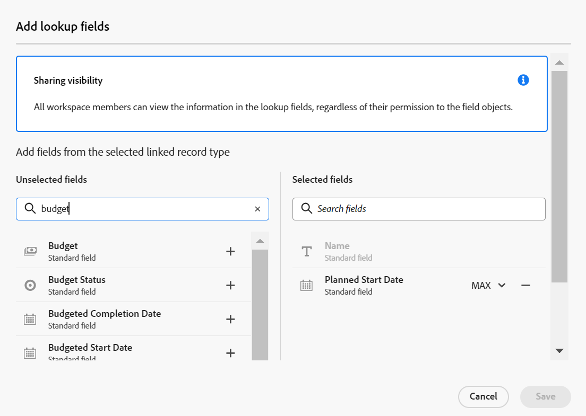
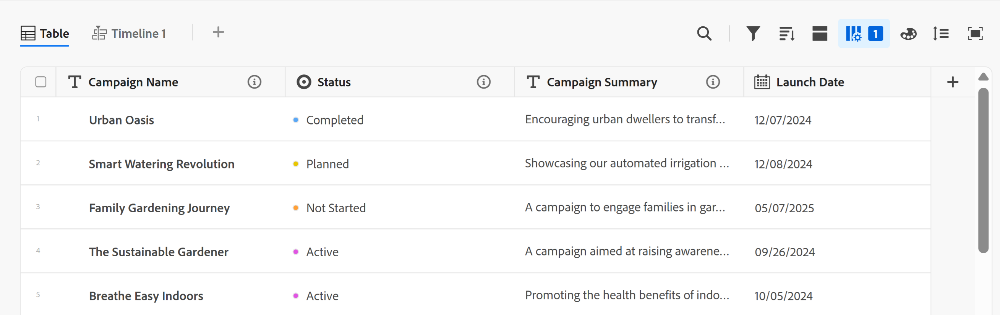

# Adobe Workfront Planning の概要

<!--this article is linked to the WF Planning landing page - do not change URL or move it; send the team a new URL after we add the redirects for this page-->

<!--do not use the snippet for IMPORTANT as it links to this article-->

>[!IMPORTANT]
>
>この記事の情報は、Adobe Workfront からの新しいオファーである Adobe Workfront Planning を説明するものです。
>
>Workfront Planning にアクセスするには、次のものが必要です。
>
>* 新しいWorkfront プランおよびライセンス。 Workfront Planning は、従来のWorkfront プランまたはライセンスでは利用できません。
>* Workfront Planning の追加ライセンス。
>* 組織のWorkfrontのインスタンスは、Adobeの Unified Experience にオンボーディングされる必要があります。
>
> Workfront Planning へのアクセス要件の完全なリストについては、[ アクセスの概要 ](/help/quicksilver/planning/access/access-overview.md) を参照してください。
> 

この記事には、Workfrontの計画に関する一般情報が含まれます。

Adobe Workfront Planning のドキュメントが含まれているアーティクルの一覧については、[Workfront Planning：アーティクル インデックス ](/help/quicksilver/planning/planning-information.md) を参照してください。

## Adobe Workfront Planning の概要

Adobe Workfront Planning は、Adobe Workfront が提供する新しいオファーです。Workfront Planning の目的は、組織の運用上の詳細に関する包括的な可視性を解き放ち、作業管理ライフサイクルの各段階で重要なビジネス上の質問に答えることです。

チームやリーダーは、次のような質問に対する明確な答えを必要としています。

* 第 4 四半期に EMEA で実行しているキャンペーンの数は？
* 同時開催のキャンペーンでオーディエンスが重複していないか？
* 認知プログラムは今どの程度順調に進んでいるのか？
* 特定のキャンペーンのアセットはどのようなものか？どれが承認を必要としているのか？

このような質問に答えるために、リーダーシップは、計画から実行、配信から結果の測定まで、あらゆる作業段階の全体像を提供できるソリューションを必要とします。現在、組織にはそのプロセスの一部をカバーできるツールがあるかもしれませんが、その多くは作業の全段階に適切なつながりがなく、また結果を確実に提供できるものでもありません。

主な機能の一部を次に示します。

* すべての段階にわたって、また作業プロセスに参加するすべての関係者に対して、作業を管理するという問題を解決します。
* 組織で使用するオブジェクトタイプ（またはレコードタイプ）を決定することから、それらのオブジェクトを相互にリンクする方法を設定することまで、ワークフローを完全にカスタマイズします。
* 他のシステムからオブジェクトタイプにリンクし、すべてのプロセスに対して一貫性のあるフレームワークを作成します。

## 現在使用可能なWorkfront Planning の機能

<!--for GA just make a list of what features ARE included in Planning and eliminate the last 2 columns; also update the title of this section-->

<!--at GA: update the link below to the new place for release notes-->

新機能とそのリリース時期について詳しくは、[2024 年のAdobe Workfront計画リリースアクティビティ ](/help/quicksilver/planning/general/release-activity.md) を参照してください。

現在、Workfront Planning で使用できる機能は次のとおりです。

* ワークスペースの作成
* レコードタイプの作成
* レコードのカスタムフィールドの作成\
  <!--* Import record types and fields using an Excel or CSV file-->

* テーブル表示でのレコードの表示
* タイムラインビューでのレコードの表示
* カレンダー表示でのレコードの表示
* テーブルビューでのレコードのフィルタリング、並べ替え、グループ化
* タイムラインビューでレコードをフィルタリング、グループ化、カラー表示します
* カレンダー表示でのレコードのフィルタリング
* テーブルビューとタイムラインビューでレコードを検索
* 同じワークスペースに属するレコードの接続
* 異なるワークスペースに属するレコードを接続します
* Workfront Planning レコードを Workfront のプロジェクト、プログラム、ポートフォリオ、会社、グループに接続
* Workfront Planning レコードを Adobe Experience Manager のアセットに接続
* 「詳細」タブでのレコード情報の表示
* 「接続」タブでのレコード接続の表示
* レコードのページのレイアウトのカスタマイズ
* ワークスペースの共有
* ビューの共有
* 外部リソースと公開でビューを共有
* ビューを複製
* レコードを作成するためのリクエストの送信
* レコードの詳細を Word にエクスポート\
  <!--* Export record details to PDF-->
* レコードへのコメントの追加
* アプリ内通知を受信
* メール通知を受信
* レコードへのサムネールと表紙の追加
* レコードの変更履歴の表示
* 段落フィールドのリッチテキスト書式設定
* Workfrontオブジェクトからの Planning レコードへのアクセス
* Workfront オブジェクトから Planning レコードを接続する
* 要求フォームを送信して計画レコードを作成します
* Workfront計画パブリック API
* Adobe Workfront Fusion 用 Adobe Workfront Planning モジュール
* Workfront計画 AI アシスタント
* Workfrontの計画情報に関するレポート（キャンバスダッシュボード）

<!--OLD: 

|       Feature                                      |     Available now  |     Coming soon   |     In research  |
|----------------------------------------------------|:-----------------------------:|:--------------------------------:|:----------------:|
|     Create workspaces                              |   ✓                           |                                  |                  |
|     Create record types                |   ✓                           |                                  |                  |
|     Create record custom fields                    |   ✓                           |                                  |                  |
|     Import record types and fields using an Excel  or CSV file                              |                              |           ✓                       |                  |
|     Link records                                   |   ✓                           |                                  |                  |
|     View records in a table                        |   ✓                           |                                  |                  |
|     View records in a timeline                     |   ✓                           |                                  |                  |
|     View records in a calendar                     |   ✓                           |                                  |                  |
|     Filter records                                 |   ✓                           |                                  |                  |
|     Group records in the timeline view             |   ✓                           |                                  |                  |
|     Group records in the table view                | ✓                              |                                 |                  |
|     Sort records in the table view                                 |  ✓                             |                                 |                  |
|     Sort records in the timeline view                                 |                               |   ✓                              |                  |
|     Sort groupings in the table view                                 |                               |   ✓                              |                  |
|     Sort groupings in the timeline view                                 |                               |   ✓                              |                  |
|   Search for records in the table view    | ✓    |   |
|   Search for records in the timeline view    | ✓    |   |
|     Connect Workfront Planning records to Workfront projects, programs, portfolios, companies, groups  |   ✓                            |                                 |                  |
|     Connect Workfront Planning records to Adobe Experience Manager assets                                  |      ✓                         |                                  |                 |
|     Connect Planning records from different workspaces                                  |      ✓                         |                                  |                 | 
|     Record page with detailed information                            |   ✓                           |                                  |                  |
|     Update the layout of the record's page              |    ✓                           |                                 |                  |
|  Share workspaces | ✓| |  |
|  Share views |✓ | |  |
|  Share views publicly with external resources |✓ | |  |
|  Duplicate views |✓ | |  |
|     Submit requests                                |                               |          ✓                        |                 |
|     Export record details to Word                                 |    ✓                           |                                  |                 |
|     Export record details to PDF                                 |                               |                                  |       ✓          |
|     Customize the color and icon of a record                                 |      ✓                         |                                  |                 |
|     Add comments to records                                 | ✓                              |                                  |                 |
|     Receive in-app notifications                                 | ✓                              |                                  |                 |
|     Receive email notifications                                 | ✓                              |                                  |                 |
|     Add thumbnails to records                                 | ✓                              |                                  |                 |
|     View history of changes on a record                                 | ✓                              |                                  |                 |
|     Rich Text formatting for Paragraph fields                                 |      ✓                         |                                  |                 | 
|     Adobe Workfront Planning modules for Adobe Workfront Fusion                                 |      ✓                         |                                  |                 | 
|     Copy and paste information from one field to another                                  |      ✓                         |                                  |                 | 
|     Access Planning records from Workfront objects                                  |      ✓                         |                                  |                 |
|     Connect Planning records from Workfront objects                                  |      ✓                         |                                  |                 |
|     Workfront Planning public API                                 |      ✓                         |                                  |                 |
|     Workfront Planning AI Assistant*                                 |      ✓                         |                                  |                 |
|     Reporting on Workfront Planning information (Canvas Dashboard)                              |                               |       ✓                           |                 |
-->

## Workfront インスタンスのユーザーに対してWorkfront Planning を有効にします

機能にアクセスするには、組織がAdobe Workfront計画プログラムに登録する必要があります。 条件を満たす場合、アカウント担当者からこのプログラムへの登録に関する情報が提供されています。

他のユーザーが Workfront Planning を使用できるようにアクセス権を付与して有効にする方法について詳しくは、[アクセス権の概要](/help/quicksilver/planning/access/access-overview.md)を参照してください。

## Workfront Planning の用語

Workfront Planning は Workfront の一部ですが、独自の概念と用語を備えています。Workfront Planning を組織で設定する前に、新しい概念をよく理解してください。

Workfront Planning のフレームワークは完全なカスタマイズが可能です。組織の正確なニーズに合わせて、すべてのレコードタイプとその属性、およびそれらに関連付けられた任意のフィールドを作成できます。

作成できるWorkfront Planning オブジェクトの数には制限があります。 詳しくは、[Adobe Workfront Planning オブジェクトの制限事項の概要 ](/help/quicksilver/planning/general/limitations-overview.md) を参照してください。

Workfront Planning の主なオブジェクトと概念は次のとおりです。

* **ワークスペース**：特定の組織の運用ライフサイクルを定義するレコードタイプのコレクション。ワークスペースは、組織単位の作業フレームです。

  

  詳しくは、[ワークスペースの作成](/help/quicksilver/planning/architecture/create-workspaces.md)を参照してください。

* **レコードタイプ**：オブジェクトタイプまたは Workfront Planning。

  オブジェクトタイプが事前に定義されている Workfront とは異なり、Workfront Planning では独自のオブジェクトタイプを作成できます。

  例えば、Workfront では、プログラム、ポートフォリオ、プロジェクト、タスクやイシューのオブジェクトタイプがあらかじめ作成されています。

  Workfront Planning では、組織のワークフローを満たす任意のレコードタイプを作成できます。後で、レコードタイプを相互に関連付けたり、フォームの依存関係を定義したりできます。

  詳しくは、[ レコードタイプの概要 ](/help/quicksilver/planning/architecture/overview-of-record-types.md) を参照してください。

* **レコード**：レコードタイプのインスタンス。

  

  レコードタイプをワークスペースに追加した後、そのタイプのレコードをレコードタイプのページに追加することができます。

  例えば、「キャンペーン」はレコードタイプにでき、「EMEA 向け夏のキャンペーン」はキャンペーンレコードタイプのレコードです。

  詳しくは、[レコードの作成](/help/quicksilver/planning/records/create-records.md)を参照してください。

* **ワークスペーステンプレート**：定義済みのテンプレートを使用して、ワークスペースを作成できます。テンプレートに含まれる定義済みのレコードタイプ、フィールドを使用するか、自分で追加することができます。

  

  Adobe Workfront Planning には、次のテンプレートが含まれています：

   * 基本：マーケティング管理
   * 詳細：マーケティング管理
   * エンタープライズ：マーケティング管理
   * 営業管理
   * 製品管理

  詳しくは、[ ワークスペーステンプレートのリスト ](/help/quicksilver/planning/architecture/workspace-templates.md) を参照してください。

* **フィールド**：フィールドは、レコードタイプに追加できる属性です。フィールドには、レコードタイプに関する情報が含まれます。<!--check the shot below, "Connection" needs to be in lowercase-->

  

  レコードフィールドに関する考慮事項は、次のとおりです。

   * レコードタイプに追加したフィールドは、自動的にそのタイプのすべてのレコードに関連付けられ、それらのレコードに関するデータの取り込みに使用できます。

   * フィールドは、レコードタイプページに適用されるテーブル表示の列として表示されます。 また、レコードのページにも表示されます。

   * フィールドはレコードタイプに固有で、レコードタイプ間では転送されません。

   * フィールドは完全なカスタマイズが可能で、Workfront Planning 内でのみアクセスできます。Workfront からは Workfront Planning のフィールドにアクセスできません。

  詳しくは、[フィールドの作成](/help/quicksilver/planning/fields/create-fields.md)を参照してください。

  新しいレコードタイプは、デフォルトで次の定義済みフィールドに関連付けられます。

   * 名前
   * 説明
   * 開始日
   * 終了日
   * ステータス

  次のタイプのカスタムフィールドを作成できます。

   * 1 行テキスト
   * 段落
   * 複数選択
   * 単一選択
   * 日付
   * 数値
   * パーセンテージ
   * 通貨
   * チェックボックス
   * 式
   * ユーザー
   * 作成者
   * 作成日
   * 最終変更者
   * 最終変更日

* **接続されたレコードタイプ**、**接続されたレコード** および **接続されたフィールド**:Workfront Planning では、次のエンティティ間の接続を作成できます。

   * 2 つのWorkfront Planning レコードタイプ。
   * レコードタイプと Workfront のプロジェクト、プログラム、ポートフォリオ、会社またはグループオブジェクトタイプ。
   * レコードタイプと Adobe Experience Manager のアセットまたはフォルダー。

     レコードタイプを Experience Manager のオブジェクトとリンクするには、Adobe Experience Manager のライセンスが必要です。

     

  レコードタイプ間の接続を確立すると、各タイプの個々のレコードを相互に接続できます。レコード間の接続は、リンクされたレコードフィールドとして表示されます。

* **リンクされたフィールド**（またはルックアップフィールド）：2 つのレコードタイプ間の接続を確立し、個別のレコードをリンクすると、接続元のレコード上で、リンクされたレコードのフィールドを参照できます。

  例えば、キャンペーンレコードタイプをWorkfront プロジェクト オブジェクトタイプに関連付けると、キャンペーンレコードで、接続されたプロジェクトの「予算」フィールドを表示できます。

  

  >[!TIP]
  >
  > 次のフィールド タイプは、接続されたレコード タイプまたはオブジェクト タイプのルックアップ フィールドとして追加することはできません。
  >
  >* ユーザー
  >* 作成者
  >* 最終変更者
  >* Workfrontの先行入力フィールド（「プロジェクト所有者」や「プロジェクトスポンサー」などのフィールドを含む）

  レコードタイプのリンク、レコード、リンクされたフィールドの作成については、次の記事を参照してください。

   * [レコードタイプの接続](/help/quicksilver/planning/architecture/connect-record-types.md)
   * [レコードの接続](/help/quicksilver/planning/records/connect-records.md)

<!--not yet:* Fields are reusable across Record Types.  -->

* **ビュー**：レコードは、それぞれのレコードタイプページに異なるタイプのビューで表示されます。

  

  ビューには、フィールド（列）のリスト、レコード（行）のリスト、レコードの順序（並べ替え）、適用済みまたは適用可能なフィルターとグループ化など、特定のビュータイプのパーソナライズされた設定が含まれています。

  レコードタイプページに適用できるビュータイプは次のとおりです。

   * **テーブル表示**：接続されたフィールドやルックアップフィールドを含む、レコードとそのフィールドをテーブル形式で表示します。 テーブルの行は個々のレコードであり、列はレコードのフィールドです。テーブル表示がデフォルトの表示です。

     

   * **タイムライン表示**：少なくとも 2 つの日付タイプフィールドがあるレコードを時系列タイムラインで表示します。 タイムラインビューには、接続されたレコードタイプとそのレコードを最大 5 つ表示できます。

     

   * **カレンダービュー**：2 つ以上の日付タイプフィールドを持つレコードをカレンダー形式で表示します。
     

詳しくは、[レコードビューを管理](/help/quicksilver/planning/views/manage-record-views.md)を参照してください。

## Adobe Workfront Planning の検索

組織に Workfront Planning へのアクセス権が付与されており、システム管理者またはグループ管理者が Planning エリアをメインメニューに追加してあることを確認します。詳しくは、[アクセス権の概要](/help/quicksilver/planning/access/access-overview.md)を参照してください。

Workfront Planning を検索するには、次の手順に従います。

1. Adobe Workfront にログインします。

{{step1-click-main-menu}}

1. **Planning**  をクリックします。

   Workfront計画のメインページが開きます。

   

   >[!TIP]
   >
   >    Workfront管理者は、レイアウトテンプレートの「ランディングページを選択」オプションに Planning 領域を追加できるので、Workfrontにログインするとすぐに Planning を開くことができます。 詳しくは、[ レイアウトテンプレートを使用したランディングページのカスタマイズ ](/help/quicksilver/administration-and-setup/customize-workfront/use-layout-templates/customize-landing-page.md) を参照してください。

1. （条件付きおよびオプション）Workfrontの管理者は、次のいずれかのタブをクリックします。
   * **自分が参加しているワークスペース**：作成したワークスペースまたは共有されているワークスペースが表示されます。
   * **その他のワークスペース**：システム内のその他すべてのワークスペースを表示します。

   その他のすべてのユーザーの場合、ユーザーが作成したワークスペースと共有されているワークスペースの両方が **ワークスペース** 領域に表示されます。

1. （オプションおよび推奨）次のいくつかの操作を続行して、作業構造を構築します。

   1. ゼロから、またはテンプレートを使用してワークスペースを作成します。 詳しくは、[ワークスペースの概要](/help/quicksilver/planning/architecture/create-workspaces.md)を参照してください。

   1. 新しいワークスペースにセクションを追加します。 詳しくは、[ ワークスペースの編集 ](/help/quicksilver/planning/architecture/edit-workspaces.md) を参照してください。
   1. 新しいワークスペースで既存のセクションの名前を変更します。
   1. 新しいワークスペースにレコードタイプを追加します。 詳しくは、[リクエストタイプの作成](/help/quicksilver/planning/architecture/create-record-types.md)を参照してください。

   1. レコードタイプの名前をクリックして、レコードタイプのページを開きます。デフォルトでは、レコードタイプページがテーブルビューで開きます。

      タイムラインビューやカレンダービューを作成することもできます。 詳しくは、[レコードビューの管理](/help/quicksilver/planning/views/manage-record-views.md)を参照してください。

   1. テーブルビューで、行を追加してレコードを追加していきます。

      または

      列を追加して、レコードフィールドを追加していきます。

      詳しくは、次の記事を参照してください。

      * [レコードの作成](/help/quicksilver/planning/records/create-records.md)
      * [ フィールドを作成 ](/help/quicksilver/planning/fields/create-fields.md).

## Workfront計画リリースアクティビティ

<!--update this with the new release activity page - the article index for all Planning releases-->

アドビでは、定期的に Workfront Planning の新機能をリリースしています。

リリースされている機能の最新の一覧については、[Adobe Workfront Planning リリース アクティビティ：記事一覧 ](/help/quicksilver/product-announcements/product-releases/planning-release-activity/planning-release-activity-article-index.md) を参照してください。

## Workfront Planning のその他のリソース

* [Adobe Workfront Planning：記事インデックス ](/help/quicksilver/planning/planning-information.md):Workfront Planning に関するドキュメントを含むすべての記事が記載されているインデックスで、目標領域別にグループ化されています。
* [Adobe Workfront Planning AI Assistant の概要 ](/help/quicksilver/planning/general/planning-ai-assistant-overview.md): Workfront AI Assistant for Planning を使用すると、レコードを検索したり、コマンドを使用してアシスタントで作業することにより、レコードを作成、更新、および削除したりできます。
  <!--
    >[!NOTE]
    >
    >    The Workfront AI Assistant has been temporarily removed and it will be available at a later date.-->

* [Workfront Fusion のAdobe Workfront Planning モジュール ](/help/quicksilver/workfront-fusion/apps-and-their-modules/workfront-planning-modules.md): Workfront Planning モジュールを使用すると、Adobe Workfront Planning でイベントが発生した場合にシナリオをトリガー設定できます。 また、レコードを作成、読み取り、更新、削除したり、Adobe Workfront Planning アカウントにカスタム API 呼び出しを実行したりすることもできます。

* [Adobe Workfront Planning API の基礎 ](/help/quicksilver/planning/general/planning-api-basics.md): Adobe Workfront Planning API の目標は、HTTP 経由で動作する REST-ful アーキテクチャを導入することで、Planning との統合を簡単に構築することです。

* **Workfront Planning のレポート機能**: Workfront キャンバス ダッシュボードを使用して、WorkfrontのレポートでWorkfront Planning の情報を表示できるようになりました。 詳しくは、[ キャンバスダッシュボードの基本を学ぶ ](/help/quicksilver/reports-and-dashboards/canvas-dashboards/manage-canvas-dashboards/get-started-canvas-dashboards.md) を参照してください。

