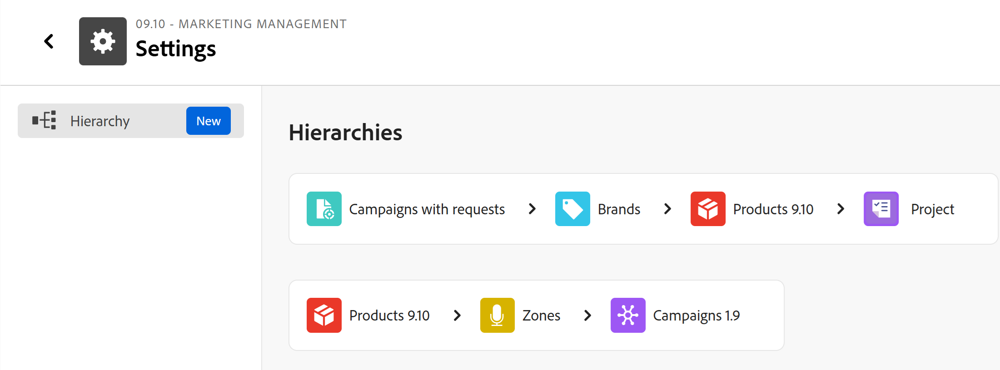
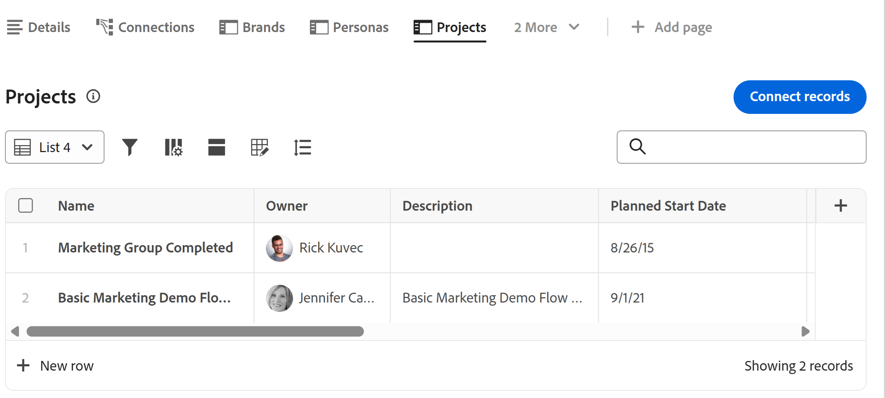

# Workfront計画の用語の概要

<!--do not use the snippet for IMPORTANT as it links to this article-->

<!--
The highlighted information on this page refers to functionality not yet generally available. It is available only in the Preview environment for all customers. After the release to Preview, the same features are also available monthly in the Production environment for customers who enabled fast releases.    

For information about fast releases, see [Enable or disable fast releases for your organization](/help/quicksilver/administration-and-setup/set-up-workfront/configure-system-defaults/enable-fast-release-process.md). 
-->

>[!IMPORTANT]
>
>ここでは、Adobe Workfront計画について説明します。 Workfront Planningは、スタンドアロン製品か、追加購入されたAdobe Workfront機能です。
>
>
>この記事では、WorkfrontまたはWorkflow パッケージも購入した場合のWorkfront計画に関する一般的な情報を説明します。
>
>Adobe Workfront Planningのドキュメントを含む記事の一覧については、[Workfront Planningの一般情報と記事インデックス ](/help/quicksilver/planning/planning-information.md)を参照してください。
>
>スタンドアロン製品としてのWorkfront Planningについて詳しくは、[ スタンドアロン製品としてのAdobe Workfront Planningの基本を学ぶ](/help/quicksilver/planning/planning-sta/planning-sta-overview.md)を参照してください。

Workfront Planning は Workfront の一部ですが、独自の概念と用語を備えています。 組織で Workfront Planning の設定を開始する前に、新しい概念を十分に理解する必要があります。

Workfront Planning のフレームワークは完全なカスタマイズが可能です。 組織の正確なニーズに合わせて、すべてのレコードタイプとその属性、およびそれらに関連付けられた任意のフィールドを作成できます。

作成できる Workfront Planning オブジェクトの数には制限があります。 詳しくは、[Adobe Workfront Planning のオブジェクト数の制限の概要](/help/quicksilver/planning/general/limitations-overview.md)を参照してください。

Workfront Planning の主なオブジェクトと概念は次のとおりです。

* [ワークスペース](#workspaces)
* [レコードタイプ](#record-types)
* [レコード](#records)
* [Workspace テンプレート](#workspace-templates)
* [フィールド](#fields)
* [接続されたレコードタイプ、レコード、フィールド](#connected-record-types-records-and-fields)
* [ルックアップフィールド](#lookup-fields)
* [階層](#hierarchies)
* [ビュー](#views)
* [自動化](#automations)
* [リクエストフォーム](#request-forms)

## ワークスペース

ワークスペースは、組織単位のフレームワークを表します。 特定の組織の運用ライフサイクルを定義する、レコードタイプのコレクションです。

詳しくは、[ワークスペースの作成](/help/quicksilver/planning/architecture/create-workspaces.md)を参照してください。

## レコードタイプ

レコードタイプは、Workfront Planningのオブジェクトタイプです。

ワークスペースにはレコードタイプが入力されます。

オブジェクトタイプが事前に定義されている Workfront とは異なり、Workfront Planning では独自のオブジェクトタイプを作成できます。

例えば、Workfront では、プログラム、ポートフォリオ、プロジェクト、タスクやイシューのオブジェクトタイプがあらかじめ作成されています。

Workfront Planning では、組織のワークフローを満たす任意のレコードタイプを作成できます。 後で、レコードタイプを相互に関連付けたり、フォームの依存関係を定義したりできます。

詳しくは、[レコードタイプの概要](/help/quicksilver/planning/architecture/overview-of-record-types.md)を参照してください。

## レコード

レコードは、レコードタイプのインスタンスです。

レコードタイプをワークスペースに追加したら、そのタイプのレコードをレコードタイプのページに追加できます。

例えば、「キャンペーン」をレコードタイプとして設定し、「EMEA 向け夏のキャンペーン」をキャンペーンレコードタイプのレコードにすることができます。

詳しくは、[レコードの作成](/help/quicksilver/planning/records/create-records.md)を参照してください。

## Workspace テンプレート

定義済みのテンプレートを使用してワークスペースを作成できます。 テンプレートに含まれる定義済みのレコードタイプ、フィールドを使用するか、自分で追加することができます。

Adobe Workfront Planning には、次のテンプレートが含まれています。

* Operations Initiative Studio
* コミュニケーション計画スタジオ
* ベーシック：マーケティング管理
* アドバンスト：マーケティング管理
* エンタープライズ：マーケティング管理
* セールス管理
* 製品管理

システム管理者は、ベストプラクティスのマルチスペーステンプレートを使用する場合、6つのワークスペースをインストールすることもできます。 マルチスペーステンプレートには、次のテンプレートが含まれています。これらのテンプレートは、6つの個別の接続されたワークスペースを同時に生成します。

* &#x200B;1. グローバル分類と分類
* 2.Fréscopa グローバルマーケティング
* 3.Fréscopa ソーシャルマーケティング
* &#x200B;4. フレスコパ・メディア&amp;PR
* &#x200B;5. フレスコパ・グローバル・イベント
* 6.Fréscopa経営陣

詳しくは、次の記事を参照してください。

* [ ワークスペース テンプレートのリスト ](/help/quicksilver/planning/architecture/workspace-templates.md)。
* [ ワークスペースを作成](/help/quicksilver/planning/architecture/create-workspaces.md)。

## フィールド

フィールドは、レコードタイプに追加できる属性です。 フィールドには、レコードタイプに関する情報が含まれます。

レコードフィールドに関する考慮事項は、次のとおりです。

* レコードタイプに追加したフィールドは、自動的にそのタイプのすべてのレコードに関連付けられ、それらのレコードに関するデータの取り込みに使用できます。

* レコードタイプのページに適用されたテーブルビューでは、フィールドが列として表示されます。 また、レコードのページにも表示されます。

* フィールドはレコードタイプに固有で、レコードタイプ間では転送されません。

* フィールドは完全なカスタマイズが可能で、Workfront Planning 内でのみアクセスできます。 Workfront からは Workfront Planning のフィールドにアクセスできません。

詳しくは、[フィールドの作成](/help/quicksilver/planning/fields/create-fields.md)を参照してください。

新しいレコードタイプは、デフォルトで次の定義済みフィールドに関連付けられます。

* 名前
* 説明
* 開始日
* 終了日
* ステータス

次のタイプのカスタムフィールドを作成できます。

* 1 行テキスト
* 段落
* 複数選択
* 単一選択
* 日付
* 数値
* パーセンテージ
* 通貨
* チェックボックス
* 式
* ユーザー
* 作成者
* 作成日
* 最終変更者
* 最終変更日
* 承認者
* 承認日
* レコード ID

<!--update the screen shot above-->

## 接続されたレコードタイプ、レコード、フィールド

Workfront Planningでは、次のエンティティ間の接続を作成できます。

* Workfront Planning の 2 つのレコードタイプ。
* レコードタイプと Workfront のプロジェクト、プログラム、ポートフォリオ、会社またはグループオブジェクトタイプ。
* レコードタイプと Adobe Experience Manager のアセットまたはフォルダー。

  レコードタイプを Experience Manager のオブジェクトと接続するには、Adobe Experience Manager のライセンスが必要です。

  

* レコードタイプと Adobe GenStudio for Performance Marketing ブランド。

  レコードタイプを GenStudio ブランドと接続するには、Adobe GenStudio for Performance Marketing ライセンスが必要です。

  

レコードタイプまたはレコードタイプとオブジェクトタイプの間に接続を確立した後は、個々のレコードまたは各タイプのオブジェクトを相互に接続できます。 レコード間の接続は、接続済みレコードフィールドまたは接続として表示されます。

相互に影響を与える複数のタイプの作業オブジェクトがある場合、レコードタイプを接続すると便利です。 例えば、キャンペーンの作業をする際に、各キャンペーンが複数のブランドを対象としている場合があります。 この関係を示すために、ブランドにキャンペーンを接続できます。 また、Workfront の複数のプロジェクトで各キャンペーンの作業が計画されることもあります。 これを示すには、関連するプロジェクトにキャンペーンを接続します。 レコードタイプを接続してから、個々のレコードを接続すると、Workfront Planning でこの関係性を確立できます。

## ルックアップフィールド

2つのレコードタイプ間の接続を確立し、個々のレコードを接続すると、接続しているレコードから接続されているレコードのフィールドを参照できます。

例えば、キャンペーンレコードタイプを Workfront プロジェクトのオブジェクトタイプと接続する場合、接続されたプロジェクトの「予算」フィールドをキャンペーンレコードに表示できます。

>[!TIP]
>
>* 次のフィールドタイプは、接続済みレコードタイプまたはオブジェクトタイプのルックアップフィールドとして追加できません。
>
>   * 作成者
>   * 最終変更者
>   * Workfront の先行入力フィールド（「プロジェクト所有者」や「プロジェクトスポンサー」などのフィールドを含む）
>

レコードタイプやレコードの接続、およびリンク済みフィールドの作成について詳しくは、次の記事を参照してください。

* [レコードタイプの接続](/help/quicksilver/planning/architecture/connect-record-types.md)
* [レコードの接続](/help/quicksilver/planning/records/connect-records.md)

<!--
not yet:* Fields are reusable across Record Types.
-->

## 階層

レコードタイプをワークスペース内で接続した後、それらの接続を整理する階層を作成できます。 階層は、レコードとオブジェクトタイプを親子関係に整理し、最大4つのオブジェクトタイプを含めることができます。

ワークスペース設定領域の

2つのレコードタイプ間の接続がまだ存在しない場合は、階層を設定するときに作成できます。 定義されると、階層は、ワークスペース内の関連するレコードタイプ間で構造化パスを確立します。

階層は、ヘッダーに表示される各レコードのパンくずリストを生成します。 これにより、ユーザーはワークフローのどの段階においても、階層のどの段階にいるのかを把握できます。

階層とパンくずリストの一般的な情報については、[階層とパンくずリストの概要](/help/quicksilver/planning/architecture/hierarchy-and-breadcrumb-overview.md)を参照してください。

## ビュー

レコードは、それぞれのレコードタイプページに様々なタイプのビューで表示されます。

ビューには、フィールド（列）のリスト、レコード（行）のリスト、フィールドやレコードの順序（並べ替え）、適用済みまたは適用可能なフィルターとグループ化など、特定のビュータイプのパーソナライズされた設定が含まれています。

レコードタイプページに適用できるビュータイプは次のとおりです。

* **テーブルビュー**：接続済みフィールドやルックアップフィールドを含む、レコードとそのフィールドをテーブル形式で表示します。 テーブルの行は個々のレコードであり、列はレコードのフィールドです。 デフォルトは、テーブルビューです。

  

* **タイムラインビュー**：少なくとも 2 つの日付タイプフィールドを持つレコードを時系列で表示します。 タイムラインビューには、接続済みレコードタイプとそのレコードを最大 5 つ表示できます。

  

* **カレンダービュー**：2 つ以上の日付タイプフィールドを持つレコードをカレンダー形式で表示します。
  

<!--
add List view here when it's possible to display Planning RTs in it??
-->

追加のビュー：

* **リストビュー**: Workfront Planningの次の領域で、リストビューにオブジェクトを表示できます。

  * プロジェクトはページを接続：
  * リクエストフォームリスト

  

詳しくは、[レコードビューの管理](/help/quicksilver/planning/views/manage-record-views.md)を参照してください。

## 自動化

Adobe Workfront Planningで自動処理を設定して、アクティブ化すると、Planning レコードからトリガーされたときにWorkfront Planningでレコードを作成できます。 作成されたレコードは、オートメーションのトリガー元のレコードに自動的に接続されます。

Workfront Planningのレコードタイプのページで、自動処理を設定してアクティブ化できます。

たとえば、Workfront計画キャンペーンを取り込み、キャンペーンに関連付けるブランドを作成する自動化機能を作成できます。

既存の自動処理を使用してオブジェクトを作成する方法について詳しくは、[Adobe Workfront Planning レコード自動処理を使用したオブジェクトの作成](/help/quicksilver/planning/records/create-wf-objects-using-planning-automations.md)を参照してください。

## リクエストフォーム

リクエストフォームを作成し、Adobe Workfront Planningのレコードタイプに関連付けることができます。 その後、フォームを他のユーザーと共有し、そのタイプのレコードを作成するリクエストを送信できます。

詳しくは、[Adobe Workfront Planning](/help/quicksilver/planning/requests/create-request-form.md)でのリクエストフォームの作成と管理を参照してください。