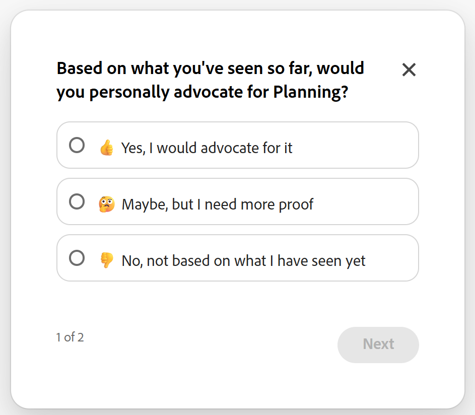

# Adobe Workfront Planning の無料体験版の使用を開始

<!-- are we still calling the tab "Best practice workspaces"? If not, reword below-->

<!--add screen shots-->
<!--check the names of areas, buttons, and links: Learn more, Open Planning, Review trial agreement, etc-->

Adobe Workfront計画では、マーケティングライフサイクルを一元的に可視化し、部門間の優れたコラボレーション、キャンペーンのリアルタイムの追跡、ワークフローの自動化を実現できます。 カスタムワークスペースを作成し、インタラクティブなタイムラインとカレンダーで作業を視覚化することができます。

>[!IMPORTANT]
>
>* Adobe Workfrontでは、Adobe Workfront計画をご利用でないAdobe Workfrontのお客様を対象に、Workfront計画の60日間の無料体験版を提供しています。
>
>* サインアップ期間は2026年4月1日に終了し、現在は閉鎖されています。
>
>* 体験版の契約書に同意し、体験版に登録した場合、2026年3月2日から5月1日の間に利用できます。 アクセスは2026年5月15日まで有効です。
>
>* 体験版は、発売日から60日間は利用でき、参加した日から60日間は利用できないことに注意してください。
>

このトライアルでは、プランニングが、日々の作業を戦略目標に合わせて合理化し、組織に測定可能な成果をもたらすのにどのように役立つのかを実感できます。

Workfront管理者が契約書に同意し、無料トライアルに申し込むと、2026年3月2日から組織内のすべてのユーザーがWorkfront Planningを利用できるようになります。

Workfront Planningの無償体験版では、次の機能を利用できます。

* キュレーションされたマルチワークスペースプランニング環境
* 次の機能を含むWorkfront Planning Prime パッケージ。

   * 無制限のワークスペース
   * 500,000 レコード/ワークスペース
   * 200万ワークスペース
   * グローバルなレコードタイプ
* サンプルデータから始めましょう
* AIを利用したオンボーディングでは、平易な言葉を使ったり、既存の成果物をアップロードしたりすることができます。プランニング部門はAIを活用してカスタム構造を生成します。 これにより、ワークスペース、レコードタイプ、フィールド、ビューが自動的に作成されます。
* 製品内トレーニングとガイダンス
* 特定の役割に合わせてカスタマイズされた、設定中のマイルストーンを明確に示します。

## 体験版に参加するための前提条件

Workfront Planningの無料トライアルに参加するには、次の要件を満たす必要があります。

* 次のいずれかの新しいAdobe Workfront パッケージまたはWorkflow パッケージを用意します。

   * 選択
   * Prime
   * Ultimate

  Workfront計画の体験版は、従来のWorkfront パッケージでは利用できません。
詳しくは、[Workfront ドキュメントのアクセス要件](/help/quicksilver/administration-and-setup/add-users/access-levels-and-object-permissions/access-level-requirements-in-documentation.md)を参照してください。
* 2026年1月26日から4月1日の間に、組織のWorkfront インスタンスで使用可能な法務トライアル契約に同意します。 体験版契約書に同意するには、Workfront管理者である必要があります。

## 重要な日付の概要

Adobe Workfront Planning無料体験版の提供に関連する重要な日付は次のとおりです。

* **2026年1月26日**: Workfront計画の無料トライアル バナーがWorkfrontのお客様にリリースされました。 バナーには以下が含まれています。
   * このドキュメントへのリンク。
   * 試用契約書の承認ウィンドウ。 Workfrontの管理者のみが契約書に同意できます。 この日付からいつでも体験版契約書に同意できます。
* **2026年3月2日**: Workfront計画体験版が開始されました。

  体験版のローンチに伴い、次の項目がWorkfront インスタンスに追加されます。

   * Workfront計画バナーは、引き続きすべてのユーザーに表示されます。 このドキュメントへのリンクがバナーに含まれています。
   * **体験版契約書の確認**&#x200B;の環境設定が&#x200B;**設定**&#x200B;領域に追加されます。

  次のシナリオが存在します。

   * Workfront管理者がこの日付より前に契約書に同意している場合は、メインメニューにプランニング エリアがあり、Workfront プランニングの使用を開始できます。

  >[!NOTE]
  >
  >Workfront ライセンスの種類に関係なく、システム内のすべてのユーザーのメインメニューに計画領域が表示されます。

   * Workfront管理者がこの日付より前に契約書に同意していない場合、Planning体験版プログラムを告知するバナーはすべてのユーザーに表示されますが、Planningはまだメインメニューで使用できません。 Workfront Planningにアクセスするには、まずシステム管理者が契約書に同意する必要があります。

* **2026年4月1日**：体験版に登録できなくなりました。

  次の項目は、Workfront インスタンスから削除されます。

   * Workfront Planningの体験版バナー。
   * **体験版の契約書を確認**&#x200B;の環境設定が&#x200B;**設定**&#x200B;領域から削除されます。

* **2026年5月1日**: Workfront Planningの体験版が終了し、Planningへのアクセス権が削除されます。 アクセスは2026年5月15日まで有効です。

  体験版に参加した場合、体験版終了後にWorkfrontがデータを保護します。 ただし、この日付を過ぎるとアクセスできなくなります。

  契約書に同意した場合に関係なく、この日付でPlanningへのアクセスは終了します。

* **2026年11月30日**：この日以降、Workfrontでデータのセキュリティが保護されなくなりました。 この日付より前にWorkfront Planningを購入した場合は、Planningおよびデータにアクセスできるようになります。

<!--
Lauren wanted this out: 
* **November 30, 2026** - Workfront no longer makes your data available after this date. You can still purchase Workfront Planning, but your data is removed after this date.
-->

## 無料体験版中および無料体験版後のWorkfront Planning データへの権限

組織内のすべてのユーザーは、体験版中に、次のWorkfront計画パッケージとWorkfront計画に対する権限レベルを受け取ります。

* **2026年3月2日～5月1日**:

  WorkfrontまたはWorkflow ライセンスのアクセスレベルに関係なく、Workfront計画トライアルプログラムへの参加を承認すると、Workfront計画Prime ライセンスが付与されます。

  無料トライアル中に、システム内のユーザーは、プランニング領域のワークスペースに対して次の権限を付与されます。

   * すべてのシステム管理者は、「自分が所属するワークスペース」および「すべてのワークスペース」タブに対する管理権限を持っています。
   * 他のすべてのユーザーにはワークスペース領域に対する表示権限がありますが、システム管理者は、そこに表示されるワークスペースに対する管理権限を付与できます。
   * システム管理者を含むすべてのユーザーには、プランニング領域の「サンプルワークスペース」タブに対する表示権限があります。

* **2026年5月1日以降：**

  体験版へのアクセスは、2026年5月15日まで有効です。 5月15日以降、システム内のすべてのユーザーがWorkfront Planningにアクセスできなくなり、Workfrontがデータを保護します。

## Workfront Planningに関する詳細情報

Workfront計画の一般的な詳細については、[Adobe Workfront計画の基本を学ぶ](/help/quicksilver/planning/general/planning-overview.md)を参照してください。

Workfront計画の導入方法に関するベストプラクティスについては、[Adobe Workfront計画のベストプラクティス：記事インデックス &#x200B;](/help/quicksilver/planning/best-practices.md/best-practices-article-index.md)を参照してください。

<!--

this information will be live on March 2 - the How to sign up below will be a ### instead of a ## section and the Navigate the trial section will be visible; also adjust ALL the ##s when you make this live:
-->

## Adobe Workfront Planningの無償体験版に登録する

Workfront管理者は、組織内の全員がWorkfront Planningの無料体験版にアクセスする前に、法的体験版の契約書を確認して署名する必要があります。

計画体験版への登録は、2026年1月26日（PT）から可能です。

体験版が開始され、組織は2026年3月2日に計画体験版を開始するためのアクセス権を取得しました。

>[!NOTE]
>
>契約書に同意する必要があるシステム管理者は1人だけです。 すべてのシステム管理者が承認する必要はありません。

### 2026年1月26日から3月2日までの計画体験版に登録します

>[!WARNING]
>
>現在、この期間は終了しています。 詳しくは、この記事の「[2026年3月2日から4月1日までの計画体験版に登録する](#enroll-in-the-planning-trial-between-march-2-and-april-1-2026)」の節を参照してください。

1. （条件付き）Adobe Workfront as a System Administratorにログインします。
1. 次のいずれかの操作を行います。

   * **Workfront計画体験版**&#x200B;に関する情報を含むアプリ内バナーに従います

   * 画面の右上隅にある&#x200B;**Workfront通知エリア**&#x200B;に移動し、**すべての通知**&#x200B;をクリックして、Workfront計画体験版に関する通知センターメッセージを見つけます。
1. **体験版契約書の確認**&#x200B;をクリックします。<!--not sure if this will be available in the email/ banner, or if they can go to System Preferences to do this - might need to adjust the steps here-->
1. 契約書を確認したら、**同意**&#x200B;をクリックします。
1. （条件付き）システム管理者でない場合は、**Workfront計画体験版**&#x200B;に関する情報を含むアプリ内バナーに従い、**詳細情報**&#x200B;をクリックします。

   Workfront計画の体験版とWorkfront計画について詳しくは、この記事を参照してください。

### 2026年3月2日から4月1日までの計画体験版に登録します

>[!WARNING]
>
>オプトイン期間は2026年4月1日に終了します。 ただし、計画体験版の機能は2026年5月15日（PT）まで利用できます。

1. （条件付き）Adobe Workfront as a System Administratorにログインします。

1. 次のいずれかの操作を行います。

   * **Workfront計画体験版**&#x200B;に関する情報を含むアプリ内バナーに従います

   * 画面の右上隅にある&#x200B;**Workfront通知エリア**&#x200B;に移動し、**すべての通知**&#x200B;をクリックして、Workfront計画体験版に関する通知センターメッセージを見つけます

   * **設定**／**システム**／**環境設定**&#x200B;に移動します。
1. （条件付き）お客様が&#x200B;**セットアップ** エリアにいる場合は、**その他の環境設定** セクションに移動し、**体験版の契約書を確認**&#x200B;をクリックします。
1. 契約書を確認したら、**同意**&#x200B;をクリックします。

   お客様の組織は、2026年5月1日までWorkfront計画体験版に登録されます。 アクセスは2026年5月15日まで有効です。

   体験版の契約書に同意すると、次のことが発生します。

   * プランニング領域が、システム内のユーザーおよびユーザー全員のメインメニューに追加され、**体験版** インジケーターが表示されます。
   * システム管理者は、計画領域の「**サンプルワークスペース**」タブに対する管理アクセス権を受け取ります。
   * 標準ユーザーは、Planningの「**サンプルワークスペース**」タブへの表示アクセス権を受け取り、独自のワークスペース、レコードタイプ、レコード、フィールドおよびビューを作成して、それらを他のユーザーと共有できます。
   * 他のすべてのユーザーは、プランニング領域の「**サンプルワークスペース**」タブへの表示アクセス権を取得し、他のユーザーが共有すると、他のワークスペースにアクセス権を取得できます。
1. （条件付き）お客様がシステム管理者ではなく、システム管理者がまだ体験版を承認していない場合は、**Workfront計画体験版**&#x200B;に関する情報を含むアプリ内バナーに従い、**詳細情報**&#x200B;をクリックします。

   Workfront計画の体験版とWorkfront計画について詳しくは、この記事を参照してください。
1. （条件付き）お客様がシステム管理者ではなく、システム管理者が体験版契約書に同意している場合は、**Workfront計画の体験版**&#x200B;に関する情報を含むアプリ内バナーに従い、**計画を開く**&#x200B;をクリックします。

   「**サンプルワークスペース**」タブの探索を開始し、共有されているワークスペースを確認、使用、または共有します。

Workfront Planningの使用について詳しくは、[Adobe Workfront Planningの基本を学ぶ](/help/quicksilver/planning/general/planning-overview.md)を参照してください。

Workfront計画の導入方法に関するベストプラクティスについては、[Adobe Workfront計画のベストプラクティス：記事インデックス &#x200B;](/help/quicksilver/planning/best-practices.md/best-practices-article-index.md)を参照してください。

## 計画に関するフィードバックを送信

Workfront Planningでの経験に関するフィードバックを送信するには：

1. Workfrontにログインし、任意のページを開きます。
1. Workfront ページの右下隅にある簡単なアンケートを見つけて質問に答え、**次へ**&#x200B;をクリックします。

   

1. 2番目のスライドで、質問に答え、**送信**&#x200B;をクリックします。

   ご意見は製品管理チームに送信されます。

## Workfront Planningを体験しましょう

サンプルのプランニング ワークスペースとそのオブジェクトを確認したり、Workfront プランニング体験版に登録するときに独自のワークスペースを作成したりできます。

1. （条件付き、必須）Workfront管理者は、無料体験版契約書に署名します。

   詳しくは、この記事の「[Adobe Workfront計画の無料体験版に登録する](#enroll-in-the-adobe-workfront-planning-free-trial)」の節を参照してください。
1. （条件付き）体験版の契約書がWorkfront管理者によって署名された後、**メインメニュー** アイコン をクリックし、次のいずれかをクリックして&#x200B;**計画** エリアにアクセスします。

   * **計画**。 アイコンの横に&#x200B;**体験版** ラベルが表示されます。
   * **プロジェクト**、**リクエスト**、**カレンダー**&#x200B;をクリックし、**キャンペーンカレンダーを探索**&#x200B;をクリックします
   * **ポートフォリオ**、**プログラム**、またはポートフォリオまたはプログラムから、次に&#x200B;**カスタム階層を探索**&#x200B;をクリックします。

   「**計画**」エリアが「**サンプルワークスペース**」タブで開きます。
1. 「**サンプルワークスペース**」タブで、次のワークスペースを確認します。

   * **グローバル分類と分類**: マーケティング記録システムの基盤となるサンプル プランニング オブジェクトの種類が含まれています。

     このワークスペース内のすべてのレコードタイプは、Workfront Planning構造の非構築ブロックを構成できます。 すべてのレコードタイプはグローバルであり、他のすべてのワークスペースから追加または接続できます。 詳しくは、[&#x200B; クロスワークスペースのレコードタイプの概要](/help/quicksilver/planning/architecture/cross-workspace-record-types-overview.md)を参照してください。

     グローバル分類ワークスペースの使用方法に関する推奨事項については、[最初の成果を持続可能な勢いに変える：管理された拡張のためのプレイブック &#x200B;](/help/quicksilver/planning/best-practices.md/playbook-how-to-scale.md)を参照してください。
   * 追加のサンプルワークスペース：次のワークスペースは、サンプル企業（Fréscopa）が特定のワークスペース、レコードタイプ、フィールド、および組織構造と作業構造のアーキテクチャに対するビューとして必要なワークスペースの例として機能します。

      * **Fréscopa グローバルマーケティング**
      * **Fréscopa Social Marketing**
      * **Fréscopa Media &amp; PR**
      * **Fréscopa Executive Company Leadership**

   >[!NOTE]
   >
   >システム管理者は、サンプルワークスペースを編集できる場合があります。 ただし、ガイダンスに使用する場合は、それらを維持し、サンプルとして提供するワークスペースをミラーリングして独自のワークスペースを構築することをお勧めします。

1. 「**ワークスペースを作成**」をクリックして、独自のワークスペースを作成します。

   詳しくは、[ワークスペースの作成](/help/quicksilver/planning/architecture/create-workspaces.md)を参照してください。

   システム管理者の場合、新しいワークスペースは&#x200B;**すべてのワークスペース**&#x200B;と&#x200B;**自分が所属するワークスペース**&#x200B;のタブに表示されます。

   >[!TIP]
   >
   >標準ライセンス ユーザーは、**ワークスペース**&#x200B;領域に表示されるワークスペースを作成できます。

1. 「**AIを使用して作成**」をクリックすると、AI アシスタントが仕様に基づいてワークスペースを作成できます。<!--(**********have they changed the button to Generate or is it Create???*********)-->

   詳しくは、「[Adobe Workfront計画Designerの基本を学ぶ](/help/quicksilver/planning/general/planning-ai-designer.md)」を参照してください。

   >[!IMPORTANT]
   >
   >体験版中にWorkfront PlanningでPlanning Designerを使用できるようにするために、Adobe Gen AI契約書に署名する必要はありません。

1. 作成したワークスペースで、次のいずれかを作成します。

   * レコードタイプ

     詳しくは、[レコードタイプの作成](/help/quicksilver/planning/architecture/create-record-types.md)を参照してください。
   * レコード

     詳しくは、[レコードの作成](/help/quicksilver/planning/records/create-records.md)を参照してください。
   * ビュー

     詳しくは、[レコードビューの管理](/help/quicksilver/planning/views/manage-record-views.md)を参照してください。
   * フィールド

     レコードタイプごとにカスタムフィールドを作成したり、Workfrontから読み込んだり、他のレコードタイプ、Workfront オブジェクトタイプ、または他のアプリケーションのオブジェクトタイプへの接続を作成したりできます。

     詳しくは、次の記事を参照してください。

      * [フィールドの作成](/help/quicksilver/planning/fields/create-fields.md)
      * [レコードタイプの接続の概要](/help/quicksilver/planning/architecture/connect-record-types-overview.md)

1. 作成したワークスペースから、次のいずれかのエンティティを共有します。

   * ワークスペース

     詳しくは、[ワークスペースの共有](/help/quicksilver/planning/access/share-workspaces.md)を参照してください。
   * レコードタイプ

     詳しくは、[&#x200B; レコードタイプの共有](/help/quicksilver/planning/access/share-record-types.md)を参照してください。
   * ビュー

     詳しくは、[&#x200B; ビューの共有](/help/quicksilver/planning/access/share-views.md)を参照してください。

   Workfront Planningの導入方法と、そのガバナンスの中心を構築する方法について詳しくは、この記事の「[Workfront Planning](#additional-information-about-workfront-planning)」の節を参照してください。
1. （オプション）作成したワークスペースを編集するには、次のいずれかの操作を行います。

   * ワークスペースを開き、手動で変更します。

     詳しくは、[ワークスペースの編集](/help/quicksilver/planning/architecture/edit-workspaces.md)を参照してください。
   * ワークスペース名の横にある「**AIで編集**」をクリックして&#x200B;**プランニング Designer**」を開き、AIを使用してワークスペースをさらに変更します。

     詳しくは、「[Adobe Workfront計画Designerの基本を学ぶ](/help/quicksilver/planning/general/planning-ai-designer.md)」を参照してください。
1. （オプション）ユーザーの&#x200B;**メインメニュー**&#x200B;からプランニング領域を削除するには、ユーザーに割り当てられた&#x200B;**レイアウトテンプレート**&#x200B;をカスタマイズし、レイアウトテンプレートの&#x200B;**メインメニューの設定**&#x200B;領域から削除します。

   詳しくは、[&#x200B; レイアウトテンプレートを使用したメインメニューのカスタマイズ &#x200B;](/help/quicksilver/administration-and-setup/customize-workfront/use-layout-templates/customize-main-menu.md)を参照してください。

   >[!TIP]
   >
   >レイアウトテンプレートを使用して、WorkfrontのインスタンスからPlanning プロモーションバナーを削除することはできません。

