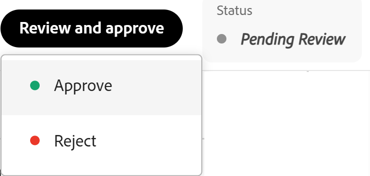
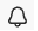

# Adobe Workfront Planning のメール通知の管理

<!--
The highlighted information on this page refers to functionality not yet generally available. It is available only in the Preview environment for all customers. After the monthly releases to Production, the same features are also available in the Production environment for customers who enabled fast releases.    

For information about fast releases, see [Enable or disable fast releases for your organization](/help/quicksilver/administration-and-setup/set-up-workfront/configure-system-defaults/enable-fast-release-process.md). 
-->

{{planning-important-intro}}

次のシナリオが存在する場合は、Workfront Planningからメール通知を受け取ることができます。

* 誰かがレコードのコメントで自分やチームにタグを付けます

  レコードコメント内の他のユーザーのタグ付けについて詳しくは、[&#x200B; レコードコメントの管理](/help/quicksilver/planning/records/manage-record-comments.md)を参照してください。
* ビュー、ワークスペース、またはレコードタイプ <!--or or a record-->へのアクセス許可を求めるユーザーがいます
* 誰かが、ビュー、ワークスペース、またはレコードタイプ <!--or record Isk confirmed that there is nno email for denying access but did not test-->に対するアクセス権が付与されたことを確認します
* Workfront計画リクエストを送信します。 詳しくは、[Adobe Workfront Planningでのリクエストフォームの作成と管理](/help/quicksilver/planning/requests/create-request-form.md)を参照してください
* 送信したWorkfront計画リクエストを誰かが承認または却下します。 詳しくは、[Adobe Workfront Planningでのリクエストの承認](/help/quicksilver/planning/requests/approve-request.md)を参照してください
* ステータスは、送信したWorkfront Planning リクエストに変わります。

## アクセス要件

+++ 展開して、この記事の機能のアクセス要件を表示します。 

<table style="table-layout:auto"> 
<col> 
</col> 
<col> 
</col> 
<tbody> 
    <tr> 
<tr> 
</tr>   
<tr> 
   <td role="rowheader">
Adobe Workfront パッケージ
</td> 
   <td> 

任意のWorkfrontおよびプランニングパッケージ
 
任意のワークフローとプランニングパッケージ

各Workfront計画パッケージに含まれる内容について詳しくは、Workfrontの担当者にお問い合わせください。 
 
   </td> 
  <tr> 
   <td role="rowheader">
Adobe Workfront プラン
</td> 
   <td>
明るいまたはそれ以上

   </td> 
  </tr> 
  <tr> 
   <td role="rowheader">
オブジェクト権限
</td> 
   <td>   
ワークスペースに対する表示またはそれ以上の権限</a> 
  
   
システム管理者は、作成しなかったワークスペースも含め、すべてのワークスペースに対する権限を持っています。
 </td> 
  </tr> 
<tr>
   <td role="rowheader">
レイアウトテンプレート
</td>
   <td> LightまたはContributor ライセンスを持つユーザーには、Planningを含むレイアウトテンプレートを割り当てる必要があります。
   
標準ユーザーとシステム管理者は、デフォルトでプランニング領域を有効にできます。

</li></ul>
</td>
  </tr> 
</tbody> 
</table>

Workfrontのアクセス要件について詳しくは、[Workfront ドキュメント &#x200B;](/help/quicksilver/administration-and-setup/add-users/access-levels-and-object-permissions/access-level-requirements-in-documentation.md)のアクセス要件を参照してください。

+++

<!--
OLD: 

<table style="table-layout:auto"> 
<col> 
</col> 
<col> 
</col> 
<tbody> 
    <tr> 
<tr> 
<td> 
   
 Products
 </td> 
   <td> 
   <ul><li>
 Adobe Workfront
</li> 
   <li>
 Adobe Workfront Planning
</li></ul></td> 
  </tr>   
<tr> 
   <td role="rowheader">
Adobe Workfront plan*
</td> 
   <td> 

Any of the following Workfront plans:
 
<ul><li>Select</li> 
<li>Prime</li> 
<li>Ultimate</li></ul> 

Workfront Planning is not available for legacy Workfront plans
 
   </td> 
<tr> 
   <td role="rowheader">
Adobe Workfront Planning package*
</td> 
   <td> 

Any 
 

For more information about what is included in each Workfront Planning plan, contact your Workfront account manager. 
 
   </td> 
 <tr> 
   <td role="rowheader">
Adobe Workfront platform
</td> 
   <td> 

Your organization's instance of Workfront must be onboarded to the Adobe Unified Experience.
 

The users in your organization receive notifications from Workfront Planning only when your organization is onboarded to the Adobe Unified Experience. 

For more information, see <a href="/help/quicksilver/workfront-basics/navigate-workfront/workfront-navigation/adobe-unified-experience.md">Adobe Unified Experience for Workfront</a>. 
 
   </td> 
   </tr> 
  </tr> 
  <tr> 
   <td role="rowheader">
Adobe Workfront license*
</td> 
   <td>
 Standard, Light, or Contributor

   
Workfront Planning is not available for legacy Workfront licenses
 
  </td> 
  </tr> 
  <tr> 
   <td role="rowheader">
Access level configuration
</td> 
   <td> 
There are no access level controls for Adobe Workfront Planning
   
</td> 
  </tr> 
<tr> 
   <td role="rowheader">
Object permissions
</td> 
   <td>   
View or higher permissions to a workspace</a> 
  
   
System Administrators have permissions to all workspaces, including the ones they did not create
 </td> 
  </tr> 
<tr>
   <td role="rowheader">
Layout template
</td>
   <td> Users with a Light or Contributor license must be assigned a layout template that includes Planning.
   
Standard users and System Administrators have the Planning areas enabled by default.

</li></ul>
  
</td>
  </tr>

</tbody> 
</table>
-->

## 誰かがコメントであなたをタグ付けしたときに送信されるメール通知を管理します

1. （条件付き、オプション）誰かがレコードのコメントで自分またはチームにタグを付けた後、タグとコメントを通知するメール通知に移動します。 メールの送信者はAdobe Experience Cloudです。

   

1. （オプション）電子メール内の&#x200B;**Workfront** ボックス内のメッセージをクリックします。

   レコードの詳細ページがWorkfrontで開きます。 レコードを更新したり、コメントに返信したりできます。

1. （条件付き）使用可能な場合は、**すべての通知を表示**&#x200B;をクリックします。 <!--check with Lilit - do non-IMS users have this button??-->
**通知** ページがAdobe Experience Cloudで開きます。 すべてのAdobe Experience Cloud アプリケーションのすべての通知が表示されます。

## 権限をリクエストおよび付与する際のメール通知を管理します

1. （条件付き、オプション）誰かがPlanning オブジェクトタイプへのアクセス権を要求または付与した後、権限リクエストを通知するメールに移動します。 メールの送信者はAdobe Experience Cloudです。

1. （オプション）電子メール内の&#x200B;**Workfront** ボックス内のメッセージをクリックします。

   Workfrontで開く権限を要求したオブジェクト。

1. （条件付き）使用可能な場合は、**すべての通知を表示**&#x200B;をクリックします。
Adobe Experience Cloudで&#x200B;**通知** ページが開きます。 すべてのAdobe Experience Cloud アプリケーションのすべての通知が表示されます。

権限の要求、付与、または拒否について詳しくは、[&#x200B; ビューまたはワークスペースへの権限の要求](/help/quicksilver/planning/access/request-permissions.md)を参照してください。

Workfront計画の通知の管理について詳しくは、[Adobe Workfront計画の通知の環境設定の管理](/help/quicksilver/planning/notifications/manage-notification-preferences.md)を参照してください。

## Workfront Planning リクエストの送信、承認、または拒否に関するメール通知を管理します

1. （オプション）Workfrontが送信するメールに移動します
リクエストを送信した後、または送信したリクエストが承認または拒否された後。 メールの送信者はAdobe Workfrontです。

1. （オプション）「**要求を開く**」をクリックします。 これにより、Workfront Planningでリクエストが開きます。

1. リクエストの右上隅にある「**レビューして承認**」ボタンをクリックし、次のいずれかをクリックします。

   * **リクエストを承認する**&#x200B;を承認します。 Planning リクエストを承認すると、レコードが作成されます。
   * **却下**&#x200B;してリクエストを却下します。 Workfront Planningでリクエストを却下すると、レコードは作成されません。 リクエストは、ステータスが&#x200B;**Rejected**&#x200B;のリクエスト領域に保存されます。

   

1. 画面の右上隅にある&#x200B;**通知** アイコン をクリックして、**通知** ページにアクセスします。

   Workfront計画の通知の管理について詳しくは、[Adobe Workfront計画の通知の環境設定の管理](/help/quicksilver/planning/notifications/manage-notification-preferences.md)を参照してください。
