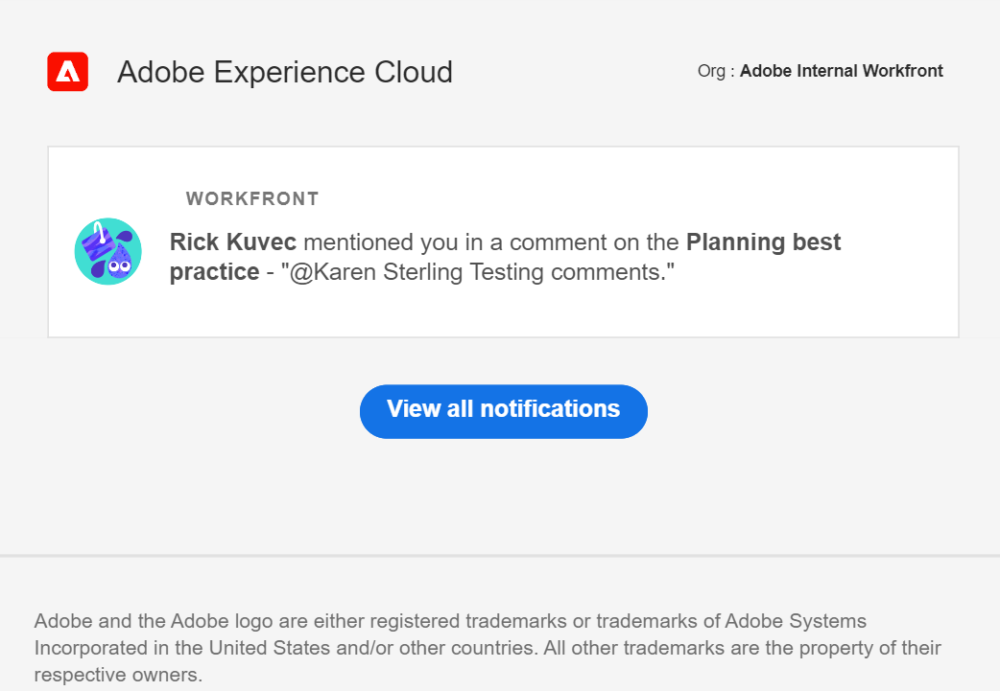

# Adobe Workfront Planning のメール通知の管理

{{planning-important-intro}}

次の状況が発生した場合は、Workfront Planning からメール通知を受信できます。

* 誰かがレコードのコメントであなたをタグ付けします
<!--
* Someone asks for your permission to access a view or a workspace
* Someone confirms your access has been granted for a view or a workspace
* Someone has denied your access for a view or a workspace. -->

>[!IMPORTANT]
>
>Workfront Planning から通知を受け取るには、会社がAdobeの Unified Experience の顧客である必要があります。
>
>詳しくは、[WorkfrontのAdobe統合エクスペリエンス ](/help/quicksilver/workfront-basics/navigate-workfront/workfront-navigation/adobe-unified-experience.md) を参照してください。

レコードコメント内の他のタグ付けについて詳しくは、[ レコードコメントの管理 ](/help/quicksilver/planning/records/manage-record-comments.md) を参照してください。

## アクセス要件

+++ 展開すると、Workfront Planning のアクセス要件が表示されます。

<table style="table-layout:auto"> 
<col> 
</col> 
<col> 
</col> 
<tbody> 
    <tr> 
<tr> 
<td> 
   
 製品
 </td> 
   <td> 
   <ul><li>
 Adobe Workfront
</li> 
   <li>
 Adobe Workfrontの計画
</li></ul></td> 
  </tr>   
<tr> 
   <td role="rowheader">
Adobe Workfront プラン*
</td> 
   <td> 

次のいずれかのWorkfront プラン：
 
<ul><li>選択</li> 
<li>Prime</li> 
<li>Ultimate</li></ul> 

Workfront Planning は、従来のWorkfront プランでは使用できません
 
   </td> 
<tr> 
   <td role="rowheader">
Adobe Workfront計画*
</td> 
   <td> 

任意 
 

各Workfront Planning プランに含まれる内容の詳細については、<a href="https://business.adobe.com/products/workfront/pricing.html">Adobe Workfrontの価格とパッケージ </a> を参照してください。 
 
   </td> 
 <tr> 
   <td role="rowheader">
Adobe Workfront platform
</td> 
   <td> 

組織のWorkfront インスタンスは、Workfront Planning のすべての機能にアクセスできるように、Adobe Unified Experience にオンボーディングされる必要があります。
 

詳しくは、<a href="/help/quicksilver/workfront-basics/navigate-workfront/workfront-navigation/adobe-unified-experience.md">Workfront の Adobe Unified Experience</a> を参照してください。 
 
   </td> 
   </tr> 
  </tr> 
  <tr> 
   <td role="rowheader">
Adobe Workfront プラン*
</td> 
   <td>
 標準、ライト、またはコントリビューター

   
Workfront Planning は、従来のWorkfront ライセンスでは使用できません
 
  </td> 
  </tr> 
  <tr> 
   <td role="rowheader">
アクセスレベルの設定
</td> 
   <td> 
Adobe Workfront Planning に対するアクセスレベルのコントロールはありません。
   
</td> 
  </tr> 
<tr> 
   <td role="rowheader">
オブジェクト権限
</td> 
   <td>   
ワークスペースに対する表示またはそれ以上の権限</a> 
  
   
システム管理者は、作成しなかったワークスペースも含め、すべてのワークスペースに対する権限を持っています。
 </td> 
  </tr> 
<tr> 
   <td role="rowheader">
レイアウトテンプレート
</td> 
   <td> 
Workfront の管理者を含むすべてのユーザーには、メインメニューの Planning エリアを含むレイアウトテンプレートを割り当てる必要があります。 
 </td> 
  </tr> 
</tbody> 
</table>

*Workfront のアクセス要件について詳しくは、[Workfront ドキュメントのアクセス要件](/help/quicksilver/administration-and-setup/add-users/access-levels-and-object-permissions/access-level-requirements-in-documentation.md)を参照してください。

+++

<!--
OLD: 

<table style="table-layout:auto">
 <col>
 </col>
 <col>
 </col>
 <tbody>
    <tr>
<tr>
<td>
   
 Product
 </td>
   <td>
   
 Adobe Workfront
 
   
In order to receive notifications from Workfront Planning and manage notification preferences, your organization's instance of Workfront must be onboarded to the Adobe Unified Experience. For information, see <a href="/help/quicksilver/workfront-basics/navigate-workfront/workfront-navigation/adobe-unified-experience.md">Adobe Unified Experience for Workfront</a>.
</td>
  </tr>  
 <td role="rowheader">
Adobe Workfront agreement
</td>
   <td>

Your organization must be enrolled in the early access stage for Workfront Planning 

   </td>
  </tr>
  <tr>
   <td role="rowheader">
Adobe Workfront plan
</td>
   <td>

Any

   </td>
  </tr>
  <tr>
   <td role="rowheader">
Adobe Workfront license
</td>
   <td>
   
Any
 
  </td>
  </tr>
  
  <tr>
   <td role="rowheader">
Access level configuration
</td>
   <td> 
There are no access level controls in Workfront Planning. 
  
</td>
  </tr>
<tr>
   <td role="rowheader">
Permissions
</td>
   <td> 
View or higher permissions to a workspace</a> 
  
   
System Administrators have permissions to all workspaces, including the ones they did not create

</td>
  </tr>

<tr>
   <td role="rowheader">
Layout template
</td>
   <td> 
Your Workfront or group administrator must add the Planning area in your layout template. For information, see <a href="/help/quicksilver/planning/access/access-overview.md">Access overview</a>. 
  
</td>
  </tr>
 </tbody>
</table>
-->

## でのメール通知 <!--when someone tags you in a comment--> 管理

1. （条件付き）誰かがレコードのコメントでタグを付けた後、タグとコメントを通知するメール通知に移動します。 メールの送信者はAdobe Experience Cloudです。

   

1. 「**Workfront**」ボックスのメッセージをクリックします。

   レコードの詳細ページがWorkfrontで開きます。 レコードを更新したり、コメントに返信したりできます。

1. （条件付き）使用可能な場合は、「**すべての通知を表示**」をクリックします。 <!--check with Lilit - do non-IMS users have this button??-->
**通知** ページがAdobe Experience Cloudで開きます。 すべてのAdobe Experience Cloud アプリケーションからのすべての通知が表示されます。

<!--
## Manage email notifications when requesting, granting, or denying permissions to a view or a workspace

For information about requesting, granting, or denying permissions to a view or a workspace, see [Request permissions to a view or a workspace](/help/quicksilver/planning/access/request-permissions.md). 
-->