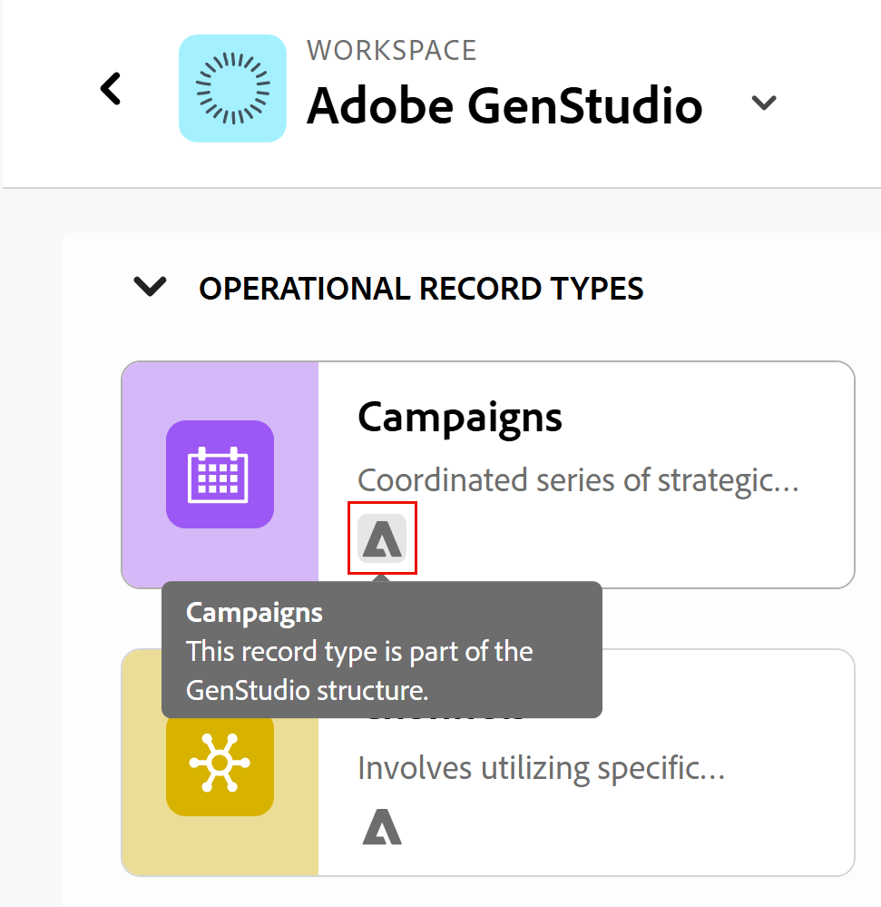

<!--
Better metadata, at publishing:
---
title: Manage the GenStudio Workspace in Adobe Workfront Planning
description: The GenStudio for Performance Marketing workspace is available in Adobe Workfront Planning when your company has purchased both products and your instance of Workfront is integrated with your company's instance of GenStudio. You can view the GenStudio workspace from Planning and update information in both systems.
feature: Workfront Planning
role: User, Admin
author: Alina
recommendations: noDisplay, noCatalog
---
-->

<!--MUST update the access requirements below - not complete!!!!!!!!!-->

# Adobe Workfront Planning での GenStudio ワークスペースの管理

<!--
The information on this page refers to functionality not yet generally available. It is available only in the Preview environment for all customers. After the monthly releases to Production, the same features are also available in the Production environment for customers who enabled fast releases.    

For information about fast releases, see [Enable or disable fast releases for your organization](/help/quicksilver/administration-and-setup/set-up-workfront/configure-system-defaults/enable-fast-release-process.md). 
-->

Adobe GenStudio for Performance Marketing Workspaceは、Adobe Workfront Planningで利用できます。お客様の会社が製品を購入し、お客様のWorkfront インスタンスが会社のGenStudio インスタンスと統合されている場合です。

GenStudio ワークスペースは、両方のシステムでPlanningから表示し、情報を更新できます。

GenStudio Performance MarketingからGenStudio Workspaceを使用および管理する方法について詳しくは、[Adobe GenStudio for Performance Marketing ユーザーガイド &#x200B;](https://experienceleague.adobe.com/ja/docs/genstudio-for-performance-marketing/user-guide/home)を参照してください。

GenStudioとWorkfront Planningの統合について詳しくは、[Adobe Workfront計画とAdobe GenStudio for Performance Marketingの統合の基本を学ぶ](/help/quicksilver/planning/planning-and-genstudio-integration/get-started-with-workfront-planning-and-genstudio-integration.md)を参照してください。

>[!IMPORTANT]
>
>この記事で説明する手順は、管理権限がある場合に、Workfront PlanningからGenStudio ワークスペースを更新する方法を示しています。
> GenStudio ワークスペースに対するContribute権限がある場合、一部の機能は使用できません。
>
>会社に複数のWorkfront インスタンスがある場合は、すべてのユーザーがWorkfront PlanningのGenStudio ワークスペースに対するContribute権限を取得します。

## アクセス要件

+++ 展開して、この記事の機能のアクセス要件を表示します。 

<table style="table-layout:auto"> 
<col> 
</col> 
<col> 
</col> 
<tbody> 
    <tr> 
<tr> 
</tr>   
<tr> 
   <td role="rowheader">
Adobe Workfront パッケージ
</td> 
   <td> 

任意のWorkfrontおよびプランニングパッケージ

任意のワークフローとプランニングパッケージ

各Workfront計画パッケージに含まれる内容について詳しくは、Workfrontの担当者にお問い合わせください。 
 
   </td> 
   <tr> 
<td> 
   
 その他の製品
 </td> 
   <td> 
   
 Adobe GenStudio for Performance Marketing
</td> 
  </tr>
  <tr> 
   <td role="rowheader">
Adobe Workfront プラン
</td> 
   <td>
標準

   </td> 
  </tr> 
  <tr> 
   <td role="rowheader">
Adobe GenStudio for Performance Marketingのユーザーロール
</td> 
   <td>
<ul><li>キャンペーン、商品、ペルソナにアクセスするためのGenStudioのユーザーロール</li>
   <li>GenStudio System Managerからアクティベーションにアクセス <!--and Events--></li></ul>
   詳しくは、<a href="https://experienceleague.adobe.com/ja/docs/genstudio-for-performance-marketing/user-guide/intro/user-roles"> ユーザーの役割と権限</a>を参照してください。 
   

  </td> 
  </tr>   
<tr> 
   <td role="rowheader">
オブジェクト権限
</td> 
   <td>  
   
Workfront Planningでは、次の操作を行います。 

   <ul>
   <li>
GenStudio ワークスペースへの権限を管理して、新しいフィールドまたはレコードタイプをGenStudio ワークスペースに追加します
</li>
   <li>
GenStudio ワークスペースにアクセス権を付与して、GenStudio ワークスペース内のレコードを追加、更新、削除します
 </li>  
   </ul>
   
Workfront PlanningのGenStudio WorkspaceからGenStudio for Performance Marketing レコードタイプまたはフィールドを削除することはできません

   
Adobe GenStudio for Performance Marketingで： 

   <ul>
   <li>
 Adobe GenStudio for Performance Marketingのすべての権限
</li>
   <li>
 Adobe GenStudio for Performance Marketingで権限を作成して項目を作成する
</li></ul>
   </td>  
</tbody> 
</table>

Adobe Workfront計画アクセスについて詳しくは、[Adobe Workfront計画アクセスの概要](/help/quicksilver/planning/access/access-overview.md)を参照してください。

Adobe GenStudio for Performance Marketingについて詳しくは、[Adobe GenStudio for Performance Marketing ユーザーガイド &#x200B;](https://experienceleague.adobe.com/ja/docs/genstudio-for-performance-marketing/user-guide/home)を参照してください。

+++   

<!--
Old:

<table style="table-layout:auto"> 
<col> 
</col> 
<col> 
</col> 
<tbody> 
    <tr> 
    <td role="rowheader">
Adobe Workfront package
</td> 
   <td> 

Any Workfront package

Any Planning package
  

   </td> </tr>
   <tr> 
<td> 
   
 Additional products
 </td> 
   <td> 
   
 Adobe GenStudio for Performance Marketing
</td> 
  </tr>
  <tr> 
   <td role="rowheader">
Adobe Workfront license
</td> 
   <td>
 Standard

  </td> 
  </tr> 
   
  <tr> 
   <td role="rowheader">
Adobe GenStudio for Performance Marketing user roles
</td> 
   <td>
<ul><li>Any GenStudio user role to access Campaigns, Products, and Personas</li>
   <li>GenSudio System Manager to access Activations ****** and Events*********</li></ul>
   For information, see <a href="https://experienceleague.adobe.com/en/docs/genstudio-for-performance-marketing/user-guide/intro/user-roles">User roles and permissions</a>. 
   

  </td> 
  </tr>   
<tr> 
   <td role="rowheader">
Object permissions
</td> 
   <td>  
   
In Workfront Planning: 

   <ul>
   <li>
Manage permissions to the GenStudio workspace to add new fields or record types to the GenStudio workspace
</li>
   <li>
Contribute permissions to the GenStudio workspace to add, update, or delete records in the GenStudio workspace
 </li>  
   </ul>
   
No users can remove GenStudio for Performance Marketing record types or fields from the GenStudio workspace in Workfront Planning

   
In Adobe GenStudio for Performance Marketing: 

   <ul>
   <li>
 Any permissions in Adobe GenStudio for Performance Marketing
</li>
   <li>
 Create permissions in Adobe GenStudio for Performance Marketing to create items
</li></ul>
   </td> 
  </tr> 
</tbody> 
</table>
-->

## Workfront PlanningでGenStudio ワークスペースを管理する際の考慮事項

* Workfront PlanningでGenStudio Workspaceを表示するには、事前にAdobe GenStudio for Performance Marketingを購入する必要があります。

* 組織が保有するWorkfront インスタンスの数に応じて、PlanningのGenStudio ワークスペースに対する次の権限が自動的に付与されます。

  <!--this table is also in the Get started article-->

  <table style="table-layout:auto"> 
   <col> 
   </col> 
   <col> 
   </col> 
   <tbody> 
      <tr> 
      <td role="rowheader">
Workfrontの1つのインスタンス
</td> 
      <td> 
   
GenStudio Workspaceは、Workfront Planningのインスタンスに表示されます

   
Workfront管理者には、PlanningのGenStudio Workspaceに対する管理権限があります

   
その他のすべてのユーザーは、PlanningのGenStudio WorkspaceにContributeからアクセスできます

   </td> </tr>
      <tr> 
   <td> 
      
 Workfrontの複数のインスタンス数
 </td> 
      <td> 
      
GenStudio ワークスペースは、すべてのWorkfront インスタンスから表示されます

   
GenStudio for Performance MarketingとWorkfront Planningにアクセスできるすべてのユーザーには、PlanningのGenStudioに対するContribute権限があります
 </td> 
   </tr>
      </tbody> 
   </table>

* GenStudio WorkspaceのWorkspace設定、レコードタイプ、ビュー、フィールドの更新は、Workfront Planning Workspaceとその要素の更新と同じです。
<!--
Is this just preview?? * You can build hierarchies for the record types in the GenStudio workspace. For more information, see [Create workspace hierarchies](/help/quicksilver/planning/architecture/create-workspace-hierarchies.md).
* You cannot include GenStudio Brands in a hierarchy.
-->

<!--
## Manage GenStudio workspace from Workfront Planning

CAN YOU DO THIS?? 
- OPTIONS FROM THE WORKSPACE CARD ??
- OPTIONS FROM THE MORE MENU ON A WORKSPACE ??
-->

## Workfront PlanningからGenStudio Workspaceを管理する

>[!NOTE]
>
>GenStudio ワークスペースを管理する前に、詳しくは、[Adobe Workfront計画とAdobe GenStudio for Performance Marketing統合の基本を学ぶ](/help/quicksilver/planning/planning-and-genstudio-integration/get-started-with-workfront-planning-and-genstudio-integration.md)を参照してください。
>

1. GenStudioにもアクセスできるユーザーとしてWorkfrontにログインします。

{{step1-to-planning}}

Workfront Planning のメインページが開きます。

1. 「**その他のワークスペース**」をクリックし、**System**&#x200B;によって作成され、**GenStudio** タグがカードに含まれている表示情報を持つワークスペースを見つけます。

   タグ GenStudio workspace カード

1. **GenStudio Workspace カード**&#x200B;をクリックして、Workfront PlanningでGenStudio Workspaceを開きます。
1. デフォルトでは、次のGenStudio レコードタイプが作成され、Workfront Planningから表示されます。

   * キャンペーン
   * 製品
   * ペルソナ
   * アクティベーション
   * チャネル
   * 地域

   GenStudioのレコードタイプのカードには、それらが元々GenStudioで作成されたことを示す表示があります。

   <!--check screen shot-->

   タグ GenStudio レコードタイプ カード

1. ワークスペース名の右側にある&#x200B;**詳細** メニューをクリックし、次のいずれかをクリックします。

   * **編集**

     詳しくは、[ワークスペースの編集](/help/quicksilver/planning/architecture/edit-workspaces.md)を参照してください。
     <!--* **Delete** - this will generate an error message, per Iskuhi, so don't document as an option/ possibility-->

     <!--For information, see [Delete workspaces](/help/quicksilver/planning/architecture/delete-workspaces.md). -->

1. 右上隅の「**共有**」をクリックして、ワークスペースを他のユーザーと共有します。

   詳しくは、[ワークスペースの共有](/help/quicksilver/planning/access/share-workspaces.md)を参照してください。

   >[!NOTE]
   >
   >共有に関する次の制限があります。
   >
   >* GenStudio ユーザーをGenStudio ワークスペースから削除するには、そのワークスペースを共有する必要があります。
   >* ユーザーがGenStudioで権限を持っている場合、そのアクセス権をWorkfront Planningの「表示」に変更することはできません。 PlanningのGenStudio Workspaceで少なくともContribute権限を付与する必要があります。
   >* GenStudio ワークスペースで、GenStudio レコードタイプに対する継承された権限を無効にすることはできません。

1. 任意のレコードタイプカードをクリックして、そのタイプのレコードを表示します。

   レコードタイプ、ビューおよびフィールドを管理するには、この記事の「[Workfront PlanningからGenStudio レコードタイプを管理する](#manage-genstudio-record-types-from-workfront-planning)」の節を参照してください。

## Workfront PlanningのGenStudio Workspaceからレコードタイプ、ビュー、レコードを管理します

>[!NOTE]
>
>GenStudio ワークスペースを管理する前に、詳しくは、[Adobe Workfront計画とAdobe GenStudio for Performance Marketing統合の基本を学ぶ](/help/quicksilver/planning/planning-and-genstudio-integration/get-started-with-workfront-planning-and-genstudio-integration.md)を参照してください。
>

1. Workfront PlanningのGenStudio Workspaceに移動し、この記事の「[Workfront PlanningからGenStudio Workspaceを管理](#manage-the-genstudio-workspace-from-workfront-planning)」の節で説明されているように、レコードタイプページを開きます。

1. レコードタイプ名の右側にある&#x200B;**詳細** メニューをクリックし、次のいずれかをクリックします。

   * **編集**

     詳しくは、[&#x200B; レコードタイプの編集](/help/quicksilver/planning/architecture/edit-record-types.md)を参照してください。
   * **自動処理の管理**

     詳しくは、[Adobe Workfront Planningの自動処理の設定](/help/quicksilver/planning/records/configure-automations-to-create-records.md)を参照してください。
   * **リクエストフォームの管理**

     複数のリクエストフォームを作成できます。 リクエストフォームは、Workfrontのリクエスト領域で利用でき、公開するかリンクを使用して共有することもできます。

     詳しくは、[Adobe Workfront Planning](/help/quicksilver/planning/requests/create-request-form.md)でのリクエストフォームの作成と管理を参照してください。

1. ビューまたはレコードタイプを共有するには、次の操作を行います。

   * レコードタイプページの右上隅にある「**共有**」をクリックし、次のいずれかをクリックします。
      * **レコードタイプを共有**
詳しくは、[&#x200B; レコードタイプの共有](/help/quicksilver/planning/access/share-record-types.md)を参照してください。
      * **現在のビューを共有**
詳しくは、[&#x200B; ビューの共有](/help/quicksilver/planning/access/share-views.md)を参照してください。
      * **ビューリンクをコピー**
ビューへのリンクがクリップボードにコピーされます。
      * **現在のビューを書き出し**
詳しくは、[&#x200B; テーブルビューからのレコードの書き出し](/help/quicksilver/planning/records/export-records-from-the-table-view.md)を参照してください。

        >[!NOTE]
        >
        >そのワークスペースまたはレコードタイプを共有した後は、GenStudio ワークスペースのレコードタイプからGenStudio ユーザーを削除することはできません。

1. レコードタイプのビューを管理するには、次の操作を行います。

   * **+ ビュー**&#x200B;をクリックして、GenStudio レコードタイプのビューを作成します。

     詳しくは、[レコードビューの管理](/help/quicksilver/planning/views/manage-record-views.md)を参照してください。

   * **フルスクリーン** アイコン でフルビューを開くをクリックすると、フルスクリーンモードで任意のビューが開きます。

   * 任意のビューからビューの要素を管理します。

     例えば、ビューのフィルター、グループ化、並べ替え、設定を使用可能な場所で変更できます。

     詳しくは、[レコードビューの管理](/help/quicksilver/planning/views/manage-record-views.md)を参照してください。

1. レコードを追加するには、次のいずれかの操作を行います。

   * 任意のビューから&#x200B;**新しいレコード**&#x200B;をクリックすると、レコードをゼロから作成できます

   * テーブルビューでExcelまたはCSV ファイルを使用してレコードを読み込む

   * タイムラインビューまたはカレンダービューの任意の場所をクリックして、レコードを追加します。

     詳しくは、[レコードの作成](/help/quicksilver/planning/records/create-records.md)を参照してください。

     レコードは、WorkfrontとGenStudioの両方から表示されます。

     >[!NOTE]
     >
     >アクティベーションレコードタイプのレコードを追加することはできません。

1. レコードを編集するには、次のいずれかの操作を行います。

   * テーブルビューからレコードをインラインで編集する

   * 任意のビューのレコードをクリックして、その詳細ページを開きます。

     詳しくは、[レコードの編集](/help/quicksilver/planning/records/edit-records.md)を参照してください。

     PlanningのGenStudio Workspaceから行った変更は、GenStudioからすぐに表示されます。

1. テーブルビューでレコードを選択し、**削除**&#x200B;をクリックします。

   詳しくは、[&#x200B; レコードの削除](/help/quicksilver/planning/records/delete-records.md)を参照してください。

   削除されたレコードは、GenStudioからすぐに削除されます。

   >[!TIP]
   >
   >削除されたレコードは、Workfront Planningで「最近削除されたビン」のテーブルビューから復元できます。 GenStudioから削除されたレコードは、Workfront Planningの「最近削除されたビン」からも復元できます。

   詳しくは、[削除されたレコードの復元](/help/quicksilver/planning/records/restore-deleted-records.md)を参照してください。

1. テーブルビューの右上隅にある「+」アイコンをクリックして、次の項目を作成します。

   * フィールド

     詳しくは、[フィールドの作成](/help/quicksilver/planning/fields/create-fields.md)を参照してください。

   * 接続

     詳しくは、[レコードタイプの接続](/help/quicksilver/planning/architecture/connect-record-types.md)を参照してください。

     GenStudio ワークスペースから作成されたフィールドは、次の領域に表示されます。

      * Workfront計画ビュー
      * Workfront計画レコードの詳細
      * GenStudio レコードの詳細

     >[!NOTE]
     >
     >* GenStudioで管理権限を持っている場合にのみ、フィールドを追加できます。
     >* Workfront Planningで作成されたフィールドは、GenStudioのリストビューには表示されません。
     >
     >* 任意のGenStudio レコードタイプをBrands GenStudio レコードタイプに接続できます。
     >  商品とペルソナは、デフォルトでブランドに接続されています。

1. テーブルビューのフィールドにカーソルを合わせ、ドロップダウンメニューをクリックして次のいずれかの操作を行います。

   * 並べ替え
   * 非表示
   * 設定の編集

   <!--* Delete it - not possible now, per Iskuhi; the link is there but it will generate an error-->

   <!--GenStudio-native fields are note removed from GenStudio. -->

   >[!NOTE]
   >
   >* GenStudio フィールドの設定を編集できるのは、GenStudioで管理権限を持っている場合のみです。
   >* GenStudio フィールドは削除できません。

<!--
Is this just Preview?? Or direct to Prod?? 

## Create workspace hierarchies in the GenStudio workspace

Creating hierarchies in the GenStudio workspace is similar to creating hierarchies in any workspace. 

>[!NOTE]
>
>You cannot add GenStudio Brands to a hierarchy in the GenStudio workspace.

For information, see [Create workspace hierarchies](/help/quicksilver/planning/architecture/create-workspace-hierarchies.md)
-->
