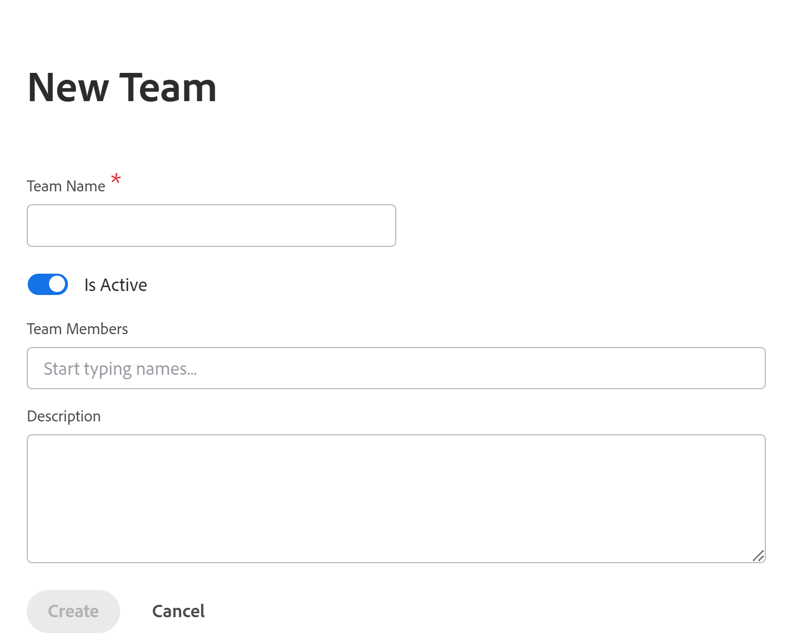

# スタンドアロン製品としてのAdobe Workfront Planningでのチーム管理

>[!IMPORTANT]
>
>ここでは、スタンドアロン製品として購入した場合のAdobe Workfront計画について説明します。 Workfront Workflow パッケージを購入しておらず、Adobe Workfront Planningのみのパッケージを購入した場合は、この記事を参照してください。
>
>Workfront パッケージと一緒に購入した場合のAdobe Workfront計画について詳しくは、[Adobe Workfront計画の基本を学ぶ](/help/quicksilver/planning/general/planning-overview.md)を参照してください。
>

Adobe Workfront Planningでは、Adobe Workfrontで管理するのと同様の方法でスタンドアロン製品としてチームを管理できますが、いくつかの制限があります。

## アクセス要件

+++ 展開して、この記事の機能のアクセス要件を表示します。 

<table style="table-layout:auto"> 
<col> 
</col> 
<col> 
</col> 
<tbody> 
    <tr> 
<tr> 
</tr>   
<tr> 
   <td role="rowheader">
Adobe Workfront計画パッケージ
</td> 
   <td> 

任意のWorkfront計画をスタンドアロンパッケージとして

</td> </tr>
  <tr> 
   <td role="rowheader">
Adobe Workfront プラン
</td> 
   <td>
計画管理者

   </td> 
  </tr>

</tbody> 
</table>

Workfront as a スタンドアロンパッケージに必要なアクセスについて詳しくは、[ スタンドアロン製品としてのAdobe Workfront Planningに必要なアクセス ](/help/quicksilver/planning/planning-sta/access-needed-for-planning-sta.md)を参照してください。
+++    

## Adobe Workfront Planningでのチーム管理

1. プランニング管理者として、Adobe CX Enterprise ホームからWorkfrontにログインします。
1. **メインメニュー** > **設定** > チーム > **新しいチーム**&#x200B;をクリックします。

   

1. 次の情報を更新します。

   * チーム名
   * アクティブ：チームがアクティブであることを示すには、この設定をオンにします。 ユーザーは、権限やその他のユーザーに割り当てることができます。
   * チームメンバー：チームにチームメンバーを追加します。 ユーザーをチームメンバーとして追加するには、まずAdobe Admin ConsoleとWorkfront Planningで作成する必要があります。
   * 説明：チームの説明を含めます。
1. 「**作成**」をクリックして、チームを作成します。
1. （オプション）既存のチームを編集するには、次のいずれかの操作を行います。

   * リストのチーム名にカーソルを合わせ、**詳細** メニュー > **チームを編集**&#x200B;をクリックします
   * リストでチームを選択し、ページ下部の青いツールバーの&#x200B;**チームを編集**&#x200B;をクリックします
1. （オプション）チームを削除するには、次のいずれかの操作を行います。

   * リストのチーム名にカーソルを合わせ、**詳細** メニュー > **チームを削除**&#x200B;をクリックします
   * リストでチームを選択し、ページ下部の青いツールバーの&#x200B;**チームを削除**&#x200B;をクリックします
1. 「**はい、削除**」をクリックして確認します。
