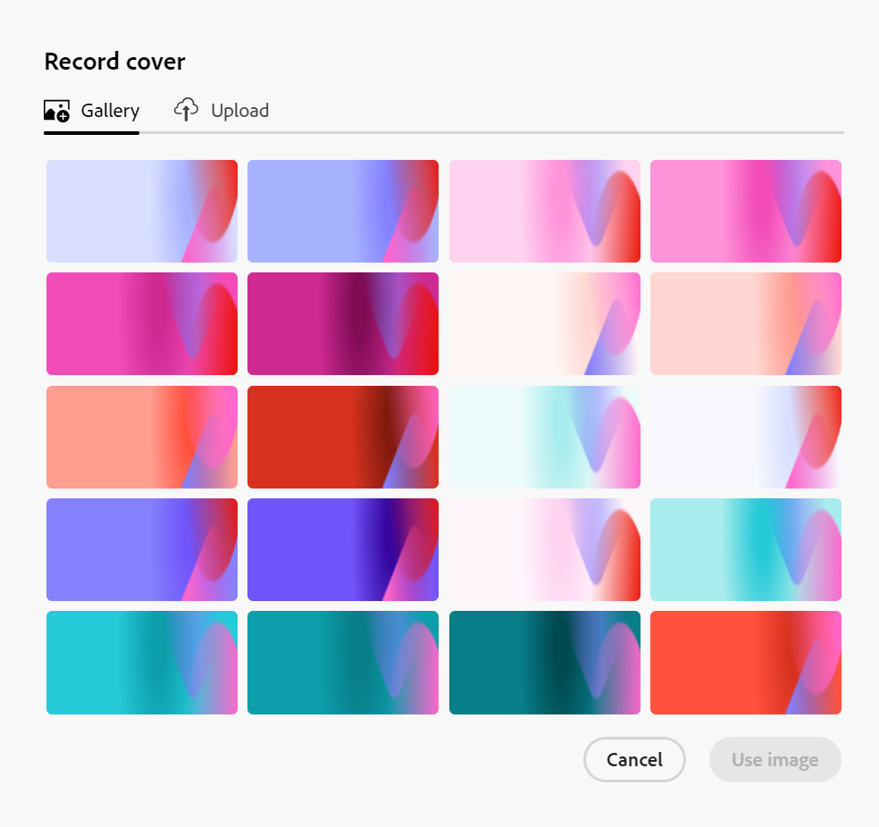

<!--update the metadata with real information-->

# レコードへのカバー画像の追加

{{planning-important-intro}}

レコードの編集時に、Adobe Workfront Planning のレコード・ページに表紙を追加することで、レコードをパーソナライズできます。

レコードの編集方法については、「[ レコードの編集 ](/help/quicksilver/planning/records/edit-records.md)」を参照してください。

レコードの作成と編集を開始する前に、レコードタイプを作成する必要があります。

詳しくは、[リクエストタイプの作成](/help/quicksilver/planning/architecture/create-record-types.md)を参照してください。

## アクセス要件

<!--************double-check permissions here - asking Isk and Lilit what permissions users need for adding cover images-->

この記事の手順を実行するには、次のアクセス権が必要です。

<table style="table-layout:auto">
 <col>
 </col>
 <col>
 </col>
 <tbody>
    <tr>
<tr>
<td>
   
 製品
 </td>
   <td>
   
 Adobe Workfront
 </td>
  </tr>  
 <td role="rowheader">
Adobe Workfront 契約
</td>
   <td>

Workfront Planning の早期アクセス段階に登録されている必要があります 

   </td>
  </tr>
  <tr>
   <td role="rowheader">
Adobe Workfront プラン
</td>
   <td>

任意

   </td>
  </tr>
  <tr>
   <td role="rowheader">
Adobe Workfront プラン*
</td>
   <td>
   
新規：標準
  
   
現在：プラン
   
  </td>
  </tr>

<tr>
   <td role="rowheader">
アクセスレベル設定
</td>
   <td> 
Workfront Planning に対するアクセス制御はありません 
  
</td>
  </tr>
<tr>
   <td role="rowheader">
権限
</td>
   <td> 
ワークスペースに対する権限の管理 
  
   
システム管理者は、作成しなかったワークスペースも含め、すべてのワークスペースに対する権限を持っています。

</td>
  </tr>
<tr>
   <td role="rowheader">
レイアウトテンプレート
</td>
   <td>  
Workfront の管理者を含むすべてのユーザーには、メインメニューの Planning エリアを含むレイアウトテンプレートを割り当てる必要があります。 
 
詳しくは、<a href="/help/quicksilver/planning/access/access-overview.md">アクセス権の概要</a>を参照してください。 
  
</td>
  </tr>

</tbody>
</table>

*詳しくは、[Workfornt ドキュメントのアクセス要件 ](/help/quicksilver/administration-and-setup/add-users/access-levels-and-object-permissions/access-level-requirements-in-documentation.md) を参照してください。

## レコードページの表紙画像に関する考慮事項

表紙画像を追加して、レコードのページをパーソナライズできます。

次の点に注意してください。

* カバー画像は、1 つのレコードに固有で、同じタイプのすべてのレコードには適用されません。
* カバー画像として追加できるのは画像ファイルのみです。
  <!--above: when you know exactly what type of files are allowed, add the exact extensions above-->
* 任意のビューのレコードプレビューまたはレコードページから、カバー画像を個々のレコードに追加できます。
* レコード ビューからカバー画像を追加することはできません。
* Workfrontは、レコードを作成するたびに、カバー画像を自動的にアップロードします。 この画像は後で変更できます。

## レコードへのカバー画像の追加

レコードのプレビューまたはページの上部にカバー画像を追加して、レコードをパーソナライズできます。

{{step1-to-planning}}

1. レコードをパーソナライズするワークスペースをクリックします。

   または

   ワークスペースから、既存のワークスペース名の右側にある下向き矢印を展開してワークスペースを検索し、リストに表示されたら選択します。

   ワークスペースが開き、レコードタイプが表示されます。

1. レコードタイプのカードをクリックします。

   レコードタイプのページが開きます。

1. 任意の種類のビューから、レコードをクリックします

   または

   テーブルビューで、最初の列にある **詳細を開く** アイコン  をクリックします。

   レコードのプレビューがビューで開きます。

   

1. （オプション）レコードプレビューの右上隅に <!--check the icon; they are changing it--> る **新しいタブで開く** アイコン  をクリックして、レコードのページを新しいタブで開きます。

   レコードページが開きます。

   

1. レコードのプレビューまたはページで、「表紙を追加 **をクリックします**

   または

   既存のカバー画像の上にマウスポインターを置き、**詳細** メニュー  をクリックしてから **アップロード** をクリックしてください。 <!--check the casing here; I logged a bug for this-->
**レコードカバー** ボックスが **アップロード** タブで開きます。

   

1. **画像を参照** をクリックし、コンピューター上の画像を参照して選択して追加します。

1. （任意）保存前に画像を削除するには、**新しい画像をアップロード** アイコン  をクリックして、新しい画像をアップロードします。

1. （オプション）「**ギャラリー**」タブをクリックして、画像ギャラリー内の画像をクリックします。 画像ギャラリーは変更できません。

   

1. **画像を使用** をクリックします。

   画像はレコードのプレビューまたはページの上部にアップロードされ、変更は自動的に保存されます。

   

1. （オプション）画像の上にマウスポインターを置き、カバー画像の右下隅にある **詳細** メニュー  ージをクリックして、次のいずれかの操作を行います。

   * カバー画像を置き換える場合は **アップロード** をクリックし、手順 6 を繰り返して新しい画像をアップロードして保存します。
   * **再配置** をクリックし、**再配置** ツール  ールを使用してカバー画像を中央に配置し、完了したら **保存** をクリックします。
   * **削除** をクリックして、カバー画像を削除します。

   Workfront では、変更を自動的に保存します。
